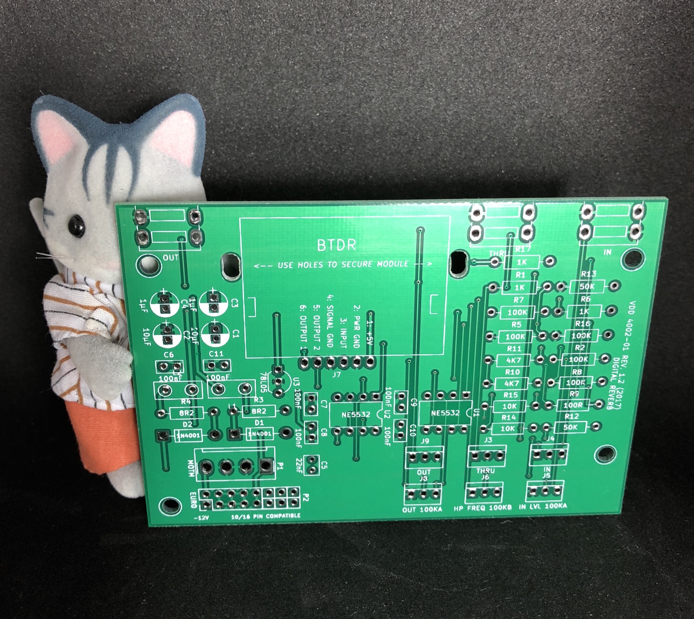
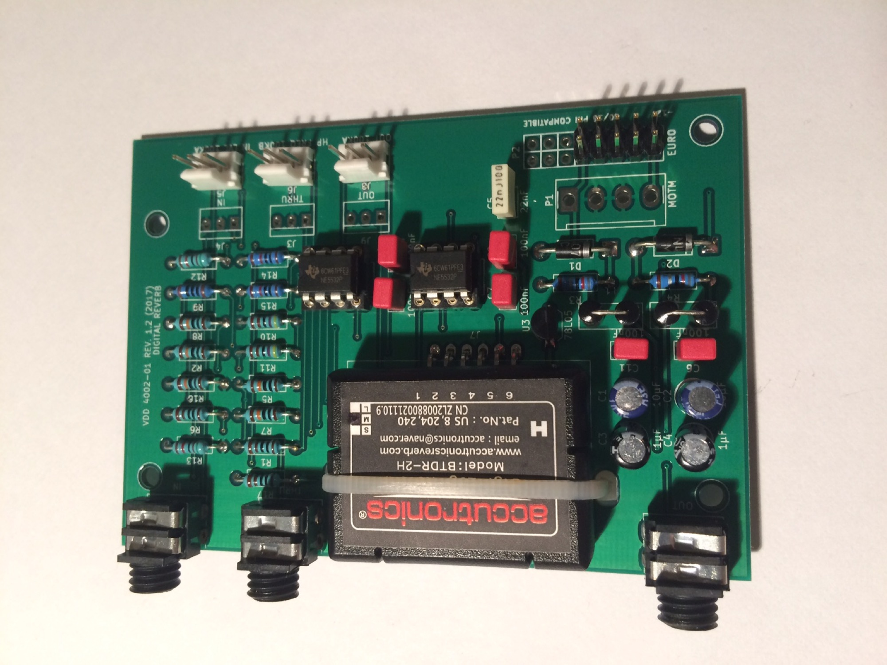

# VDD 4002 Digital Reverb

> **Project**
>
> ### Projecttitel: VDD 4002 Digital Reverb
>
> ### Status: `done`
>
> ### Startdate: 01.01.2018
>
> ### Manufacture link: just this website

## The VDD 4002 is a Digital Reverb for DIY

**Specification:**

Eurorack and 5U/FRAC Format compatible

works on -12/12V -  -15V/15V

adjustable HF Filter 

good Opamps NE5532

powerfiltering

its exclusive available at DIYsynth.de

**INFO:**

**thats an easy to build module,**

**ask diysynth.de if you have problems to find parts, the most parts are in his shop and not all parts are listed there.**

**BOM:**

|   |   |   |   |   |   |   |
|---|---|---|---|---|---|---|
| ID | PCB ID | Name | Quantity | TYPE | Source |   |
| 1 | IC socket | IC socket 8pin | 2 | 1pin | [https://www.diysynth.de/diy-components/passive-components/ic-sockets/8-pin-dip-ic-sockel-round.html](https://www.diysynth.de/diy-components/passive-components/ic-sockets/8-pin-dip-ic-sockel-round.html) |   |
| 2 | C1,C2 | Electrolyte capacitor Radial\_D5.0mm\_P2.00mm | 2 | 10µF | [https://www.diysynth.de/?cat=c12\_Capacitors-capacitors.html](https://www.diysynth.de/?cat=c12_Capacitors-capacitors.html) |   |
| 3 | C3,C4 | Electrolyte capacitor Radial\_D5.0mm\_P2.00mm | 2 | 1µF | [https://www.diysynth.de/?cat=c12\_Capacitors-capacitors.html](https://www.diysynth.de/?cat=c12_Capacitors-capacitors.html) |   |
| 4 | C5 | Capacitor WIMA **RM2.5mm** L4.6mm\_W3.0mm\_P2.50mm\_MKS02\_FKP02 | 1 | 22nF | [https://www.diysynth.de/?cat=c12\_Capacitors-capacitors.html](https://www.diysynth.de/?cat=c12_Capacitors-capacitors.html) | its listed as RM5 there, note it in the order and you get the correct part. |
| 5 | C6,C7,C8,C9,C10,C11 | Filmcapacitor (Polyester) **RM2.5mm** | 6 | 100nF | [https://www.diysynth.de/?cat=c12\_Capacitors-capacitors.html](https://www.diysynth.de/?cat=c12_Capacitors-capacitors.html) | its listed as RM5 there, note it in the order and you get the correct part. |
| 6 | D1,D2 | Rectifier /diode 1N4001 THT | 2 | 1N4001 | ask diysynth.de |   |
| 7 | THRU | Cliff1384 jack | 1 | THRU | diysynth.de |   |
| 8 | IN | Cliff1384 jack | 1 | IN | [diysynth.de](http://diysynth.de) |   |
| 9 | J3 | MTA-100-3p header +jack | 1 | THRU | only for non onboard jacks (MOTM) | or use a wire directly on pcb |
| 10 | J4 | MTA-100-3p header +jack | 1 | IN | only for non onboard jacks (MOTM) | or use a wire directly on pcb |
| 11 | J5 | MTA-100-3p header +jack | 1 | IN LVL 100KA | or use a wire directly on pcb |   |
| 12 | J6 | MTA-100-3p header +jack | 1 | HP FREQ 100KB | or use a wire directly on pcb |   |
| 13 | J7 | BTDR-2 reverb | 1 | BTDR | banzai - different models: short/medium/long |   |
| 14 | J8 | MTA-100-3p header +jack | 1 | OUT 100KA |   | or use a wire directly on pcb |
| 15 | J9 | MTA-100-3p header +jack | 1 | OUT jack | only for non onboard jacks (MOTM) | or use a wire directly on pcb |
| 16 | OUT | Cliff1384 jack | 1 | OUT jack | [https://www.diysynth.de/diy-components/passive-komponenten/buchsen/cliff-jack-3-5mm-mono-with-nut.html](https://www.diysynth.de/diy-components/passive-komponenten/buchsen/cliff-jack-3-5mm-mono-with-nut.html) |   |
| 17 | L1,L2 | BEAD-2B (Ferrite Bead) | 2 | 50R 10mhz | [https://www.diysynth.de/diy-components/passive-komponenten/Ferrite-Beads/Dual-Ferrite-Bead.html](https://www.diysynth.de/diy-components/passive-komponenten/Ferrite-Beads/Dual-Ferrite-Bead.html) |   |
| 18 | P1 | MTA156 | 1 | MOTM | optional for 5U /MOTM | [diysynth.de](http://diysynth.de) |
| 19 | P2 | Pin\_Header\_Straight\_2x08\_Pitch2.54mm | 1 | EURO POWER | optional for Eurorack Power | ask diysynth.de |
| 20 | R1,R6,R17 | 1K 1% resistor | 3 | 1K | [https://www.diysynth.de/?cat=c11\_Resistors-Resistors.html](https://www.diysynth.de/?cat=c11_Resistors-Resistors.html) |   |
| 21 | R2,R5,R7,R8,R16 | 100k 1% resistor | 5 | 100K | [https://www.diysynth.de/?cat=c11\_Resistors-Resistors.html](https://www.diysynth.de/?cat=c11_Resistors-Resistors.html) |   |
| 22 | R3,R4 | 8R2 1% resistor | 2 | 8R2 | [https://www.diysynth.de/?cat=c11\_Resistors-Resistors.html](https://www.diysynth.de/?cat=c11_Resistors-Resistors.html) |   |
| 23 | R9 | 100R 1% resistor | 1 | 100R | [https://www.diysynth.de/?cat=c11\_Resistors-Resistors.html](https://www.diysynth.de/?cat=c11_Resistors-Resistors.html) |   |
| 24 | R10,R11 | 4K 1% resistor | 2 | 4K7 | [https://www.diysynth.de/?cat=c11\_Resistors-Resistors.html](https://www.diysynth.de/?cat=c11_Resistors-Resistors.html) |   |
| 25 | R12,R13 | 50k 1% resistor (49k9) | 2 | 50K | [https://www.diysynth.de/?cat=c11\_Resistors-Resistors.html](https://www.diysynth.de/?cat=c11_Resistors-Resistors.html) | 49K9 is ok too |
| 26 | R14,R15 | 10K 1% resistor | 2 | 10K | [https://www.diysynth.de/?cat=c11\_Resistors-Resistors.html](https://www.diysynth.de/?cat=c11_Resistors-Resistors.html) |   |
| 27 | U1,U2 | NE5532 OPAMP DIP-8 | 2 | NE5532 | [https://www.diysynth.de/diy-components/aktive-bauteile/ne5532.html](https://www.diysynth.de/diy-components/aktive-bauteile/ne5532.html) |   |
| 28 | U3 | 78L05 TO-92\_Inline\_Wide | 1 | LM78L05 | in most shops available likle mouser or tme.eu | [https://www.mouser.de/productdetail/on-semiconductor-fairchild/lm78l05acz?qs=sGAEpiMZZMtdAabcSkQOl9gipZmsKLz7](https://www.mouser.de/productdetail/on-semiconductor-fairchild/lm78l05acz?qs=sGAEpiMZZMtdAabcSkQOl9gipZmsKLz7) |
| 29 | offboard | 100KA (log) Potentiometer 16mm | 2 | alpha 16mm | [https://www.diysynth.de/diy-components/passive-komponenten/Potentiometer/Potentiometer-16mm-100K-Log-solderlug.html](https://www.diysynth.de/diy-components/passive-komponenten/Potentiometer/Potentiometer-16mm-100K-Log-solderlug.html) |   |
| 30 | offboard | 100KB (lin) Potentiometer 16mm | 1 | alpha 16mm | in most shops available likle mouser or tme.eu |   |

**Schematics:**

[4002-01.pdf](assets/4002-01.pdf)

