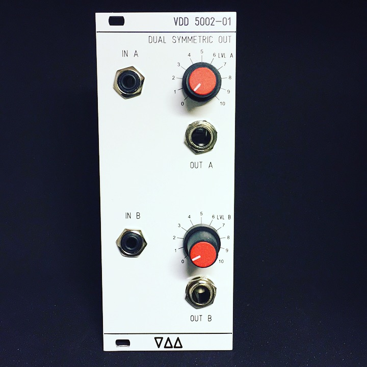
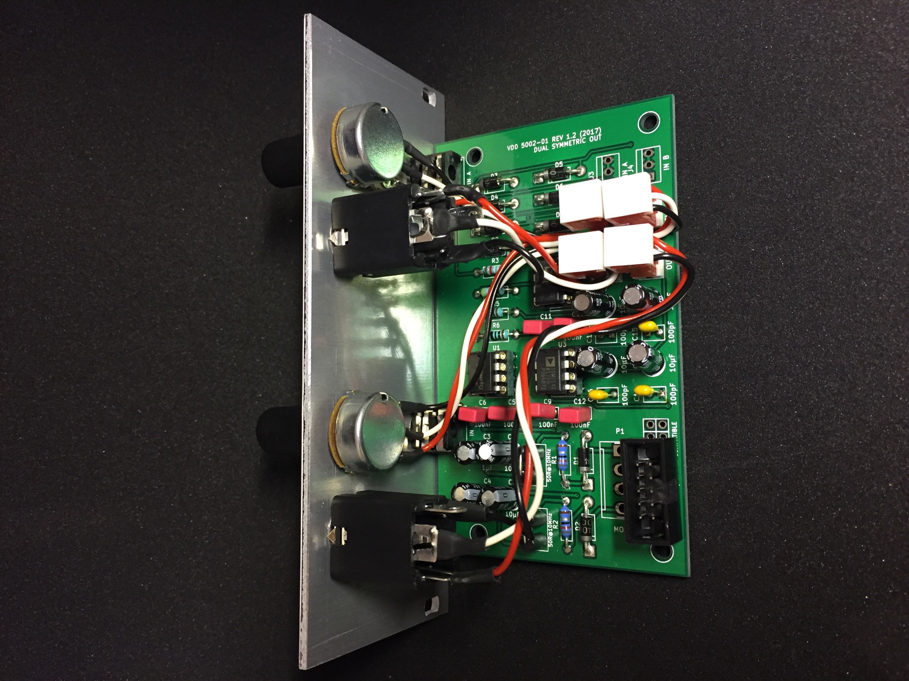
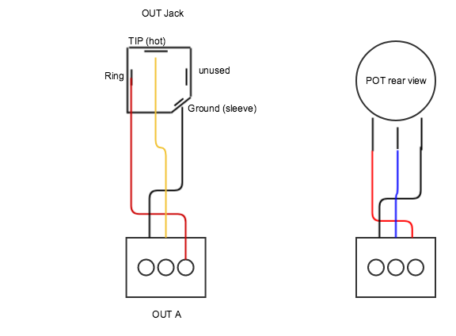

# VDD 5002-01 DUAL SYMMETRIC OUTPUT Module

> **Project**
>
> ### Projecttitel: Dual Symetric out
>
> ### Status: `Finished`
>
> ### Released: 29 Sept. 2017
>
> ### Duedate: --
>
> ### Manufacture link:

Feel free to ask if you want a DIY Kit, PCB/Panel or an assembled Module.

 

> **Info**
>
> The VDD 5002-01 Dual Symetric Output Module in Eurorack format
>
> **5002-01 Description**
> The 5002-01 is a module to convert standard synth outputs into a balanced signal. This is helpful in live and studio situations: balanced signals are more robust to interferences and it is possible to use long cables without signal degradation.
> Your modular synth is an unknown source. This is why we designed this module not with specific input level requirements.
> The 5002-01 is well suited for live situations. The white panel is easy to read even on a dark stage. The 1/4inch connectors are separated from the pcb in order to reduce mechanical stress. As a result, it is easy to maintain. Instead of trying to build it as small as possible the main goal of the panel design was easy operation. So every connector and knob is easy to access without interference with other elements.
> The circuit is built with Highend Op-Amps 2x SSM2142 (Line Driver) and NE5532 Opamps.
> The Device is designed and built in Germany with respect on ROHS (leadfree solder)
>
> 5002-01: get your sound right to the audience...
>
> **Specs**
> 2x channel balanced line driver
> 2x Individual attenuators
> 2x Inputs format 3,5mm  (1/8 inch) mono
> 2x balanced Output format 6,35mm (1/4 inch) (stereo jack)
> Width 10hp
> Depth 59mm (please check your case depth)
> works on +12V/-12V and without changes on +15V/-15V
> Current 20mA@12V / 15mA@-12V
>
> a Eurorack 16pin to 10pin powercable is included, the red stripe is minus
> the schematics are only available on request

**BOM:**

[Symmetric\_out.xlsx](assets/Symmetric_out.xlsx)

Pot: 858-P160KN0QC15A100K mouser

> **Hinweis**
>
> **you can replace the ssm2142 with: DRV135, THAT1646**

### Schematics:

The Schematics are only available for the buyer of the DIY Kit or Assembled Version with respect on the copyright.

DIY Version:

Buildguide:

for eurorack Version: use only the OUT A, OUT B, LEVEL A, LEVEL B  - MTA100 Header

for MOTM/MU Version:  use the addional IN A and IN B MTA100 Header for your inputs (you dont need the 3,5mm input jacks)

> **Achtung**
>
> the 4x Bipolar 10uf caps are only for C8, C14, C13, C7

MTA Pinout  J7, J8:

Pin 1 = GND  (left)

PIN 2= HOT

PIN 3= COLD

MTA Pinout J5, J6:

Pin1 = GND  (on pot right pin on rearview) CCW

Pin2= wiper

Pin3 = left on pot (rearview) CW

