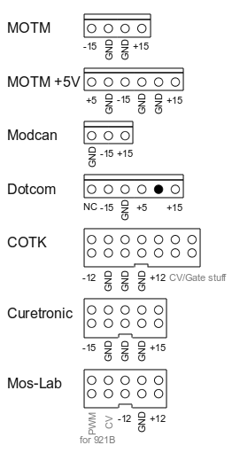

# Modular Synthesizer Connector Types

**Synthesizers.com (Dotcom):**

MTA 100 typical AWG22 / 0,20-0,20mm² possible up to 0,50mm²

Pinout:

1 = +15V
2= No Connect
3 = +5V
4 = Ground
5 = -15V
6 = No Connect

**MOTM Standard**
typical AWG156 4pole, AWG22 – AWG18

1= +15V
2= Ground
3= Ground
4= -15V

MODCAN
typical MTA156 3pole
1= +15V
2= -15V
3= Ground

