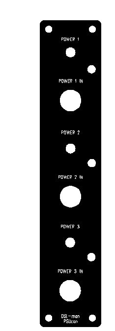

# 5U Panel with 4pole Powerconnector

what we need:

3x panel in 5U with 1U width

3x switch UM 4pol to break all lines.

3x led holder 5mm

3x led (green or red)

9x powerconnector 4pol (microphone female)  [http://www.reichelt.de/B-604/3/index.html?&ACTION=3&LA=446&ARTICLE=4546&artnr=B+604&SEARCH=B+604](http://www.reichelt.de/B-604/3/index.html?&ACTION=3&LA=446&ARTICLE=4546&artnr=B+604&SEARCH=B+604)

9x powerconnector 4pole (microphone male)  [http://www.reichelt.de/Mikrofonverbinder-fuer-Funkgeraete/M-604/3/index.html?&ACTION=3&LA=2&ARTICLE=11162&GROUPID=5189&artnr=M+604](http://www.reichelt.de/Mikrofonverbinder-fuer-Funkgeraete/M-604/3/index.html?&ACTION=3&LA=2&ARTICLE=11162&GROUPID=5189&artnr=M+604)

Frontpanel file: [psucon.fpd](assets/psucon.fpd)

price  33€ on schaeffer.ag frontpanel designer

