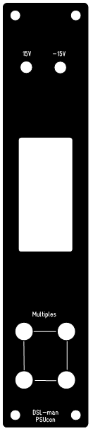
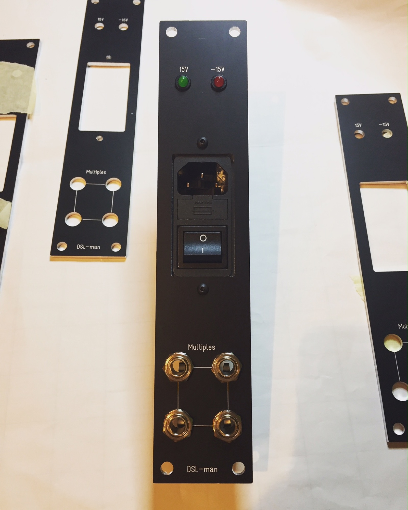
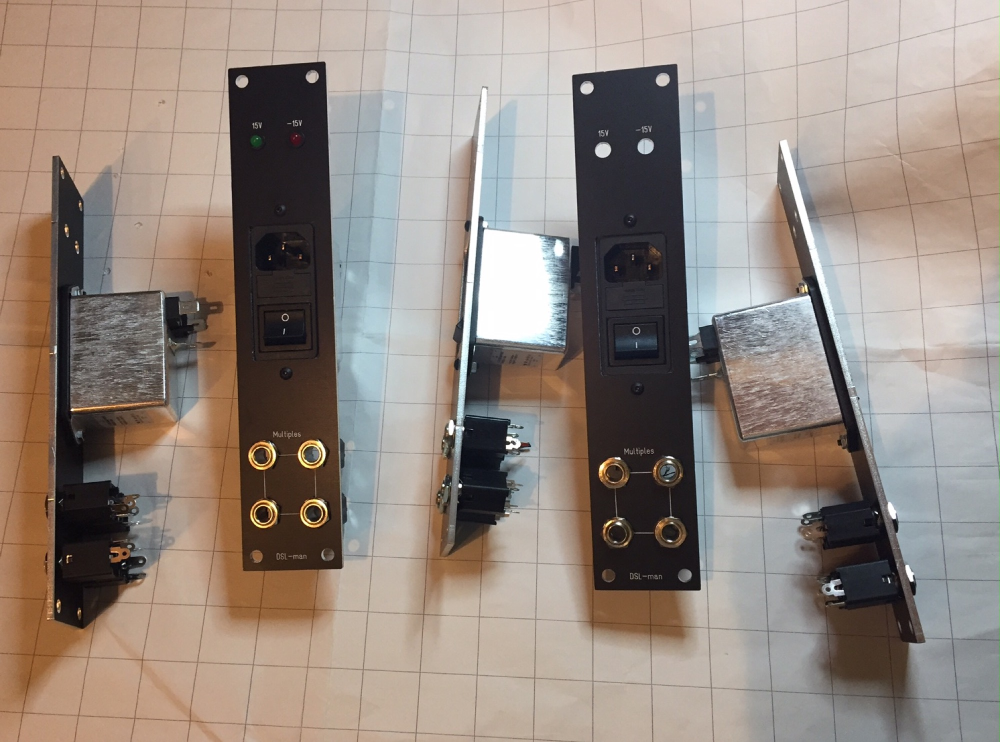
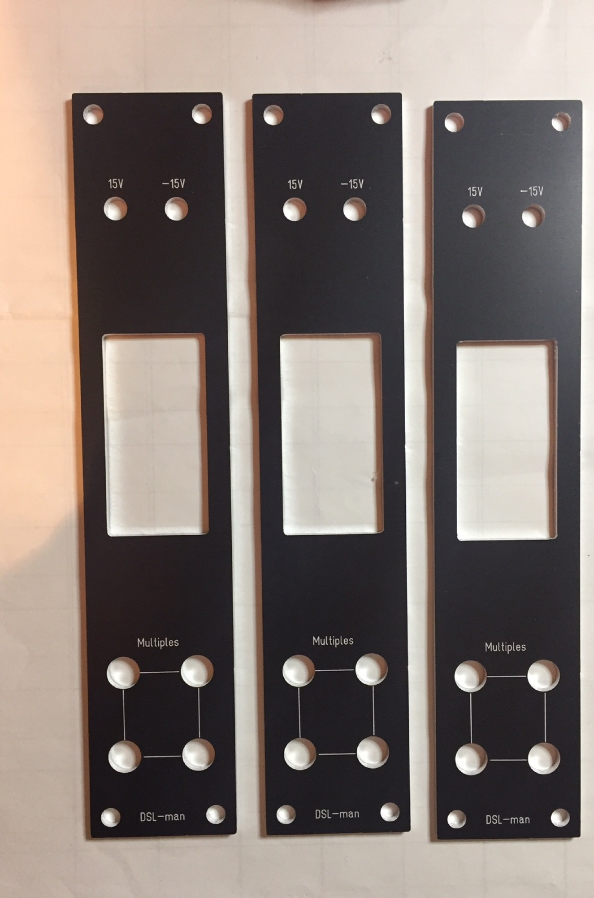

# 5U Powerinput

Project may 2017

Status `finished`

**BOM:**

5x[https://www.buerklin.com/de/entstoerfilter-mit-iec-stecker-schalter-und-sicherungshalter/p/71d322](https://www.buerklin.com/de/entstoerfilter-mit-iec-stecker-schalter-und-sicherungshalter/p/71d322)

5x LED red  5mm 2mA

5x LED green 5mm  2mA

10x LED holder for 5mm LEDs (RTC51) 6,5mm hole

20x 6.3mm jacks (multiples)

datasheet IEC:

[http://www.produktinfo.conrad.com/datenblaetter/375000-399999/398602-da-01-en-IEC\_INLET\_FILTER\_40\_C\_4A\_FN\_283\_4\_06.pdf](http://www.produktinfo.conrad.com/datenblaetter/375000-399999/398602-da-01-en-IEC_INLET_FILTER_40_C_4A_FN_283_4_06.pdf)

**Frontpanel file:**

[power2017.fpd](assets/power2017.fpd)

