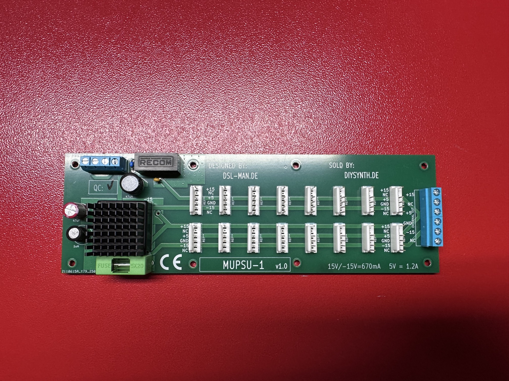

# MUPSU-1

BOM:

| **part** | **amount** |   |
|---|---|---|
| RS6-1205S RECOM Isolated DC/DC Converters - Through Hole | 1 |   |
| S24DE150R6NDFA | 1 | or DKMW20F-15 or other |
| 578405B00000G Aavid Heat Sinks | 1 |   |
| RL622-1R0K-RC Bourns RF Inductors - Leaded | 1 | 1uH |
| 6100-470K-RC Bourns RF Inductors - Leaded | 1 | 47uH |
| fg28x5r1e106mrt00 10uf mlcc rm5 | 1 |   |
| screw terminals 6 pin | 1 |   |
| screw terminal 4 pin | 1 |   |
| MTA100 | 16 |   |
| 1nF cap | 1 | Rm 2.5 |
| spacer | 8 |   |
| screws washer nuts | 8 |   |

