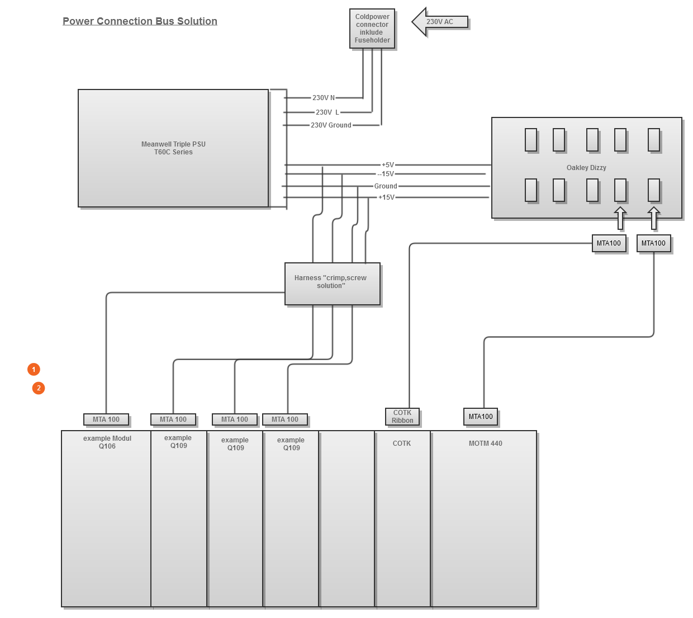
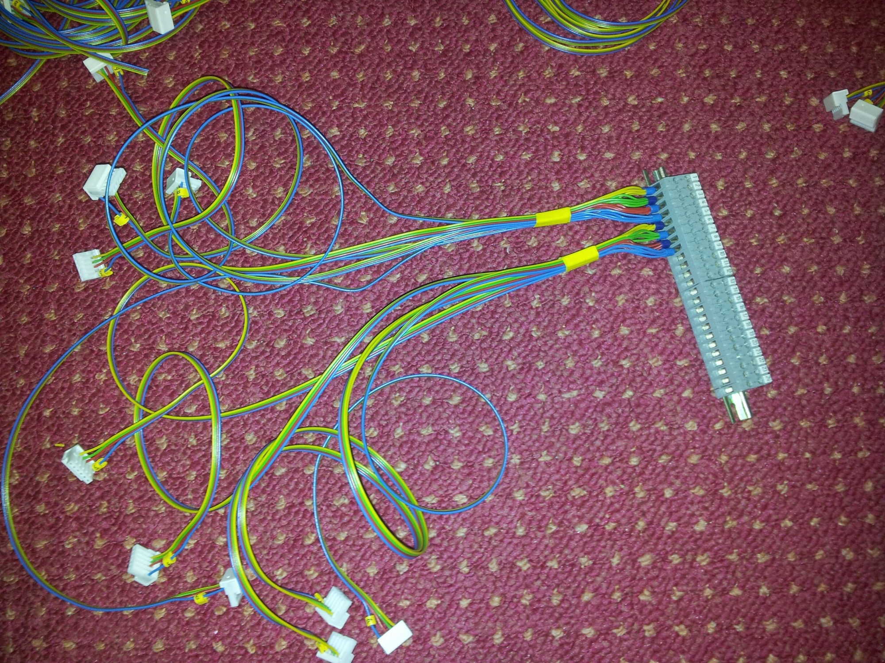
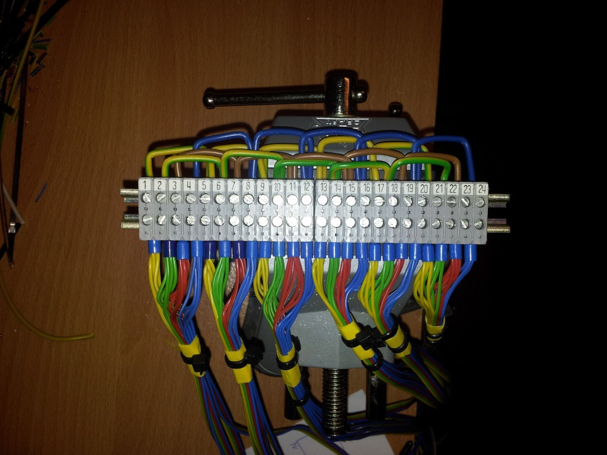
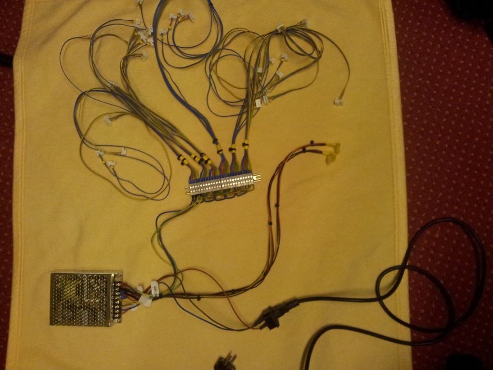

# Power Solution Part 1

# POWER SOLUTION FOR A 22 MODULE CABINET

### Just build a Powersolution for a large dotcom System with 22Modules and 2-3 MOTM Modules.

### Requirements :

- 30 dotcom Power Connectors and 2-3 MOTM Power Conenctors

- cheap price

-compatible  with other Modules like COTK

- PSU must exchangeable by customer ( selfrepair or switch to linear powersupply)

### Solution:

#### Powersupply:

- Switched PSU (cheaper as linear)

- MEANWELL enclosured series like PSAIG 62Wat (T-60C)  it have -15V, +15V, +5V (0,5A on 5V)

#### Cable Harness

- 30 MTA100 6 pin AWG24 Connectors for Synthesizers.com Modules

- 30 MTA100 Dustcaps for the connector

- 3 MTA 156 4 pin AWG 18 or AWG 20 for MOTM, Yusynth, okaley Modules

- 3 MTA 156 Dustcaps for the connector

- 25 meters AWG24 cable

- many cable markers to declare each cable with a number, to see which lenght it have

**If you want a own power Solution from me, feel free to ask me..**

(Dotcom, MOTM, COTK, Doepfer, Curetronics)Solutions

