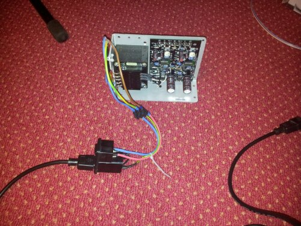
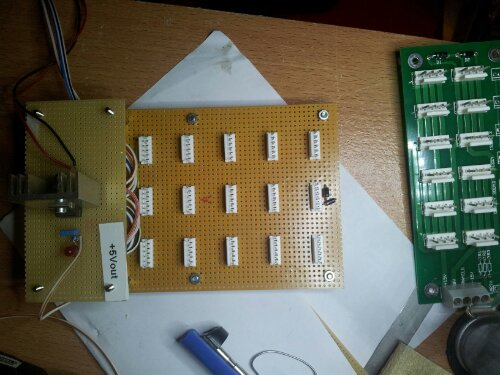
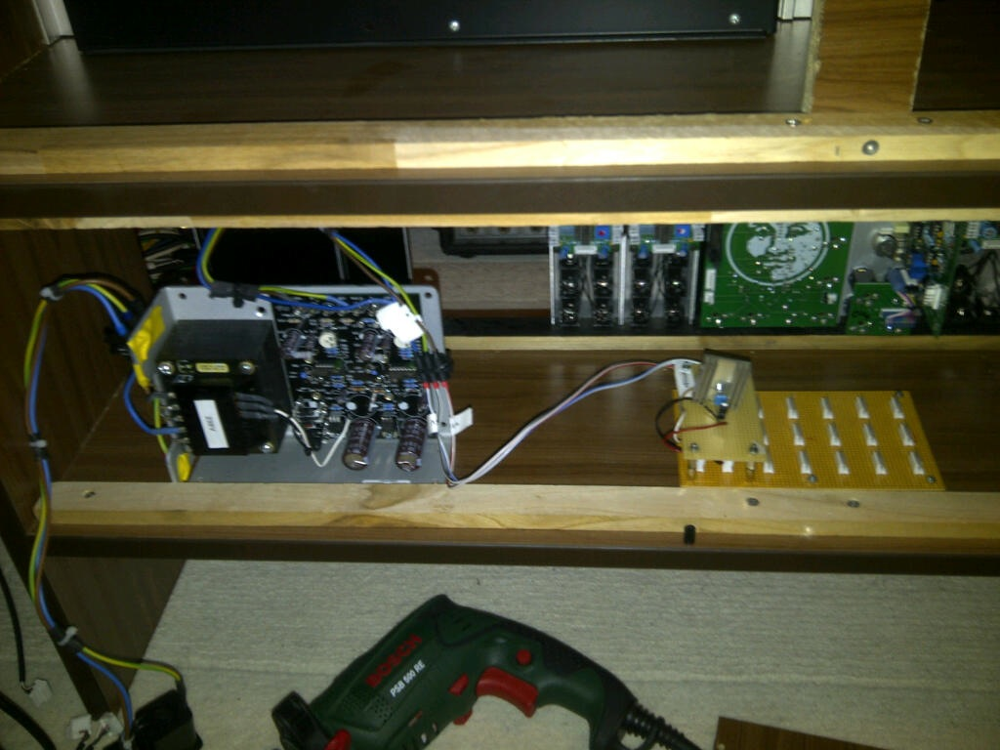
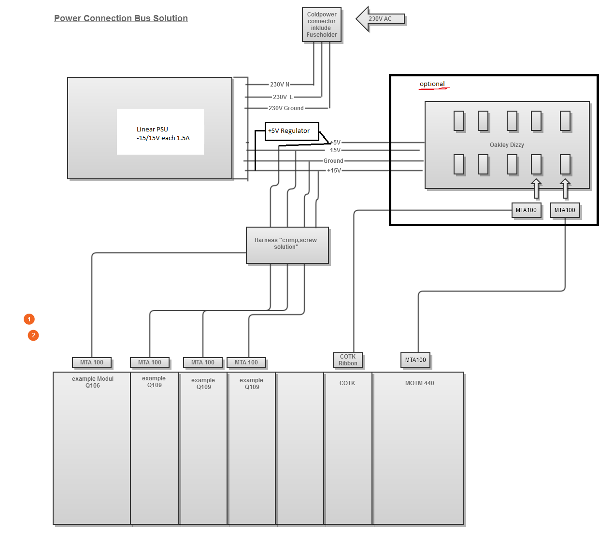
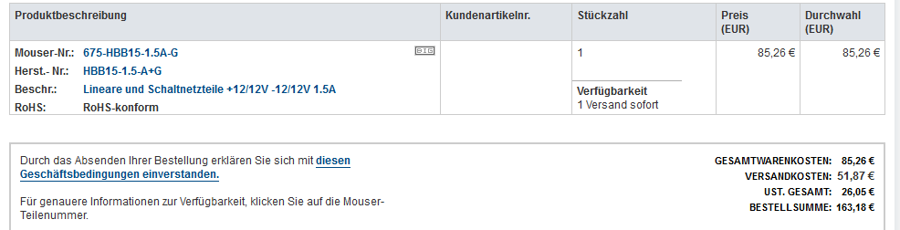

# Power Solution Part 2

last and final update 05 Jun.2013

**Requirements:**

- 15 MTA 100 connectors for Synthseizers.com each 30-80cm.
- +15V, -15V   each 1 ,5A, 5V 1A
- expandable to MOTM Connections like oakley dizzy board and further modules like cotk, curetronics.
- IEC Connector with Fuseholder and Powerswitch on cabinet side
- Linear Powersupply dual1.5A

**Inquiry:**

[Powersupply Linear](http://de.mouser.com/Search/ProductDetail.aspx?R=HBB15-1.5-A%2bGvirtualkey67500000virtualkey675-HBB15-1.5A-G)  79,40€ + 51,87€ shipping  (stand am 25.05.2013)

Stand am 27.05.2013  85,26€ + 51,87€  +TAX 26,05€! =**163,18€**

Power regulator 5V/1A  5€

cable  for connectors multicolour:  =  15€

cable for  230V  3×1,5mm²   \* 1m  = 3€

MTA 100 Connectors \* 30  & MTA100 Connector Caps/Dust Cover \*  30    = 20€

IEC connection. switch and fuseholder -reichelt [FEH 2101](http://www.reichelt.de/Entstoerfilter/FEH-2101/3/index.html?;ACTION=3;LA=446;ARTICLE=7655;GROUPID=3255;artnr=FEH+2101) 8,80€

Fuses 1€

Connection Board – PCB´s 6€

shipment for order 7€ +5,60€

shipment customer 6€

working time ~3hours – 50€

small parts, bold holder, cableshrink,screw, tin solder,

**Total arround 260€**
