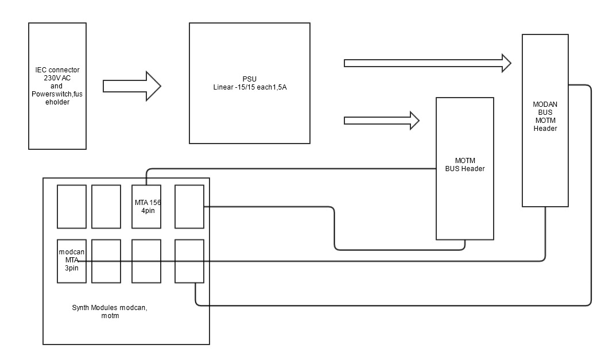
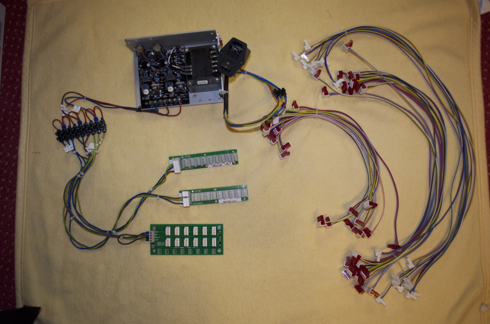
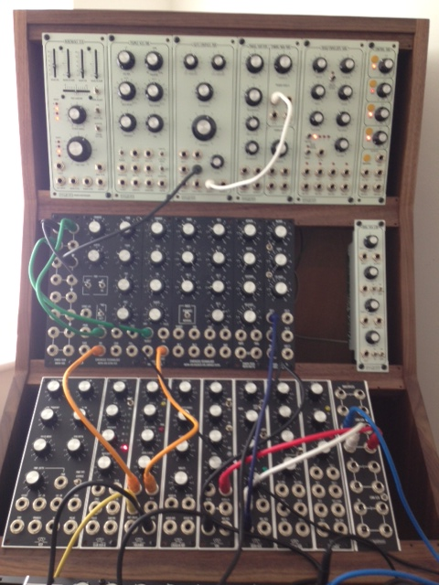

# Power Solution Part 3

### Project: Power Solution for Modcan and MOTM

**Requirements:**

20 MOTM Modules

8 Modcan Modules

Powersupply linear  1,5A per Rail on -15V,+15V

cable lenghts 30 -80cm

IEC Connection with Fuse and Switch

no customer Soldering

**Parts (price without Shipping cost)**

linar PSU 130€

cables  20meter 29€

12x MTA156 Header 4pole (for dizzy board)  3€

40x MTA156  Connector 4pole  11€

16x MTA 156 Connectors 3pole  6€

40x MTA 156 4pole caps

16x MTA156 3pole caps

2 Dizzy Boards each 12MOTM connectors

1 modcan distro board or custom build

