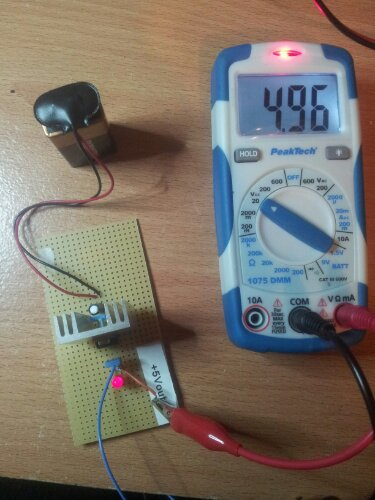
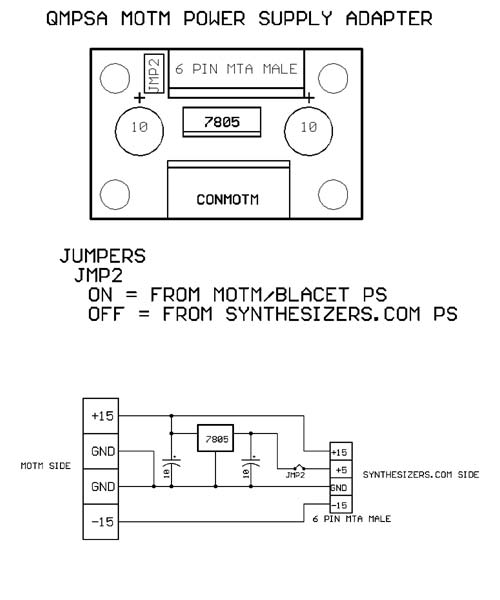
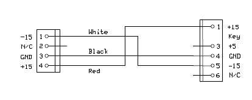
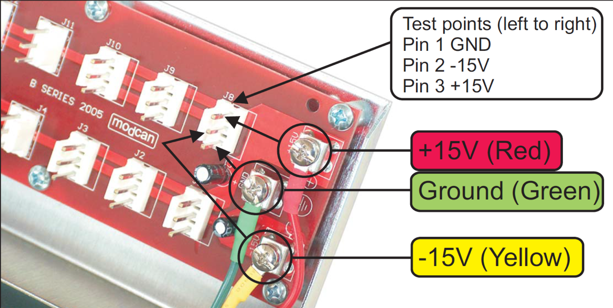
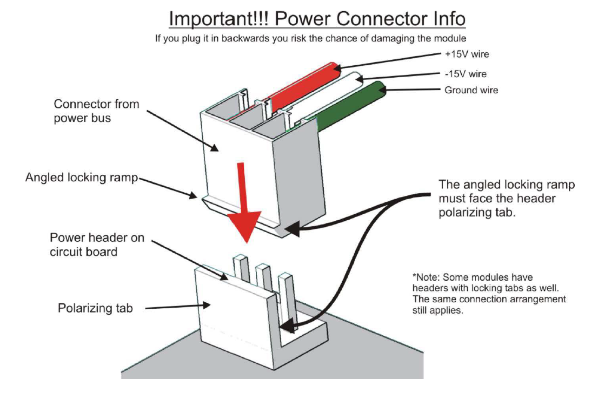

# 5Volt Regulator

Here is my 5volt regulator,  to get from 15v a 5v source to power a synthesizers.com System on a dual 15V Powersupply.

one 10uF Cap/elko.

2 x 100uF Capaciator bipolar

1 x 1N4002 Diode

1x L7805

1x LED with resistor

