# DIY Synthesizer

Here are some other projetcs , like drumboxes, sequencers ,repairs

you find the navigation on left hand or use the search box on top

**Link to Ouboard Space**

SRE330 DCR320 ADR30 Compressors, Effects and more

**Subpages of this Space- alphabetical**

**Recent space activity**

[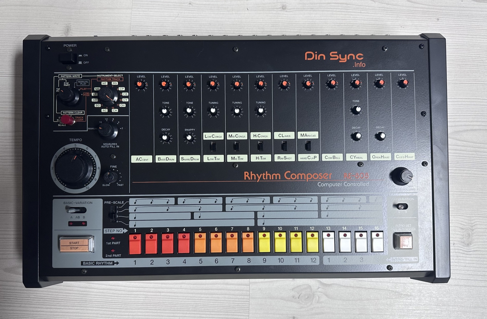](projects/re-808-its-a-replica-of-the-tr-808/index.md)

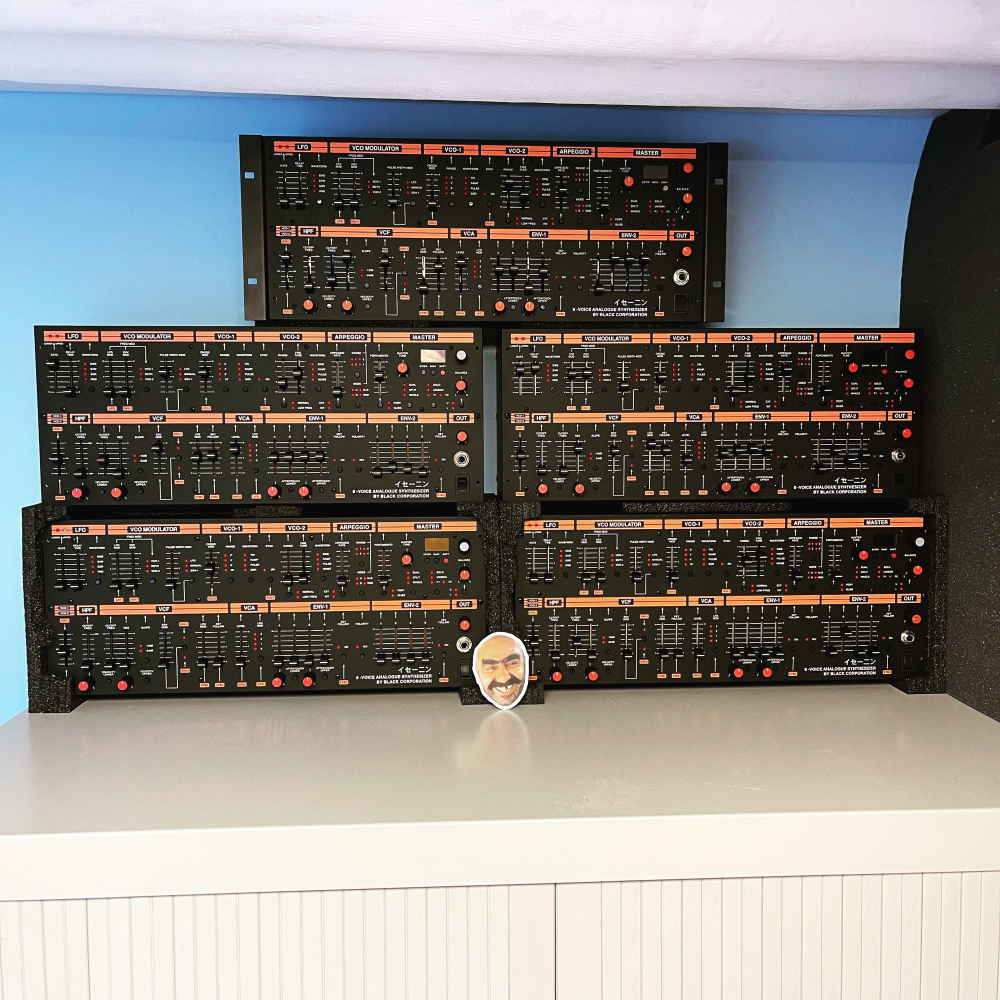

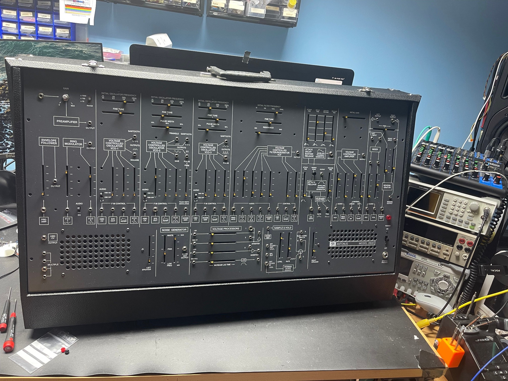

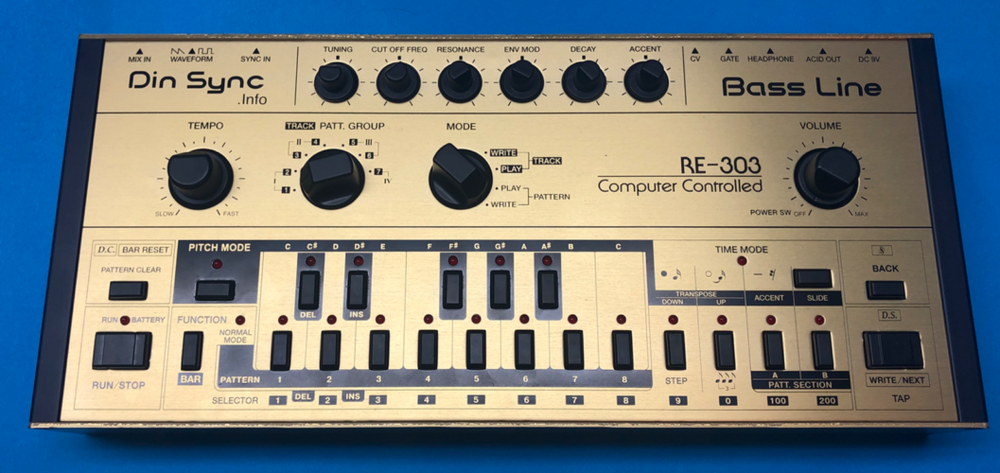

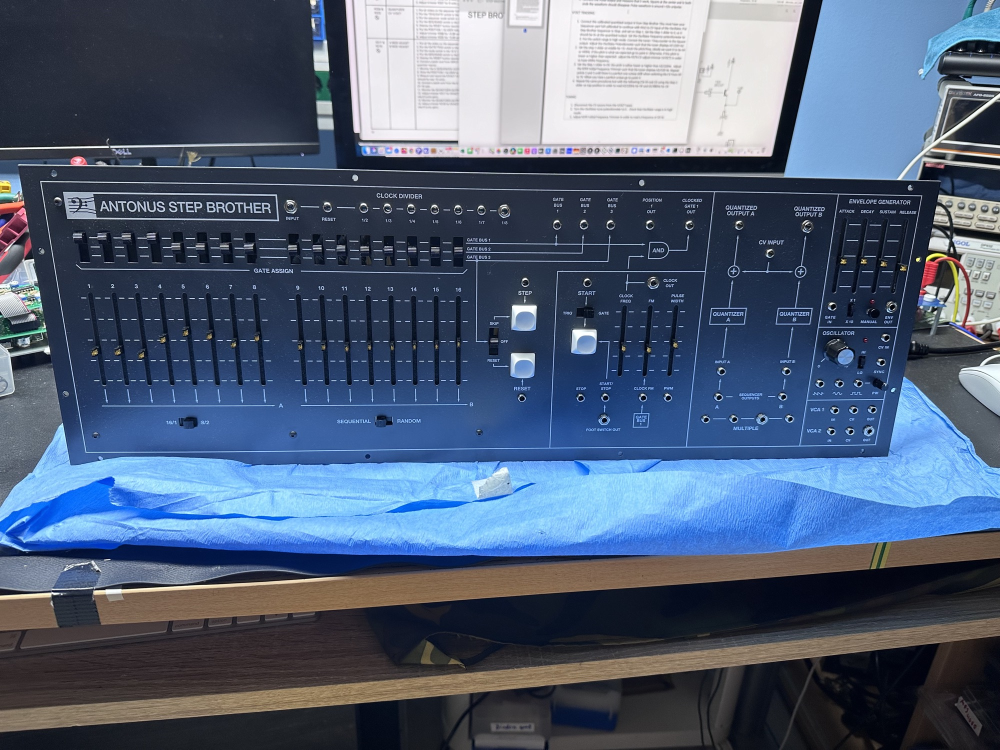

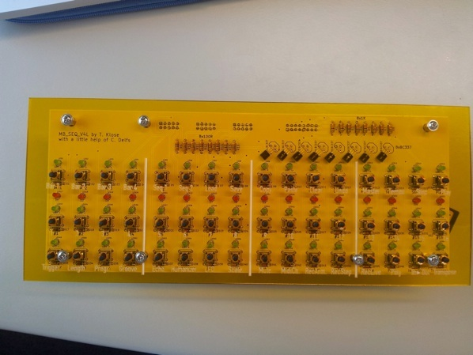

[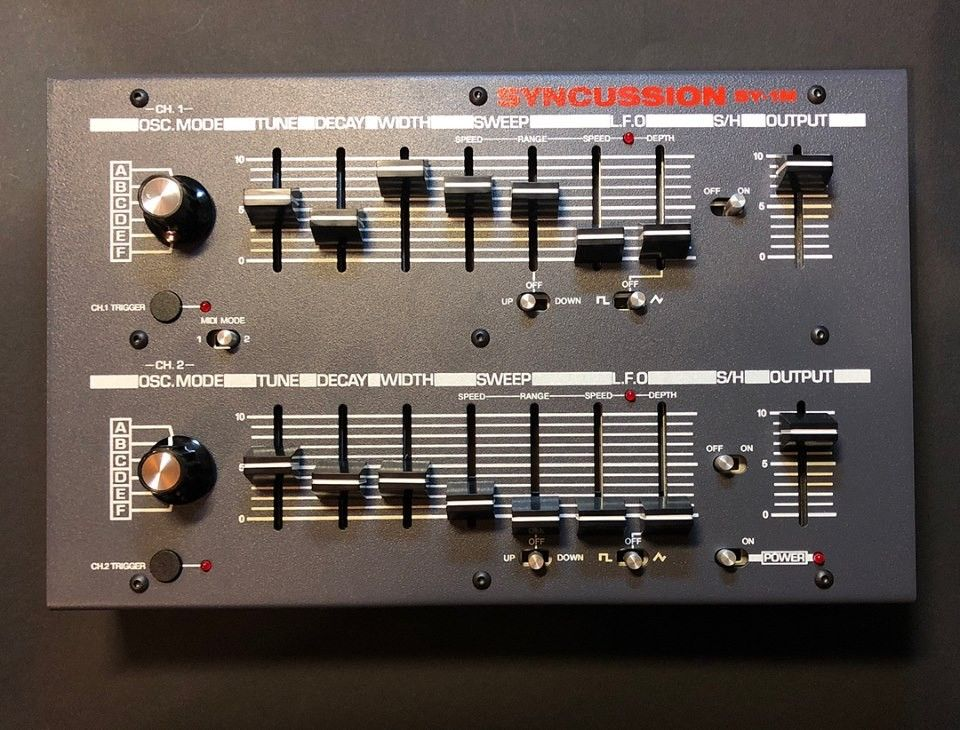](projects/syncussion-sy-1m/index.md)[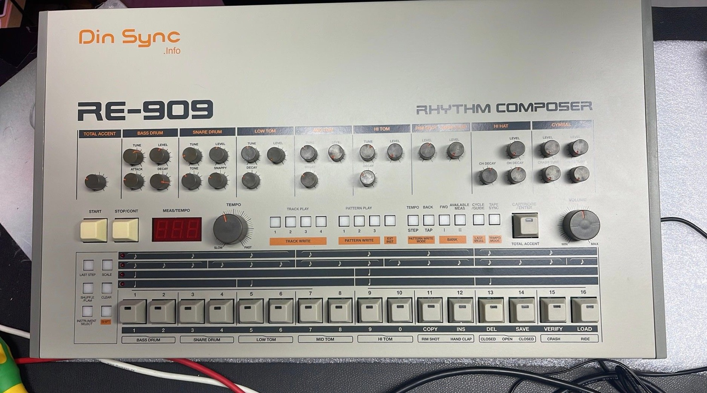](projects/re-909-tr-909-replica/index.md)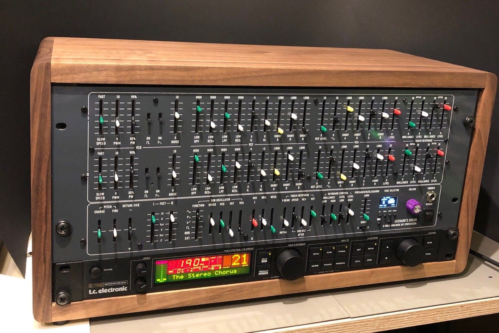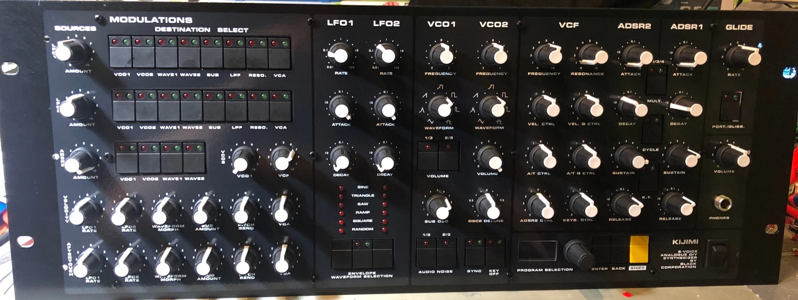[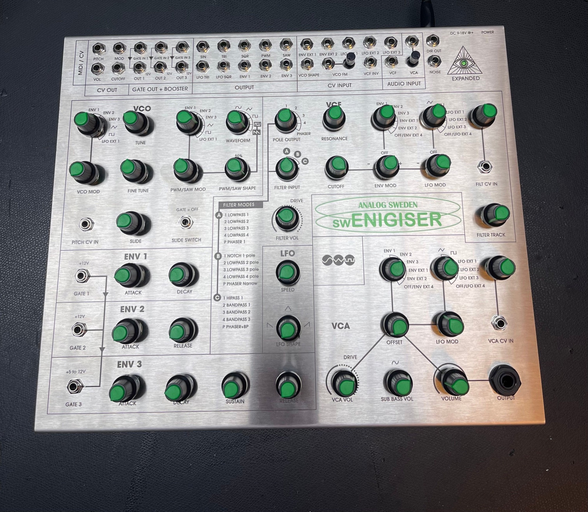](projects/swenigiser-orgon-enigiser-clone/index.md)
