# Arp2600 keyboard 3620 clock input Modification

Dakota Melin designed a PCB to have a clock input for the Korg Arp2600 keyboard.

(it’s only for the KORG Version possible with this mod)

**Function**:

connect a pulse/square signal with 5VPP for example to the upper voice output jack (top jack), the keyboard LFO (internal clock) is overwritten by the external clock.

for example a arp sequencer clock can be used or a beatstep pro or a doepfer MSY signal.

when you DO NOT patch a cable to the upper Voice jack, it use the default function (internal LFO)

> **Hinweis**
>
> I don´t give any warranty for people who try to install the Modification byself.
>
> You need experience in SMT desoldering and SMT soldering and a ESD safe environment.
>
> **DO NOT TRY .. in case you aren't a PRO DIY person, a new pcb from korg isn't available!!**
>
> I offer this Modification as a **PCB only**and a**build/send-in Service** (customers have to remove the panel and pcb and send it to me)

PCB only:

[https://www.diysynth.de/pcbs-panels/korg-arp2600-clock-mod-fuer-3620-keyboard-pcb-only.html](https://www.diysynth.de/pcbs-panels/korg-arp2600-clock-mod-fuer-3620-keyboard-pcb-only.html)

[Assembly Service includes modification:](mailto:info@diysynth.de)
[https://www.diysynth.de/assembly-service-and-repair/arp3620-clock-input-mod.html](https://www.diysynth.de/assembly-service-and-repair/arp3620-clock-input-mod.html)

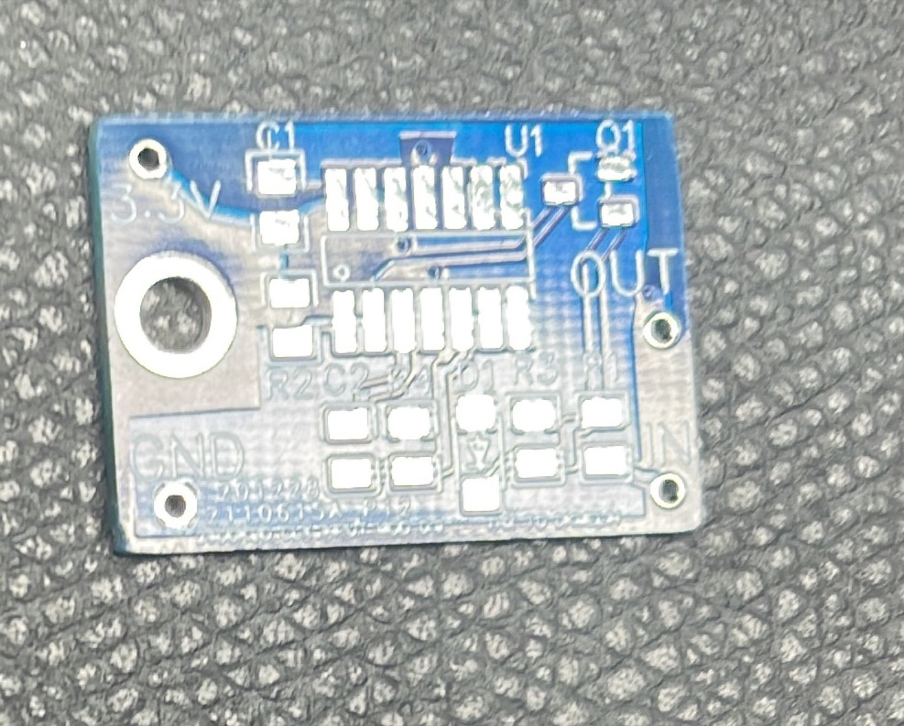

BOM:

| **Designator** |   |   |   |
|---|---|---|---|
| R1 R3 R4 | 100K SMT 0805 |   |   |
| R2 | 47K SMT 0805 |   |   |
| C2 | 100pF SMT 0805 |   |   |
| C1 | 100nF SMT 0805 |   |   |
| IC | CD4093 SOIC 14 SMT format |   |   |
| Q1 | MMBT3904  SOT23 |   |   |
| D1 | 1N4148W-7F   SMT DIODE. SOD123 format |   |   |
| 1x spacer M3 and screw, lock washer |   |   |   |
| 4x cable 0.25mm2 for wiring of power |   |   |   |
| cable shrink/ties etc… |   |   |   |

That's not a build guide !!!

1. remove the screws as shown here (4 Screws are removed from the Keyboard case)

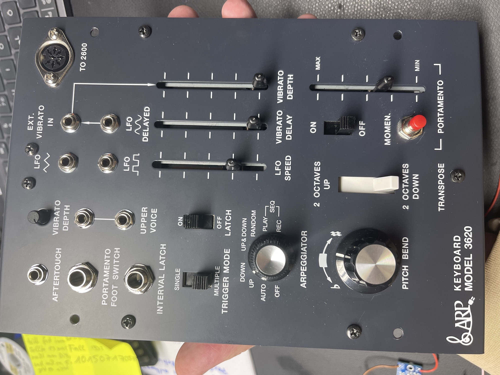

based on this:

[https://modwiggler.com/forum/viewtopic.php?t=242243](https://modwiggler.com/forum/viewtopic.php?t=242243)

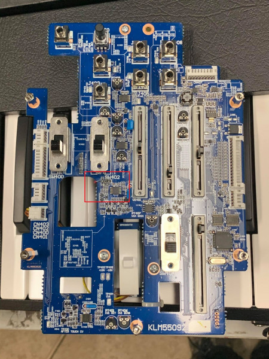

remove the cables:

install a wire bridge as shown:

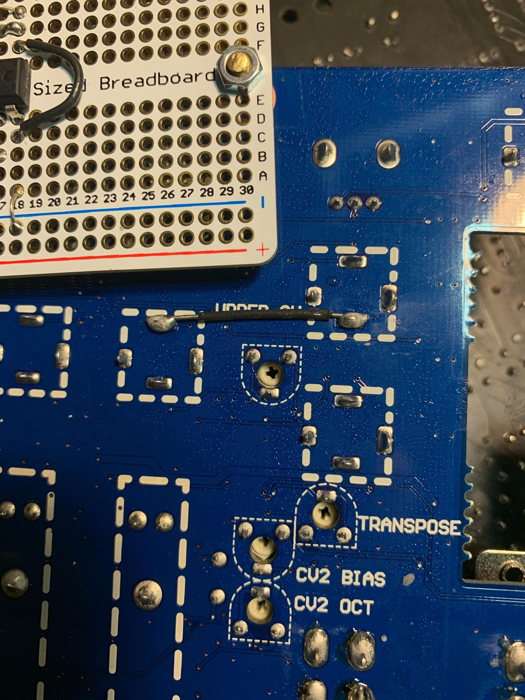

**You have to remove R444 (100R)on the top side:**

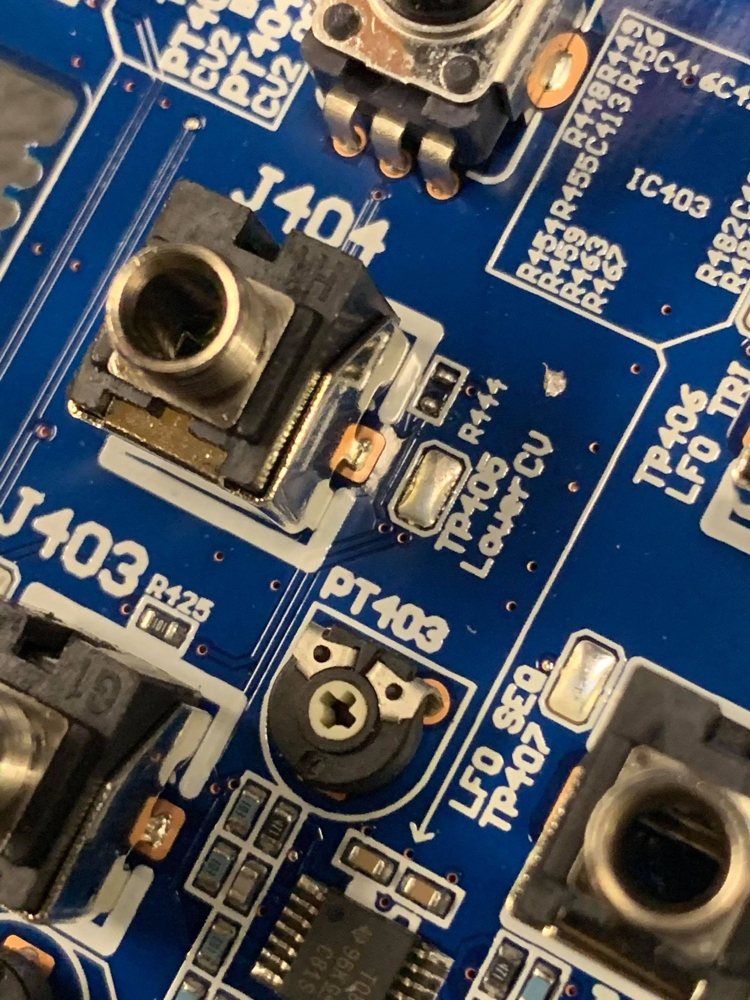

2.  the resistors marked 152 and 562 and both diodes **must be removed**. ***IF YOU HAVE NOT WORKED ON SMD BEFORE STOP HERE!*** Get someone who has experience, please. This is a lead free, relatively delicate board. DO NOT ATTEMPT unless you have done this stuff before.

3. These three pads **are where we are attaching the OUT** of the above conditioning circuit. This point is the input to the MCU that it reads for the tempo of the sequencer/arpeggiator.

4. solder a cable from this point to the mod pcb out.

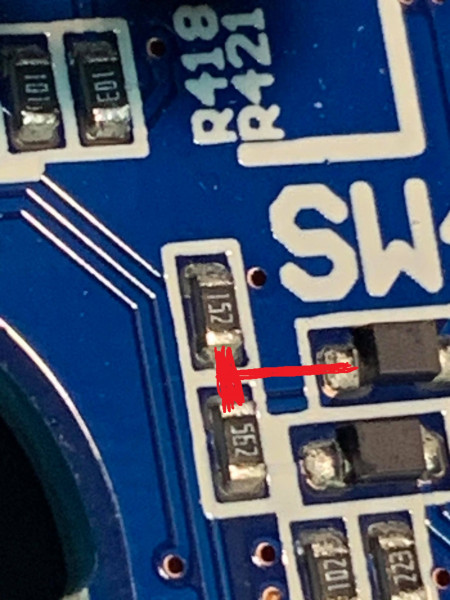

5. solder a cable from the upper CV jack (top) pin - to the input of the mod pcb

6. solder a wire/cable bridge from upper Cv jack (bottom pin)

7. solder power input and ground as shown in following pictures (there are unused pcb connections on bottom of the pcb) marked as CN410, pin6 is positive power out and pin1 is GND) which has to be connected to the Mod PCB.

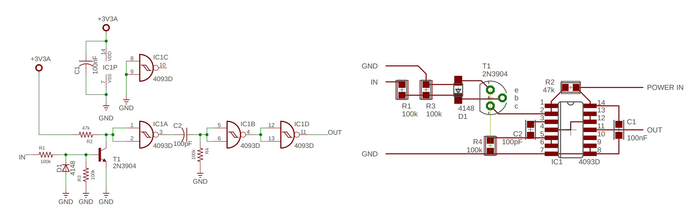

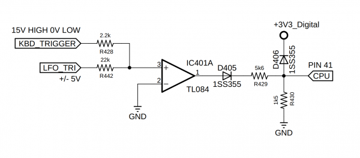

before Modification:

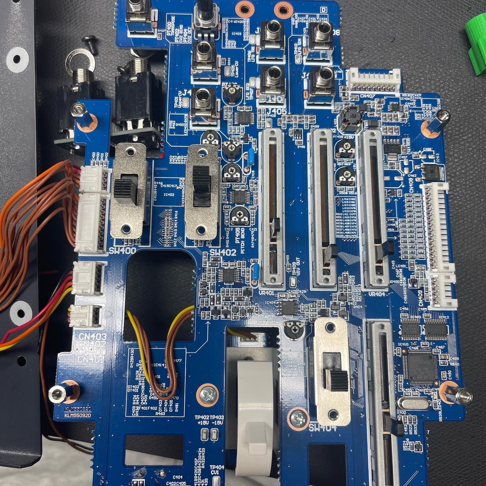

This picture shows the installed Modification:

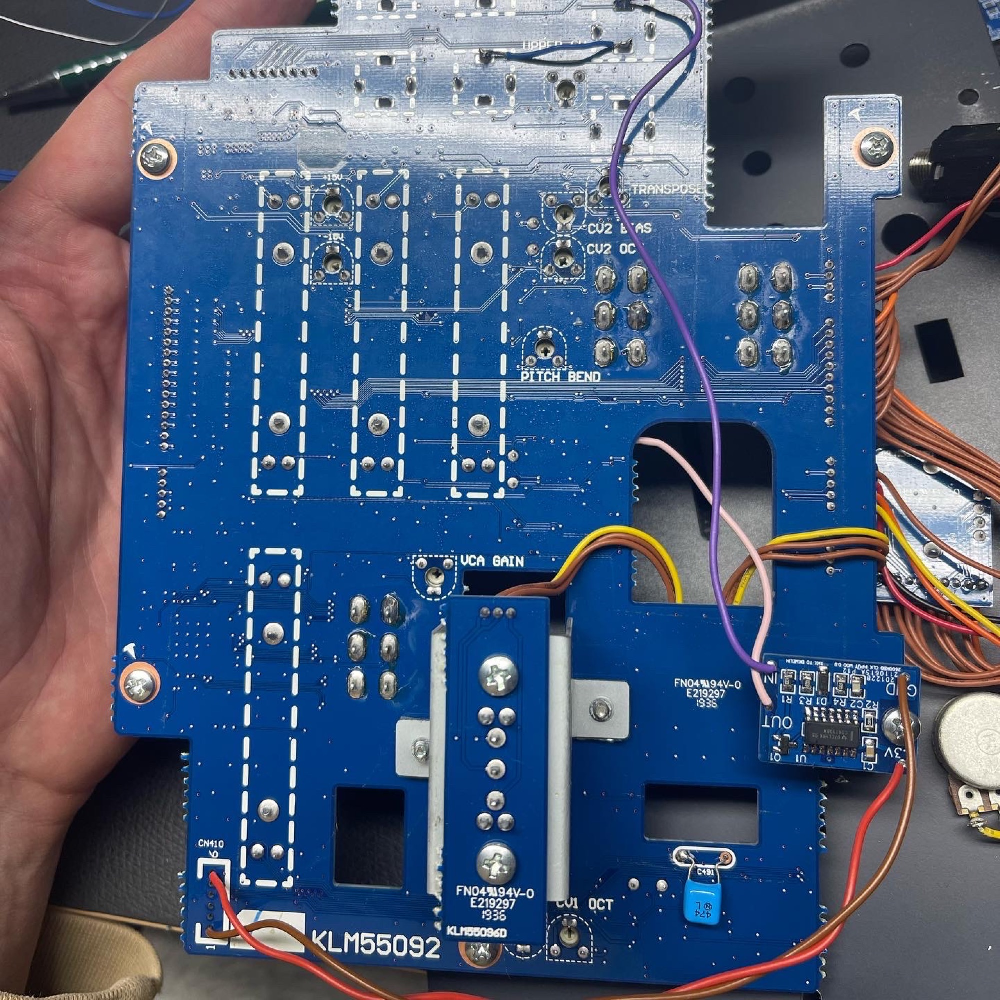

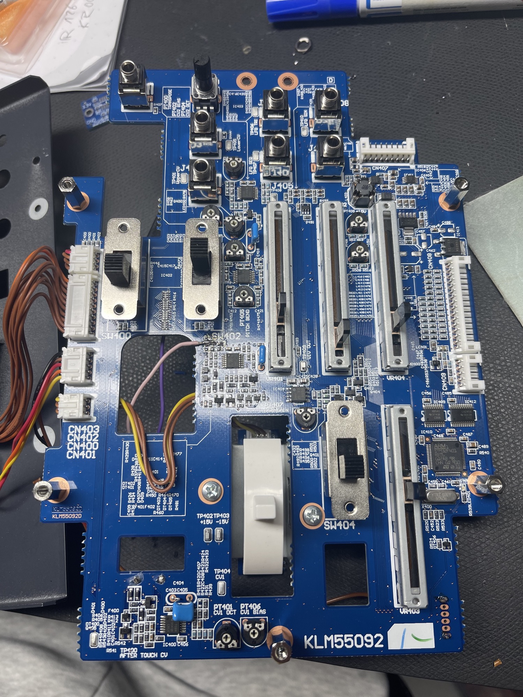

**from a other build :**

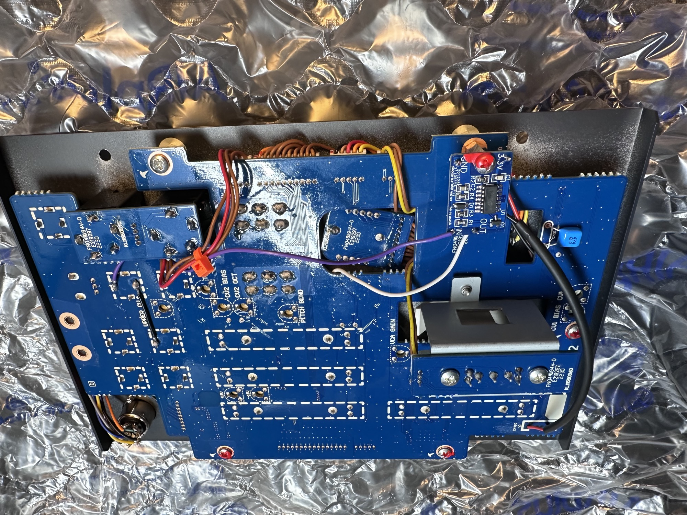

from a other build too:

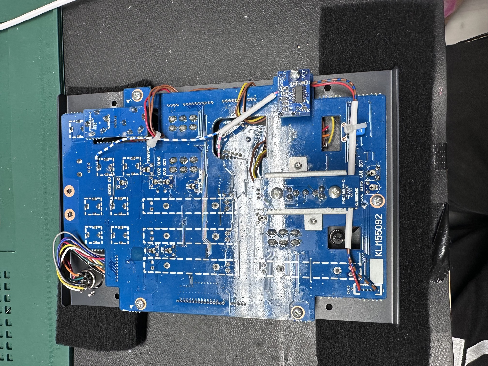
