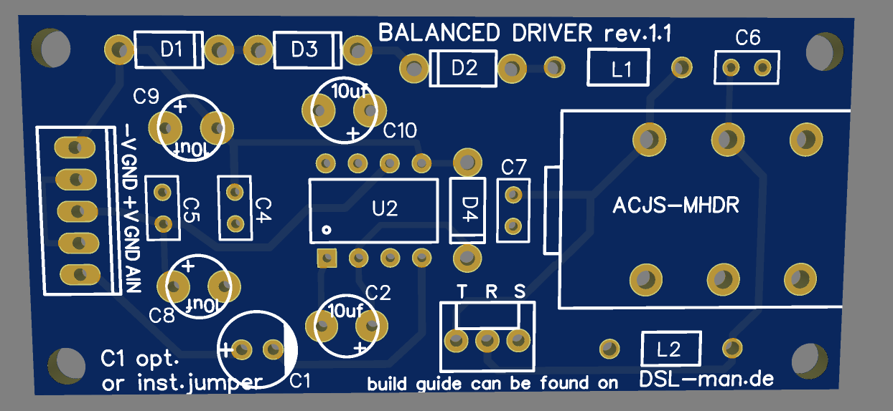
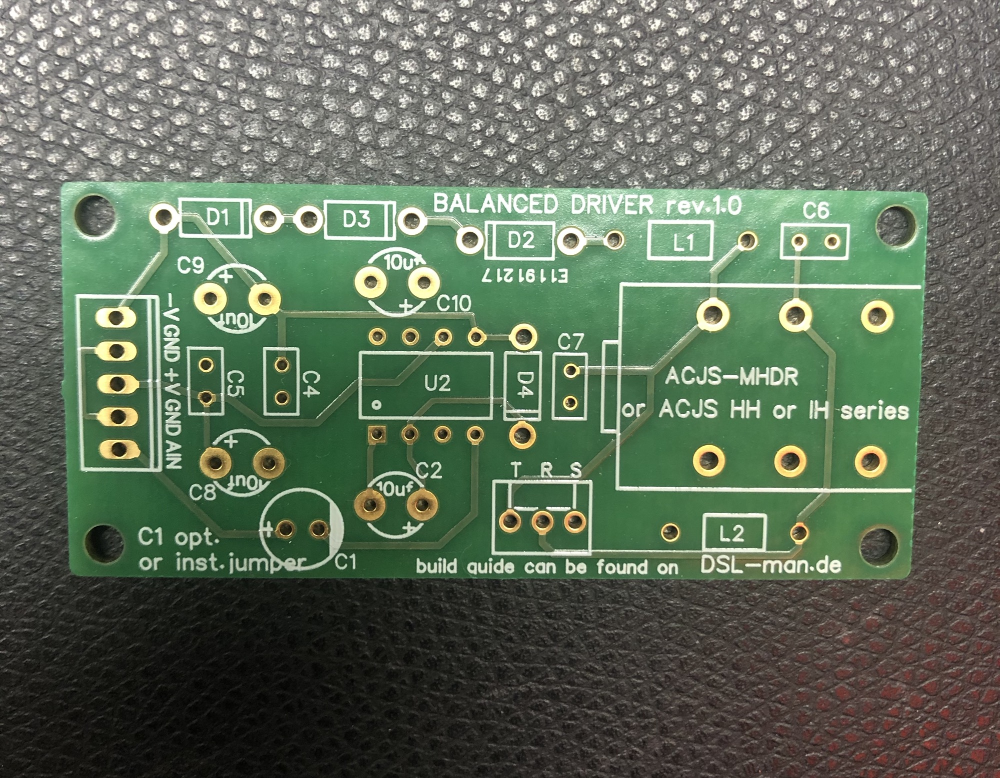
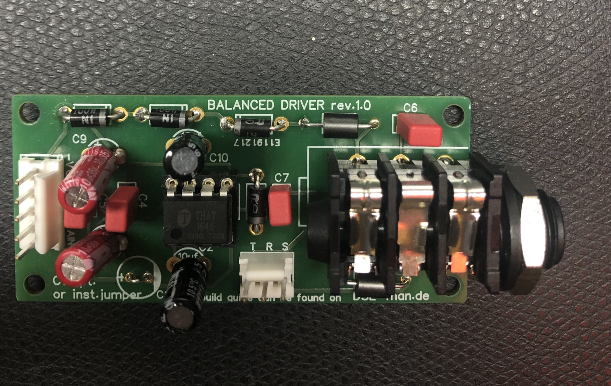
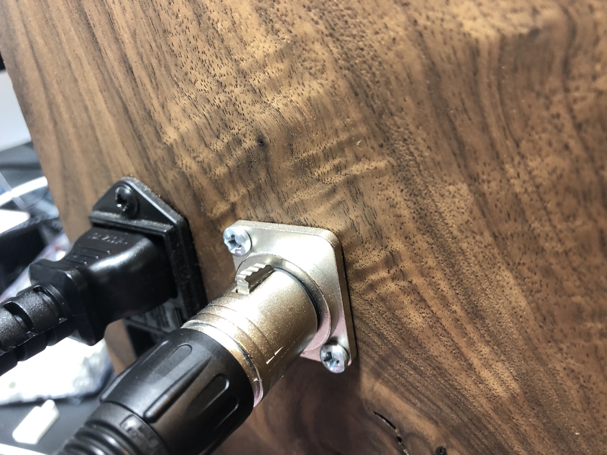
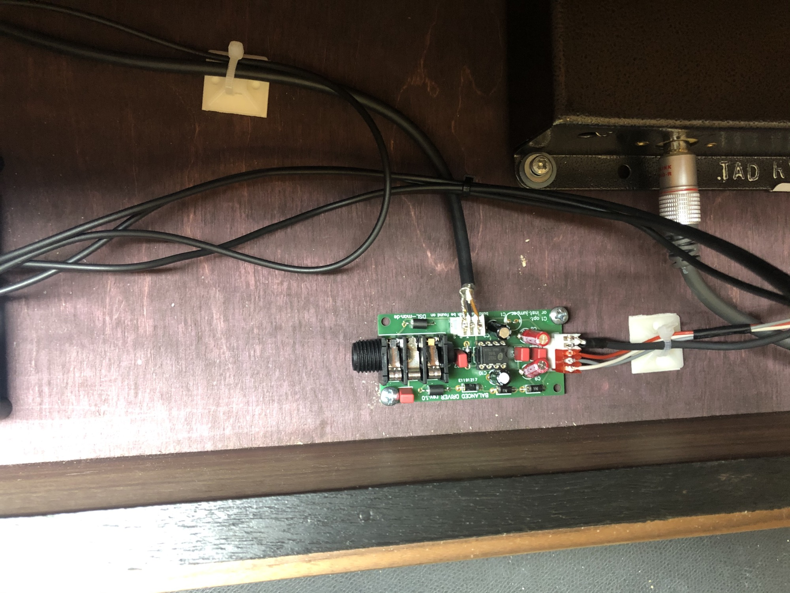

# Balanced Output Driver

> **Project**
>
> ### Projecttitel: Balanced Driver
>
> ### Status: `done`
>
> ### Startdate: 03/2020
>
> ### Duedate: 03/2020
>
> ### Manufacture link: this page
>
> ### Shop Link: diysynth.de - [https://www.diysynth.de/pcbs-panels/Balanced-Driver-PCB.html](https://www.diysynth.de/pcbs-panels/Balanced-Driver-PCB.html)

This Module was designed for my private usage, to install it in some Arp Clones like the TTSH or in old vintage gear.

the 6.3mm Connection is **optional**, the Signal output is at the TRS 3pol MTA header available for XLR Connections too.

the Circuit is Phantom power protected.

the benifits are symmetricial outputs with an bigger headroom and for situations with long cables or problems with EMV..

for TTSH Users: the TTSH isn´t a true Stereo Device, one of this PCB is fine for your TTSH.

 

### **BOM:**

[Download Version: balancer.xlsx](assets/balancer.xlsx)

**Mouser Project**

[https://www.mouser.com/ProjectManager/ProjectDetail.aspx?AccessID=c5113c803c](https://www.mouser.com/ProjectManager/ProjectDetail.aspx?AccessID=c5113c803c)

### BOM Textversion 1.01 (same as above xlsx Version)

|   |   |   |   |   |   |   |   |   |   |
|---|---|---|---|---|---|---|---|---|---|
| version 1.01 | Balanced Driver output. |   |   |   |   |   |   |   |   |
|   | March2020 |   |   |   |   |   |   |   |   |
|   |   |   |   |   |   |   |   |   |   |
|   |   |   |   |   |   |   |   |   |   |
| ID | Name | Designator | Footprint | Quantity | Manufacturer Part | Manufacturer | Supplier | Mouser | alternative |
| 1 | THAT1646PO8-U | U2 | DIP8 | 1 |   |   | Musikding, mouser | 887-1646P08-U | 594-K101J15C0GF53L2 |
| 2 | 100p | C6,C7 | RM2 | 2 |   |   | tme, mouser | 505-FKP0D001000BKSSD |   |
| 3 | FERRITE | L1,L2 | RM10 | 2 |   |   |   | 623-2743001112LF |   |
| 4 | 100uF **optional** | C1 | RM2.5 | 1 | 100uF 35V 6.3\*11 |   |   |   |   |
| 5 | 100n | C4,C5 | RAD-0.1 | 2 |   |   |   | 594-K104K15X7RF53H5 | 81-RDE5C1H104J2K1H3B |
| 6 | 1N4001 - 1N4004 | D1,D2,D3,D4 | DO-41 | 4 |   |   |   | 621-1N4001 |   |
| 7 | 10uf | C8, C9 | RM5 - RM2.5 fits too | 2 | nichigon or Wurth |   |   | 710-860020672010 |   |
| 8 | AMPHENOL ACJS-MHDR #888 | P2 | AMPHENOL ACJS-MHDR #88 | 1 | Amphenol |   |   | 523-ACJS-MHDR |   |
| 9 | MTA-100 header 2.54mm rak 3-pol | H1 | MTA-100 1X3 2.54MM | 1 | TE-Connect. | TE Connectivity | Electrokit | [640456-3](https://www.mouser.de/ProductDetail/TE-Connectivity-AMP/640456-3?qs=sGAEpiMZZMs%252BGHln7q6pm5E1Eb6qwPl2bZeLrWq0xYY%3D) |   |
| 10 | MTA100 header 5pol | CN1 | MTA-100-5V | 1 | TE-Connect. |   |   | [640456-5](https://www.mouser.de/ProductDetail/TE-Connectivity-AMP/640456-5?qs=sGAEpiMZZMs%252BGHln7q6pm5E1Eb6qwPl2GvJwv4oqRbM%3D) |   |
| 11 | MTA 100 jack 5pol | CN1 jack | Rm2.54 | 1 | TE-Connect. |   |   | [3-641190-5](https://www.mouser.de/ProductDetail/TE-Connectivity-AMP/3-641190-5?qs=sGAEpiMZZMs%252BGHln7q6pm5E1Eb6qwPl21OXD67i2SbI%3D) |   |
| 12 | MTA 100 jack 3pol | H1 for optional XLR connection | Rm2.54 | 1 | TE-Connect. |   |   | [3-640443-3](https://www.mouser.de/ProductDetail/TE-Connectivity/3-640443-3?qs=sGAEpiMZZMs%252BGHln7q6pm48SVpWlpfsE4S6O3VfQVW8%3D) |   |
| 13 | IC socket 8pin milled | for U2 |   | 1 |   |   |   | 575-144308 |   |
| 14 | screws, washer, nuts optional |   |   |   |   |   |   |   |   |
| 15 | 10uF **BIPOLAR** capacitor | C2, C10 | RM5, Rm2,5 fits too | 2 |   |   |   | 667-ECE-A1EN100UB |   |
|   | **note: you dont need the 6.3mm jack on the pcb - you can also use the TRS H1 header for jacks or XLR** |   |   |   |   |   |   |   |   |
|   |   |   |   |   |   |   |   |   |   |

## Buildguide

nothing special.. just install the parts.. and solder everything

**before you start:**

the **C1**  100uF capactitor is optional -**jumper the pins** as seen in the above picture.

when you only use XLR - use only the TRS (3pole MTA100 connector)

when you only want the 6.3mm connection - don't install the TRS header

make sure you install in C2 and C10 the BIPOLAR electrolyte caps   (C8 and C9 is polarity sensible)

**Pinout:**

| pin number | function |
|---|---|
| -V | negative Power input from -12V thru -18V |
| +V | positive Power input from 12- 18V |
| AIN | analog unbalanced input from your audio source |
| GND pads | ground for voltage (one pad with ground is fine) in some devices you have to ground the chassis with the GND pads too (in case you have hum issues from the circuit, but make sure you don't have a ground loop) |
|   |   |
| TRS header balanced output !! | T = Tip R= Ring S= Ground/sleeve |
