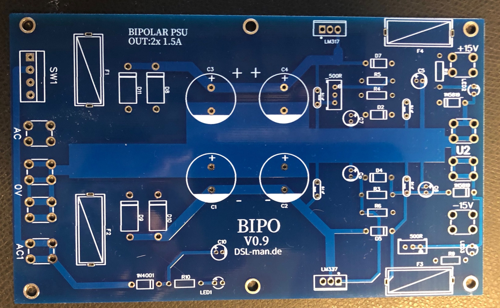
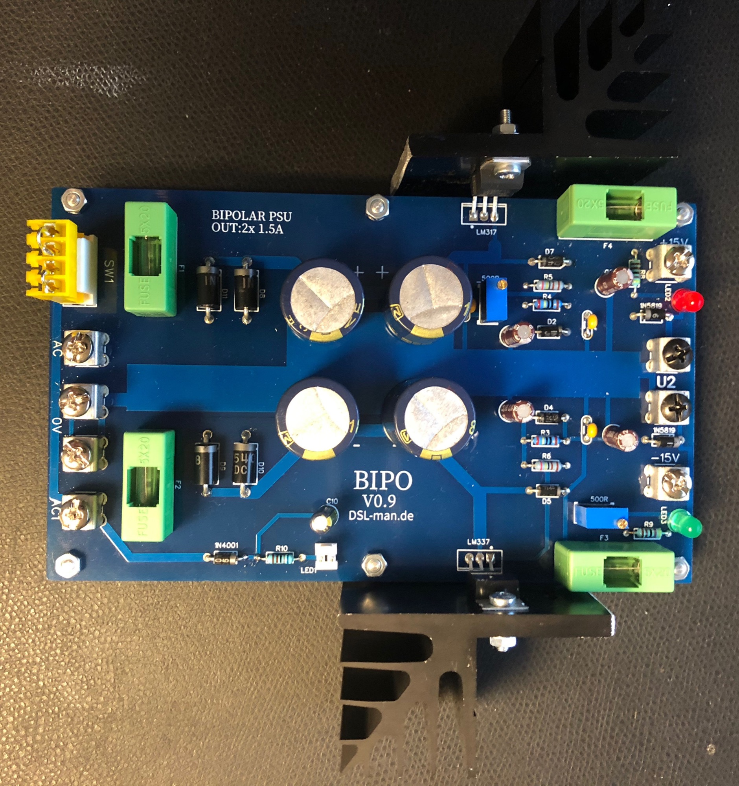
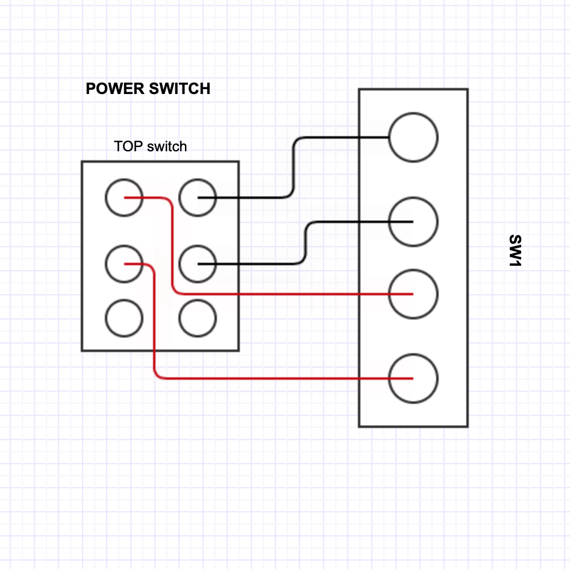
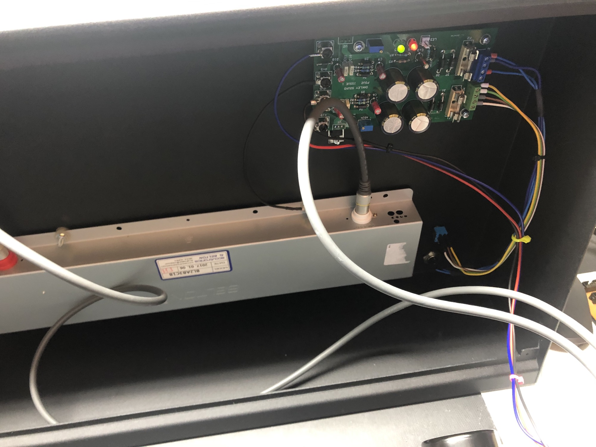
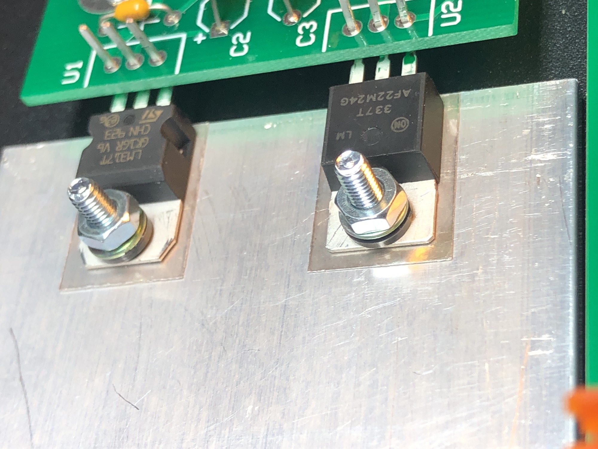

# Bipolar Powersupply BIPO

The Psu PCB is available in my shop:

[https://www.diysynth.de](https://www.diysynth.de)

I reworked a PSU design, because the most bipolar psu pcbs doesn't match with my requirements.

This Psu is great in combination with an Yamaha PA-30, perfect for the TTSH  - no EMV problems or hum from the switching DC solution and no hum on the reverb.

The Yamaha PA-30 gives you around 700mA on 15V and 700mA on -15V.

Inputs and Outputs are mechanical very stable and the pcb can be attached by 6 Screws.

The Voltage regulators can be mount directly (with isolation/glimmer  pads) on a metal case like the TTSH or with cooling frames.

you can use MTA100 headers instead of the LEDs - to connect 1 or 2 external Led holder in your device.

> **Achtung**
>
> Its important to double check every rectifier/diode and capacitor and your wiring before you test the circuit.

**BOM: (09.Aug.2020)**

[BOM\_PSU\_rev1.1\_2020-08-09\_17-15-03.xls](assets/BOM_PSU_rev1.1_2020-08-09_17-15-03.xls)

for SW1: don't use the MTA header- connect the cable directly.

the 3pole PSU Connector for the Yamaha PA30 is available on TME. FC684203

**Build:**

just install all parts from the BOM. use Glimmer(isolation) in case you attach both regulators to the same metal/cooler

for the switch  SW1 - don't use a header - connect directly cables to SW1.

use the trimmer to get the correct voltage

**wiring for Sw1:**

**Fuse sizing:**

use at the input fuses (F1/F2) the value which your AC-AC transformer offer - for the Yamaha PA.30 its max. 750mA - you need for F1 and F2 750-800mA fuses,

normally FAST blow fuses are not good in this circuit, please use medium or slow blow fuse types !!

for the secondary fuse use a value which is 10-20% bigger than what your device ask (for example a TTSH works great with 2x  500mA fuses and should be work with a 320mA too (depends on the additional mods)

**Schematic:**

[Schematic\_PSU\_rev0.9\_2020-11-02\_19-11-13.pdf](assets/Schematic_PSU_rev1.0_2020-11-02_19-11-13.pdf)

**Example for TTSH installation:**

the case of the TTSH is used as a cooling block

Heres´an example of an isolated Installation with Glimmer and plastic rings - its important that both voltage regulators are isolated - there's also a plastic inlet on bottom of the nut which isolated the screw from the voltage regulator body.

