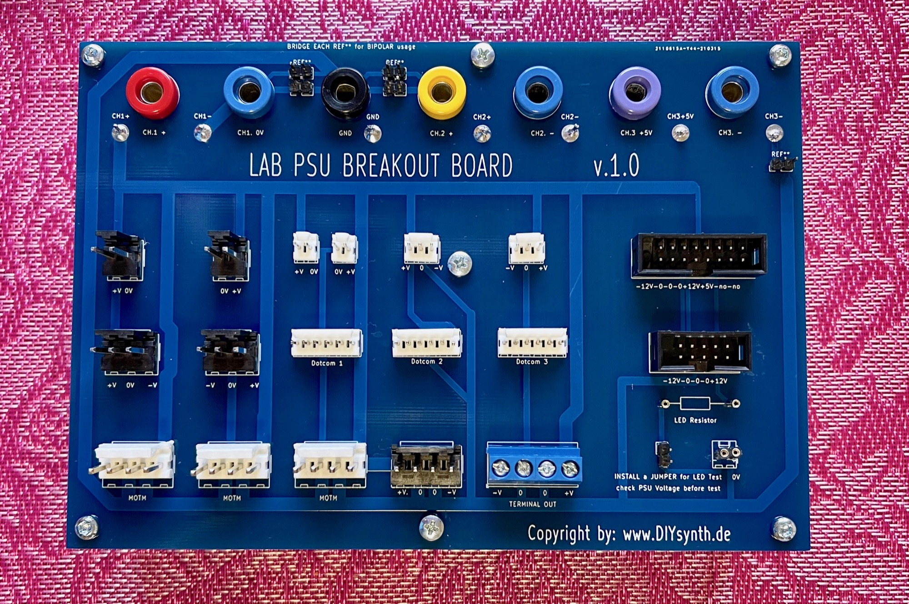

# Lab PSU Breakoutboard PCB

I have this PCB as assembled and blank PCB in my shop:

assembled:

[https://www.diysynth.de/pcbs-panels/LAB-PSU-Breakoutboard-PCB-assy.html](https://www.diysynth.de/pcbs-panels/LAB-PSU-Breakoutboard-PCB-assy.html)

bare PCB:

[https://www.diysynth.de/pcbs-panels/LAB-PSU-Breakoutboard-PCB.html](https://www.diysynth.de/pcbs-panels/LAB-PSU-Breakoutboard-PCB.html)

This PCB was designed for Pro DIY Builder who wants different Connector to build, test and repair devices or modular modules.
You should have an Bipolar Powersupply to connect this pcb.
There´s a LED test and LED resistor test section
**the PCB comes populated**,
The Banana connectors are for the Inputs of your Lab/Bench PSU - the common 0V can be brigded by the jumpers (if needed)
The banana colour can be different - the shown picture is just an illustration.

**Connectors:**
3X MOTM
1x MOTM +/- inverse
3x Dotcom Modular
1x 16pin Eurorack
1x 10Pon Eurorack
1x MTA156 2pin
1x MTA156 2Pin inverse
1x MTA100 2pin
1x MTA100 2pin inverse
1x MTA100 3pin
1x MTA100 3 pin inverse
1x MTA156 3pin 
1x MTA156 3pin inverse
1x Terminal with Screws   
1x LED test section /LED driver resistor test

**BOM:**

(the most builders known the parts and have some in stock, you can use different vendors and suppliers for example TE-Connectivity or Molex)

| **Nr.** | **quantity** | **Name** | **Partnumber** | **vendors** |
|---|---|---|---|---|
| 1 | 2 | MTA156 2 pin | [3-641120-](https://www.mouser.de/ProductDetail/TE-Connectivity-AMP/3-641120-4?qs=JhGsHB8aCLvpu6wzALHI5A%3D%3D)2 | TME/Mouser/digikey |
| 2 | 2-3 | MTA100 2 pin | 640454-2 |   |
| 3 | 2 | MTA100 3pin | 640454-3 |   |
| 4 | 2 | MTA156 3pin | [3-641120-](https://www.mouser.de/ProductDetail/TE-Connectivity-AMP/3-641120-4?qs=JhGsHB8aCLvpu6wzALHI5A%3D%3D)3 MTSS156-3-D |   |
| 5 | 3 | MTA100 6 pin | 640454-6 |   |
| 6 | 4 | MTA156 4pin | [3-641120-4](https://www.mouser.de/ProductDetail/TE-Connectivity-AMP/3-641120-4?qs=JhGsHB8aCLvpu6wzALHI5A%3D%3D). MTSS156-4-D (mascon) |   |
| 7 | 1 | screw terminal | ETB11040B000Z |   |
| 8 | 4 | pins from IC socket - milled pin | STS-1P (confly DS1005-09-468) |   |
| 9 | 6 | 2pin RM2.54 header | 68000-212HLF. (order only 1x because its 12pin) |   |
| 10 | 7 | Banana - different colors | MFR50SFTE52-11K for example |   |
