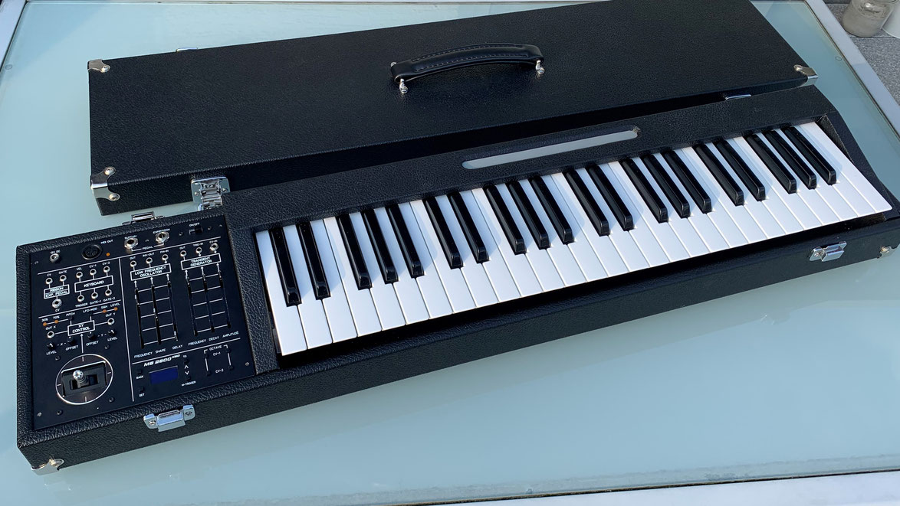

# MS2600KBD

> **Project**
>
> ### Projecttitel: MS2600KBD
>
> ### Status: `in progress`
>
> ### Startdate:
>
> ### Duedate: 10/2021
>
> ### Manufacture link: diysynth.de

The MS2600KBD Project **is owned by** [https://diy-mms.jimdo.com/ms-2600-kbd/](https://diy-mms.jimdo.com/ms-2600-kbd/) 

This is an DIY Project !!

## **Specification:**

|   |   |
|---|---|
| **4 Octaven Manual with Aftertouch (FATAR TP9)** | Octave-Shift about 4 Octaves 2\* CV-OUT for Pitch ( 0-8V, 1V/OCT ) 2\* GATE (0/10V) 1\* Trigger (0/10V – 2ms) 1\* Velocity (0-10V, Dynamik adjustable) Monophone, Duophone and Split-Mode |
| **Sequencer** | 7\* 64 Steps |
| **Arpeggio** | 7 different Modes |
| **Sustain-Pedal** | On/Off |
| **Expression Pedal** | CV (0..10V) |
| **MIDI-OUT** | Note ON/OFF Velocity Sustain Pitchbend CC vom Ribbo & Joystick |
| **XY-Joystick** | each -10 to +10V (Pegel and Offset adjustable) (X) Pitch-Bend (Y) LFO- Control |
| **Ribbon-Bar** | CV (0..4V oder -4V bis +4V) Gate (0/10V) Relative/Absolute/Centered-Mode |
| **LFO** | two Outputs FM Input 14 Waveforms Waveshaping Sample&Hold Sync 50mHz – 30Hz Delay (fade in) |
| **Transienten-Generator** | Transient-Generator Slew-Limiter Event-Generator Echo-Generator |
