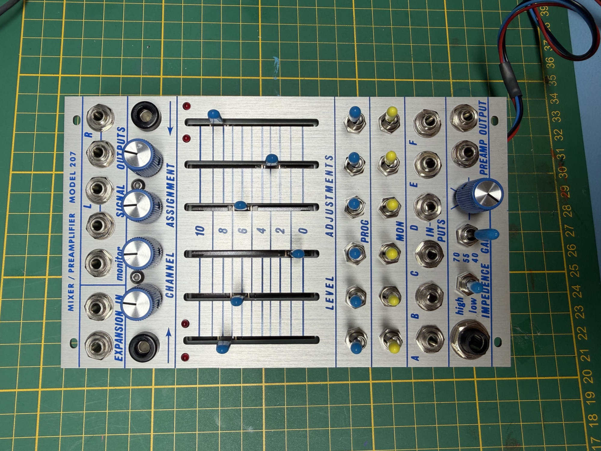
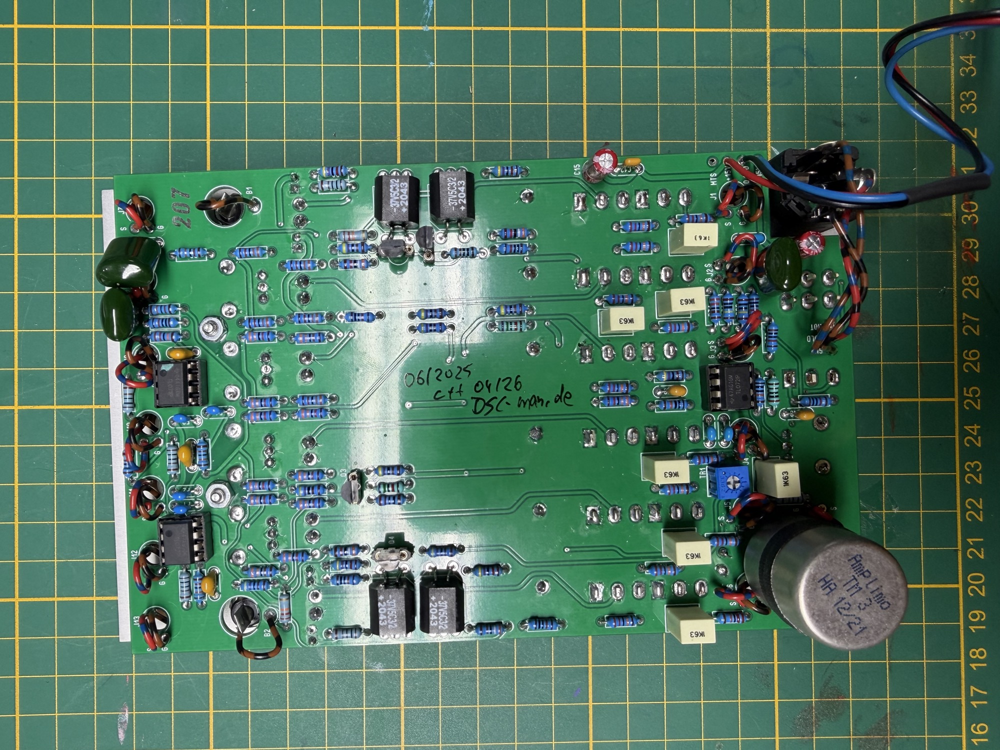
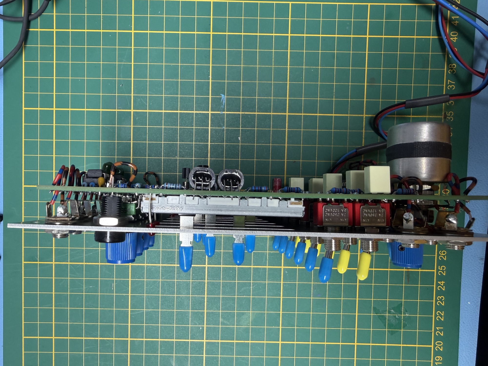

# 207s buchla inspired

[207\_BOM.pdf](assets/207_BOM.pdf)

you can use 2N3904 without changing the pinout.

in case you use PN3565 as described in the BOM, you must turn the transistor 180 degrees, they are for the Vactrol control - CV Panorama of Ch A and F.

I built the 207s from Samodular.

**Info:**

In addition, a high impedance monitor out signal is also sent to an**MTS wire**as part of the power cable.  This can be connected to the MTS input on the 227 mixer.

[https://www.youtube.com/watch?v=1qK\_rBia81E](https://www.youtube.com/watch?v=1qK_rBia81E)

Infos about Buchla 207 DIY Versions: (its not valid for the SAmodular version)

 [https://modularsynthesis.com/roman/buchla207/207\_mix-pre.htm](https://modularsynthesis.com/roman/buchla207/207_mix-pre.htm)

the 4 upper potis are for each channel the panorama L/R

The left black banana is for CH.1 (A) CV - pan

the black banana is for channel 7 (F9 CV - panporam

For the Functions, you should look this:

[https://www.youtube.com/watch?v=1qK\_rBia81E](https://www.youtube.com/watch?v=1qK_rBia81E)
