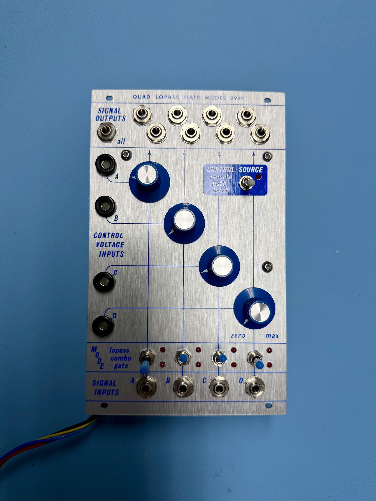
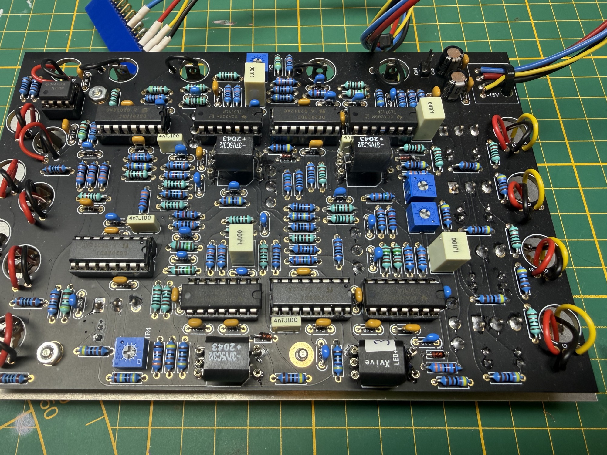
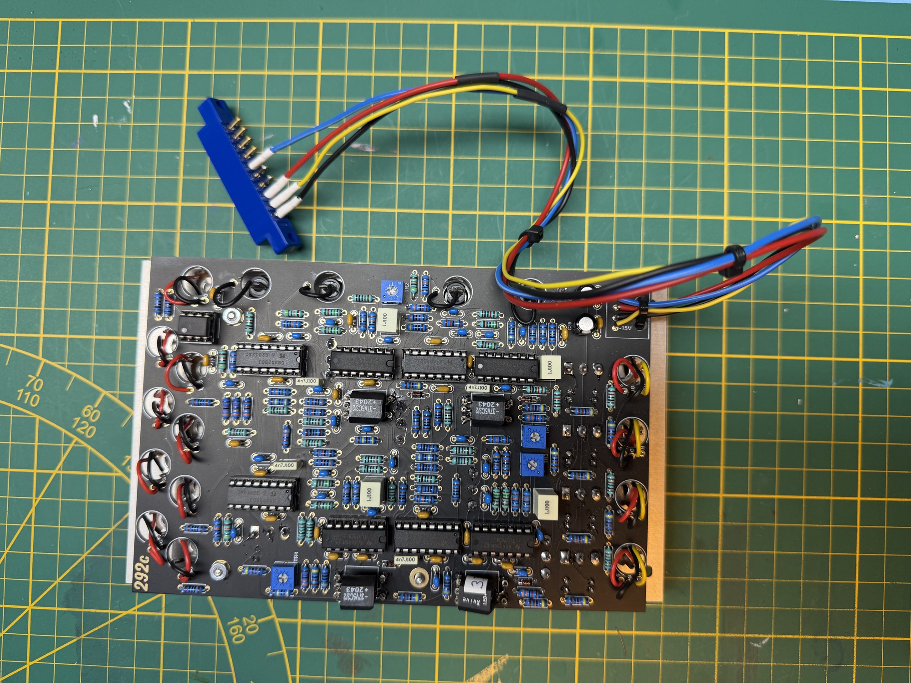

# 292c Buchla inspired

a 292c from SAModular was build in 2025 from my backlog

[https://web.archive.org/web/20230325175558/https://www.samodular.com/product/292cs-qlpg/](https://web.archive.org/web/20230325175558/https://www.samodular.com/product/292cs-qlpg/)

[292c\_BOM-2.pdf](assets/292c_BOM-2.pdf)

[292\_Diodes\_Resistors.pdf](assets/292_Diodes_Resistors.pdf)

