# Abstrakt Instruments VS-1 DIY

> **Project**
>
> ### Projecttitel: VS-1
>
> ### Status: `in build`
>
> ### Startdate: 06/2020
>
> ### Duedate: 04/2024
>
> ### Updated: 20.January.2026 Backup added
>
> ### Manufacture link: [http://abstraktinstruments.com](http://abstraktinstruments.com)
>
> [https://abstraktinstruments.com/vs1-diy/](https://abstraktinstruments.com/vs1-diy/)
>
> [https://www.kickstarter.com/projects/abstraktinstruments/vs-1-polyphonic-analog-synthesizer/description](https://www.kickstarter.com/projects/abstraktinstruments/vs-1-polyphonic-analog-synthesizer/description)
>
> ### Facebook group: (I´m the admin). [https://www.facebook.com/groups/849435342474238](https://www.facebook.com/groups/849435342474238)
>
> send me a message if you dont get access
>
> ### Modwiggler Build thread:
>
> [~~https://www.modwiggler.com/forum/viewtopic.php?t=281217~~](https://www.modwiggler.com/forum/viewtopic.php?t=281217)
>
> new: 
>
> [https://www.modwiggler.com/forum/viewtopic.php?p=4115173#p4115173](https://www.modwiggler.com/forum/viewtopic.php?p=4115173#p4115173)

**This Pages are especially for the DIY Version**

The Kickstarter campaign is online since: 14.Jan.2020 and was sucessfully backed with 250K USD

[https://www.kickstarter.com/projects/abstraktinstruments/vs-1-polyphonic-analog-synthesizer/description](https://www.kickstarter.com/projects/abstraktinstruments/vs-1-polyphonic-analog-synthesizer/description)

**Table of Contents**

## **Generel Info bit the Kickstarter goals:**

DIY PCB SET CONTAINS..

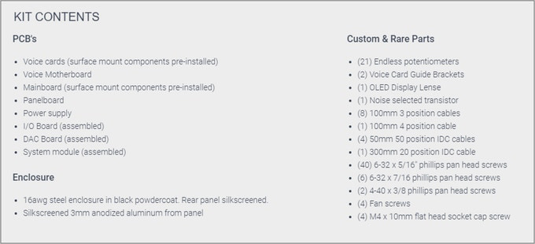

**Stretchgoals:**

- 120K - MPE Support
- 140K - Direct Outputs
- 160K - Stereo Analog Chorus - We have a hell of an analog chorus designed - we can't add cost & commit resources to implement it unless we reach certain cost targets.
- 180K SD Card
- **all Stretch Goals arrived**

---

> **Disclaimer**
>
> ⚠️   This guide is a**best practice guide**and I'm not responsible for any damage, or product quality.
>
> Please respect your local laws/regulation for handling of electronics/electricity.
>
> I'm not responsible for damages, failures with your build.
>
> **Do not try to build this device without basic knowledge of synthesizers. You need experience in DIY.**

## **BOM:**(officially by Abstrakt Instruments)

[~~VS-1\_DIY\_BOM(v102).xlsx~~](assets/VS-1_DIY_BOM-v102.xlsx)~~from 04.Jan.2024~~

[~~VS-1\_DIY\_BOM(v103).xlsx~~](assets/VS-1_DIY_BOM-v103.xlsx)~~from 24.Jan.2024~~

[VS-1\_DIY\_BOM(v104).xlsx](assets/VS-1_DIY_BOM-v104.xlsx) from 09.Feb.2024  please look at t he changeling in the BOM, in case you used the BOM 1.03 previous.

## **Soldercore**

**you need 2 solder core types:**

1. **water soluble solder core**, this is the solder core which you use for resistors,capacistors, IC-sockets, parts which can be in touch in water.

[https://www.digikey.de/de/products/detail/kester-solder/24-6337-6403/6048](https://www.digikey.de/de/products/detail/kester-solder/24-6337-6403/6048)

part nr.  24-6337-6403

     2. **no clean solder core** - which must be used for trimmers and potentiometer (everything which has to be installed after you washed the pcbs with hot water)

[https://www.digikey.de/de/products/detail/kester-solder/24-6337-8809/365521?s=N4IgTCBcDa4CwFoBsBmFB2BAOLAGAnCALoC%2BQA](https://www.digikey.de/de/products/detail/kester-solder/24-6337-8809/365521?s=N4IgTCBcDa4CwFoBsBmFB2BAOLAGAnCALoC%2BQA)

part nr.  24-6337-8809

## **Schematics**: (copy from 09.Feb.2024)

[vs1\_schematics.pdf](assets/vs1_schematics.pdf)

## **Build it:**

Please see the [*Altium 365 Viewer*](https://www.altium.com/documentation/altium-365) documentation for full details on the cloud-based tool.

#### Altium links: (open the links inside of the page every day - do not use a old browser session, the browser do not update the content automatically)

#### [https://abstraktinstruments.com/vs1-diy/](https://abstraktinstruments.com/vs1-diy/)

## **PCB Scans:** (Copyright Patrick)

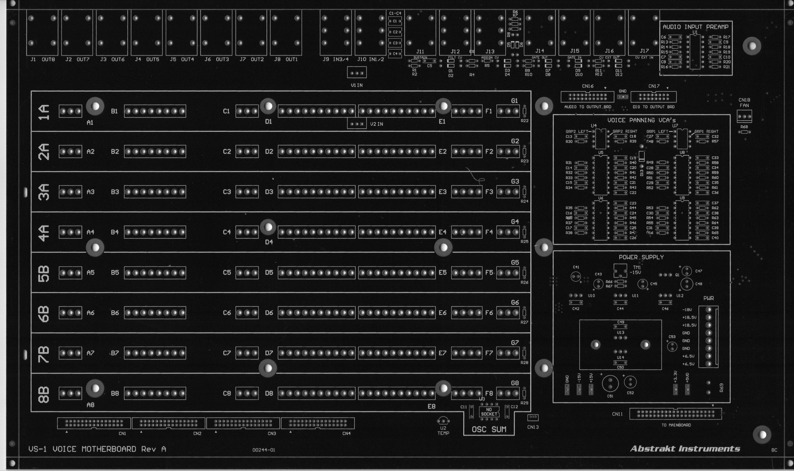

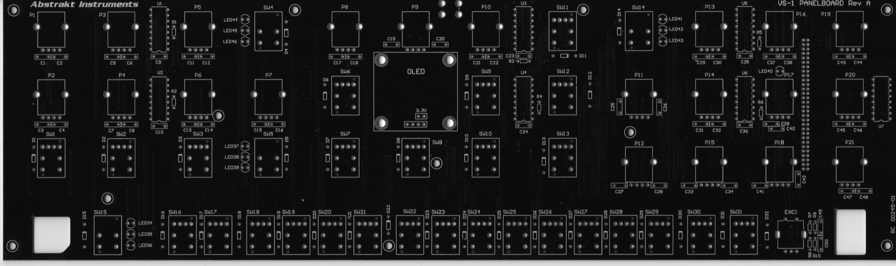

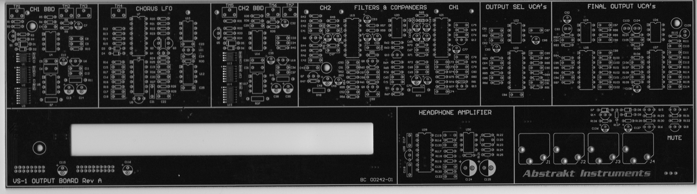

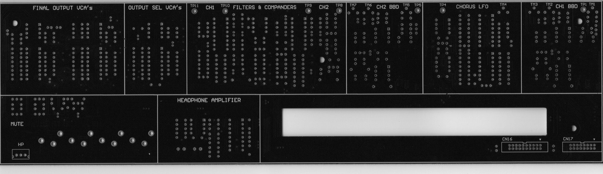

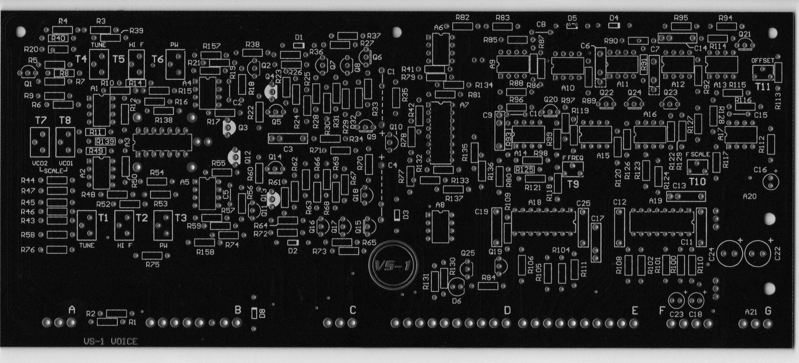

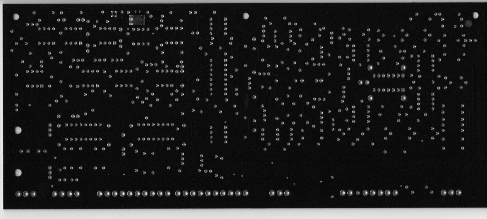

## **Build Manual:**(officially by Abstrakt Instruments)

**Please Note:** The VS-1 Build Manual is still in draft form, currently draft v0.83. Formatting may change, and Section 3 on calibration is yet to be completed. There are also a few steps left in section 2 to be completed.

[vs1\_build\_manual\_v0.83.pdf](assets/vs1_build_manual_v0.83.pdf)

furthermore watch all YT videos on Brians Channel:

[https://www.youtube.com/@abstraktinstruments8666](https://www.youtube.com/@abstraktinstruments8666)

**Backup of all files - downloaded from Altium page and abstract website on 20.Jan.2026**

[VS1-Altium-Mainboard.zip](assets/VS1-Altium-Mainboard.zip)

[VS-1-BOM-Buildguide-schemas.zip](assets/VS-1-BOM-Buildguide-schemas.zip)

[VS-1 Voice Mobo RevA (10-29-2024 7-25-36 PM).zip](assets/VS-1-Voice-Mobo-RevA-10-29-2024-7-25-36-PM.zip)

[VS-1 Voice Card RevA (10-30-2024 11-10-39 AM).zip](assets/VS-1-Voice-Card-RevA-10-30-2024-11-10-39-AM.zip)

[VS-1 Panelboard.zip](assets/VS-1-Panelboard.zip)

[VS-1 Output Board.zip](assets/VS-1-Output-Board.zip)

[VS-1 IO Board.zip](assets/VS-1-IO-Board.zip)

[VS-1 DAC Board.zip](assets/VS-1-DAC-Board.zip)

## **Issues/Failures/Improvements**

You have to respect the Build Manual from Brian too. in case of question, contact me by Email or Facebook, Modwiggler, instagram.

| **ID** | **Date** | **Bug/Issue/Improvement** | **affected part/pcb** | **Issue** | **Fix** | **reported by** | **reported to developer** | **Status/Validation** **QM Process** | **affected version** | **Info for the Developer only** |
|---|---|---|---|---|---|---|---|---|---|---|
| 1 | ~~Jan 2024~~ | ~~Silkscreen wrong~~ | ~~Voice Motherboard~~ | ~~diode wrong silksvcreen orientation~~ ~~D13~~ The Silkscreen is correct on the PCB 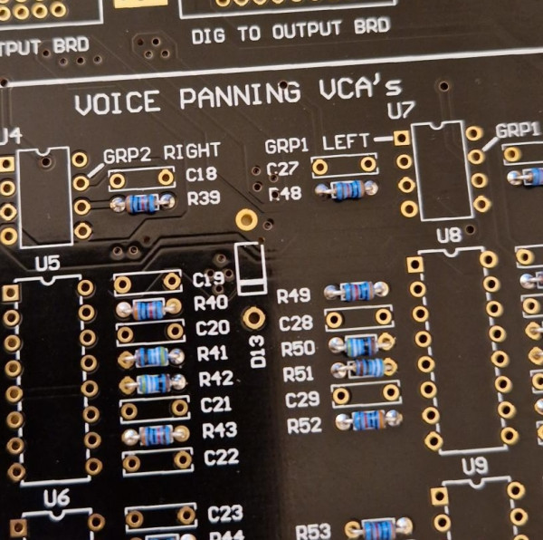 | ~~install~~**~~against~~**~~silkscreen~~ | modwiggler user | no |   | diy | **this was a wrong issue !!** |
| 2 | 25.Jan 2024 | info | PSU | check that your PSU is still modified with other regulators my psu was still modified with the correct parts since it was bought as Partkit from Brian, back in 2020. | perform a visible check and keep in mind to test the psu later without attached Device/pcbs, as described in the YT Videos/guide. | Patrick | no | ✅ | diy |   |
| 3 | 25.Jan 2024 | build info | Voice and Voice Motherboard | you have to respect that the MOLEX connectors on the Voice Motherboard and Voices have to installed in one step. You cannot start with soldering the molex connectors at the pcb without align it against the opposite part. do this: | **It's highly recommended to use a ruler or other exact flat**[**precisely**](https://www.dict.cc/englisch-deutsch/precisely.html)**tool to allign the Molex Pin headers in a row. This makes things easier.** 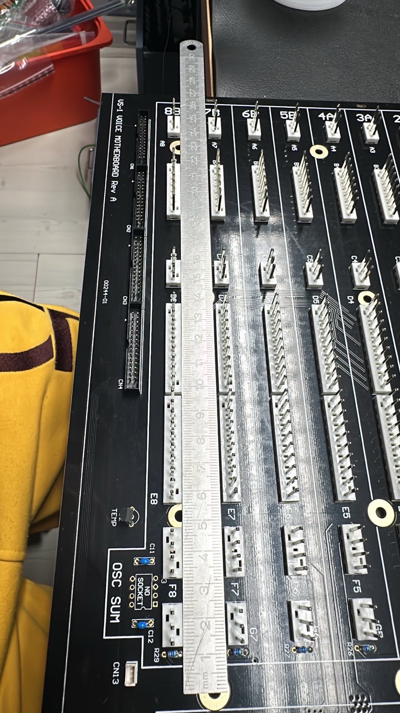 | Patrick | no | ✅  valid - tested by Patrick |   |   |
| 4 | 27.Jan.2024 | BOM failure | Voicecard | Voice Cards BOM lists 1.5M resistor for R7 and R45, but those are already filled with 49.9K resistors as per the BOM and the schematic | wait on validation, DO NOT INSTALL R7/R45 **do not populate R7 and R45** | Stuck and Patrick |   | not validated now | BOM 1.0.3 |   |
| 5 | 27.Jan.2024 | Bom failure ? | Output board | On the Output board - R22 isn’t listed on the BOM, schematic says 2.2K | **wait on validation** | Facebook Sduck |   | notvalidated now | BOM 1.0.3 |   |
| 6 | 27.Jan.2024 | Info | Output board | C22 is DNP - do not populate | C22 is DNP - do not populate | Facebook Sduck |   | notvalidated now | BOM 1.0.3 | -- |
| 7 | 27.Jan.2024 | BOM failure | Output Board | Q15, 16, 17, 18 aren’t listed on the BOM | is  2SC2878 | Facebook Sduck |   | not validated | BOM 1.0.3 | change the BOM |
| 8 | 28.jan 2024 | info | Voicecard | "Note that R140 and R141 are the preinstalled smt resistors on the back." |   | Facebook Sduck |   | valid ✅ | BOM 1.0.3 | change the BOM |
| 9 | 28.jan 2024 | info | Voicecard | "Brian for some reason doesn't list parts that are back in the "Rare Parts" list, so A3 is an CA3086N; A10, A12, A13, A14, A15 are all AS3080E; and A18 and A19 are AS3310." |   | Facebook Sduck |   |   | BOM 1.0.3 | change the BOM |
| 10 | 28.jan 2024 | info | Voicecard | **"There is one wrong sized hole on the bottom row of holes for the molex connectors**. In one of the videos Brian suggests using a dremel tool to grind down the size of the affected pin, which I tried and it was relatively easy and worked well. I suppose you could also drill out the hole, but you would then also drill out the solder pad, and would need to run a wire jumper from the affected pin to one of the vias to make that work." |   | Facebook Sduck |   | valid ✅ | BOM 1.0.3 | Brian change on Voicecard |
| 11 | 29.Jan.2024 | info | Voice MOBO | 30k resistor bag is labeled with quantity of 32 - in Altium is 24. | 24 are required - BOM 1.03 correct, just the bag is wrong | Patrick |   | valid ✅ |   |   |
| 12 | 29. Jan.2024 | info | Voice MOBO | 100nF caps 20 in bag and labeled with quant. of 20, BOM is quant. of 18 and in Altium | 18 required - Bag is wrong | Patrick |   |   |   |   |
| 13 | 29.Jan.2024 | Important Info ⚠️ | Voice Mobo | **don´t remove the pcb stripes** (from pcb fab - panelized pcb) i**n case you use a solder frame**. otherwise the traces can be damaged |   | Patrick |   | valid ✅ |   |   |
| 14 | 29. Jan 2024 | improvement | Voice Mobo | use 1/4W 0.5W watt 0207 Format resistors for R66/R67 to improve thermal noise | use 1/4W 0.5W watt 0207 Format resistors for R66/R67 to improve thermal noise | Patrick |   |   |   |   |
| 15 | 5.feb 2024 | bug ⚠️ | Voice Mobo | **U2 wrong silkscreen orientation** | **install in this way**  | Patrick |   | valid ✅ | batch 01/2024 from kickstarter | Brian - change the Silkscreen |
| 16 | 07.feb 2024 | Important Info ⚠️ | Output Board | **Install** R7, R11, R37, R41, R48 & R73 **with few millimeter distance against the PCB to avoid Thermal Issues** | **Install** R7, R11, R37, R41, R48 & R73 **with few millimeter distance against the PCB to avoid Thermal Issues.** **Look in. the Buildguide** | Brian |   | valid ✅ Yutube video and build guide | all Versions |   |
| 17 | 07.Feb.2024 | Important Info ⚠️ | Voice | **Since we have to trim the Voices by Trimmers from Top, its not possible for 2 Trimmers when you have installed IC Sockets for A3 (Expo CA3086/CA3046)** | **Do not install a IC Socket in A3** **in case you still installed a IC Socket, desolder 2 pins of T3 and pull the trimmer out as shown** 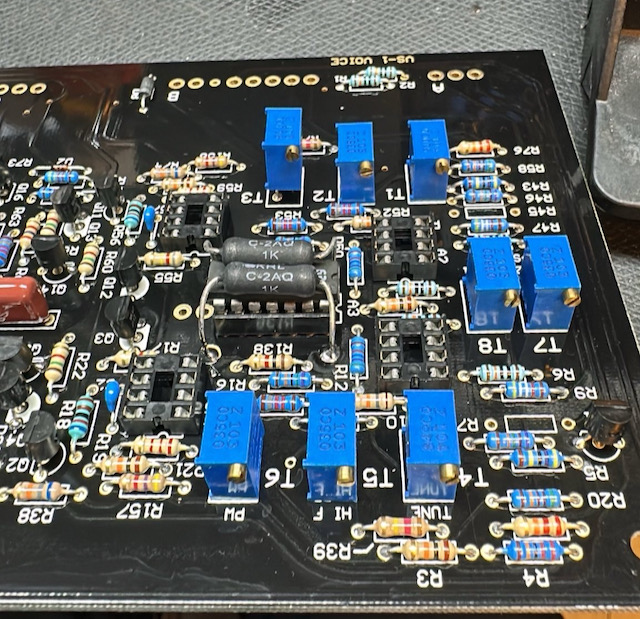 | Patrick |   | valid ✅ | all Versions |   |
| 17 | 07.Feb.2024 | Important Info ⚠️ | Voice | **Since we have to trim the Voices by Trimmers from Top, its not possible for 2 Trimmers when you have installed IC Sockets for A10** | **Do not install a IC Socket in A10** **in case you still installed a IC Socket, desolder 2 pins of T9 and pull the trimmer out as shown** 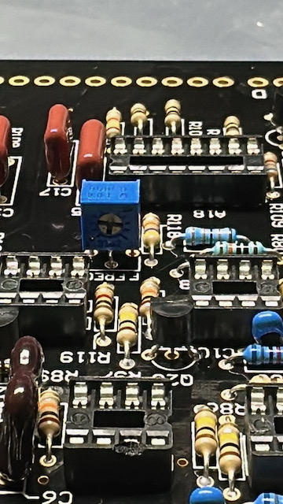 | Patrick |   | valid ✅ | all Versions | -- |
| 18 | 07.Feb.2024 | Tip | all PCBs | do not clean the Styrene Cap with Isopropyl - the Capacitor is glued and can be damaged |   | Patrick |   | ✅ valid |   |   |
| 19 | 07.Feb.2024 | Tip | all PCBs | Do not wash the Trimmers, install the Trimmers and styrene Cap on Voice Card at the end and |   | Patrick |   | ✅ valid |   |   |
| 20 | 07.Feb.2024 | Tip | Voicecard | for better Installation and to avoid a broken capacitor due to mechanical stress bend the pins for C19 and C12 | on left original, on right bend style 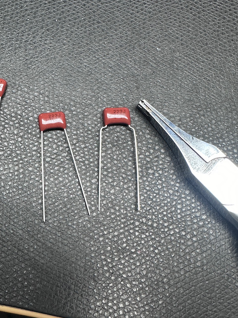 | Patrick |   | ✅  valid |   | @Brian change the Voicecard Pinout for C19/C12 |
| 21 | 10.Feb.2024 | BUG ⚠️ | Controlpanel PCB | from my experience it can happen under Mechanical stress situation that the Potentiometer Chassis/body comes in contact thru the PCB solderstop with the traces.. This was happen on TTSH, DDRM and other devices and the users wasn't able to Troubleshoot easily the root cause ! | use a tape or other isolation on 2 Potentiometers as shown here: 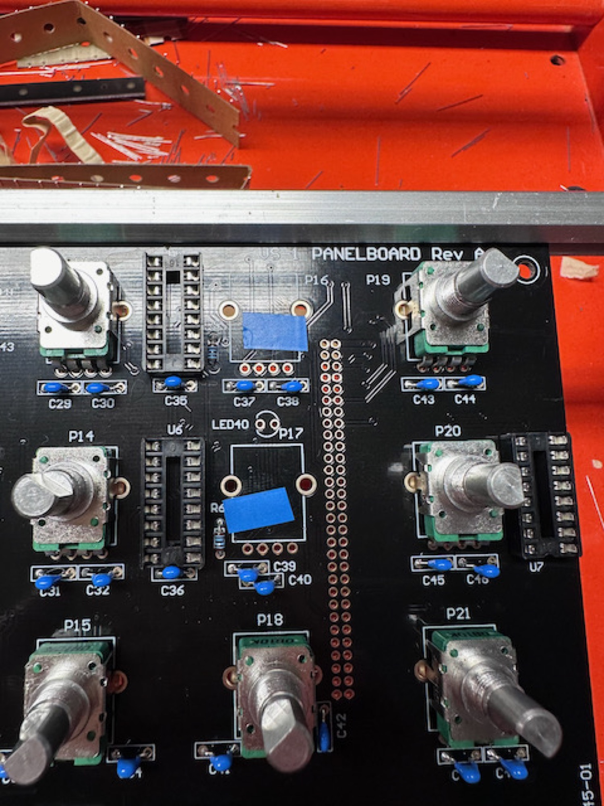 | Patrick |   | ✅ valid | DIY rev.A | @Brian change the routing of the trace |
| 22 | 10 Feb.2024 | BOM failure and Kit failure | Voice PCBs | in the full kit comes for the Voice Pcbs only 6,8uf. but no 10uF caps for the power rails. 6.8uF should be fine for the VCA out from the original schematic | wait on Brian | Patrick |   |   | DIY rev.A | @Brian please give an info about the 6.8UF caps - why are no 10uF caps in the Voicecard bag ? |
| 23 | 12.feb.2024 | BOM failure | Output Board | affect 1.04 version Output Board C31 is wrong in line 203 must be C30 | typo in BOM correct is 150pf C30 instead of c31 | Patrick |   | ✅ | DIY revA | at Brian pls. fix it in BOM rev 1.05 |
| 24 | 12.Feb.2024 | Major Bug ⚠️ | Panel board | there's a potential risk that the L bracket comes in contact with the diode furthermore is a trace on the right side - which can cause a problem under mechanical stress 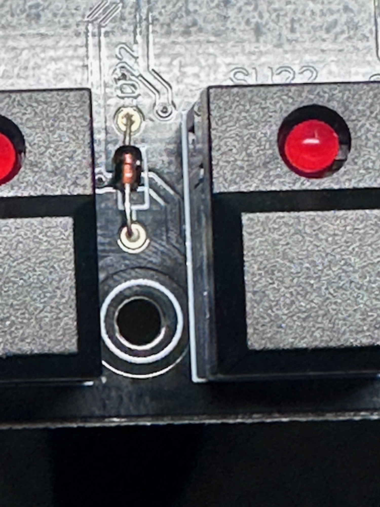 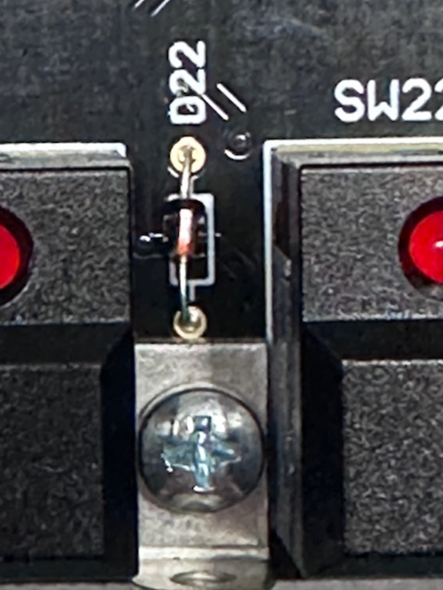 | file down the L bracket **and** use a tape as shown 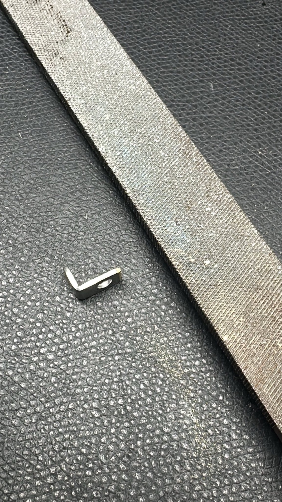 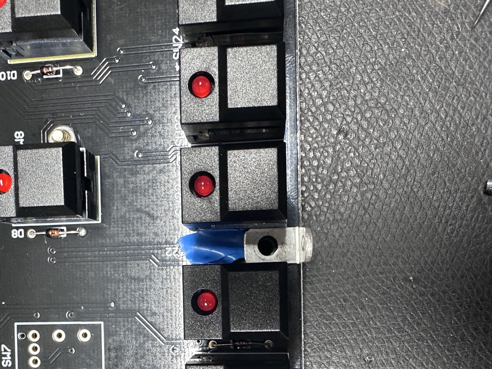 | Patrick |   |   | DIY rev A |   |
| 25 | 14.Feb.2024 | BOM failures | BOM - ALTIUM | make sure to re-open every day Altium from the link on Brians website. The Browser session in Altium do not update automatically the content in case of changes by Brian. For example reported 2 users a mismatch between BOM and Altium - R83 and R133 must be 12K as stated in BOM 1.03 and 1.04 and Altium. always use this Altium links: [https://abstraktinstruments.com/vs1-diy/](https://abstraktinstruments.com/vs1-diy/) | its a voltage divider and 12K should be correct - wait on validation from Brian 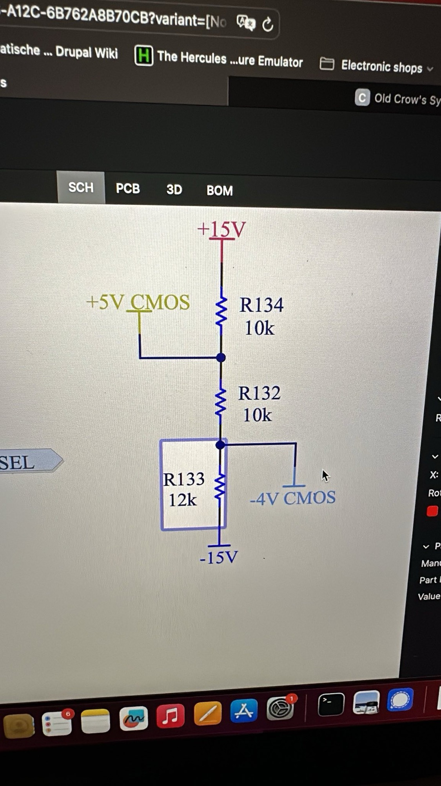 |   |   |   |   |   |

#### Own Pictures from my Build. Some changes aren't implemented yet . not for reference build !!

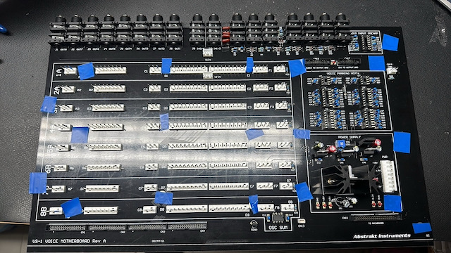

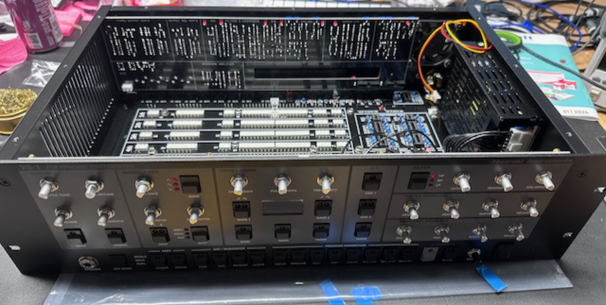
