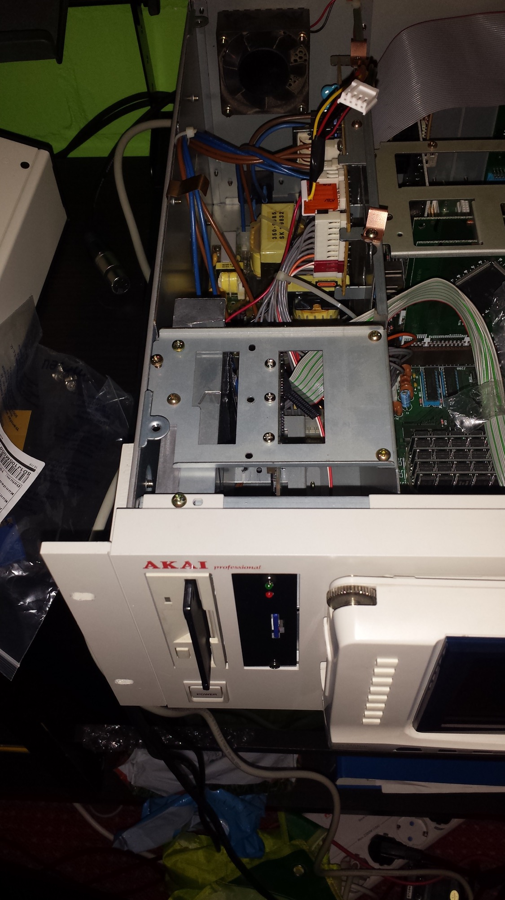
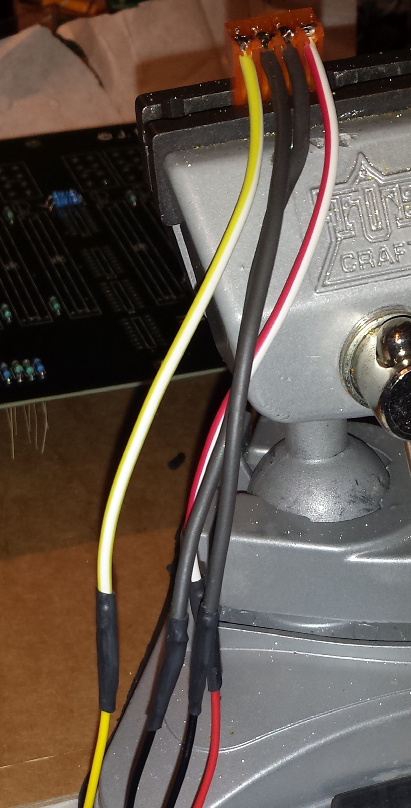
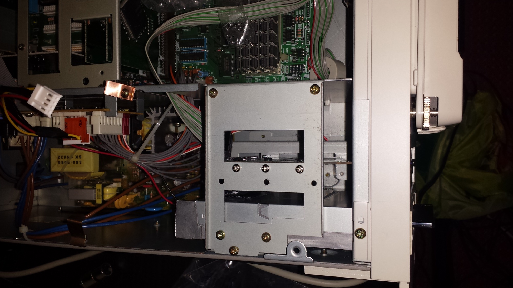
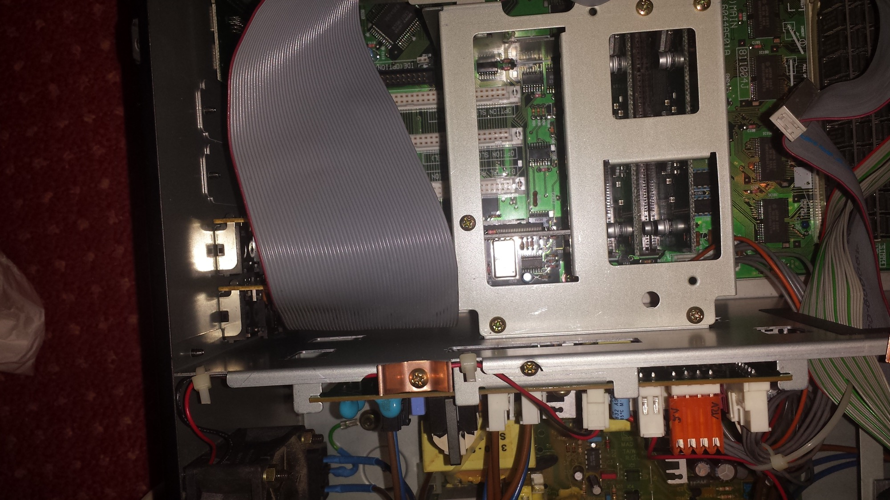
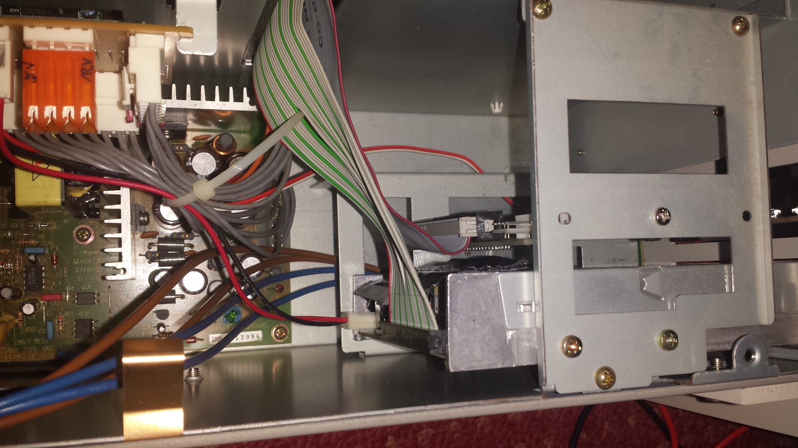
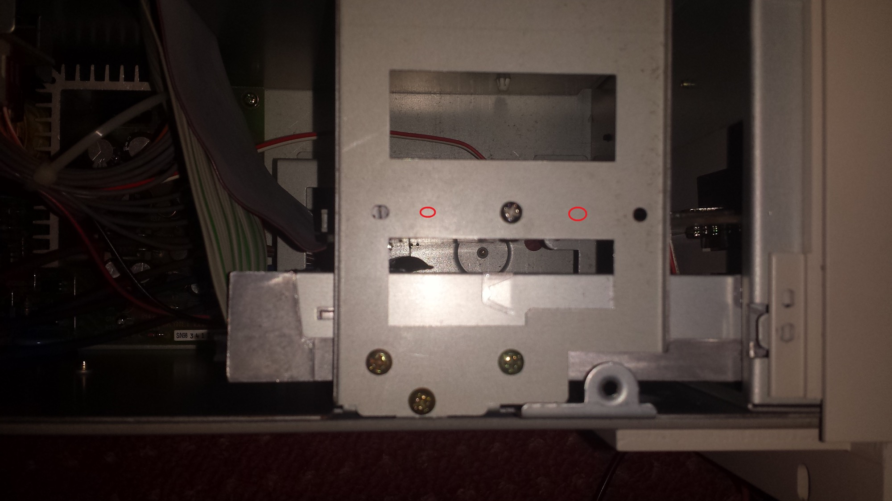
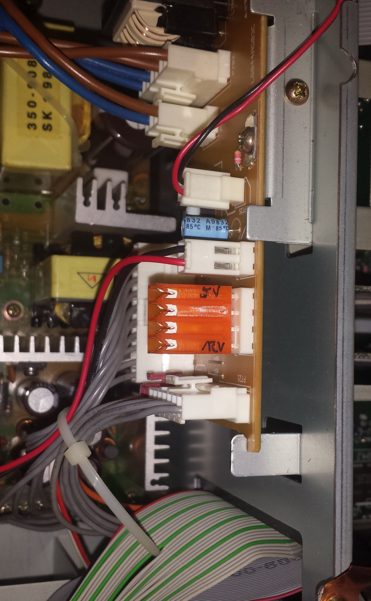
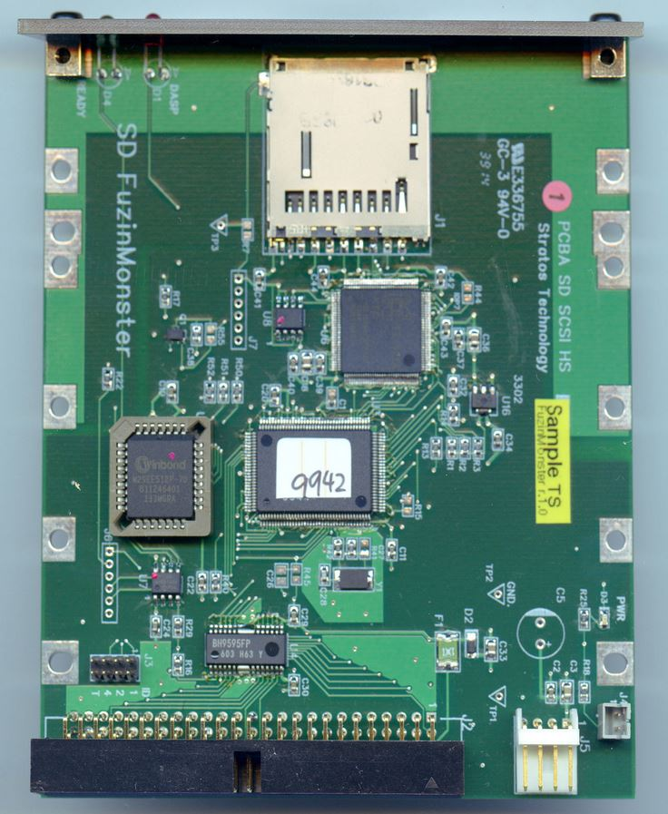

# Akai S6000 Storage Solution

> **Project**
>
> ### Projecttitel:Akai S6000 Storage Solution
>
> ### Status: `finished`
>
> ### Startdate:May2015
>
> ### Duedate: Jun 2015
>
> ### Manufacture link:

as a Akai S6000 User i want a modern and fast Storage Solution..

**Issue:**  The S6000 have internal and external SCSI Connections, my Notebook dont have SCSI and SCSI Harddrives and other SCSI gear its old, slow, expensiv

on the global  market are many solutions like SCSI to IDE Controller, this aren´t HOT SWAP devices (please correct me if i´m wrong)..

further you need SD-Card or Compact flash reader for IDE, or add expensiv SSDs to this..

**Solution:** i found a seller from japan on ebay, he offer SCSI to Conpact flash and SCSI to SD-CARD devices for around 150USD with shipping.

[http://www.artmix.com/SD\_FuzinMonster.html](http://www.artmix.com/SD_FuzinMonster.html)

[http://www.ebay.de/usr/artmix](http://www.ebay.de/usr/artmix)

by usage of AKAI S5000/S6000 you need to modify the powercable and drill 2 addional holes in the metal frame of your sampler:

**Steps:**

disconnect Power and all other gear from your sampler

open the Sampler from top( 5-6screws)

remove the display/controller (only by S6000)

remove the 3 screws from frontpanel at top and 3 screws from bottom frontpanel, now you are able to remove the frontpanel - remove the 3,5inch plastic bedide the floppy.

add the frontpanel to the sampler and mount the top and bottom screws.

by usage of the sd-card version device: add for testing the controller in the 3,5inch tray beside the controller, (check my pics - you see what i mean)

now you have to drill 2 futher holes in the metal tray from the akai s6000 - remove the 5 -6 screws from floppy and s6000 frame, dont drill it while the tray is in the s6000 (otherwise while drilling metalparts/fillings drops in the electronic)

add the controller to the tray by usage of the delivered metal adapters (check my pics)

power: red cable is 5V, yellow cable is 12V, the other 2 cables are ground,  i used a MTA156 connector and a 15cm cable - check my pics.

scsi connection on S6000 is under the MIDI ports - you can add this by usage of screwdriver or other long parts, to press to cable jack the bottom, or remove the midi port adapter pcbs/slots.

make Sure you have V2.14 installed, otherwise you cant use the sdcard or other FAT formatted devices. ( the sampler dont show the SD-card controller/device)

