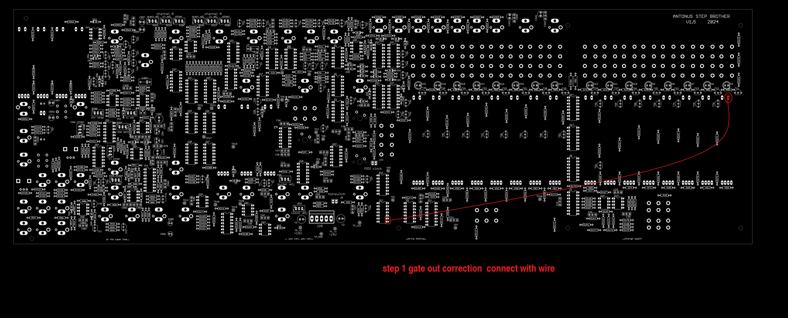

# Antonus Step Brother DIY

**Project**

> **Info**
>
> ### Projecttitel: Antonus Step Brother DIY
>
> ### Status: done ✅
>
> ### Startdate: 10.April 2024
>
> ### Duedate: May 2024
>
> ### Manufacture link: [https://antonus-synths.com/diy-kit-for-antonus-step-brother/](https://antonus-synths.com/diy-kit-for-antonus-step-brother/)
>
> **Modwiggler Link:** [https://www.modwiggler.com/forum/viewtopic.php?p=4144466&hilit=antonus#p4144466](https://www.modwiggler.com/forum/viewtopic.php?p=4144466&hilit=antonus#p4144466)
>
> USA Ordering by Synthcube: [https://synthcube.com/cart/antonus-2600-diy-original-size-538796434?search=step&description=true](https://synthcube.com/cart/antonus-2600-diy-original-size-538796434?search=step&description=true)
>
> USA Order by Synthcube Fullit: [https://synthcube.com/cart/antonus-2600-diy-original-size?search=antonus&description=true](https://synthcube.com/cart/antonus-2600-diy-original-size?search=antonus&description=true)

**Official Files from 26.04.2024**

**Antonus Documentation (June2024):**

[antonus step brother kit documentation-3.zip](assets/antonus-step-brother-kit-documentation-3.zip)

**before you start:**

change R383 to 220K. and R379 to 100K

(Should be fixed in new BOM and schematics othweise you have 2V/OCT on expo converter)

**PCB Scans, Copyright by Patrick**

[Antonus-step-left.pdf](assets/Antonus-step-left.pdf)

[Antonus-step-right-rear.pdf](assets/Antonus-step-right-rear.pdf)

[Antonus-step-right.pdf](assets/Antonus-step-right.pdf)

[Antonus-step-left-rear.pdf](assets/Antonus-step-left-rear.pdf)

**Corrections:**

Step 1 Gate Output:

