# APOB OSCar40 DIY

> **Project**
>
> ### Projecttitel: APOB OSCar40 DIY
>
> ### Status: `done`
>
> ### Startdate: 11/2025
>
> ### Duedate: 12/2025
>
> **Updated 02/2026**
>
> ### Manufacture link: Facebook group OSCAR40 [https://www.facebook.com/groups/537634519109677](https://www.facebook.com/groups/537634519109677)
>
> IR HAM aka Apob is the developer , he offer assembled and DIY Versions.

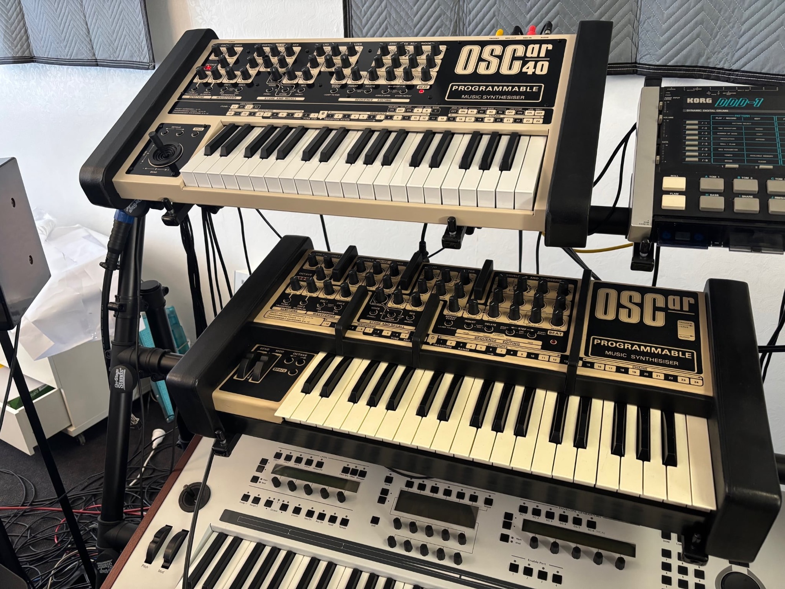

**Info:**

The Oscar40 is available preassembled and in DIY.

[https://foundsound.com.au/products/40787?srsltid=AfmBOootZ584VHmk\_WiqtVkTKNpfcm-LsT1WZqPC-Exstx5b0IXHLh1U](https://foundsound.com.au/products/40787?srsltid=AfmBOootZ584VHmk_WiqtVkTKNpfcm-LsT1WZqPC-Exstx5b0IXHLh1U)

This page is for the DIY project i, its nearly a replica.

It's not for beginner, and my page isn't for reference or a true support.

there´s a disclaimer at the footage of this site.

**Build Docs:**

[OSCar40%20Build%20Guide%20A.pdf](assets/OSCar40-20Build-20Guide-20A.pdf)

[Oscar40-pcbs.pdf](assets/Oscar40-pcbs.pdf)

[Schematic.zip](assets/Schematic.zip)

[OSCar40\_iBoms.zip](assets/OSCar40_iBoms.zip)

**BOM:**

the current BOM has few failures, a new Version is on the way.

for backup reasons, the old BOM:

[OSCar BOM V2.1.xlsx](assets/OSCar-BOM-V2.1.xlsx)

the Resistor network designator/amount is wrong in the BOM.

**Usermanual from APOB:**

[OSCar40 Manual E.pdf](assets/OSCar40-Manual-E.pdf)

**Costs**:

case and PCBs 1250€

 plus import/VAT 22%

 mouser, digikey, tme 300€

 eBay z80 and rare parts 50€

 keyboard icon i-keyboard 4x    130€

**Usermanual :**

[https://www.virtual-music.at/en/client/documents/OScar\_UsersManual\_VM.pdf](https://www.virtual-music.at/en/client/documents/OScar_UsersManual_VM.pdf)

**known issues:**

|   |   |   |   |   |
|---|---|---|---|---|
|   |   |   |   |   |
| **ID** | **Issue** | **Fix** | **date** | **fixed version** |
| 1 | traces are very close to the standoffs, which can in worst case  make electrical shorts affect the joystick pcb 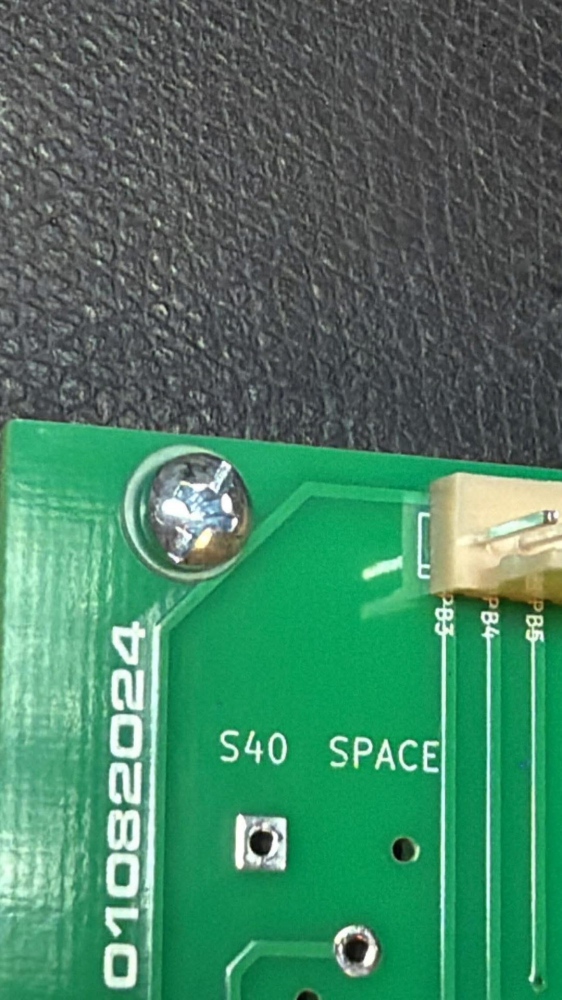 | use tape under the standoffs 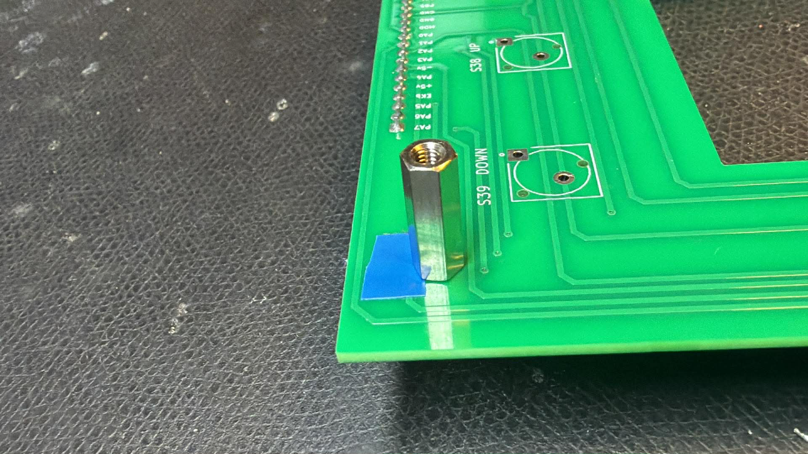 | 12/2025 |   |
| 2 | Quality Check cable | you have to check all cables and pinouts against the pcb silkscreen. (2 headers on my controlboard build are 180degrees rotated against the silkscreen - so I changed the wiring) |   |   |
| 3 | Quality Check soldering | check for solder bridges, check for missing or defect solder points |   |   |
| 4 | Quality Check IC orientation | its important to avoid a wrong position, wrong orientation, bended Pins, |   |   |
| 5 | Quality Check power | before you connect the PSU to the controlboard - measure -15/15V at the PSU out |   |   |
| 6 | calibration | in case the sound is modulated - you have to calibrate the joystick “ function by: rotate the joystick in circles while turning on the device. The battery must be connected to the device /full or the “failure” is present on every restart of the device. |   |   |
| 7 | important usage | as described in the user manual , the Trigger jack is for in and out : RING = Trigger Out , Tip = Trigger in |   |   |

The DIY Kit contains the Case, Knobs, Potentiometers, Screws.

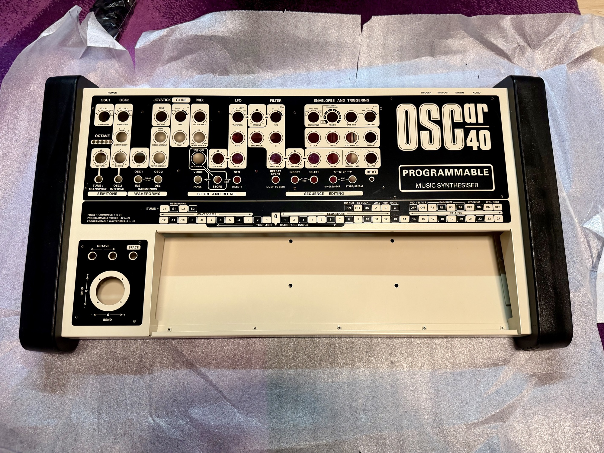

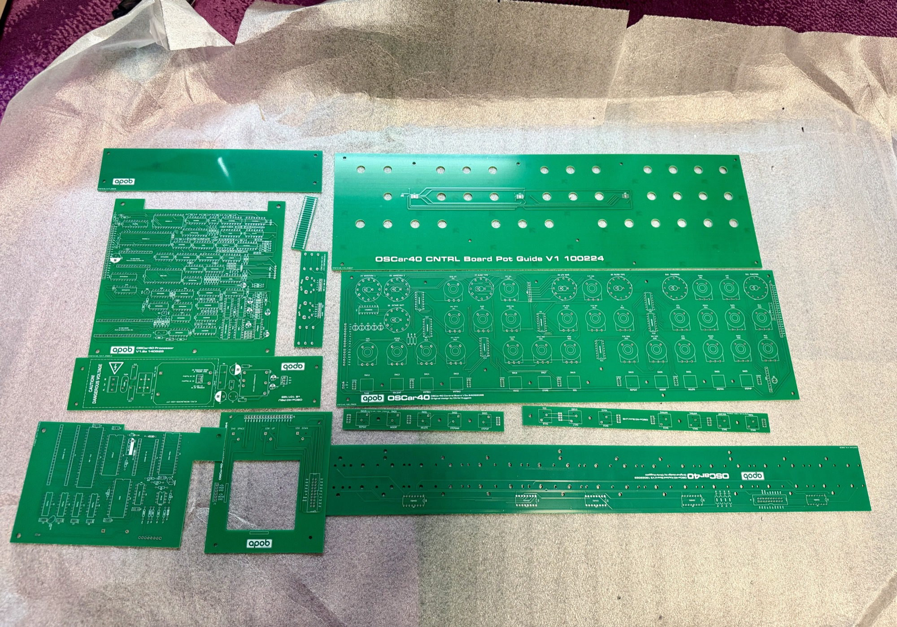

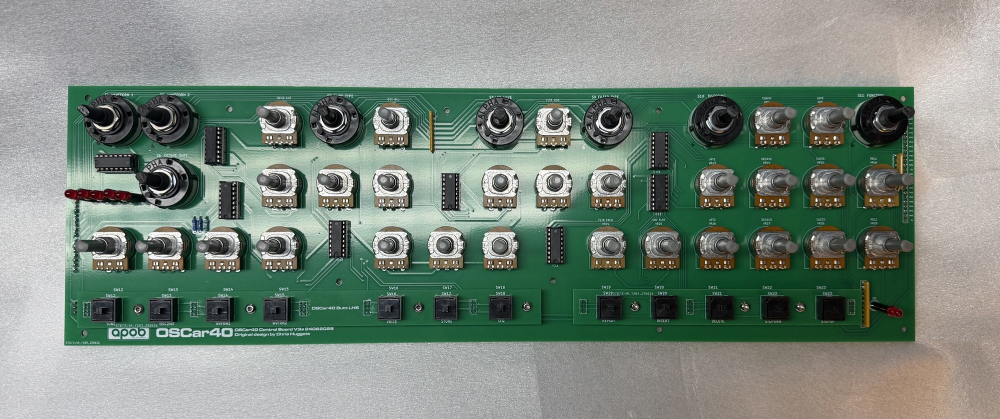

Note: remove on nearside of the ICON the screws, take the big screws at the side - you need them later !

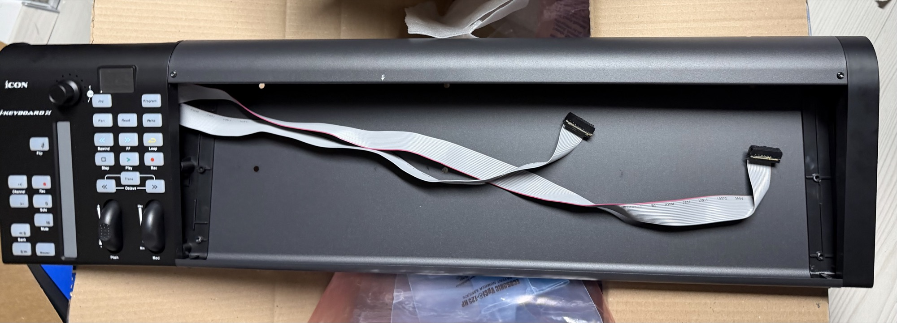

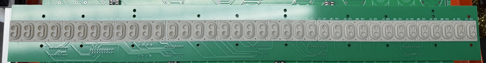

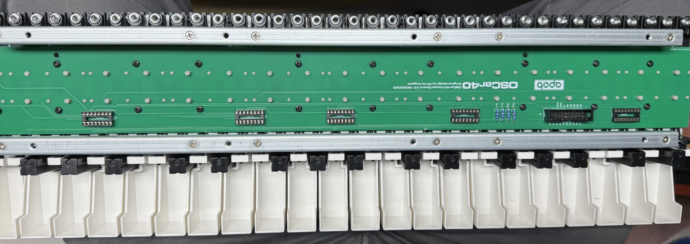

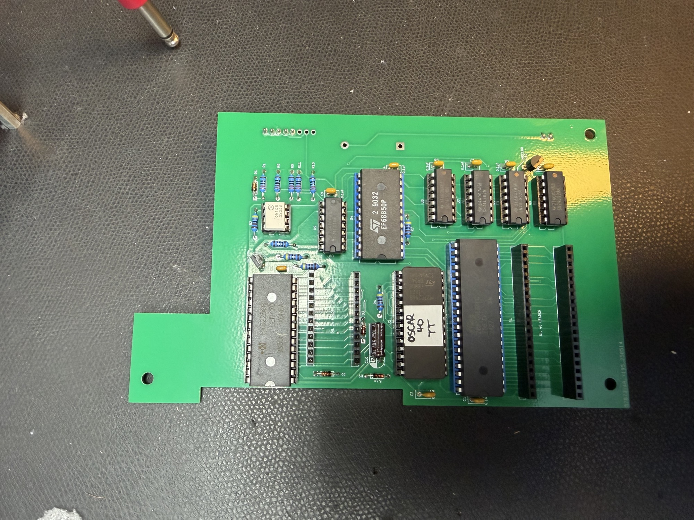

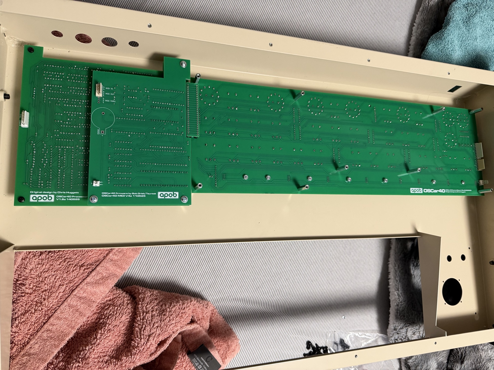

The Synthesizer is basically digital based, the heart is the Processorboard with a Z80CPU and tons of ICs.

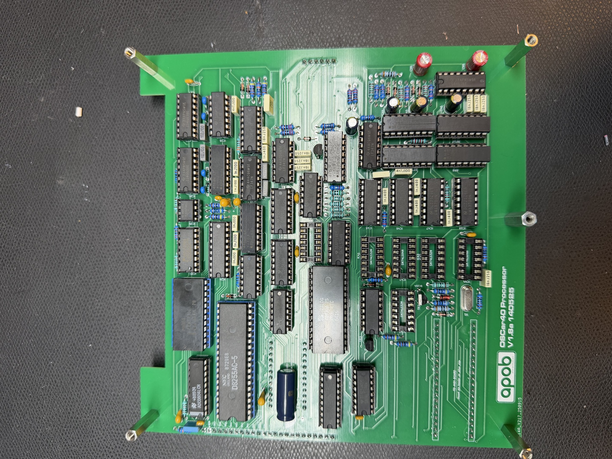

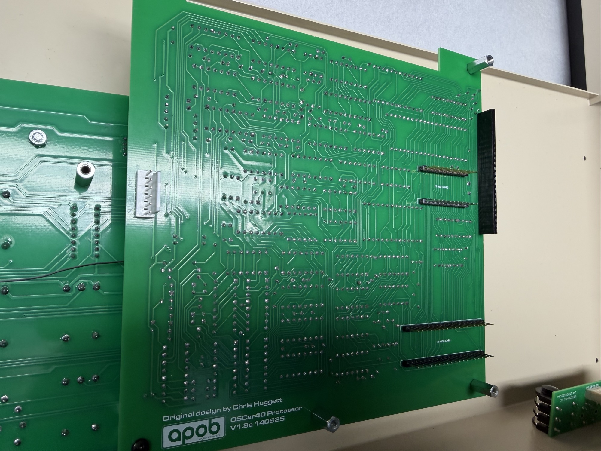

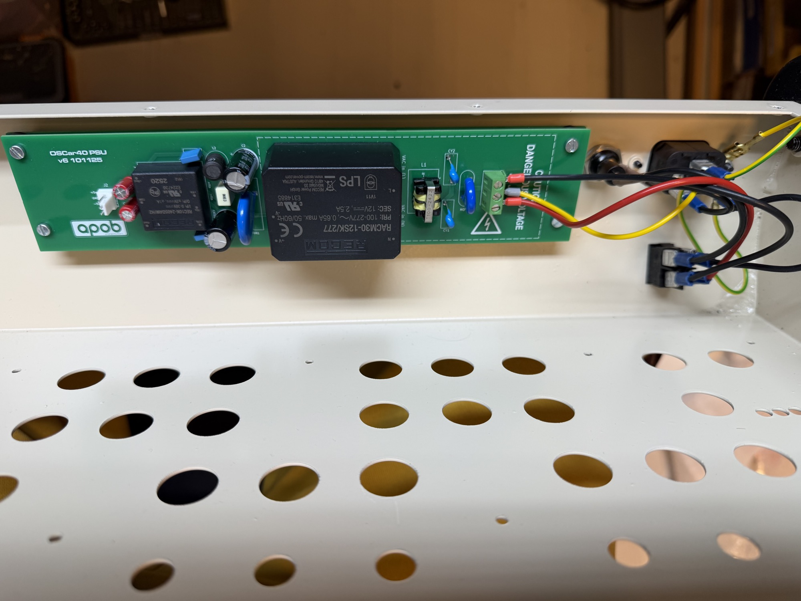

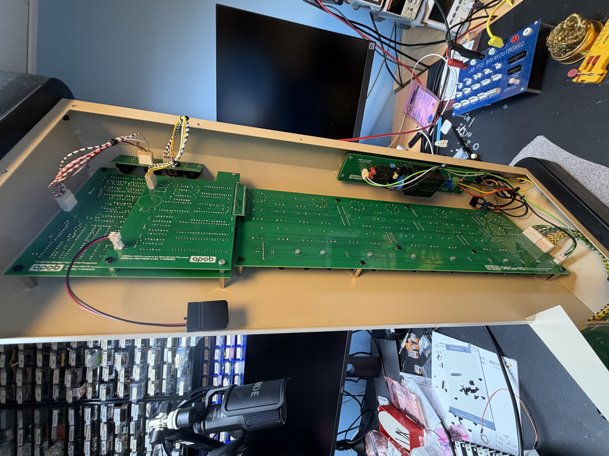
