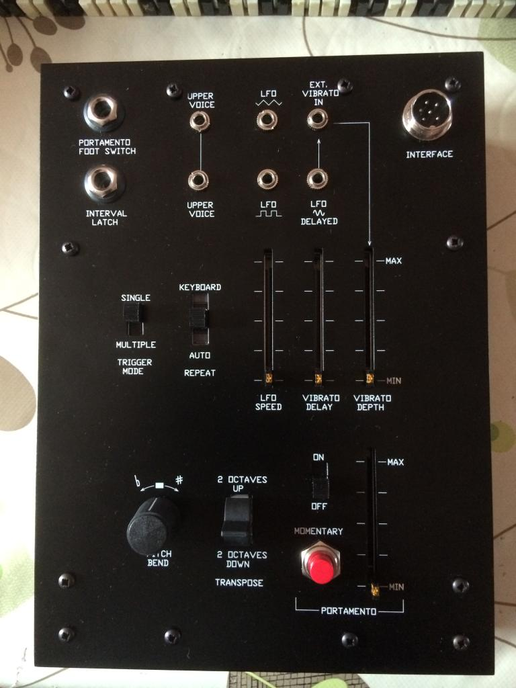
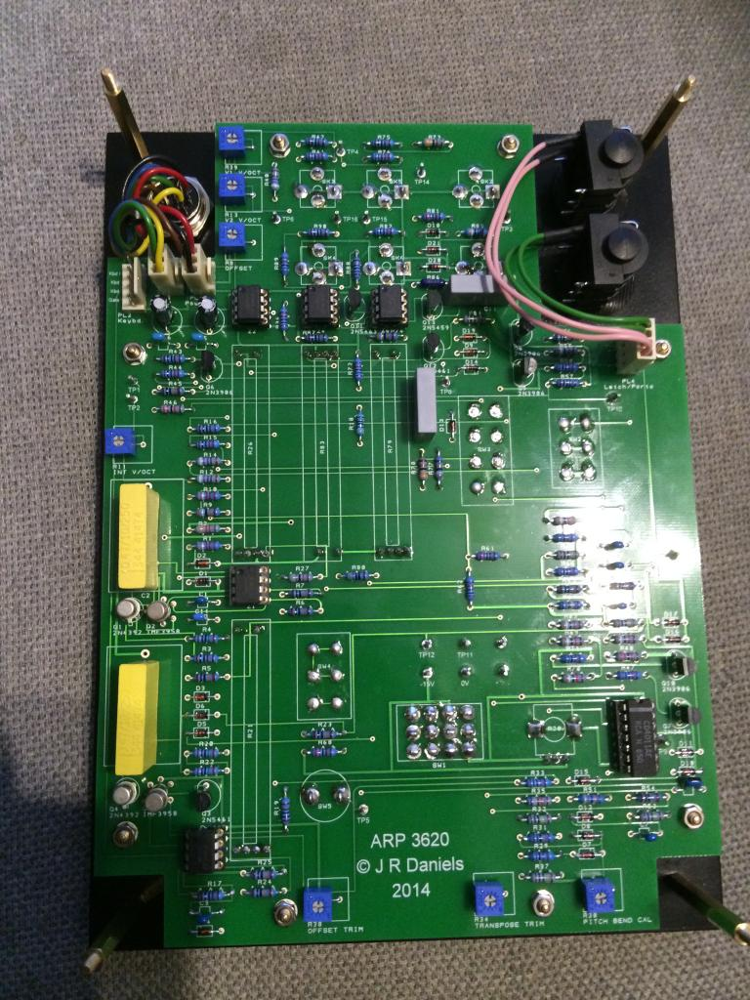
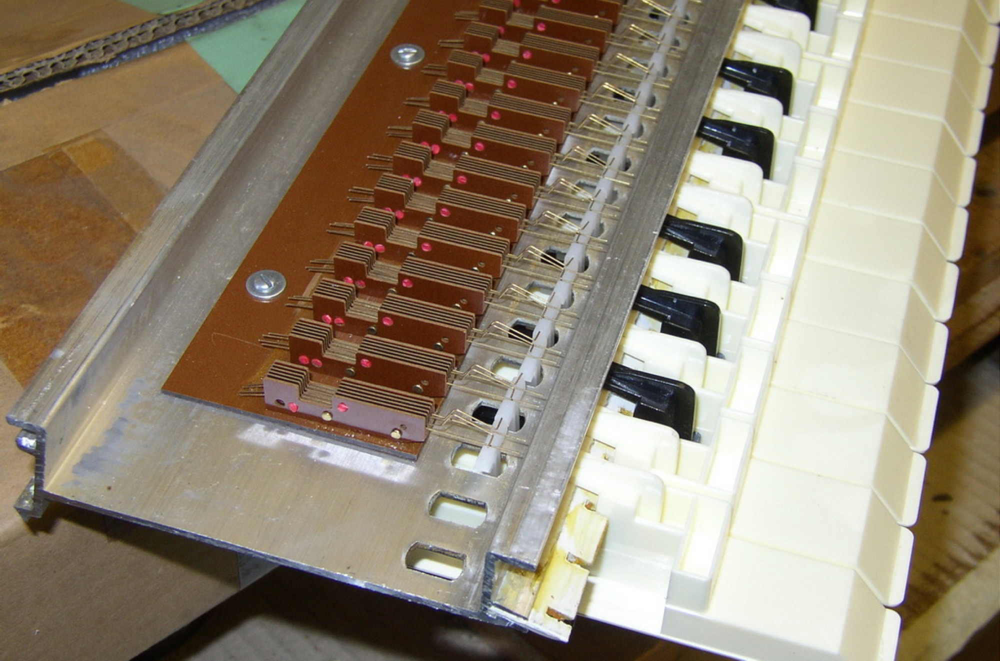
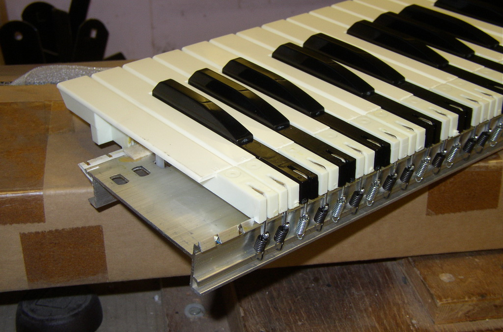
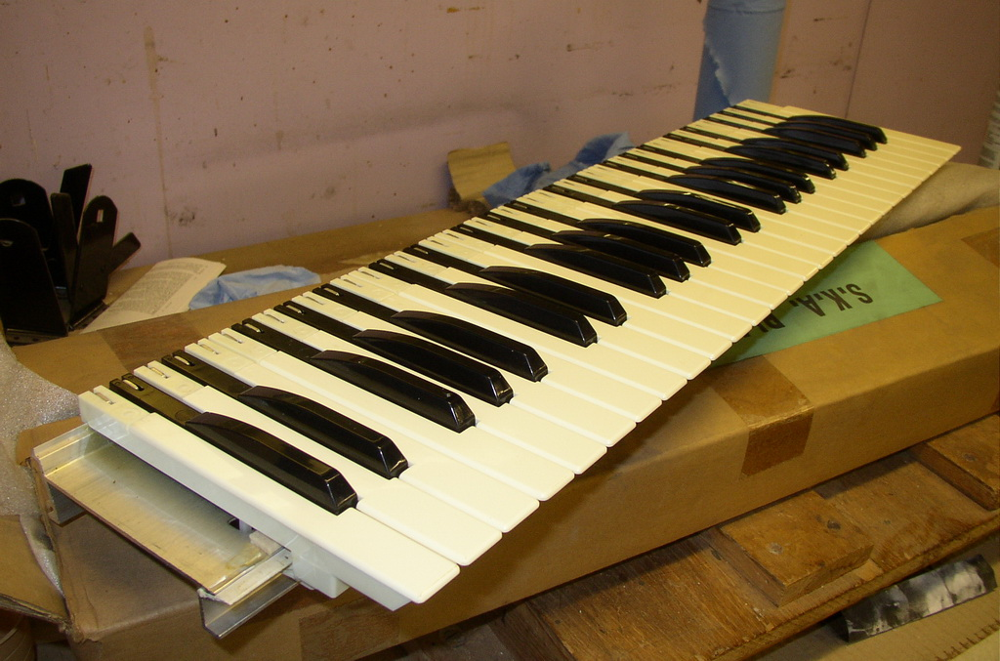
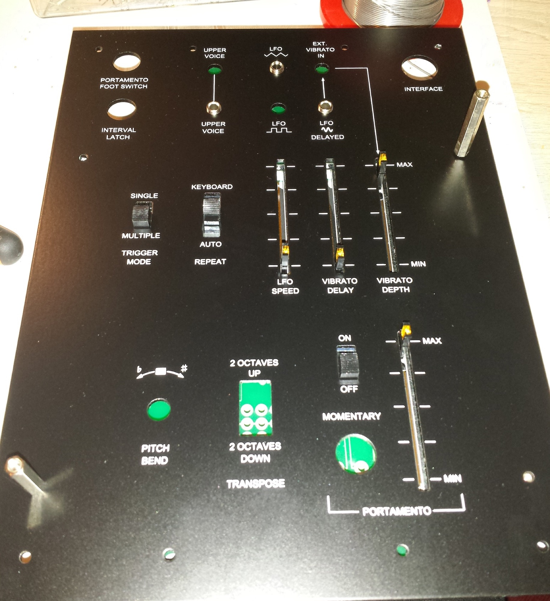
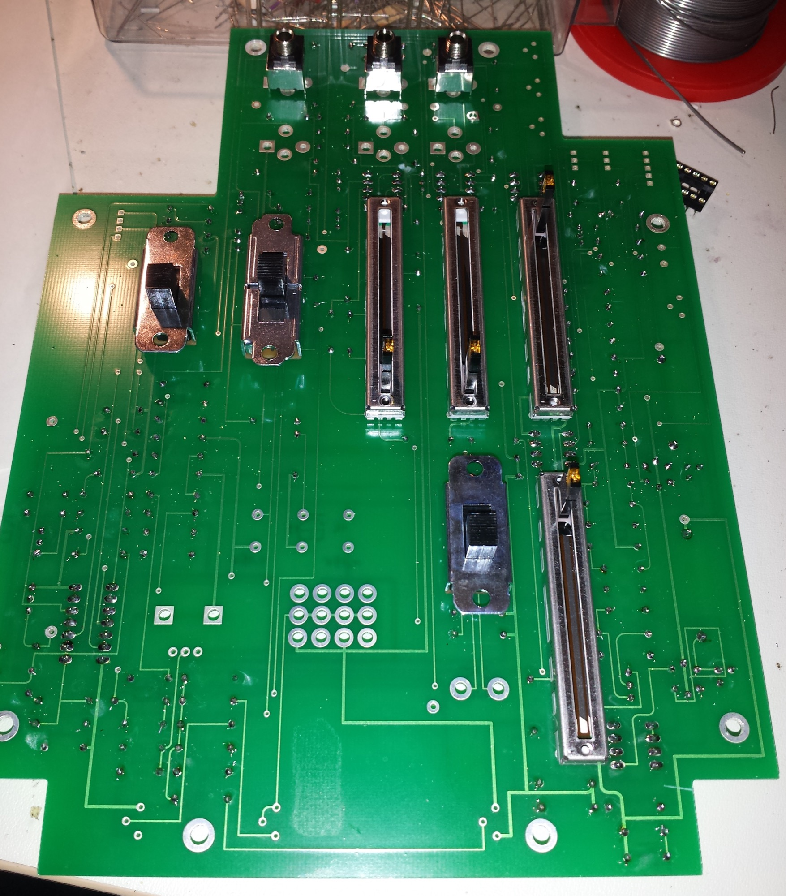
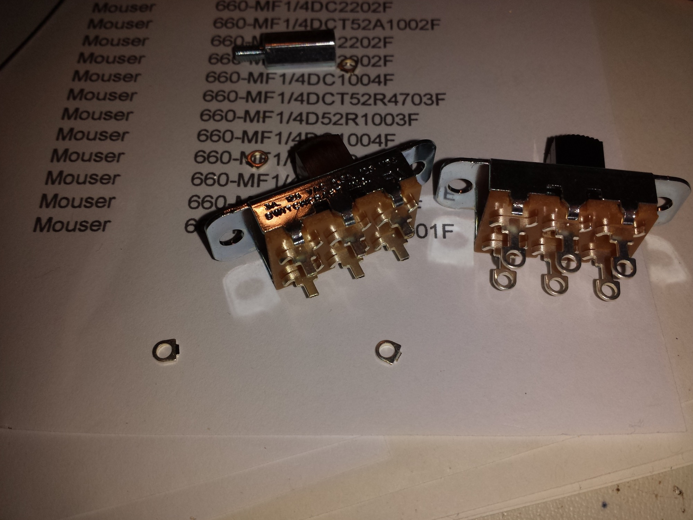
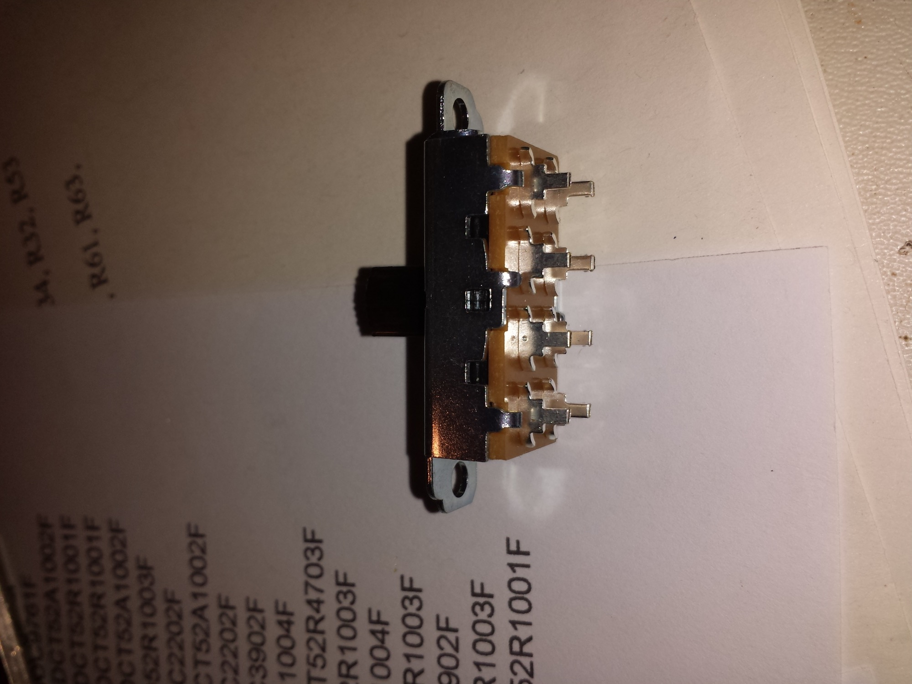
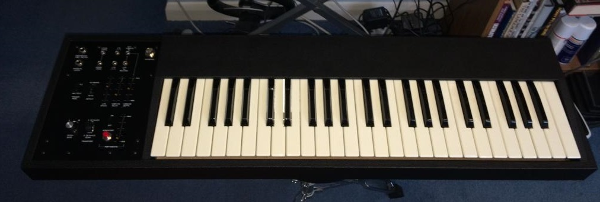

# ARP 3260 Keyboard Clone

> **Project**
>
> ### Projecttitel: ARP 3260 Keyboard Clone
>
> ### Status: `in planning`
>
> ### Startdate: October 2014
>
> ### Duedate: April 2015
>
> ### Manufacture link: -

This is a direct copy of the original ARP 3620 electronics so requires a similar keyboard arrangement - 4 octave (49-key) with two independent contacts per key, with the CV bus contact bent slightly to make momentarily before the gate bus contact (to prevent the previous note triggering in error on a subsequent keypress). You could use a 3-octave by placing a 1K2 precision resistor at one end of the CV resistor chain to make up the total 4k8 (48 x 100R).

I used a new keyboard assembly from Kimber Allen in the UK with twin gold contacts, and I know at least a couple of others building this have ordered the same. It is a little pricey though at £296 + VAT.

Other choices would be an old keyboard pulled from a scrap organ, and again Kimber Allen keyboards are a very popular choice for those too - they have been making organ parts since 1928.

I've attached the information pack which includes the original service manual etc. The schematic drawings shows how the key contacts should be wired, but if in doubt please ask.

## Groupbuy for Panel and pcb:

[https://www.muffwiggler.com/forum/viewtopic.php?t=118486](https://www.muffwiggler.com/forum/viewtopic.php?t=118486)

**You need the PCB and Panel from muffwiggler groupbuy, a keyboard, Case and parts from BOM (resistors, capaciators, semis, switches, pots, jacks and more)**

**The total costs are around 700€ depends on costs of case and keyboard**

## Documents for Controller:

- [ARP 3620 keyboard case.pdf](assets/ARP-3620-keyboard-case.pdf)
- [ARP 3620 keyboard ends.dwg](assets/ARP-3620-keyboard-ends.dwg)
- [ARP 3620 Rev 0 - PCB.pdf](assets/ARP-3620-Rev-0---PCB.pdf)
- [15061_img_0176_3.jpg](assets/15061_img_0176_3.jpg)
- [15061_img_0182_2.jpg](assets/15061_img_0182_2.jpg)
- [ska_3_resize_155.jpg](assets/ska_3_resize_155.jpg)
- [ska_2_resize_113.jpg](assets/ska_2_resize_113.jpg)
- [ska_1_resize_132.jpg](assets/ska_1_resize_132.jpg)
- [ARP 3620 keyboard ends.pdf](assets/ARP-3620-keyboard-ends.pdf)
- [ARP 3620 keyboard lid.dwg](assets/ARP-3620-keyboard-lid.dwg)
- [ARP 3620 keyboard lid.pdf](assets/ARP-3620-keyboard-lid.pdf)
- [20141022_223842.jpg](assets/20141022_223842.jpg)
- [20141022_223458.jpg](assets/20141022_223458.jpg)
- [20141022_223405.jpg](assets/20141022_223405.jpg)
- [20141022_223236.jpg](assets/20141022_223236.jpg)
- [ARP 3620 BOM.xls](assets/ARP-3620-BOM.xls)
- [ARP 3620 Rev 1 - PCB.pdf](assets/ARP-3620-Rev-1---PCB.pdf)
- [ARP 3620 Service Manual (scanned original).pdf](assets/ARP-3620-Service-Manual-scanned-original.pdf)
- [ARP 3620 V2 - Project.pdf](assets/ARP-3620-V2---Project.pdf)
- [Panel (inc dimensions).pdf](assets/Panel-inc-dimensions.pdf)
- [ARP 3620 keyboard case.dwg](assets/ARP-3620-keyboard-case.dwg)
- [ARP 3620 Keyboard Owners Manual.pdf](assets/ARP-3620-Keyboard-Owners-Manual.pdf)
- [15061_img_0363_1.jpg](assets/15061_img_0363_1.jpg)

## Documents for Case:

- [ARP 3620 keyboard case.pdf](assets/ARP-3620-keyboard-case.pdf)
- [ARP 3620 keyboard ends.dwg](assets/ARP-3620-keyboard-ends.dwg)
- [ARP 3620 Rev 0 - PCB.pdf](assets/ARP-3620-Rev-0---PCB.pdf)
- [15061_img_0176_3.jpg](assets/15061_img_0176_3.jpg)
- [15061_img_0182_2.jpg](assets/15061_img_0182_2.jpg)
- [ska_3_resize_155.jpg](assets/ska_3_resize_155.jpg)
- [ska_2_resize_113.jpg](assets/ska_2_resize_113.jpg)
- [ska_1_resize_132.jpg](assets/ska_1_resize_132.jpg)
- [ARP 3620 keyboard ends.pdf](assets/ARP-3620-keyboard-ends.pdf)
- [ARP 3620 keyboard lid.dwg](assets/ARP-3620-keyboard-lid.dwg)
- [ARP 3620 keyboard lid.pdf](assets/ARP-3620-keyboard-lid.pdf)
- [20141022_223842.jpg](assets/20141022_223842.jpg)
- [20141022_223458.jpg](assets/20141022_223458.jpg)
- [20141022_223405.jpg](assets/20141022_223405.jpg)
- [20141022_223236.jpg](assets/20141022_223236.jpg)
- [ARP 3620 BOM.xls](assets/ARP-3620-BOM.xls)
- [ARP 3620 Rev 1 - PCB.pdf](assets/ARP-3620-Rev-1---PCB.pdf)
- [ARP 3620 Service Manual (scanned original).pdf](assets/ARP-3620-Service-Manual-scanned-original.pdf)
- [ARP 3620 V2 - Project.pdf](assets/ARP-3620-V2---Project.pdf)
- [Panel (inc dimensions).pdf](assets/Panel-inc-dimensions.pdf)
- [ARP 3620 keyboard case.dwg](assets/ARP-3620-keyboard-case.dwg)
- [ARP 3620 Keyboard Owners Manual.pdf](assets/ARP-3620-Keyboard-Owners-Manual.pdf)
- [15061_img_0363_1.jpg](assets/15061_img_0363_1.jpg)

## Building:

6pol jack/plug:  reichelt.de

-
  - 
  - [B 606](http://www.reichelt.de/Mikrofonverbinder-fuer-Funkgeraete/B-606/3/index.html?&ACTION=3&LA=5&ARTICLE=4548&GROUPID=5189&artnr=B+606)
  - Mikrofon-Einbaustecker f. Funkgeräte, 6-polig
  - 0,63 €[\*](http://www.reichelt.de/Warenkorb/5/index.html?&ACTION=5&LA=2#legal)

-
  - 
  - [M 606](http://www.reichelt.de/Mikrofonverbinder-fuer-Funkgeraete/M-606/3/index.html?&ACTION=3&LA=5&ARTICLE=11164&GROUPID=5189&artnr=M+606)
  - Mikrofon-Kupplung f. Funkgeräte, 6-polig
  - 0,66 €[\*](http://www.reichelt.de/Warenkorb/5/index.html?&ACTION=5&LA=2#legal)
  -

**BOM:**

[ARP 3620 BOM.xls](assets/ARP-3620-BOM.xls)

## **Building Documentation:**

**assembly/solder all resistors, diodes, trannys (make sure your 2n3958 are tested)**

i used 12mm spacer for correct placement of switches and fader (same spacer sizing like in TTSH)

> **Achtung**
>
> KEEP ATTENTION on the correct mounting side of switches, jacks, fader - see pictures as reference

> **Tipp**
>
> as you can see in the pictures, cut the legs of the switches to mount them

