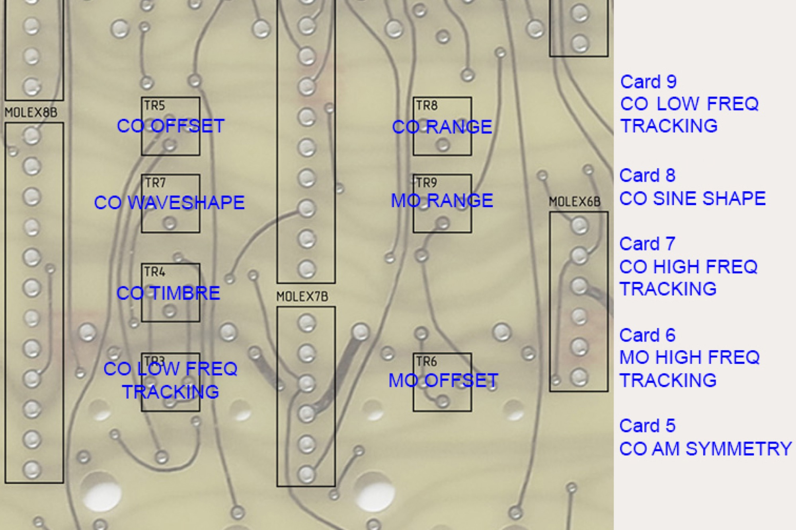
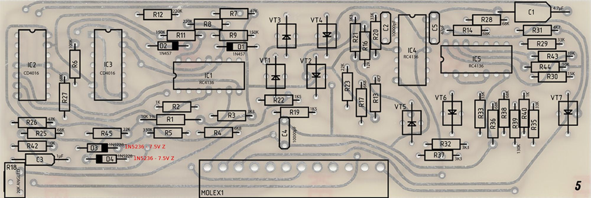
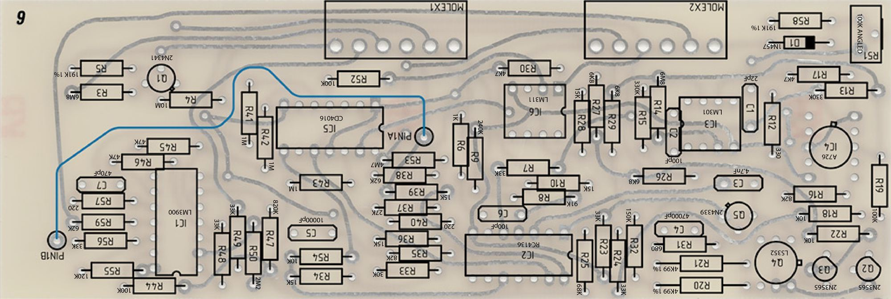
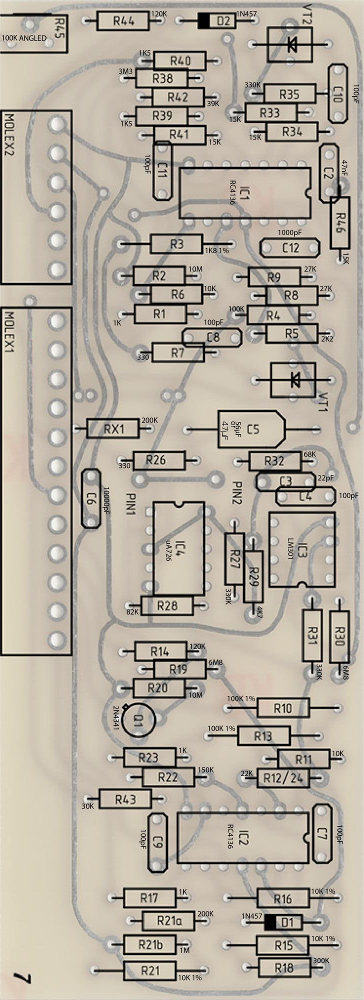
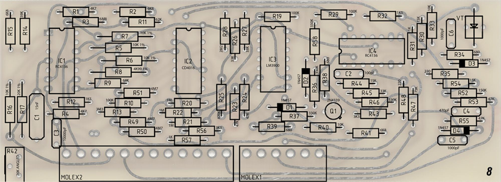
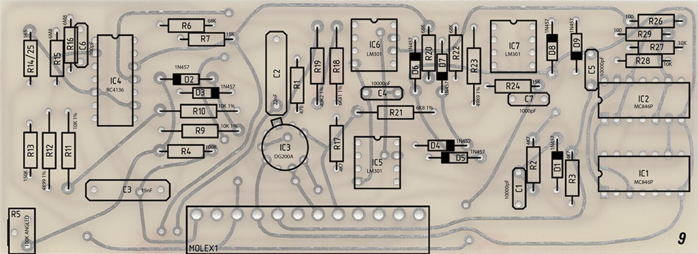

# Buchla 208P 208R calibration notes

> **Important**
>
> **Buchla is a company and own the Trademark "Buchla"**
>
> **visit [https://buchla.com/](https://buchla.com/company/) if you want the original Easel and 208/218 modules**
>
> **This website is only for private usage and for documentation.**

Thats a summary of the calibration process - on one page !

**from: [https://modularsynthesis.com/roman/buchla208v2/208spss.htm](https://modularsynthesis.com/roman/buchla208v2/208spss.htm)**

**Thanks Dave for the great help**

**Internal notes:**

1.2v/oct - should work for 1v/oct too

card6 MO range = R9 330K

card6 MO 1.2v/oct R5 82k instead of 190k

card7 R14 68-75k

Install cards 1,2, and 4. I start with card 4 to verify the pulser is working. Then I use the pulser to clock the sequencer, random, and envelope. The sequencer will not always work correctly unless you have added the decoupling capacitors.

Once I verify these I add **card 6 and verify the MO on edge pin 4**. You can also **verify the MO CV on the upper right banana connector**.

Once that works I add **cards 7-9 and verify the CO**.

There are two COs and at this point I don't worry about some abnormalities as they haven't been calibrated.

The **secondary CO has a triangle waveform on card 8 pin 15 and a square wave on pin 14**.

The **primary CO has a triangle wave on card 8 edge pin 9**. The **wave shaping outputs are on card 8 edge pin 4**. I look for basic functionality as it is not calibrated.

Then I install card 5. The FM almost always works as that just patches CV over to the CO. The **modulator outputs are card 5 edge pins 5 & 6.** Again I just verify basic functionality of AM. I don't worry about the Balanced Mod yet as it uses the same circuitry.

Then I install cards 10-12. Without the reverb tank connected the recover op-amp is at the rail so I short out the reverb return input on the motherboard. Once these cards are verified I install the reverb tank and verify functionality.

[208 V1 Calibration.pdf](assets/208-V1-Calibration.pdf)

**Calibration**

Here is my trimmer descriptions and the procedure I used to calibrate the module.  Some trimmers had very little effect so I just centered them.

|   |   |   |
|---|---|---|
| **Trimmer** | **Function** | **Procedure** |
| **MB front** TR1 | MO Tuning | Set to center and adjust as needed to trim after setting MO Range. |
| **MB front** TR2 | CO Tuning | Set to center and adjust as needed to trim after setting CO Range. |
| **MB rear** TR3 | CO LF Lin | I found little tracking effect so set to center.  *There is an error on the motherboard.  See card 8 description above to correct.* |
| **MB rear** TR4 | Timbre | Set Timbre to max, **Card 9 R5 to center**, then view sine wave output on scope and and **adjust TR4** for symmetrical folds in waveshape.  |
| **MB** rear TR5 | CO Offset | Adjusted to 100 Hz with front panel slider at bottom. |
| **MB** rear TR6 | MO Offset | Adjusted to 16 Hz with front panel slider on 16. |
| **TR7 and Card 9 R5** require some explanation.  There are actually two COs.  Card 9 is the main since CO and the Card8 CO is used for the waveshapes.  Timbre is generated by triangle modulating the CO by itself (e.g. the other CO).  This is accomplished by using the Card 8 CO to FM modulate the Card 9 VCO which is a thru-zero VCO.  CO Waveshape synchronizes the two COs by adjusting the CV delta between them.  This adjustment should be done with the frequency set in the middle of the range. |   |   |
| **MB** rear TR7 | CO Waveshape | Set waveshape to square wave and adjust for symmetrical top and bottom.  |
| **MB** rear TR8 | CO Range | Set to 1.2V/Octave. |
| **MB** rear TR9 | MO Range | Set to 1.2V/Octave. |
| Card 5 R18 **(trimmer on card)** | CO AM Symmetry | Set MO Index until 100% modulation and adjust for symmetrical AM modulation.  I found that it was not symmetrical on all waveforms so set it for the triangle waveform.  |
| Card 6 R51**(trimmer on card)** | MO High Freq Tracking | I found little tracking effect so set to center. |
| Card 7 R45 **(trimmer on card)** | CO High Freq Tracking | I found little tracking effect so set to center. |
| Card 8 R42 **(trimmer on card)** | CO Sine Shape | Adjust for proper shaped sine wave. |
| **R5 is the low frequency adjustment for the CO on card 9**.  Sometimes at low frequencies the two COs do not track and it can be heard as instability in frequency. |   |   |
| Card 9 R5 **(trimmer on card)** | CO Low Freq Track | Adjust for stable oscillation with the frequency control set to minimum.  Sometimes it takes some further adjustments to CO Waveshape so recheck and iterate between the two as necessary. |

**PA726 calibration: from [http://www.portabellabz.be/pa726.html](http://www.portabellabz.be/pa726.html)**

Calibration procedure

Ensure the module is **turned off and cold**, if it was used soon before, **let it cool down for at least 20 minutes** to avoid remaining heat inside the CA3046 and have it at room temperature. **Remove the jumper.**
**Turn on the module and measure the voltage at the T° volt** pad located near the trimpot. This is the temperature voltage at room temperature (typically 20°C).

**Turn off the module and plug in the jumper.**
**Turn on the module and let it warm up during 10 minutes**. **Measure the voltage at the T° volt pad again and adjust the trimpot until the voltage is 60mV below the voltage measured at room temperature**. The voltage should be **about 0.63V.**

****

**from paps:**

Calibration

Calibration infos are available on Dave brown's page,

[http://modularsynthesis.com/roman/buchla208v2/208spss.htm](http://modularsynthesis.com/roman/buchla208v2/208spss.htm)

Here are some extra.

**Card 5 - Modulator**

Vactrols need selection on test for best performance but this is a PITA and need a lot of vactrols on hand. Dave Brown's Card 5 modifications are a very good alternative that I recommend : [http://modularsynthesis.com/roman/buchla208v2/208spss.htm](http://modularsynthesis.com/roman/buchla208v2/208spss.htm)

To select vactrols however, if you don’t have a good desoldering tool, it's better not to solder them untill you find the good ones, make sure they make good contact by bending the legs in the holes.
Set both MO and CO to high frequency and monitor LPG1 output on a scope, with MO triangle and CO wave, MO modulation switch to AM, LPG to VCA. You'd see losanges, if their top are roundish, swap a vactrol or the other and test, adjusting the trimpot. Adjusting R16’s value helps too.

When you have proper losanges lower the MO frequency and adjust the scope horizontal setting to keep a usable display. If a second smaller losange appears between the former ones at lower MO frequency and doubles the MO modulation output frequency, swap the vactrols again and adjust the trimpot until you get a single losange across the whole MO frequency range.
A perfect calibration should give a linear AM modulation without waveform "twist".

The difference in the CO output amplitude between AM and FM with index slider can be fixed by selecting R29 on test with the index slider set to 0.

**Oscillators tracking**

Both MO and CO are able to track on 5 octaves but this needs a fine calibration and subtle selection on test of R5 and R58 on board 6 and R14 and R44 on board 7.

First of all, calibrate both pA726s as described in their own build notes.
In case another μA726 replacement is used, refer to the manufacturer's instructions.

I calibrate the tracking with a 218 but any keyboard or sequencer or midi to CV interface can do the job. To me, proper calibration means all the notes played with the 218 are in tune with MO initial frequency C0 (32.7Hz) and CO initial frequency C1 (65.4Hz). This not an official procedure but my own conclusions after building and calibrating many 208s and other synths. Feel free to adapt this procedure or do otherwise if you like.

Adjust the offset and range trimpots with a frequency counter in a way the frequencies come close to what's written on the panel.
Then adjust the HF (and LF for the CO) tracking trimpots and the panel "(trim)" ones together, using your ears, a frequency meter or chromatic tuner.

**

**

Change the aforementioned resistors if the HF trimpot is off range. A small readjustment of the range trimpot may be needed.
The goal is to get all octaves in tune. When the octaves are in tune, the notes between will be automatically in tune.

**Suggestions for 1.2V/oct. :**

Board 6 R58 : 390k R5 : 91k

Board 7
R14 : 44k (68k added in parallel with 120k) R44 : 150k
R45 : 100k trimpot

These values are suggestions and might not be ideal in another 208 or with another expo converter, why selection on test is needed for R58 and R44.
R5 and R14 values are ok for 1.2V/oct., should be ok for 1V/oct. and might not be ok for 2V/oct. Warm up time and calibration adjustment are needed for each resistor change.

**Card 9 : tracking of both CO oscillators together**

This may be a tricky part and needs a proper balance between the CO timbre (TR4) and waveshape (TR7) trimpots on the MB and the one on card 9 to avoid spurious oscillation across the whole CO frequency and timbre range. Some oscillation might occur at specific points of the sliders course, try and adjust the 3 trimpots until you get proper performance, or one you can live with.

**CO timbre**

The timbre folding depends on vactrol VT1 on card 7. R3 attenuates the CV making a ground connection, increase its value will increase the number of foldings. There's no official number of foldings, some prefer more foldings, others prefer less, select R3 to best fit your own preference, keeping in mind that this may affect the tracking of both CO oscillators together.
