# Buchla 208 Clone

> **Project**
>
> ### Projecttitel: 208 Clone
>
> ### Status: `finished`
>
> ### Startdate: 12/2020
>
> ### Duedate: 02/2020
>
> updated 06/2026

> **Hinweis**
>
> **Important**
>
> **Buchla is a company and own the Trademark "Buchla"**
>
> **visit**[**https://buchla.com/**](https://buchla.com/company/)**if you want the original Easel and 208/218 modules**
>
> **This website is only for private usage and for documentation.**

few words from my side about the 208 Clones.

At the moment are 3 clones on the DIY Market, the first was the 208R from Roman.F (the Black Corp Owner) which was sold in the E.M.S (electro music store) and its still available there. (208r v2)

Since few years is the 208P available from papz (Constantin) - (Portabellabz.be), this version fixed 99% of the issues of the 208R.

you can buy fullkits from samodular.com, he also sell 218p fullkits and other stuff, as well cases .

On this pages are summaries and few tips/tricks for you

**Custom panel for my 208P:**

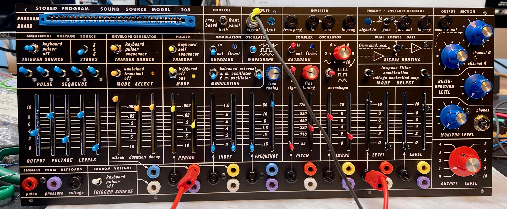

**original 208 Version:**

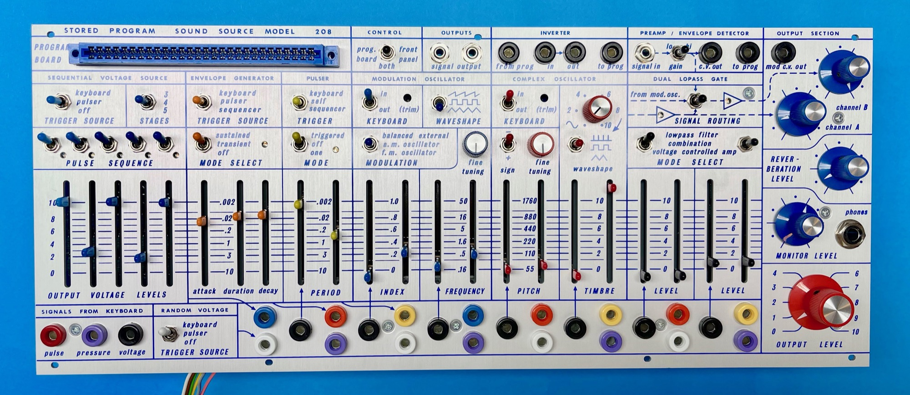

## BOM:

**BOM for 208P**

[Portabellabz\_208p\_BOM\_by\_AshtrayWasp-2.xls](assets/Portabellabz_208p_BOM_by_AshtrayWasp-2.xls)

**BOM from Roman for 208R**

[https://electricmusicstore.com/blogs/build/12614717-stored-program-sound-source-model-208](https://electricmusicstore.com/blogs/build/12614717-stored-program-sound-source-model-208)

## Build Guides:

**208R Buildguide:**

[https://modularsynthesis.com/roman/buchla208v2.1/208spss.htm](https://modularsynthesis.com/roman/buchla208v2.1/208spss.htm). (black pcb version)

[https://modularsynthesis.com/roman/buchla208v2/208spss.htm](https://modularsynthesis.com/roman/buchla208v2/208spss.htm) (earlier version)

**208P Buildguide and Muffwiggler Page**

208P Build Tips: [http://www.portabellabz.be/images/208/208p\_build\_notes.pdf](http://www.portabellabz.be/images/208/208p_build_notes.pdf)

[208p build thread (papz's PCBs) - MUFF WIGGLERwww.muffwiggler.com › viewtopic](https://www.google.com/url?sa=t&rct=j&q=&esrc=s&source=web&cd=&cad=rja&uact=8&ved=2ahUKEwi03I3TwqzuAhWhwQIHHa9QCckQFjACegQIBhAC&url=https%3A%2F%2Fwww.muffwiggler.com%2Fforum%2Fviewtopic.php%3Ft%3D194531&usg=AOvVaw1QFmlAK7YXl7FqqxQKftCQ)

**its important to read the FAQ page**: [http://www.portabellabz.be/208pcbfaq.html](http://www.portabellabz.be/208pcbfaq.html)

on Portabellabz.be find you many infos and build notes for the 208P. (backup: 

[208 build notes\_final\_02-2021.pdf](assets/208-build-notes_final_02-2021.pdf)

)

**Schematics**: [http://www.portabellabz.be/images/208/schemas\_208.zip](http://www.portabellabz.be/images/208/schemas_208.zip)

## General links to shops or infos:

contact me if you are looking for an assembled version 

[https://www.samodular.com](https://www.samodular.com)  &gt; Cases and parts

[http://www.portabellabz.be/208pcb.html](http://www.portabellabz.be/208pcb.html) &gt; PCBs 208P

[https://electricmusicstore.com/collections/all](https://electricmusicstore.com/collections/all) &gt; 208R and more

card12 - improved reverb card: [New Buchla Card 12](https://www.muffwiggler.com/forum/viewtopic.php?t=211862&highlight=) - contact Boops by email or PM on muffs. (40euro in 2020)

card12 guide: [https://modularsynthesis.com/roman/boops\_208\_card12/boops\_card12.htm](https://modularsynthesis.com/roman/boops_208_card12/boops_card12.htm)

card12 BOM: [My New Card 12 Mouser BOM](https://modularsynthesis.com/roman/boops_208_card12/Boops%20Card12%20Mouser%20BOM.pdf). 

[New\_208crd12-1.pdf](assets/New_208crd12-1.pdf)

## Schematics:

[schemas\_208.zip](assets/schemas_208.zip)

## PCB Pics:

[cards-2.zip](assets/cards-2.zip)

## Tips and Tricks

**Sequencer LED Resistor:** the resistor is at the mainboard panel side, you can't change the 5 resistors without removing the Frontpanel.

Tip: install milled headers at the rearside of the mainboard and easily swap the resistors:

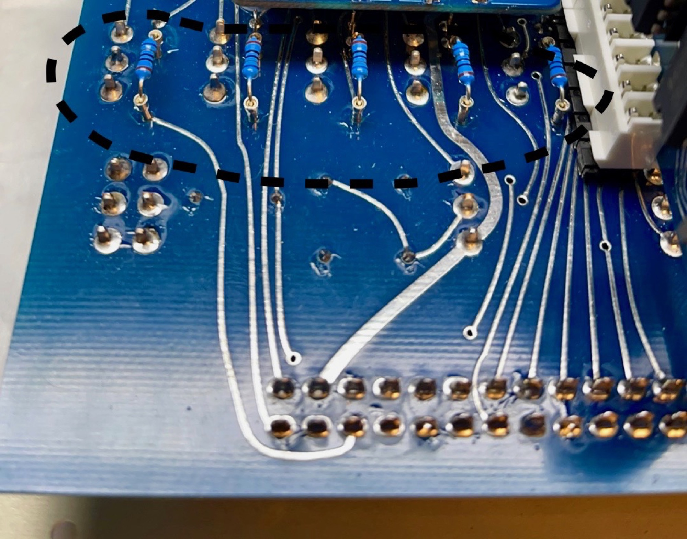

**Vactrols**

The Vactrols on card5 must be selected to have the correct/or your preferred AM/FM Sound. (look at [https://modularsynthesis.com/roman/buchla208v2/208spss.htm](https://modularsynthesis.com/roman/buchla208v2/208spss.htm))

**Trick:** use milled pins from an milled IC socket or buy this separately, bend the Vactrols legs and cut them to the same length - minimum on bottom of the vactrol 5mm - install the pins IN THE Vactrols legs/pins - THEN install it to the pcb.

the pcb don't have on both pcb sides solder pads - which makes it too complicated to install the pins at the pcb and later the Vactrols.

now you can easily swap the Vactrols - when you have finished the selecting just solder carefully each vactrol to the pin (just in case you move the 208 very often, to avoid that a vactrol get loose)

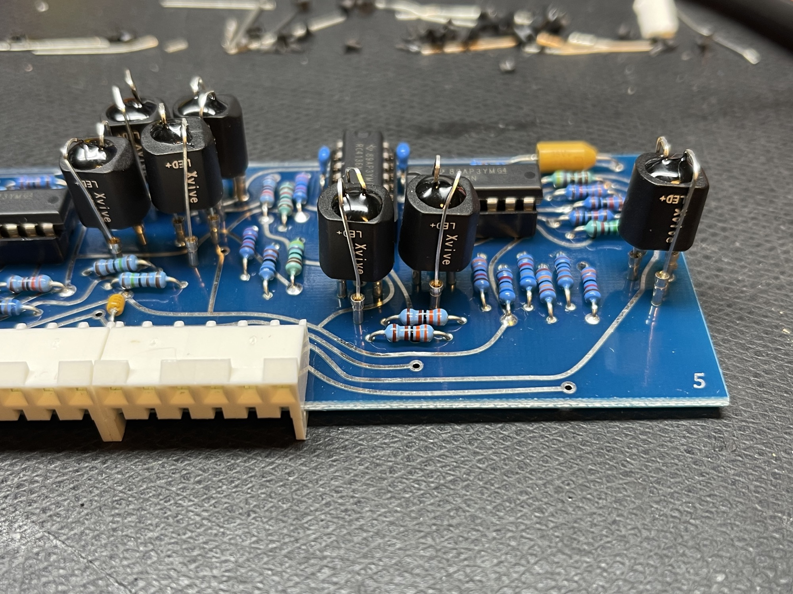

**Vactrols - card5 cable**

Here´s the ultimate way to swap the Vactrols without removing the card5, in addition to the above trick, 

buy MTA156 headers and sockets or molex 156 sized pins and connect it with a 10-15cm cable.

install temporary duct tape at the card5 bottom side - then you can drop the card5 pcb on top of the 208 pcbs while you remove the vactrols.

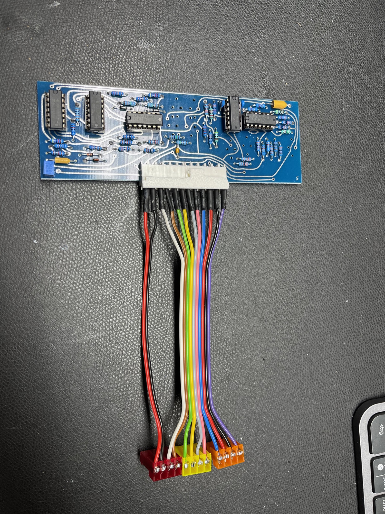

10K resistor for routing/card12 output mod

install 2 milled pins as shown above for the 10K resistor at the Mainboard from the rearside, this make changes later easier when you want install a different card12 ([https://modularsynthesis.com/roman/boops\_208\_card12/boops\_card12.htm](https://modularsynthesis.com/roman/boops_208_card12/boops_card12.htm))

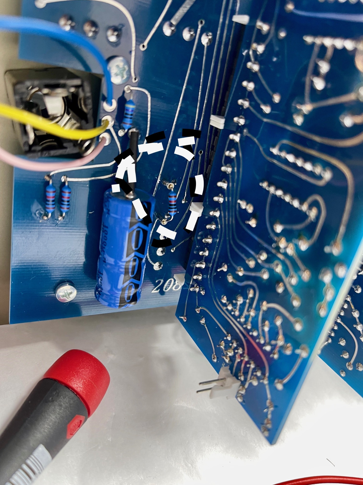

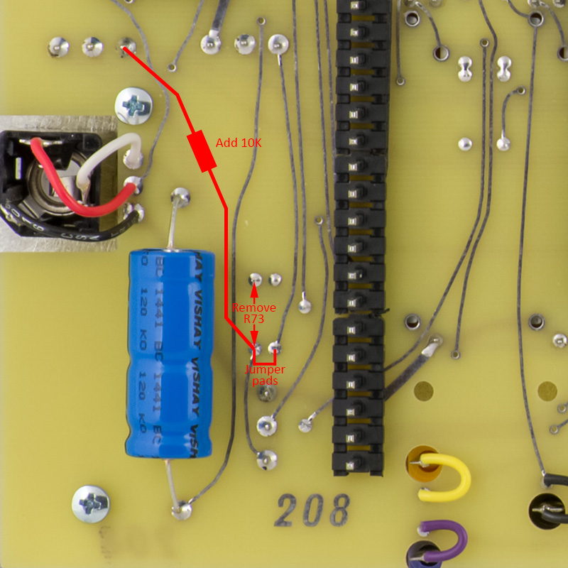

**Build notes from me:**

| **ID** | **Type** | **Description** |   |   |
|---|---|---|---|---|
| 1 | BUG | Slider connected to PCB mainboard | use tape or remove the slider metal - or bend it | 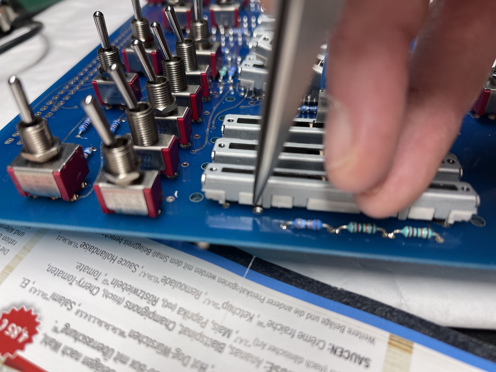 |
| 2 | Documentation | some Infos are missing... Pinout mainboard | Circle on mainboard -  capacitors is positive the square pads show the + pole | 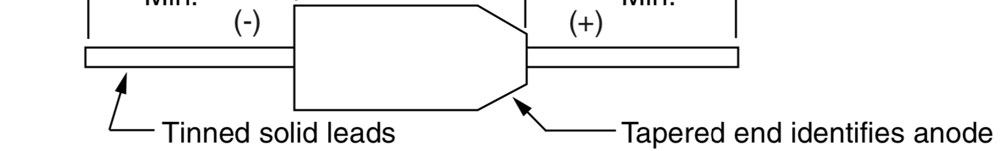 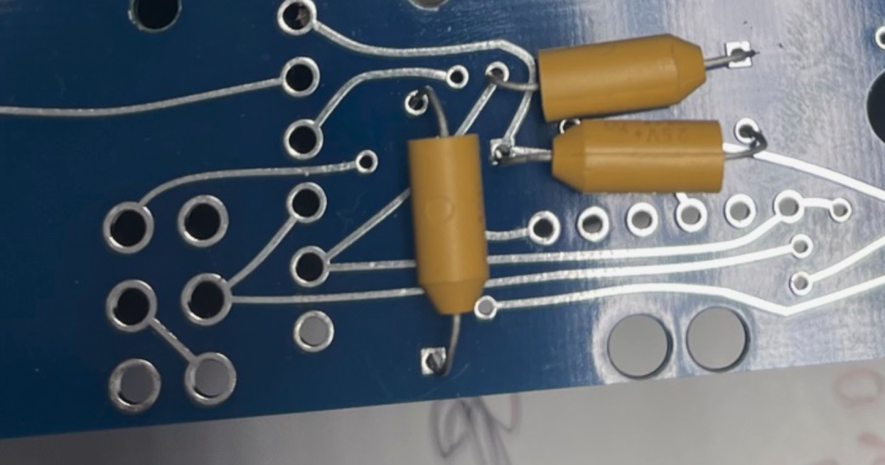 |
| 3 | Documentation | Vactrols | use 5C/3-2 instead of 2 single |   |
| 4 | BUG | Pot 17 on mainboard (alpha 9mm) the pin of the foot is against one trace. | isolate the pin with double layer tape or similar isolation | 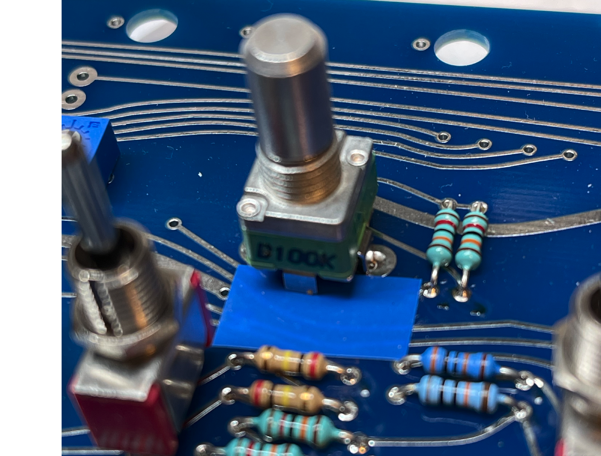 |
| 5 | power connection: |   |   | 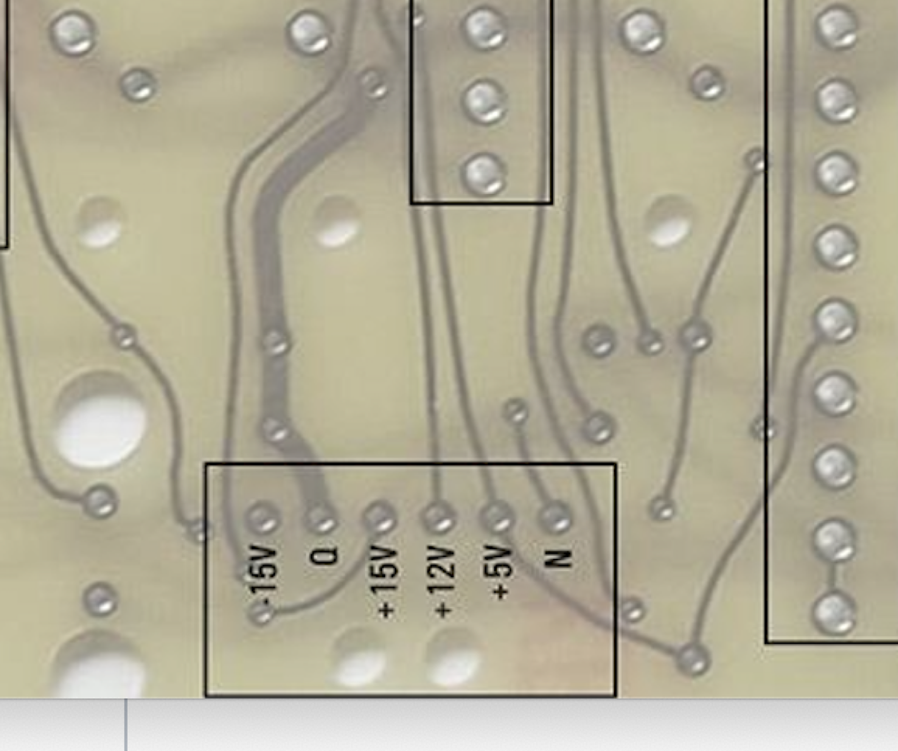 |
| 6 | testing process | to test card 1-4 | install card 12 - because it connects Q-N |   |
| 7 | testing - general | new card12 from boops | connect Q-N together jumper the in/outs | 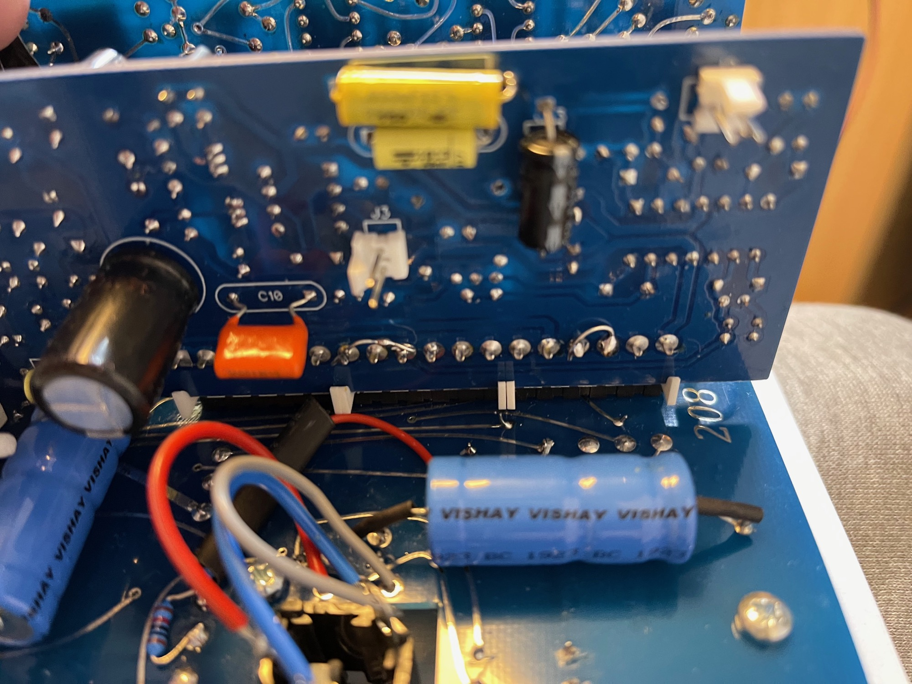 |
| 8 |   | for card 10 and 11 | connect the VTL5C3/2 as shown | 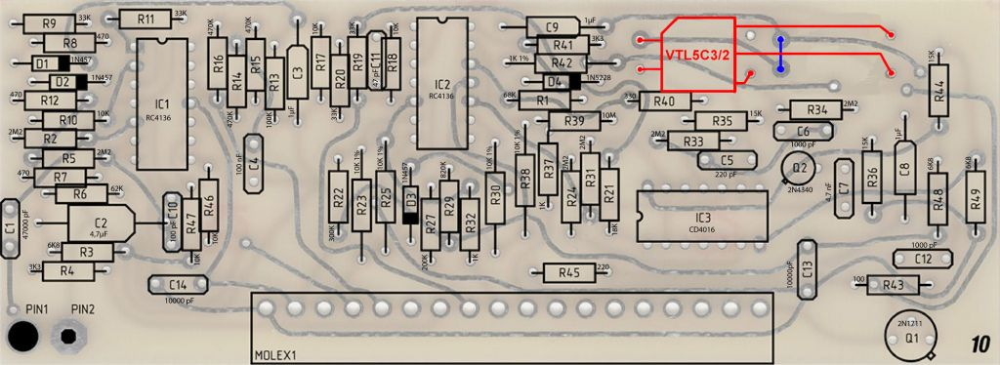 |
| 9 |   | Calibration notes | install pinheader to test/select but this values works in a 208R and 208P perfect | Card6 Mo range: R9 must be 330k (instead of 240k) Card6   1-1.2V/oct R5 must be 82K (instead of 190K) Card7 R14 68k instead of 120k |

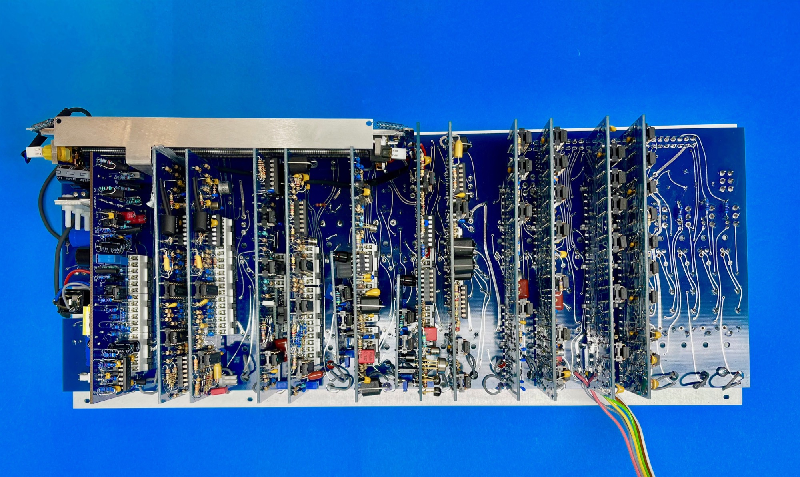

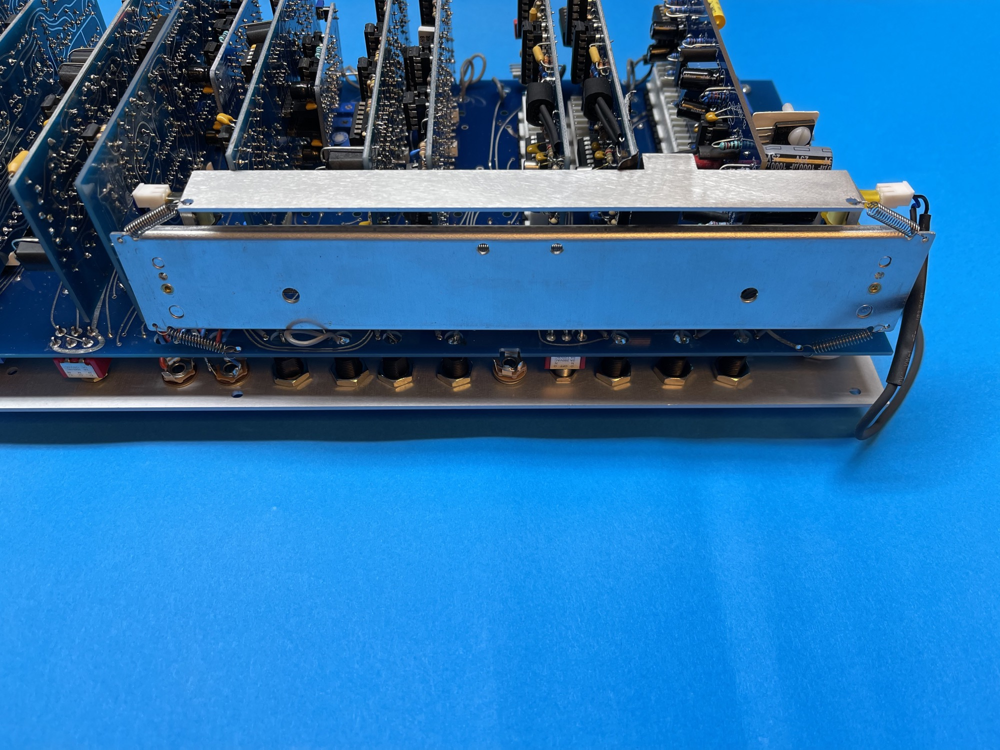

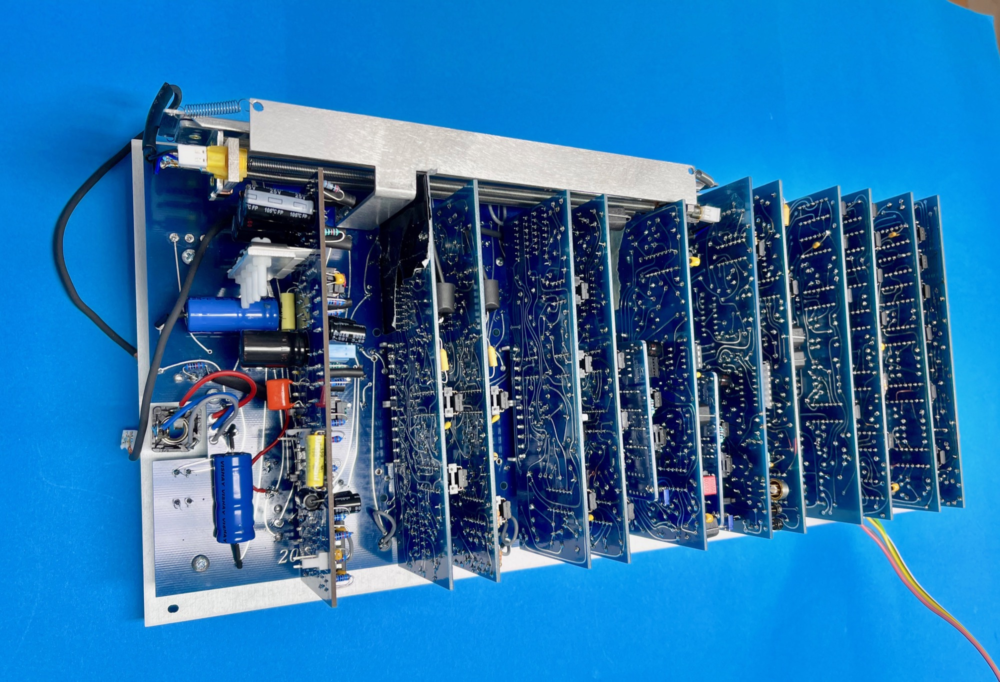

