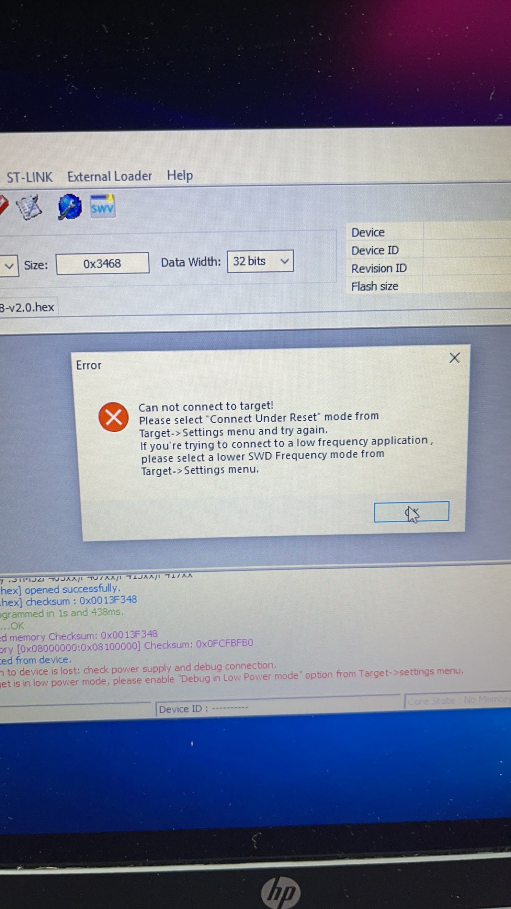
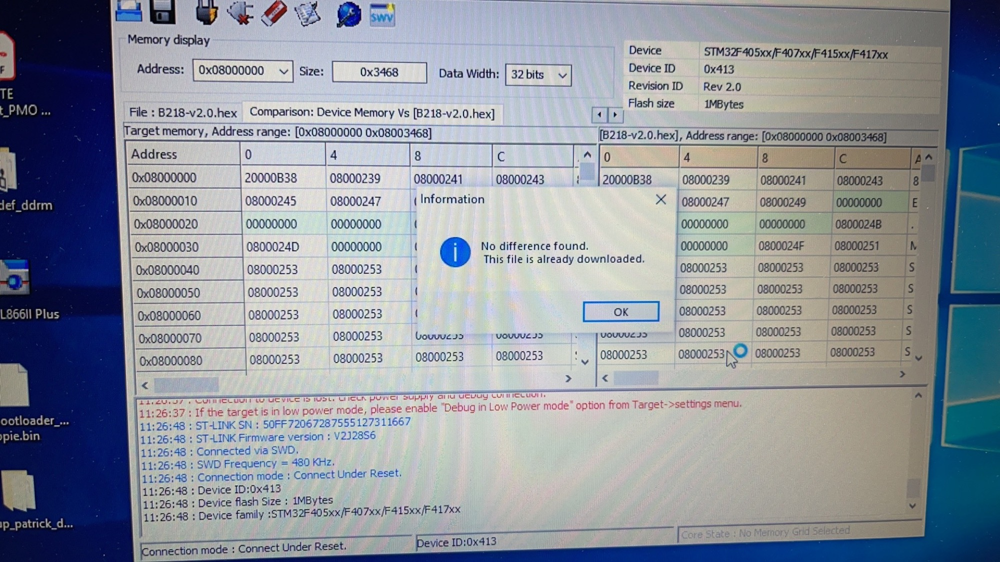
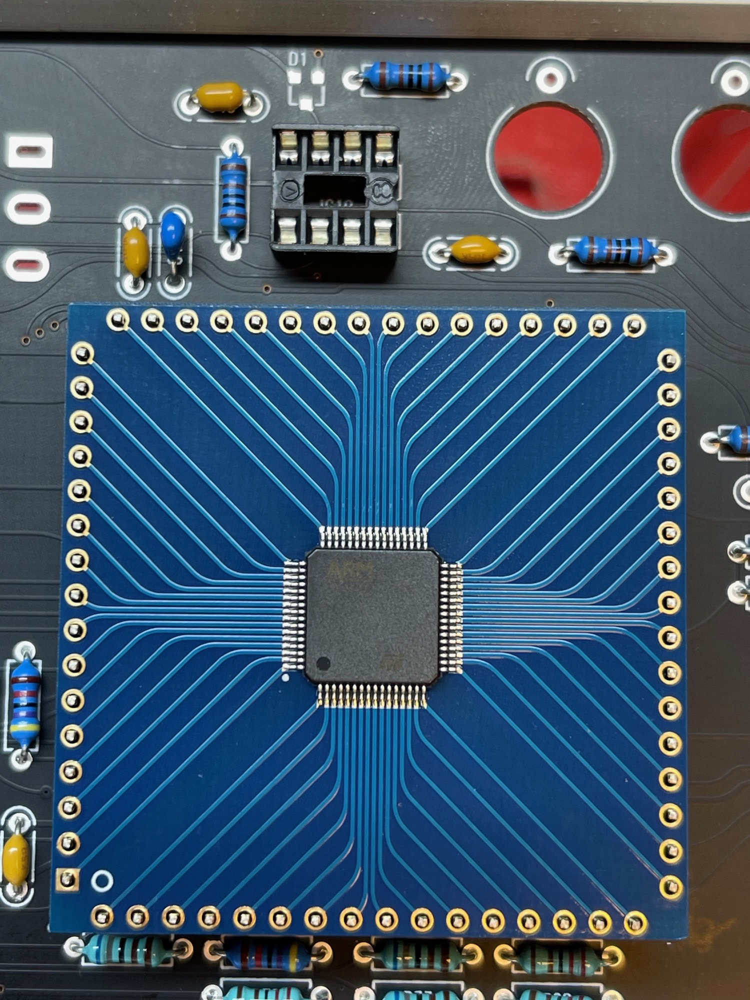
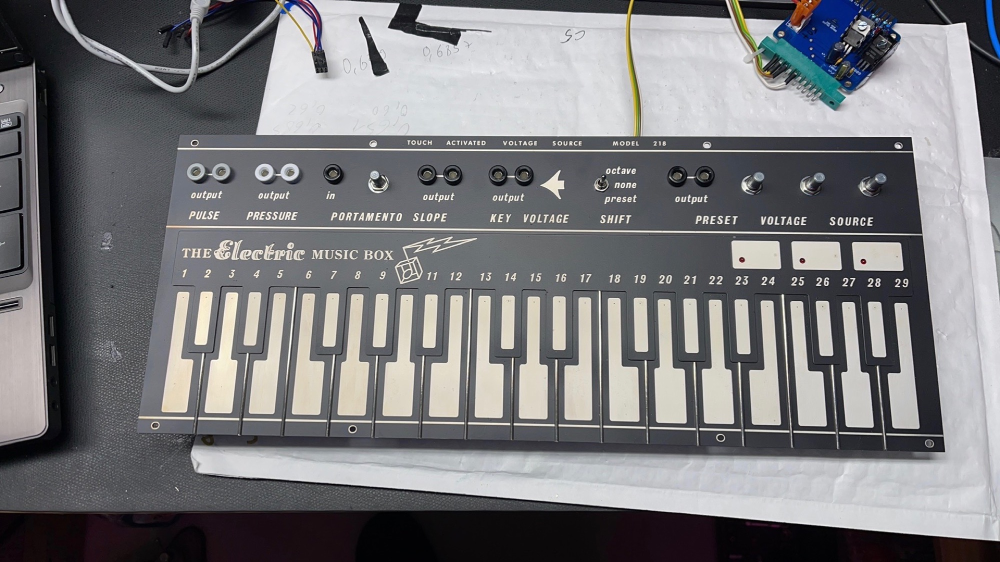
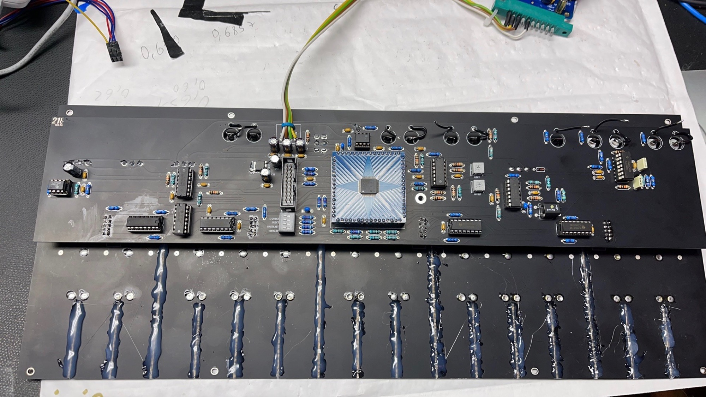
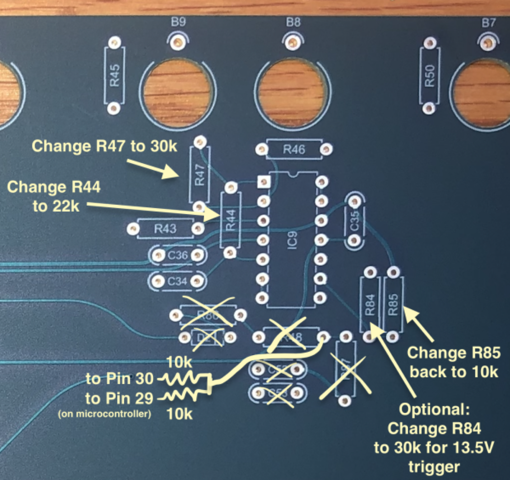

# Buchla 218R 218S clone

> **Project**
>
> ### Projecttitel: Buchla 218R 218P Clone
>
> ### Status: `done`
>
> ### Startdate: 02/2021
>
> ### Change: 08/2026 Firmware
>
> ### Manufacture link: [https://electricmusicstore.com/blogs/build/touch-activated-voltage-source-model-218](https://electricmusicstore.com/blogs/build/touch-activated-voltage-source-model-218)

> **Hinweis**
>
> ### Important
>
> **Buchla is a company and own the Trademark "Buchla"**
>
> **visit**[**https://buchla.com/**](https://buchla.com/company/)**if you want the original Easel and 208/218 modules**
>
> **This website is only for private usage and for documentation.**

The 218 clone was available from Samodular.com as 218s

 and EMS Store 218R (R=Roman)

**I built the 218R from an old kit for a friend, some experience and docs are here to have an backup and knowledge transfer:**

### Differences:

the 218R is black/silver 

the 218s is blue,red

### Programming/Flashing:

latest Firmware from EMS website: [B218-v2.0.hex](assets/B218-v2.0.hex)

**howto flash:**

connect the ribbon cable to the STlink v2 programmer and connect a PC to the programmer by usb.

start the STM programmer tool

power on the 218R

try to make an connection in the STM Utility software and upload the data by the function: "program&verify"

after you have done this, the connection will be lost ! that's ok. (on bottom you can see the error message after the programming) - but you need to respect the log entry before the error message started  - which says: "programmed in 1s and 430ms" that's what we want.

just disconnect and restart the 218R and perform the compare function - which reads the memory of the 218R and the computer it with the content of the hex file.

that's all. 

### Pictures:

The heart an STM32, not perfect here - the decoupling caps are far away from close to the chip.

Modification and new Firmware:

please visit [https://www.modwiggler.com/forum/viewtopic.php?t=176801&start=210](https://www.modwiggler.com/forum/viewtopic.php?t=176801&start=210)

a new firmware is here:  [https://github.com/damschwartz/218r](https://github.com/damschwartz/218r)

for the 218S (samodular version) change this:

