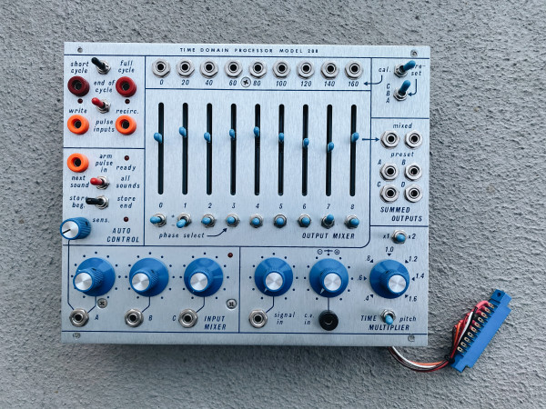
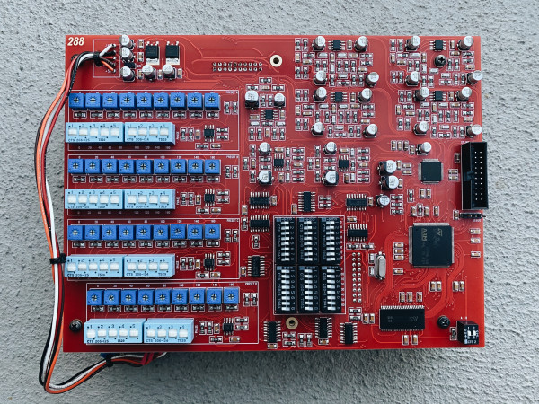
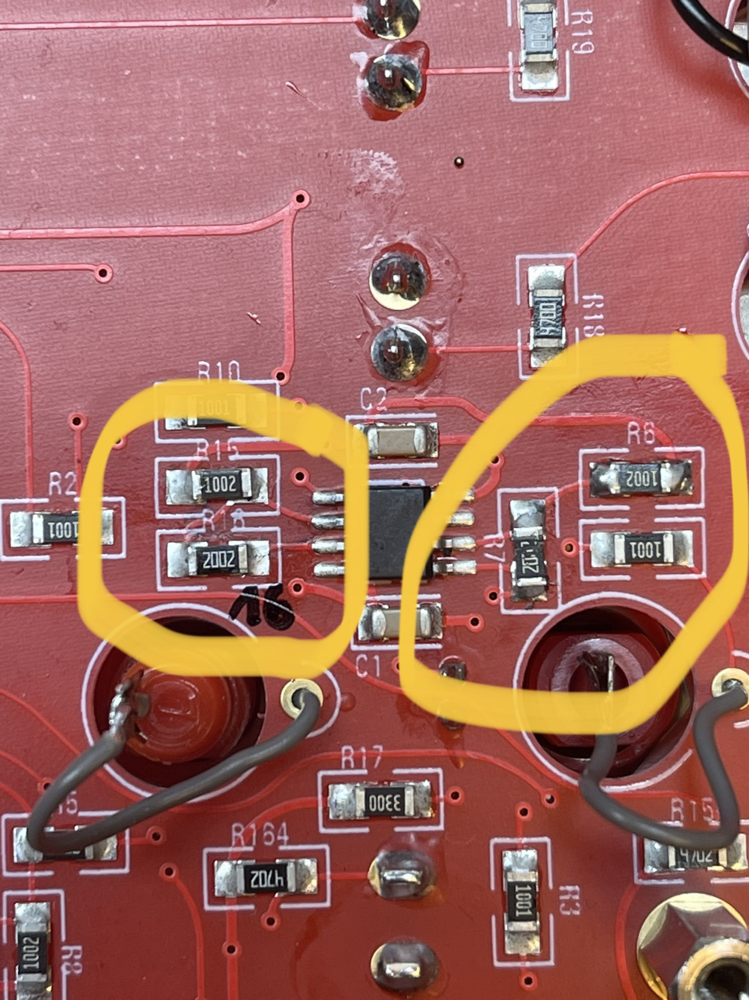

# Buchla clone 288R v2

> **Project**
>
> ### Projecttitel: Buchla 288R v2 Clone
>
> ### Status: `done`
>
> ### Startdate: 03/2022
>
> ### Duedate: 04/2022
>
> ### Manufacture link: PCB and Panel was sold by Black Corporation

> **Hinweis**
>
> ### Important
>
> **Buchla is a company and own the Trademark "Buchla"**
>
> **visit**[**https://buchla.com/**](https://buchla.com/company/)**if you want the original Easel and 208/218 modules**
>
> **This website is only for private usage and for documentation.**

**Forum:** [https://modwiggler.com/forum/viewtopic.php?t=243081&start=150](https://modwiggler.com/forum/viewtopic.php?t=243081&start=150)

### firmware:

[B288-REV1.0-1.hex](assets/B288-REV1.0-1.hex)

### Specs/Info

- 24bit/196KHz sound quality (switchable to 12bit "vintage" mode)
- up to 40 seconds of looping buffer (switchable to original short loop timings)
- both timing and phase/mixing presets are set up by trimmers and dip-switches on a back of a module, no need to wire or change resistors
- preorder is $299, total price is $1099 shipped
- a usb-programmer for firmware updates will be included with each order
- source code will become public shortly after the release of a module
- shipping is scheduled for mid-march 2021
- this is one-time run and i'm not offering kits atm unfortunately
- couple more cool modules to be released later this year.

### Bugs:

when the Sum isn't working : there's on few pcbs a trace damaged/missing connection (was reported on modwiggler.com) 

 Change: check the BOM - there's a resistor change needed - swap R6 with R7 and swap R15 with R16

changelog:

R6 was 20k now its 10K

R7 was 10K now 20k

R15 was 20k now 10k

R16 was 20k now 10k

**Usage:**

an info from a User on modwiggler:

"It's my understanding that the A, B, C switch selects pre-set delay tap timings. So instead of the 20ms between each tap that is listed as "cal." at the top of the panel (0, 20, 40, 60, 80...160),

 you can use the dip switches on the PCB to nudge the individual taps by 10ms. I'm guessing it's 10ms longer, so tap one which is 20ms would become 30ms, tap 2 would become 50ms and so on.

Could be fun to bump every other tap to get a shuffle type of feel out of the taps, or add other weird complexity in combination with which tap outputs are on or muted

1) you can preselect taps with dip switches, by 10ms steps
by default i've set:

A for 10-20-30-40-50-60-70-80ms
B for 50-60-70-80-90-100-110-120ms
and C for 90-100-110-120-130-140-150-160ms

you can select any 8 timings with 10ms steps, say, 10-20-50-100-120-130-150-160ms
if you set more than 8 switches per preset, it will still work, but only first 8 are to be considered

2) ABCD outputs are presets of 8 volume sliders and 8 phase toggle switches, they are set by trimmers and dip switches on left of a back

3) 4-position dip switch near the MCU sets some extra features

- switch 1 extends delay time to 5120ms and looper buffer to 20480ms (10x times)

- switch 2 limits frequency range to 11025Hz

- combination of switches 3/4 sets the resolution:

3 off/4 off - 24bit
3 on/4 off - 12bit
3 off/4 on - 8bit
3 on/4 on - 4bit

**BOM:**

[B288-BOM-v1.0.xlsx](assets/B288-BOM-v1.0.xlsx)

|   |   |   |   |   |
|---|---|---|---|---|
| TIME DOMAIN PROCESSOR MODEL 288 |   |   |   |   |
| BILL OF MATERIALS REV 1.0 |   |   |   |   |
| PCB1 |   |   |   |   |
| RESISTORS |   |   |   |   |
| VALUE | DESIGNATOR | QTY | DESCRIPTION | MOUSER PART# |
| 10K | R6, R15 | 2 | change R6 with R7 (from 10K to 20K) change R 15 with R16(from 10K to 20K) | not needed |
| 20K | R7, R16 | 2 | see above | not needed |
|   |   |   |   |   |
| 10-100K LOG | POT1, POT3, POT4, POT5 | 4 | 16MM ANGLED | [http://smallbear-electronics.mybigcommerce.com/alpha-single-gang-16mm-right-angle-pc-mount/](http://smallbear-electronics.mybigcommerce.com/alpha-single-gang-16mm-right-angle-pc-mount/) |
| 10-100K LOG | POT2 | 1 | 9MM | [http://smallbear-electronics.mybigcommerce.com/alpha-single-gang-9mm-right-angle-pc-mount/](http://smallbear-electronics.mybigcommerce.com/alpha-single-gang-9mm-right-angle-pc-mount/) |
| 10-100K LIN | POT6, POT7 | 2 | 16MM ANGLED | [http://smallbear-electronics.mybigcommerce.com/alpha-single-gang-16mm-right-angle-pc-mount/](http://smallbear-electronics.mybigcommerce.com/alpha-single-gang-16mm-right-angle-pc-mount/) |
| 50K LINEAR | POT8, POT9, POT10, POT11, POT12, POT13, POT14, POT15, POT16 | 9 | 45MM TRAVEL ALPS SLIDER | FARNELL/NEWARK: RS4511150K |
|   |   |   |   |   |
| MISC |   |   |   |   |
| VALUE | DESIGNATOR | QTY | DESCRIPTION | MOUSER PART# |
|   |   | 1 | BANANA JACK BLACK | 530-108-0903-1 |
|   |   | 2 | BANANA JACK RED | 530-108-0902-1 |
|   |   | 3 | BANANA JACK ORANGE | 530-108-0906-1 |
|   | LED1, LED2, LED3, LED4, LED5 | 5 | RED 3MM LED | 604-WP710A10ID5V |
|   | J1-J18 | 18 | TINY-JAX | 502-41 |
| SPDT ON-ON | SW2, SW3, SW4, SW5, SW6, SW8, SW9, SW10, SW11, SW13, SW15, SW17, SW18 | 13 | TOGGLE SWITCH | 633-M201201 |
| SPDT ON-OFF-ON | SW7, SW12 | 2 | TOGGLE SWITCH | 633-M201301 |
| SPDT (ON)-OFF-(ON) | SW14 | 1 | TOGGLE SWITCH | 633-M201801 |
| SPDT ON-OFF-(ON) | SW16 | 1 | TOGGLE SWITCH | 633-M201901 |
|   | PBD1, PBD2 | 2 | PLD 20 PIN (MALE) | 517-929836-01-10-RK |
|   |   | 6 | 15MM MF STANDOFF |   |
|   |   | 22 | BLUE SWITCH CAP |   |
|   |   | 2 | BLACK SWITCH CAP |   |
|   |   | 2 | RED SWITCH CAP |   |
|   |   |   |   |   |
| PCB2 |   |   |   |   |
| RESISTORS |   |   |   |   |
| VALUE | DESIGNATOR | QTY | DESCRIPTION | MOUSER PART# |
| 50K | TR1-TR36 | 36 | SINGLE TURN TRIMMER | 652-3362P-1-503 |
|   |   |   |   |   |
| MISC |   |   |   |   |
| VALUE | DESIGNATOR | QTY | DESCRIPTION | MOUSER PART# |
|   | PLD1, PLD2 | 2 | PLD 20 PIN (FEMALE) | 579-25AA512-I/P |
|   | SW1 | 1 | DIP SWITCH | 774-2084 |
|   | SW27, SW28, SW29, SW30, SW31, SW32 | 6 | DIP SWITCH | 774-2088 |
|   | SW19, SW20, SW23, SW24 | 4 | DIP SWITCH | 206-125ST |
|   | SW21, SW22, SW25, SW26 | 4 | DIP SWITCH | 206-124 |
|   | STLINK | 1 | IDC-20 THRUHOLE HEADER | 571-1761681-7 |
|   |   |   | DIP SWITCH | 774-2084 |
|   |   | 6 | 12MM FF STANDOFF |   |
|   |   | 1 | POWER CONNECTOR | 587-306-50-010 |
|   |   | 1 | ST-LINK/V2 PROGRAMMER | 511-ST-LINK/V2 |
