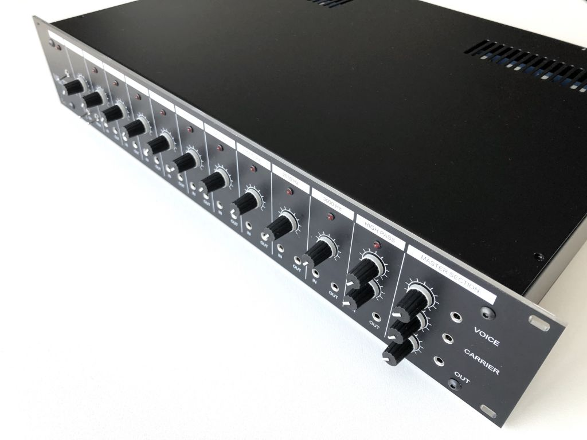
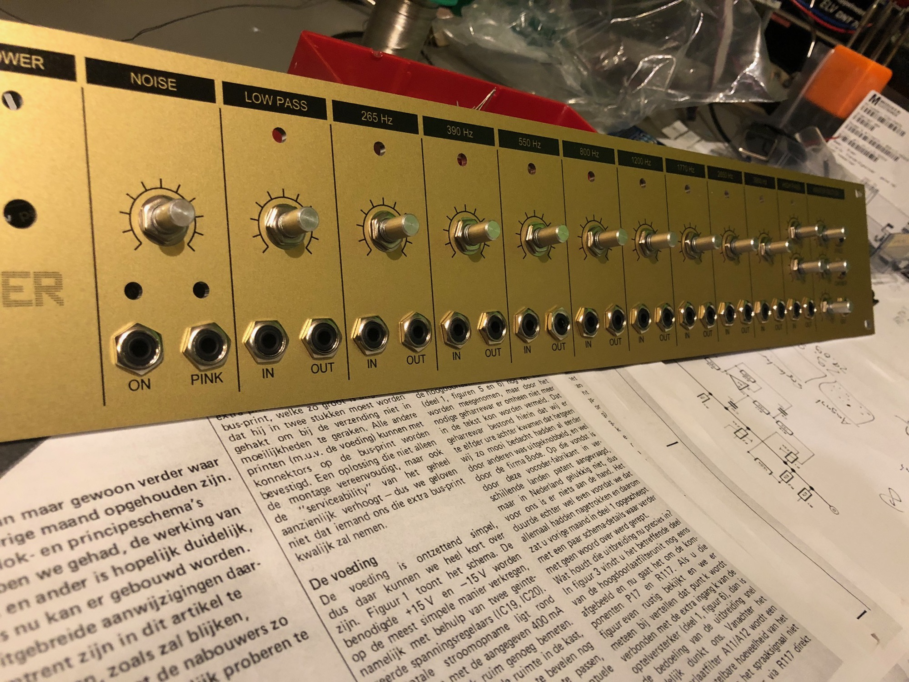
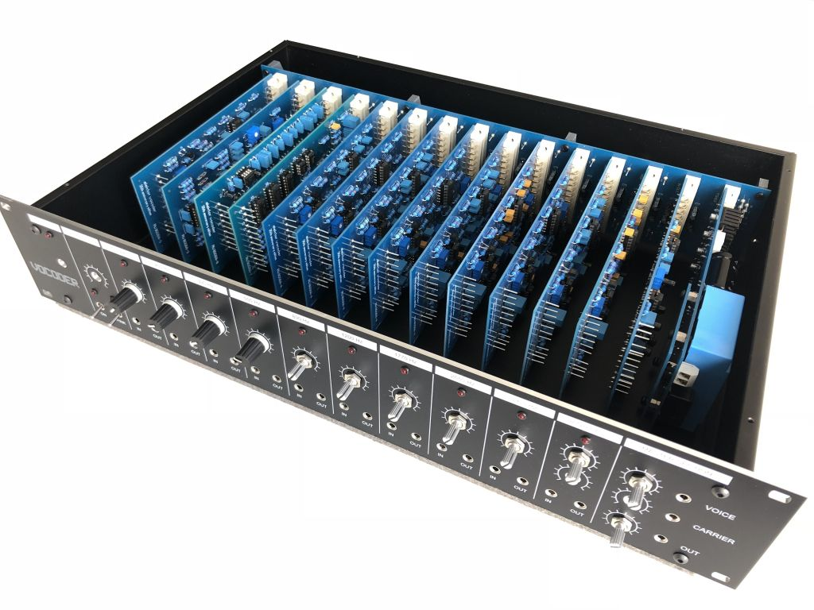
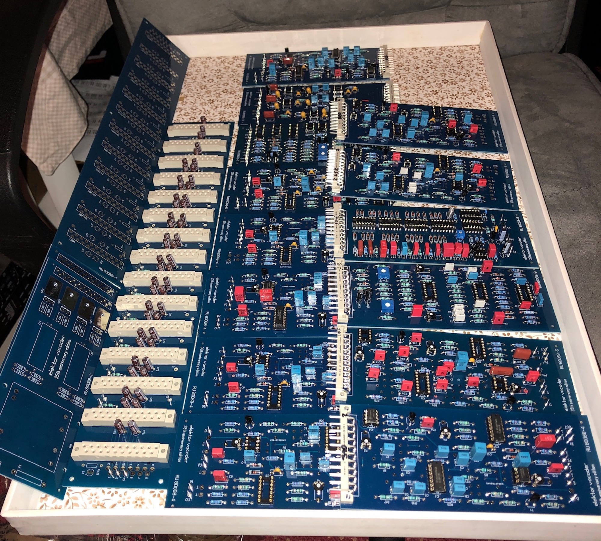
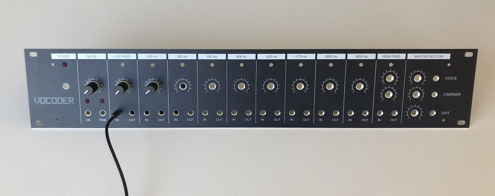
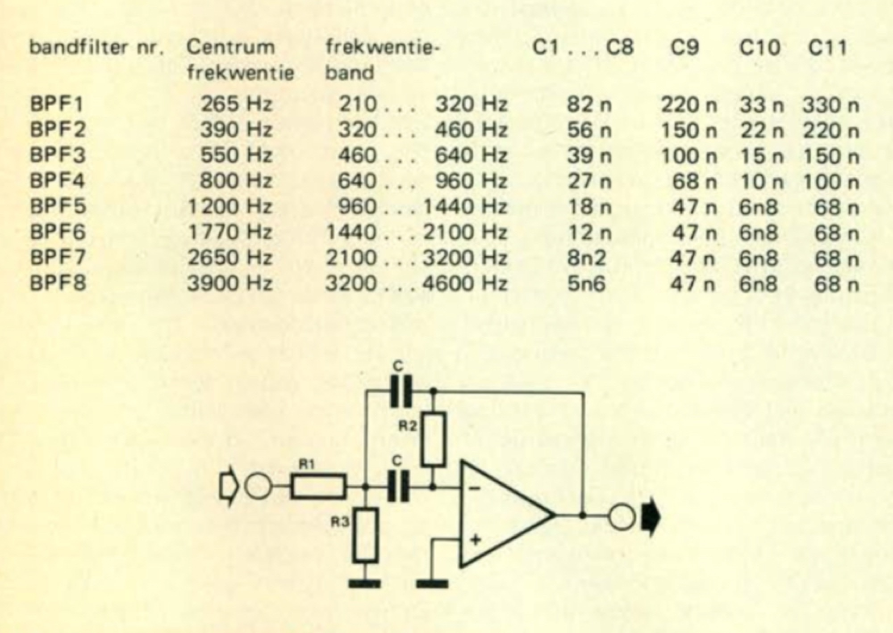

# Elektor Vocoder Clone

> **Project**
>
> ### Projecttitel: Elektor Vocoder Clone
>
> ### Status: `prototyping`
>
> ### Startdate: July 2018
>
> ### Duedate: September 2018
>
> ### Manufacture link: [https://www.muffwiggler.com/forum/viewtopic.php?t=193646&start=0](https://www.muffwiggler.com/forum/viewtopic.php?t=193646&start=0)

> **Info**
>
> copyright/IP info:   i´m not the resonsible person for the "products", its just an documentation about this projects.

> **Info**
>
> ### from the developer:
>
> "In those days, board designs were published in magazines, afterwards mirrored and copied on transparent foils, heat transferred to hand drilled boards. And last but not least, ferric chloride dissolved in water was used to etch the PCB's. As you know the original Vocoder is built on a total of 14 PCB's, it was a complex and nasty job to completed all boards.
>
>  There also was no internet, no "one day order and delivery" from Mouser or Farnell, so getting all your components was quite complex and labor intensive. But I was convinced to build my own Vocoder and putted al my pocket money in. Months later with the unaffordable help of my best friend, I succeeded to finish the heavily under-estimated build.
>
>  Here is a picture from the 30 years old device, still operational, but dusty and abandoned."

i was so kindly to offer the protoyp assembly and testing for Raoul (the developer)

**The PCB SET price is 140€**

optional Panel and Case, 3D printed parts (card holder)

## BOM:

[Elec\_VOC\_BOM.xlsx](assets/Elec_VOC_BOM.xlsx) (not final version !!! )

