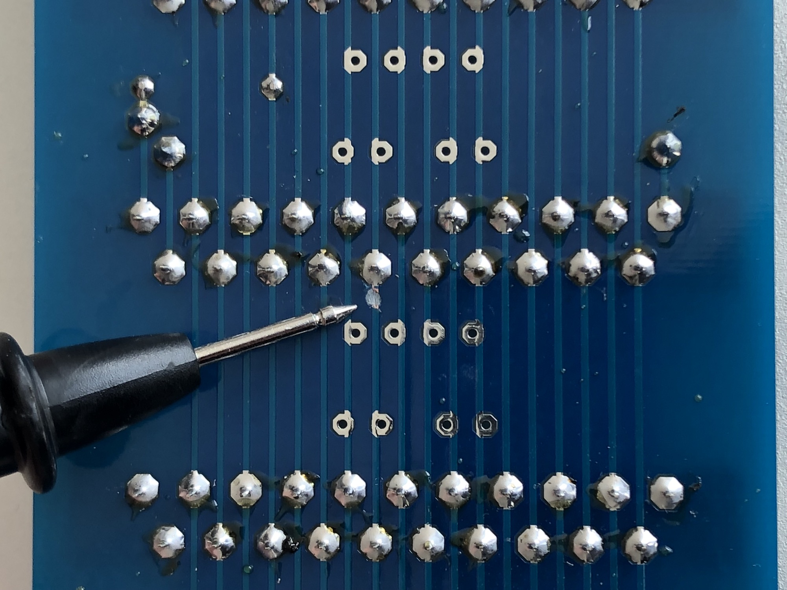
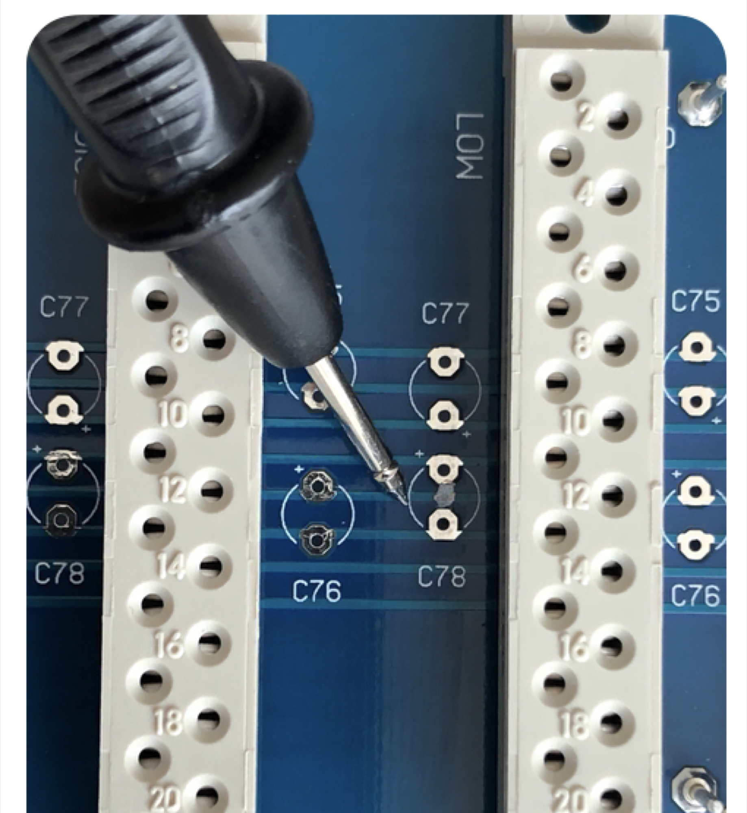
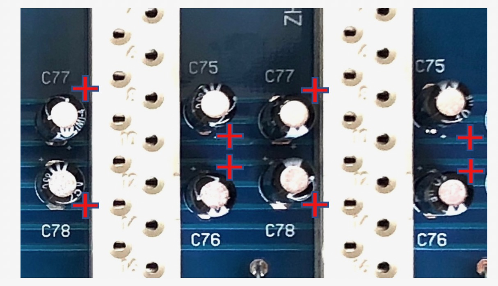
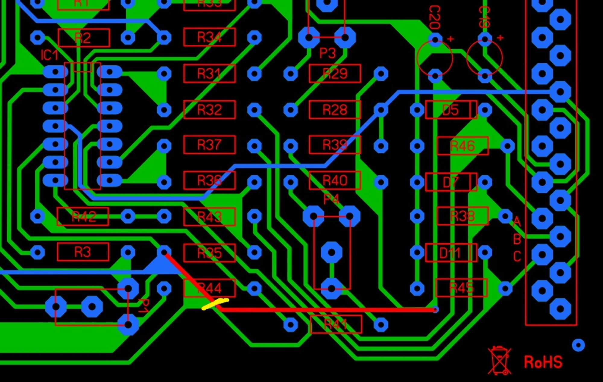
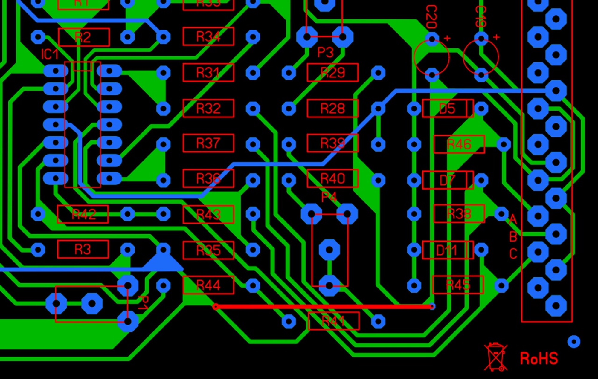
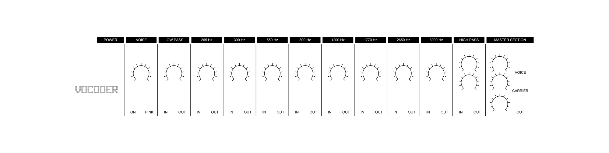
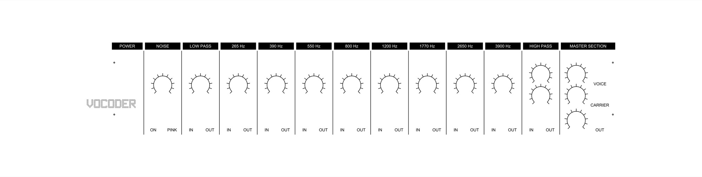

# secret area - elector vocoder

## Known Issues Prototyp:

## LP

  Resistor R99 must be mounted more to right

## HP

820pf instead of 1NF - not tested

### Extended Backplane - RU80068.1X

♣For the extenden version of the vocoder (the model with the sybillian expansion) cut the connection between pin 4 (carrier I) & 5 (carrier J) on the solder side of the PCB. Do not cut the connection between pin 2 (voice G) and pin 3 (voice H).
This is only applicable for the prototyping boards.
♣Cut the trace leaving pin 12 left from the connector labeled LOW (left from the LP connector)

**Do this both on the component side as solder side** from the PCB.
**This is only applicable for the prototyping boards.**

 

♣Do not install C76 & C78 for the 3 connectors on the left, labeled COM, DET & NOISE.
This is **only applicable** for the **prototyping boards.**

♣Polarity indication electrolytic capacitors (e-caps) **are inverted** on silkscreen for the following parts:
C77 (apply 15 times)
C78 (apply 12 times)

**This is only applicable for the prototyping boards.**
♣The negative voltage indications on the left side are exchanged:
-15 should be read as -5
-5 should be read as -15

**Failure on PCB 9 = Detection board**

Trace error

The RED trace is wrong

cut the trace behind R44

Then make a new connection.

drill a hole and connect the trace from upper side to the solder side, as seen in the picture the small "via"

Project description:

[Vocoder Project Description.pdf](assets/Vocoder-Project-Description.pdf)

building notes:

[Vocoder Building Notes.docx](assets/Vocoder-Building-Notes.docx)

[Vocoder Building Notes Step 1.pdf](assets/Vocoder-Building-Notes-Step-1.pdf)

## Schematics:

- [Device Block Diagram.jpg](assets/Device-Block-Diagram.jpg)
- [Voiced Unvoiced Switch.jpg](assets/Voiced-Unvoiced-Switch.jpg)
- [High Pass Filter.jpg](assets/High-Pass-Filter.jpg)
- [Voiced Unvoiced Detector.jpg](assets/Voiced-Unvoiced-Detector.jpg)
- [Sibilance Expansion Block Diagram.jpg](assets/Sibilance-Expansion-Block-Diagram.jpg)
- [Noise Generator.jpg](assets/Noise-Generator.jpg)
- [Jack chassis.pdf](assets/Jack-chassis.pdf)
- [Wired Led.pdf](assets/Wired-Led.pdf)
- [Vocoder Project Description.pdf](assets/Vocoder-Project-Description.pdf)
- [Vocoder Building Notes.docx](assets/Vocoder-Building-Notes.docx)
- [Rotary Potentiometer.pdf](assets/Rotary-Potentiometer.pdf)
- [Cylindrical LED.pdf](assets/Cylindrical-LED.pdf)
- [Conec 102E10079X.pdf](assets/Conec-102E10079X.pdf)
- [Conec 101E10099X.pdf](assets/Conec-101E10099X.pdf)
- [Low Pass Filter.jpg](assets/Low-Pass-Filter.jpg)
- [Filter Block Diagram.jpg](assets/Filter-Block-Diagram.jpg)
- [Band Filter.jpg](assets/Band-Filter.jpg)
- [Vocoder Building Notes Step 1.pdf](assets/Vocoder-Building-Notes-Step-1.pdf)
- [Vocoder Extended Panel V306 No Thread_own.fpd](assets/Vocoder-Extended-Panel-V306-No-Thread_own.fpd)
- [Vocoder Extended Panel V306 No Thread_own_gold_with_mount_h.fpd](assets/Vocoder-Extended-Panel-V306-No-Thread_own_gold_with_mount_h.fpd)
- [Vocoder Extended Panel V306 No Thread_own_gold_without_mount_h.fpd](assets/Vocoder-Extended-Panel-V306-No-Thread_own_gold_without_mount_h.fpd)
- [VOCODER_FP_306_c_1200.jpg](assets/VOCODER_FP_306_c_1200.jpg)
- [image4.png](assets/image4.png)
- [image4-2.png](assets/image4-2.png)
- [image2.jpeg](assets/image2.jpeg)
- [image3.png](assets/image3.png)
- [VOCODER_FP_306_c_1200.png](assets/VOCODER_FP_306_c_1200.png)
- [Vocoder Extended Panel V306 No Thread.fpd](assets/Vocoder-Extended-Panel-V306-No-Thread.fpd)
- [trACES_VOC.png](assets/trACES_VOC.png)
- [Error 2.jpeg](assets/Error-2.jpeg)
- [Error 3.jpeg](assets/Error-3.jpeg)
- [Error 1.jpeg](assets/Error-1.jpeg)
- [Screen Shot 2018-08-28 at 23.15.19.jpeg](assets/Screen-Shot-2018-08-28-at-23.15.19.jpeg)

## Panel Patrick:

[Vocoder Extended Panel V306 No Thread\_own.fpd](assets/Vocoder-Extended-Panel-V306-No-Thread_own.fpd)

[Vocoder Extended Panel V306 No Thread\_own\_gold\_with\_mount\_h.fpd](assets/Vocoder-Extended-Panel-V306-No-Thread_own_gold_with_mount_h.fpd)

modified Patrick without 19" mounting holes, jacks modified for cliff

[Vocoder Extended Panel V306 No Thread\_own\_gold\_without\_mount\_h.fpd](assets/Vocoder-Extended-Panel-V306-No-Thread_own_gold_without_mount_h.fpd)

Original:

[Vocoder Extended Panel V306 No Thread.fpd](assets/Vocoder-Extended-Panel-V306-No-Thread.fpd)

**Datasheets parts:**

[Rotary Potentiometer.pdf](assets/Rotary-Potentiometer.pdf)

[Cylindrical LED.pdf](assets/Cylindrical-LED.pdf)

[Wired Led.pdf](assets/Wired-Led.pdf)

[Conec 101E10099X.pdf](assets/Conec-101E10099X.pdf)

[Conec 102E10079X.pdf](assets/Conec-102E10079X.pdf)

[Jack chassis.pdf](assets/Jack-chassis.pdf)
