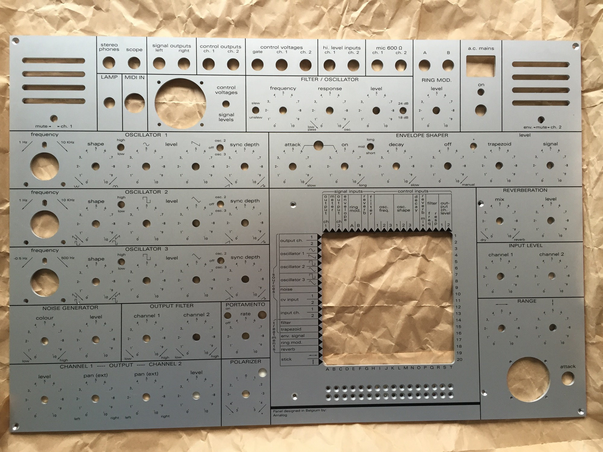

# EMS Synthi A Clone

> **Project**
>
> ### Projecttitel: EMS Synthi A Clone
>
> ### Status: `in progress`
>
> ### Startdate: September 2014
>
> ### Duedate: Late 2017
>
> ### Manufacture link:

> **Info**
>
> status:
>
> all pcbs are completed but untested,
>
> case is in progress,
>
> open:  powersupply and mounting of all parts inside the case, testing, calibration
>
> modification later

Children pages

**Panel here:**

[http://www.muffwiggler.com/forum/viewtopic.php?t=65022](http://www.muffwiggler.com/forum/viewtopic.php?t=65022)

**pcbs here:**

[http://www.phutney.com/](http://www.phutney.com/)

**Case:**

~~[http://www.explorer-cases.de/explorer-cases-laptop-koffer-4412-b-c.html](http://www.explorer-cases.de/explorer-cases-laptop-koffer-4412-b-c.html)~~

dosn´t fit with my panel

**BOM parts dealer:**

[http://www.williges-elektronik.de/](http://www.williges-elektronik.de/)

[http://www.sequencer.de/synthesizer/viewtopic.php?t=70270&p=744735](http://www.sequencer.de/synthesizer/viewtopic.php?t=70270&p=744735)

**further builder/mods**

**[http://www.hinton-instruments.co.uk/ems](http://www.hinton-instruments.co.uk/ems)**

[http://monopole.ph.qmul.ac.uk/~thomas/synthdiy/vcs3project.htm](http://monopole.ph.qmul.ac.uk/~thomas/synthdiy/vcs3project.htm)

[http://www.sequencer.de/synthesizer/viewtopic.php?f=13&t=70270&hilit=vcs3+sammelbestellung&start=25](http://www.sequencer.de/synthesizer/viewtopic.php?f=13&t=70270&hilit=vcs3+sammelbestellung&start=25)

[http://anothersynthiclone.blogspot.ch/](http://anothersynthiclone.blogspot.ch/)

[http://spanishsynthiclone.blogspot.de/2013\_05\_01\_archive.html](http://spanishsynthiclone.blogspot.de/2013_05_01_archive.html)

**manual**

[handbook\_a\_synthia.pdf](assets/handbook_a_synthia.pdf)

[VCS3M.pdf](assets/VCS3M.pdf)

Die schwer zu beschaffenden Bauteile kann man durch aktuelle Teile ersetzen.
Für die 2C746 nimmt man den LM394, der TAB101 kann durch einen CA3046 ersetzt werden (wenn man dazu einen passenden Adapter auf Lochrasterplatine bastelt).
Für die ME9002 (in der Bucht, aber teuer!!!) nimmt man den BSX20, den MFC6070 gibt es auch in der Bucht (acpsurplus).
Den TAB101 bekommt man noch bei littlediode.com (habe ich auch schon bestellt).
Ich habe alle Transistoren bei [http://www.williges-elektronik.de](http://www.williges-elektronik.de) bestellt, und die Lieferbarkeit wurde mir bestätigt (kann aber noch etwas dauern, da momentan nicht alle Teile am Lager sind).
Einige Transistoren kannst du auch bei Derek Revell kaufen, aber sie sind billiger, wenn man beim Händler bestellt.
Die Diode DK10 kann durch eine beliebige Ge-Diode ersetzt werden, z.B. 1N60, AA143, 1N34A,...

**Reverb:**
die 1er Serie ist nicht im Vertriebsprogramm.

Die 8er Serie ist äquivalent ABER hat 3 Federn und damit einen deutlich höheren Qualitätsstandard.

Die entsprechende accutronics ist sofort lieferbar und hier zu finden: [http://www.tubeampdoctor.com/catalog.php?product\_search=BC2D1B](http://www.tubeampdoctor.com/catalog.php?product_search=BC2D1B)

**Matrix:**

[gkv\_n\_x\_m\_321-621\_la\_e.pdf](assets/gkv_n_x_m_321-621_la_e.pdf)

| Part |   | Quantity |   | source | ordered | price w.shipping |
|---|---|---|---|---|---|---|
| Panel |   | 1 |   | [http://www.muffwiggler.com/forum/viewtopic.php?t=65022](http://www.muffwiggler.com/forum/viewtopic.php?t=65022) | ✅ | ca.170 |
| pcbs |   | kit (3pcbs) |   | [http://www.phutney.com/ClonedParts.html](http://www.phutney.com/ClonedParts.html) | ✅ | 85€ |
| Ghielmetti matrix 20x20 Type 621 | ghielmetti.ch | 1 |   | new 20 pins | ✅ | 370€ 32€ |
| Joystick |   | 1 |   | [http://www.superdroidrobots.com/shop/item.aspx?itemid=1265](http://www.superdroidrobots.com/shop/item.aspx?itemid=1265) |   | 25€ |
| speaker |   | 2 |   | [http://www.phutney.com/ClonedParts.html](http://www.phutney.com/ClonedParts.html) | ✅ | 15€ |
| reverb tank  1BC2D1B |   | 1 |   | [http://www.tubeampdoctor.com/product\_info.php?language=de&category\_id=148&products\_id=3496&mySID=zaEgxl2Mj2,tNscykCK2c1](http://www.tubeampdoctor.com/product_info.php?language=de&category_id=148&products_id=3496&mySID=zaEgxl2Mj2,tNscykCK2c1) [http://www.tubeampdoctor.com/catalog.php?product\_search=BC2D1B](http://www.tubeampdoctor.com/catalog.php?product_search=BC2D1B) |   | 30€ |
| pcb connector 32way |   |   |   |   | ✅ | 10€ |
| edge connector |   |   |   | [http://www.silicon-ark.co.uk/electronics-hardware/electrical-sockets-and-connectors/pcb-edge%20connector-7\_4way](http://www.silicon-ark.co.uk/electronics-hardware/electrical-sockets-and-connectors/pcb-edge%20connector-7_4way) |   | -- |
| powersupply parts |   |   |   |   |   | 30€ |
| Vernier Dials 45KN100 |   |   |   | 45KN100 mouser | ✅ | 125€ |
| add. pcb |   |   |   |   | ✅ | 30€ |
| pots and switches, midi, lamp, fuse holder, power jack, headphone |   |   |   | USA import, banzai | ✅ | 130€ |
| powersupply |   |   |   | DIY |   | 25€ |
| case |   |   |   | DIY | ✅ | 25€ |
| screws, THT parts except trannys |   |   |   |   | ✅ | 50€ |
| knobs |   |   |   |   |   | 85€ |
| BNC jack female |   |   |   | tue : [1-1337452-0](https://www.tme.eu/de/details/1-1337452-0/bnc-steckverbinder/te-connectivity/) | (X) |   |
|   |   |   |   |   |   |   |
|   |   |   |   |   | **TOTAL** | **1237€** |

| ICs/Trannys | quantity | avaibilty | sources |   | example | ordered | price w. shipping |
|---|---|---|---|---|---|---|---|
| Tip3055 | 2 | normal |   |   | banzai | ✅ | 1,20 |
| DK10 | 6 | rare | ebay | use any small signal diode like OA47, 1N34A or 1N60 etc, | banzai 1n34a | ✅ 1N34A | 3€ |
| BFY51 | 2 | rare | ebay |   | ebay | ✅ | 15€ |
| AC153K | 2 | rare/normal |   |   | ebay | ✅ | 5€ |
| AC176K | 2 | normal |   |   | banzai | ✅ | 3,34€ |
| 2N5461 | 1 | normal |   |   | banzai | ✅ | 1,43€ |
| 2N5163 | 6 |   |   | or use BF245C Vp 3,4V | ebay | BF245C ✅ | 7,50€ |
| 2N4288/BC258 | 30 |   |   | or use BC214L, BC258 | ebay | ✅ BC258B | 60€ |
| 2C746 | 2 | ultra rare |   | or use LM394CH or 2N2916 = pin compatibe use 2x 2x BC169 (epoxy together) | [http://www.ebay.co.uk/i](http://www.ebay.co.uk/itm/NS-LM394CH-CAN-6-LM194-LM394Supermatch-Pair-/251110339862?pt=LH_DefaultDomain_0&hash=item3a7757b516) [http://www.ebay.co.uk/i](http://www.ebay.co.uk/itm/2N2916-Manu-MOTOROLA-Encapsulation-CAN-6-Dual-NPN-Planar-Transistor-in-a-/120932115614?pt=LH_DefaultDomain_0&hash=item1c281da49e) [http://www.williges-elektronik.de/lm394ch-japan-schaltkreis.html](http://www.williges-elektronik.de/lm394ch-japan-schaltkreis.html) | ✅ | ca15€ |
| TAB 101 | 1 | ultrarare |   |   | [http://www.littlediode.com/components/TAB101.html](http://www.littlediode.com/components/TAB101.html) [http://www.ebay.de/itm](http://www.ebay.de/itm/TAB101-BURR-BROWN-INTEGRATED-CIRCUIT-CAN-TAB101-/200991710455?pt=UK_BOI_Electrical_Components_Supplies_ET&hash=item2ecc0a1cf7) | ✅ | NOS 10€ |
| ME9002 | 6 |   |   | or 2N2369 | [http://www.ebay.de/sch/i.html?\_from=R40&\_sacat=0&\_nkw=me9002&rt=nc&LH\_PrefLoc=2](http://www.ebay.de/sch/i.html?_from=R40&_sacat=0&_nkw=me9002&rt=nc&LH_PrefLoc=2) | ✅2N2369 | 6 |
| MFC6070 | 1 |   |   |   | [http://www.amazon.com/American-Microsemiconductor-MFC6070/dp/B001HFAVEM](http://www.amazon.com/American-Microsemiconductor-MFC6070/dp/B001HFAVEM) | ✅ | 30€ |
| 2n5172 | 57 |   |   |   | banzai - mouser ab 100stück | ✅ homestock | ebay/mouser a 0,8€ |
|   |   |   |   |   |   |   | **total around 160€** |
|   |   |   |   |   |   |   |   |

## Potis:

| amount | value |   |   |
|---|---|---|---|
| 2 | 1k lin |   |   |
| 13 | 10k lin |   |   |
| 18 | 5k **log** |   |   |
| 3 | 1m **log** |   |   |
|   |   |   |   |
|   |   |   |   |

## **Panel:**

## Build notes

[source:  https://www.muffwiggler.com/forum/viewtopic.php?t=65022&start=700](https://www.muffwiggler.com/forum/viewtopic.php?t=65022&start=700)

> **Info**
>
> figured out the VCO shape cv via the patchbay problem I was having, with input from Derek, who's been really nice with helping me troubleshoot stuff. You need to remove resistors R197, R226 and R260 from the Z PCB and replace with wire jumpers. Then remove the wires connected to the wipers of the 3 shape pots, and attach a 68K resistor to VCO 1's wiper, and 36K resistors to VCO 2 and 3 wipers. Then attach the wires that were attached from the pcb, and the wires from the patch bay to their respective resistors. Then you'll have working shape controls via the knobs and the patch bay.
>
>  The On and Off pot wiring is corrected as so -
>
> 
>
>  so basically you're just switching the On and Off pots.
>
>  Other knobs that are indicated wired backwards according to the wiring diagram - in other words the "1" is on the wrong side are
>
>  Attack
>  Decay
>
>  filter response (resonance)
>
>  output filters
>
>  Channel 1 & 2 output levels

[source:  https://www.muffwiggler.com/forum/viewtopic.php?t=65022&start=700](https://www.muffwiggler.com/forum/viewtopic.php?t=65022&start=700)

> **Info**
>
> Ok, got my trapezoid working correctly, all I had to do was change R143 to a 750K.

[source:  https://www.muffwiggler.com/forum/viewtopic.php?t=65022&start=700](https://www.muffwiggler.com/forum/viewtopic.php?t=65022&start=700)

> **Info**
>
> Q145 is a BF245C, Q48 is a 2N5461, C46 is a 35v 1uF tant.

[source:  https://www.muffwiggler.com/forum/viewtopic.php?t=65022&start=700](https://www.muffwiggler.com/forum/viewtopic.php?t=65022&start=700)

about LED

> **Info**
>
> What led circuit are you using and how is it connected??
>
>  Thanks, XXX, I’m using Graham Hinton’s circuit. LED with resistor and Zener diode in series. Realised that my Zener is probably 6V, rather than 6v8 as specified. I have some arriving tomorrow, so I’ll be able to tell you if that makes a difference. I might just see if I can order a neon lamp from Robin, as it’s a lot nicer than an LED anyway, which would do away with the “hack” but I’ve no idea if it would solve the issue
>
> 
>
> Ok, got this going. I had the connection to the -9v to the wrong place. I did a lot of experimentation with resistors and LEDs and zeners, and ended up liking Graham's values best, with a mouser part No. VAOL-3GWY4, which is just a pretty standard white led.
>
> Replace the jfet with one that has a Vp of 3.5-4 or change the value of r148.use a 3.3uf rather than a 2.5uf cap for c48

source:

[https://www.muffwiggler.com/forum/viewtopic.php?t=65022&postdays=0&postorder=asc&start=650](https://www.muffwiggler.com/forum/viewtopic.php?t=65022&postdays=0&postorder=asc&start=650)

> **VCF mod**
>
> For anyone interested in completely subjective testimony on the so-called "18db/24db" VCF mod, I can now offer some, after having installed it.
>
>  I first replaced the Rainbow Fish caps I initially used with ceramics. I just wanted to see if I could squeeze a bit more stability out the circuit-- it just sounded a little thin and wonky with the rainbow fish. The new caps had the exact effect I was hoping for. It's not a dramatic change, but it sounds smoother and more linear now with the update.
>
>  So, then I installed the 100ohm resistor and 0.1uf cap for the filter mod; again, I'm happy to say it seems to have bolstered the overall "stability" of the VCF. It's not dramatic, but the filter sounds slightly deeper, darker and smoother now-- to borrow a cliche, I'd say it's slightly more Moogy.
>
>  The differences are subtle, but I think the sound is improved. It's also slightly less nasal, and I could see some people preferring the more band-pass like unmodified sound, but for most uses, I think I'll prefer the modified sound.
>
>  Anyone using Derek Revell's PCBs, the modification couldn't be easier to implement as there are dedicated plated thru holes already in place for it on the Y board b/t diodes 16 and 23.
>
>  Despite its name, the mod actually ads a 5th pole to what was already designed as a 4-pole 24dB LPF, effectively bumping it up to a 30dBs. The additional pole, aka the mod, was standard on Synthi's manufactured after 1974. Anyway you can read all about it on most of the Synthi sites.
>
> **Graham comment this with:**
>
> Swapping caps with 10% or 20% tolerances will move the centre frequencies of each stage around. Arguing that different types change the sound is only valid if they are matched for value, if you replace one that is -20% its nominal value with one that is +20% of course it will sound slightly different.

Panel Mods:

3x OSC SYNC Level

Polarizer (attenuator)

Portamento

picture from sducks build:

