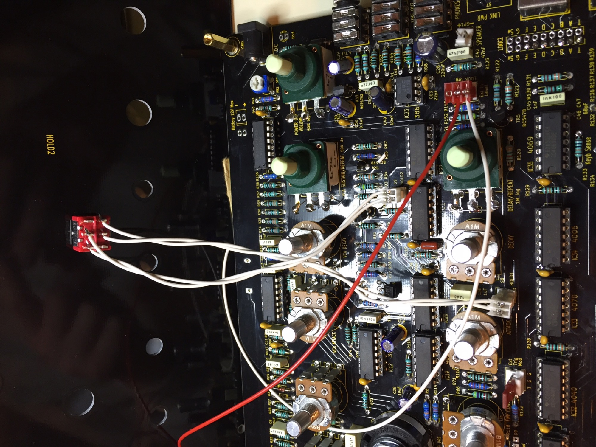
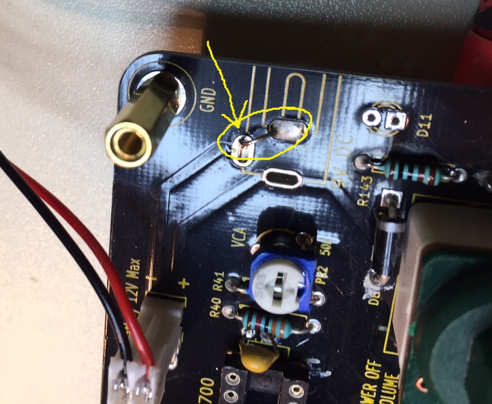
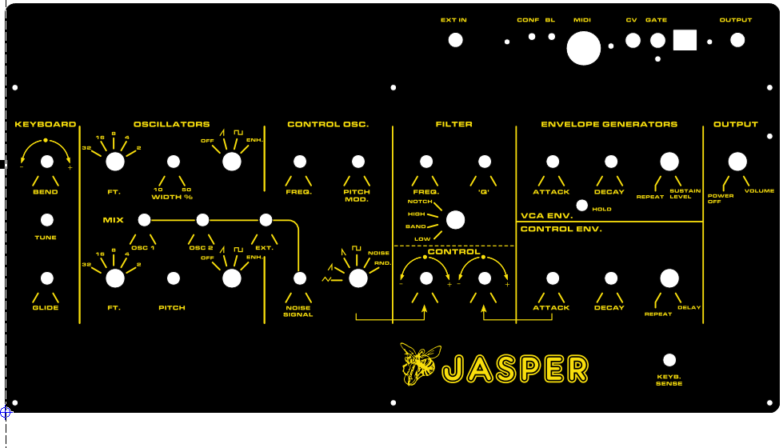
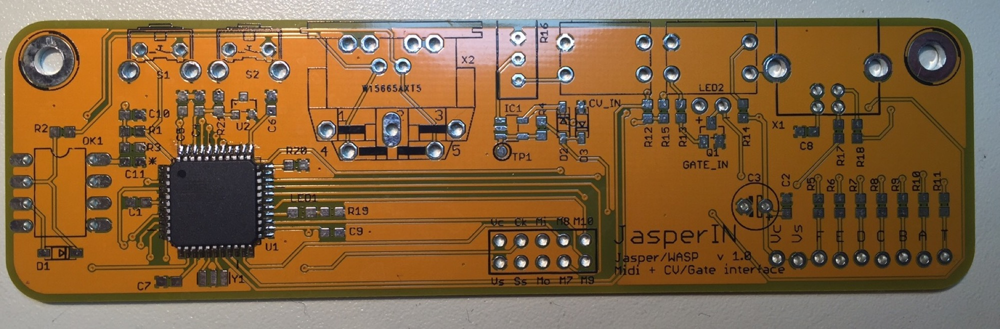
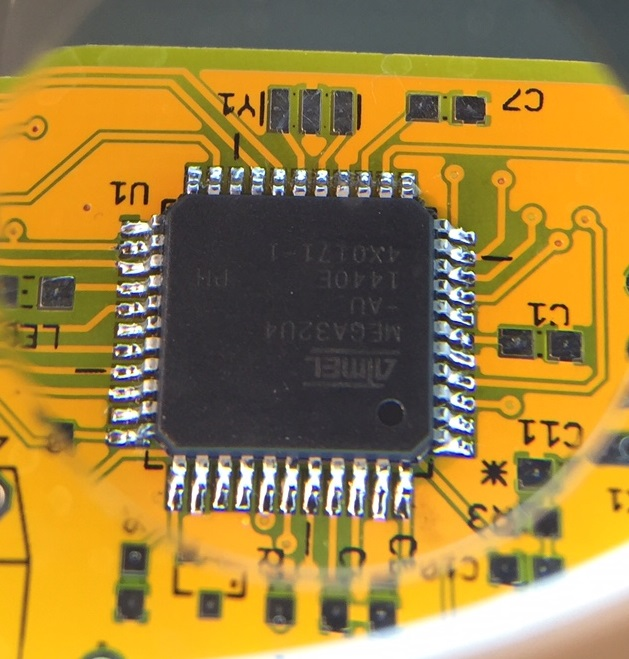
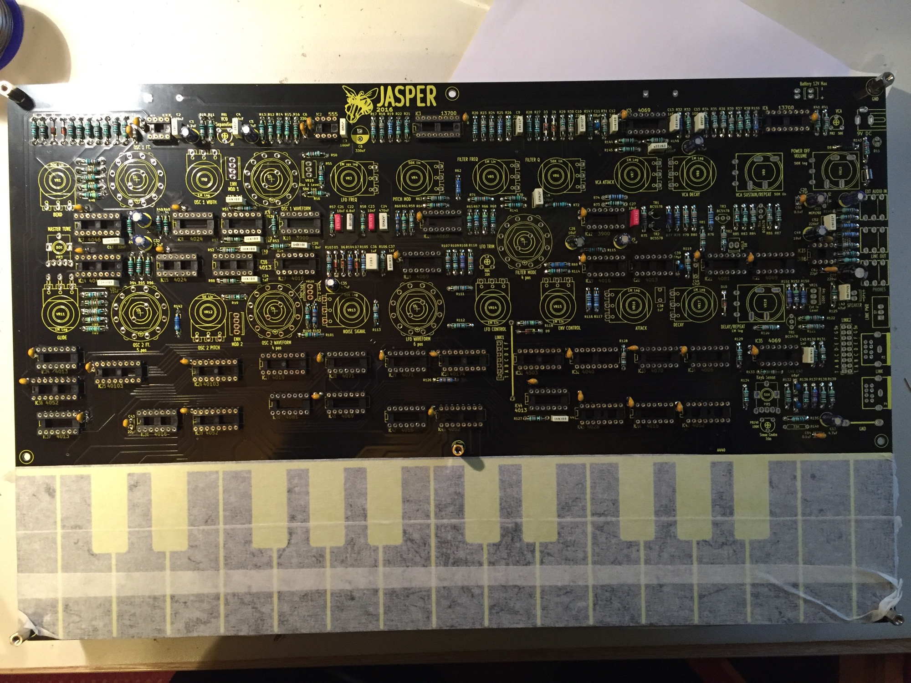
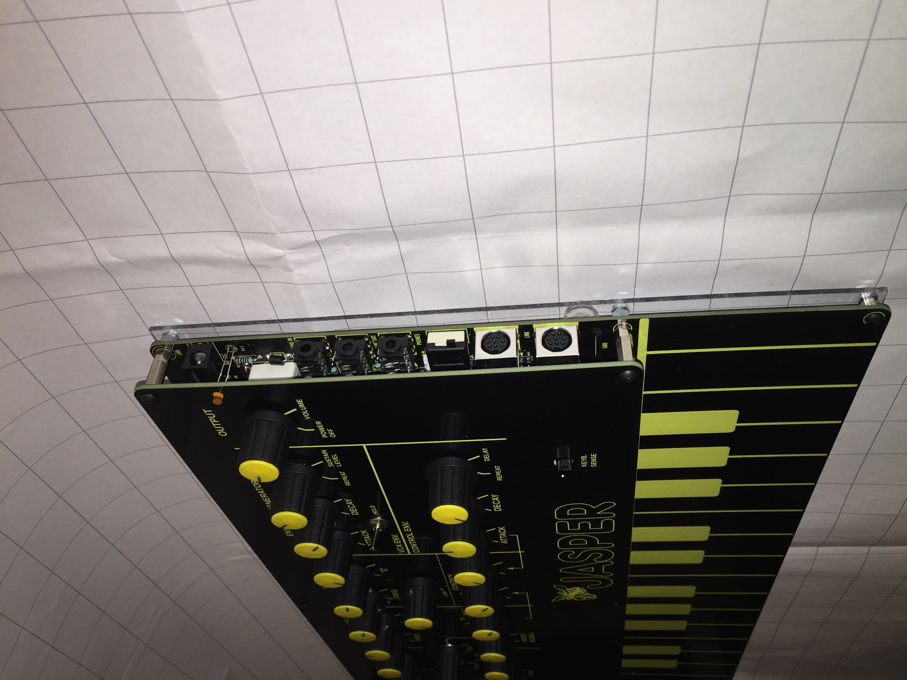
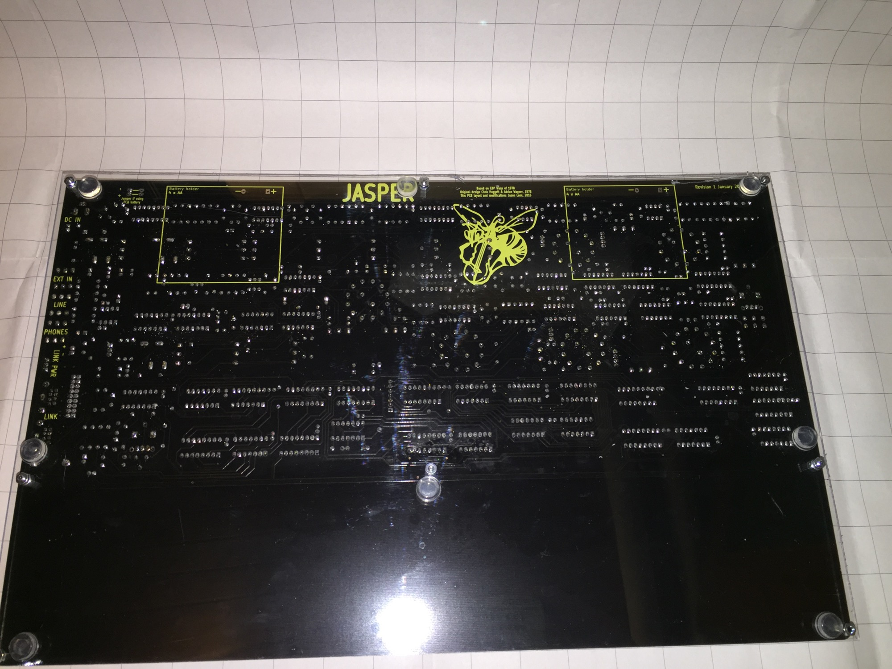
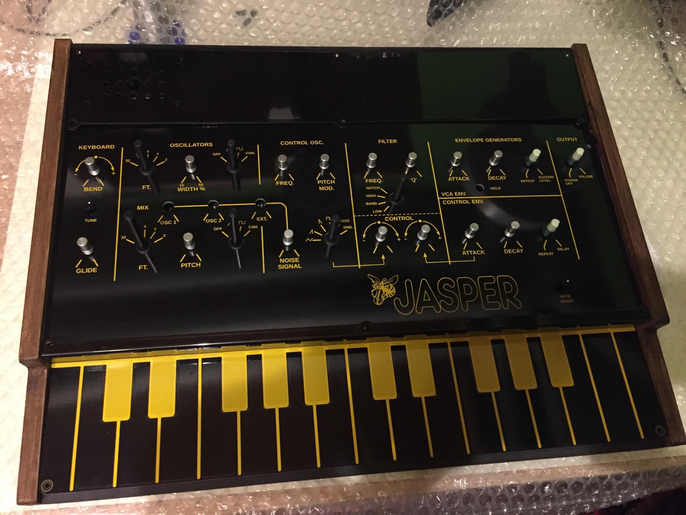
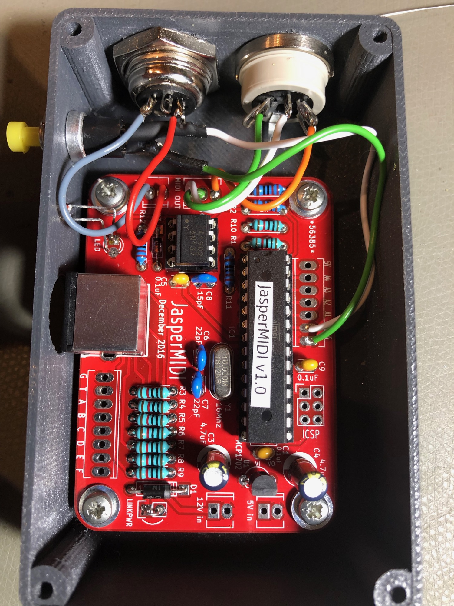

# Jasper Wasp Clone

> **Project**
>
> ### Projecttitel:Jasper Wasp Clone
>
> ### Status: `finished`
>
> ### Startdate: 01 March 2016
>
> ### Duedate: May 2016
>
> **updated March 12/2019**
>
> ### Manufacture link: [https://www.muffwiggler.com/forum/viewtopic.php?t=151625](https://www.muffwiggler.com/forum/viewtopic.php?t=151625)

> **Sale**
>
> if you looking for a assembled device, please [contact me](mailto:patrick@dsl-man.de)

**Page Contents:**

## Info

**Order Thread:** [https://www.muffwiggler.com/forum/viewtopic.php?t=151625&start=450](https://www.muffwiggler.com/forum/viewtopic.php?t=151625&start=450)

**Info from Muffs:**

Apart from the CD4006 in the noise circuit it uses easily available components - all the ICs are new TI parts available from Mouser or Farnell. The 3080s in the original are replaced with a pair of LM13700s.
The transistors are BC547 and BC557. The rotary switches are normal Alpha 2x6 PCB pin switches, the normal pots are 16mm Alpha vertical pots from (MusikDing or Smallbear) with the pins straightened to match the height of the switched pots and rotary switches. The switched pots are Omeg ECO16 types available from CPC/Rapid/Conrad. All the controls are mounted on the top side of the PCB.
Cliff stereo 3.5mm audio jacks, and 8pin mini-DIN sockets for the Link port, and a 2.1mm DC jack are soldered onto the right hand side of the PCB.

Electronically it's almost identical to the original Wasp, but I had to change some component values for it to work with 1M potentiometers (the original used a number of 2M2 pots - not common now). Also the keyboard sense circuit had to be altered to make it work with a new TI CD4069 chip. There are some extra decoupling caps on some of the ICs and LM386. It also uses an MCP1702-5002 LDO voltage regulator in order to work even longer on batteries. Without the speaker active, it draws about 30-40mA, and about 120mA when driving a speaker.

There are a few extras on the PCB:
Notch filter setting. There are a pair of unused CD4069 units in the filter I used to implement a notch filter, like Juergen Haible's Wasp filter clone.
Buffered audio input. This uses a pair of unused CD4069 units on the right hand side to implement a buffer with variable gain that can be mixed with the two oscillators and noise.
Oscillator volume pot headers - like the Wasp deluxe. These fit via flying wires to the panel, or can be jumpered as on my prototype.
'Enhanced' waveform option headers: like the Gnat. This is a PWMed pulse wave with a fixed LFO made using a single 4069. Two of these are on a small PCB, and connect with flying wires to the main board. I'm awaiting delivery of this prototype PCB. The headers for this are kludged onto my prototype board, but are included if I make another set of boards.
Two 4x AA battery holders with PCB pins can be attached underneath the PCB. Intended for use with 8x NiMh batteries.

The Link port is implemented using 8pin mini-DIN cables and sockets. These are easily available, and save confusing Link with MIDI. I made an option of using the spare wire to carry power - so Jasper can power other devices using the Link port.

I've got an unfinished control panel and bottom plate in a CAD program - haven't decided whether to use an aluminium panel, or use laser etched/cut wood or acrylic. The PCB should work OK in different styles of enclosure - it is 250mm x 398mm.

There's no MIDI on the PCB - but it should be straightforward enough to make a simple MIDI-Link controller using a microcontroller.

## BOM

OLD Version: [Jasper BOM.pdf](assets/Jasper-BOM.pdf)  (version 1 **until** July 2016)

[Jasper v2 BOM.pdf](assets/Jasper-v2-BOM.pdf) (version 2 rollout July 2017= with embedded Enhanced Mode function,)

[Jasper Enhanced Mode PCB.pdf](assets/Jasper-Enhanced-Mode-PCB.pdf) was needed only in first revision (with yellow style keybed instead of orange) there was a separate PCB in the kit.

NOTE: R172 must 1K instead of 68k !! R171 must be changed to 68K by usage of the VCO Mixer pots !!

notice:      4M7 for LFO timing. Use a 5% carbon resistor here, so there is some minor variation in modulation between the two modules.

Important for rev.2+3+4: please read !

[ExtTrigMod note.pdf](assets/ExtTrigMod-note.pdf)

If you do not wish to use the external trigger at all, simply solder the cathode lead (with the line) to the square pad on the right, closest to the label D9. You can leave out R172 and the Ext Trig Mod header.

## Build guides:

Build Thread:  [https://www.muffwiggler.com/forum/viewtopic.php?t=157937](https://www.muffwiggler.com/forum/viewtopic.php?t=157937)

Build Guide old:  [Jasper Construction Guide.pdf](assets/Jasper-Construction-Guide.pdf) (version 1)

Build Guide rev.2 [Jasper2 Construction Guide.pdf](assets/Jasper2-Construction-Guide.pdf) (updated in Aug.2016)

[Jasper-4th-run-PCB-note-1.pdf](assets/Jasper-4th-run-PCB-note-1.pdf)  – Output-jacks

[JasperMIDI-Construction-Guide.pdf](assets/JasperMIDI-Construction-Guide.pdf)

## Schematics:

[jasperMidiSchematic.pdf](assets/jasperMidiSchematic.pdf)

[Jasper-v2-2-Schematic.pdf](assets/Jasper-v2-2-Schematic.pdf)

## LFO MOD:**for C36 instead of 1uf**

1. original 1uF LFO speed  - its very fast
2. slow 10uF LFO speed  - check tme.eu or mouser for 10uF electrolyte bipolar capacitor
you can use a switch ..

## workaround instead of a Case:

use a acryl plate for bottom,

planned are sidepanels avaible on muffwiggler jasper thread

[Jasper PCB and Panel Measurements.pdf](assets/Jasper-PCB-and-Panel-Measurements.pdf)

## Build notice:

not shown:  mount all trimmers from the bottom side - this save time and is easier - because its time intensive top open the jasper when the panel is mounted.

Hold switches:

(solder the BC547/557 flat - close to the pcb - otherwise a switch wont fit)

## External Metal case usage:

i prefer the Usage of 2x 6,3mm jacks for output at the rear, further the external trigger, MIDI, CV connection and Power Input jack

for Power Input run a cable from the MTA100 header to a DC connector, bridge as shown on the pcb the connection.

### Frontpanel with MIDI-CV board option

new Frontpanel (Frontpanel express /Frontpanel designer Schaeffer)

thanks to: **mbroers** from Muffwiggler.com/forum

[jasper\_01\_wart.fpd](assets/jasper_01_wart.fpd)

## Midi and CV Mod: (not preferred to use this Version - better to use Jasons Midi Interface)

i ordered on muffwiggler the CV-MIDI board (unassembled)  [https://www.muffwiggler.com/forum/viewtopic.php?t=172630&start=0&postdays=0&postorder=asc](https://www.muffwiggler.com/forum/viewtopic.php?t=172630&start=0&postdays=0&postorder=asc)

**BOM**: [https://docs.google.com/spreadsheets/d/1QKysy6yEmX6xeVm8s9hNUjck0YvDYJ8n7AZGtjl4MWU/edit?usp=sharing](https://docs.google.com/spreadsheets/d/1QKysy6yEmX6xeVm8s9hNUjck0YvDYJ8n7AZGtjl4MWU/edit?usp=sharing)

**Mouser BOM:** [http://www.mouser.com/ProjectManager/ProjectDetail.aspx?AccessID=0d6a696eb2](http://www.mouser.com/ProjectManager/ProjectDetail.aspx?AccessID=0d6a696eb2)

Panel holes file: [JasperINPanel\_Holes.eps](assets/JasperINPanel_Holes.eps)

**Panel hole file as png:**   

**Firmware**: [http://misw.us/jasperin/JasperIN.v0.09.zip](http://misw.us/jasperin/JasperIN.v0.09.zip) (March 2017)

You need teensy loader: [https://www.pjrc.com/teensy/loader.html](https://www.pjrc.com/teensy/loader.html)

Simply open the app, load the hex file, set it to auto, and plug in the Jasperin interface via USB. The code will upload and the yellow LED will come on indicating that it is down. The jasperin is powered by the synth only, it does not power from the USB so it has to be plugged in to the LINK port

> **Info**
>
> **for pre-assembled or pcb with soldered ARM chip :**
>
> Yes, you will need to flash them with the firmware, it should be pretty straight forward.
> The chips already have the halfkay(teensy bootloader), so you just need to flash the firmware by USB.
>
> The JasperIN needs to be installed and the Jasper powered for this to work, the board is powered by the Jasper, not by USB.
>
> Download the Teensy Loader for your OS from here:
> [https://www.pjrc.com/teensy/loader.html](https://www.pjrc.com/teensy/loader.html)
>
> Download the firmware:
> [http://misw.us/jasperin/JasperIN.v0.09.zip](http://misw.us/jasperin/JasperIN.v0.09.zip)
>
> Just load the firmware into the Teensy Loader, some usb controllers auto detect the teensy and put it in bootloader mode automatically, if it does not do that, just press the switch closest to the DIN socket.
>
> More details on how to configure midi channel, etc
> [https://www.muffwiggler.com/forum/viewtopic.php?t=172630&start=0](https://www.muffwiggler.com/forum/viewtopic.php?t=172630&start=0)

> **Info**
>
> **Usermanual- Configuration**
>
> The CV/gate jacks need to be unplugged while you configure the JasperIN.
>
> 1. - Configuration mode (Switch S1)
>   Puts the JasperIN in configuration mode for configuration of the channel and CV input range
>
>   Midi Channel Configuration:
>   1) Press the learn button to put the JasperIn into configuration mode
>   2) Send one midi note in the midi channel you want to set the JasperIN to respond to
>
>   CV range configuration:
>   1) Press the learn button to put the JasperIn into configuration mode
>   2) To configure the CV input range, send one midi note in the octave listed in the following table:
>   |   |
>   |---|
>   | **Code:** |
>   | Midi Note # \| Octave \| Range 0 to 11    \|   -2   \| 0.083v-3v 12 to 23    \|   -1   \| 1.083v-4v 24 to 35    \|    0   \| 2.083v-5v &gt;35      \|   Any  \| 3.083v-6v |
> 2. **new instruction for setup the CV volatge**
>   - Unplug CV/Gate cables
>   - Press S1. The JasperIN is in learning/config mode
>   - Send C-1 (1 octave below C0) MIDI note in the MIDI channel you want the Jasper to respond. This will configure the CV range to be 1.083v to 4v
>   - Plug the CV/Gate cables back
>   - Feed 2V to the CV
>   - Adjust the trimmer until you get 1V at TP1
> 3. - Teensy bootloader mode (Switch S2)
>   Puts the JasperIN in bootloader mode for firmware updates
>
>   The USB port is currently used for uploading the code only.

**rev 1 version**:

**rev.1 pcb**

  

  

