# JSISYNTH PROGUE

> **Project**
>
> ### Projecttitel: Progue
>
> ### Status: `finished`
>
> ### Startdate: 02/2021
>
> ### Duedate: 03/2021
>
> ### Manufacture link: [https://jsisynth.com/products.html](https://jsisynth.com/products.html)

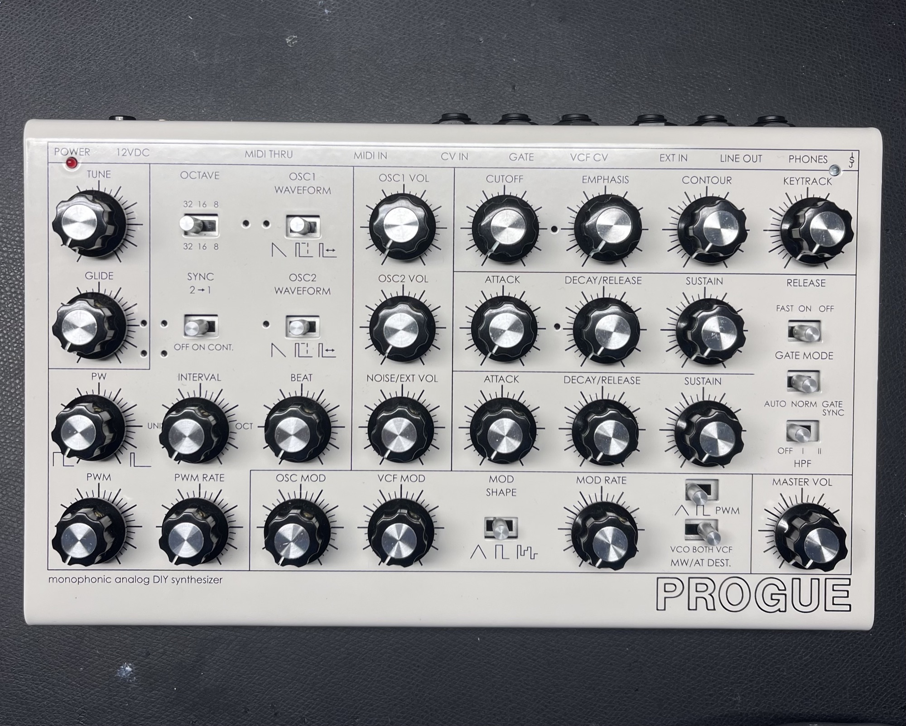

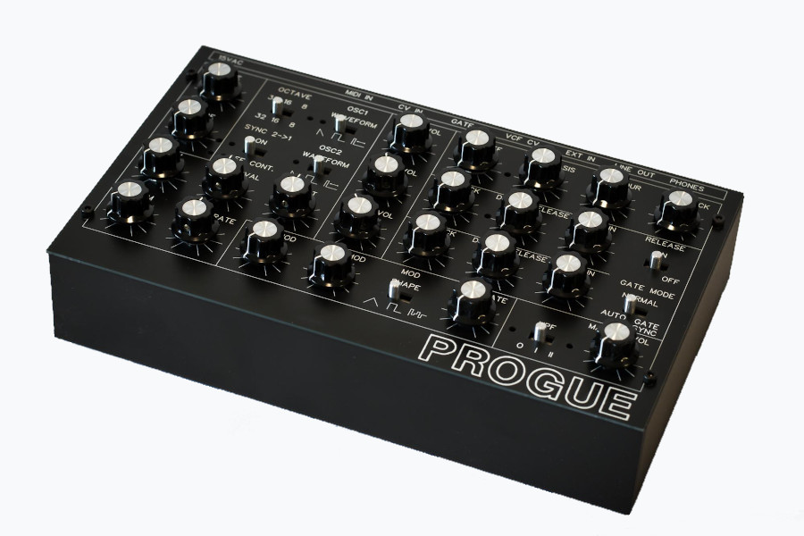

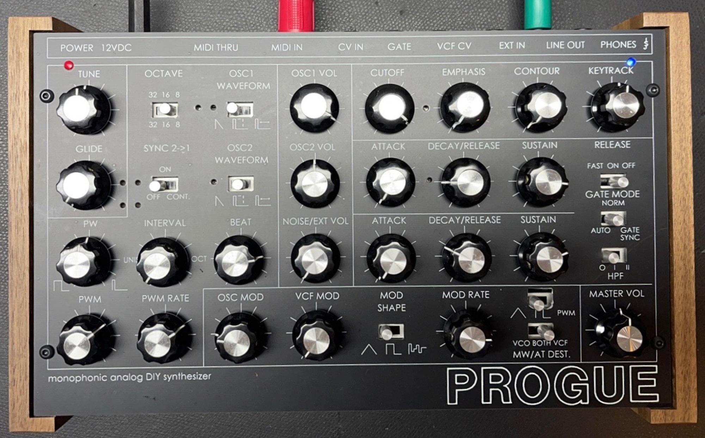

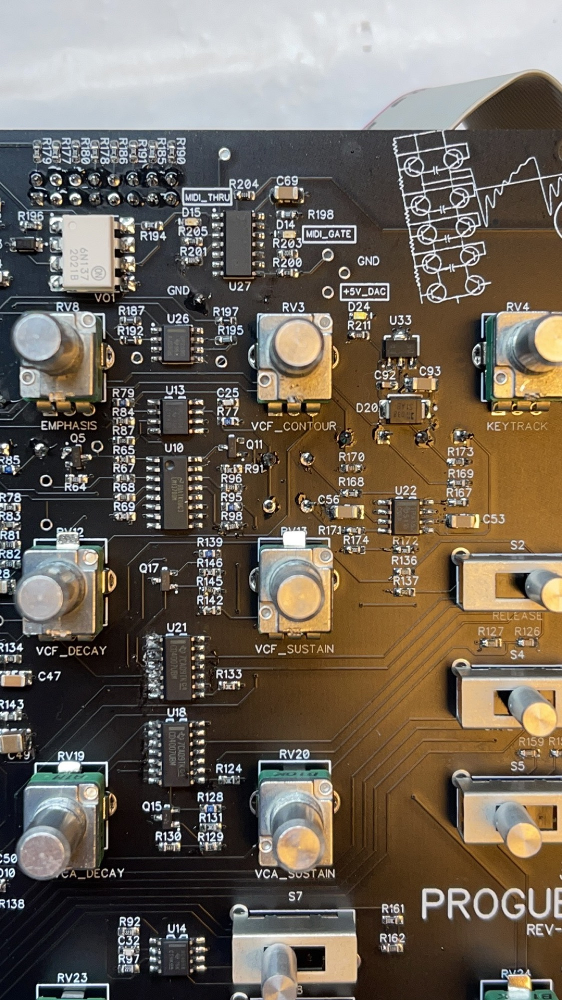

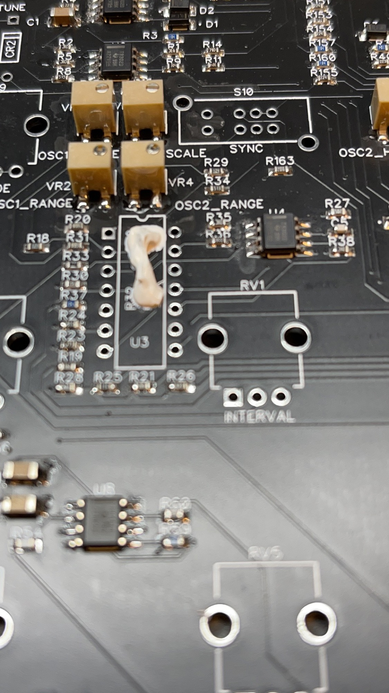

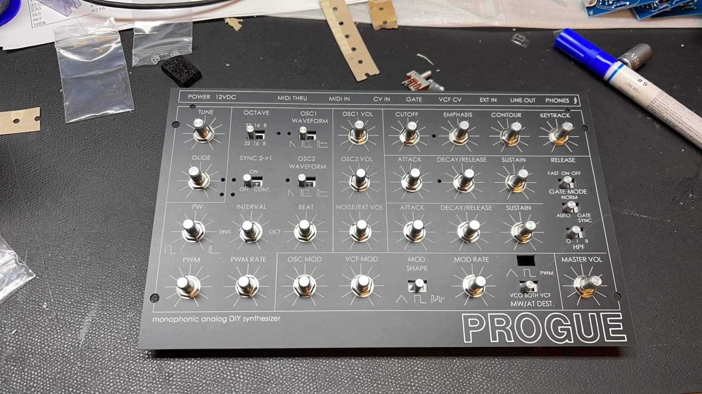

## Description

PROGUE is a monophonic analog DIY synthesizer inspired by the two well-known vintage synthesizers: ROGUE and PRODIGY. While both of them had their pros and cons, the goal with the PROGUE was to combine their best qualities into a single portable tabletop synthesizer.

The prime focus was maintaining those specific sound characteristics that still makes them desirable today and to add some of the features we always thought they lacked.

From independently modulated PWM and Oscillator Gate Sync to passive High-Pass Filter and precise Fine-tuning of the Oscillators, PROGUE delivers it all without forgetting the modern self-evident functionalities like Polychain via MIDI.

## Specs: (click to expand)

Specifications

OSCILLATORS

- Two discrete oscillators with Sawtooth and Pulse waveforms
- Pulse width and pulse width modulation
- Hard sync: OSC2 to OSC1 with envelope control
- Oscillators can be synced to Gate
- OSC2 tuning: Interval and Beat (fine) amount
- Pink noise generator

MIXER

- OSC1 amount
- OSC2 amount
- Noise / External input amount

FILTERS

- Four-pole (24db/oct) transistor ladder Low Pass Filter with resonant control
- LPF can be driven to self-oscillation
- Keyboard tracking amount
- Independent passive High Pass Filter

ENVELOPES

- Two ADS style envelopes for LPF and VCA

LFO / SAMPLE & HOLD

- Triangle, Square and random waveforms
- Rate, OSC amount, VCF amount
- Midi modwheel / aftertouch to VCF / VCA / both

MIDI

- Built-in 16-bit Midi to CV converter with 2 channel DAC
- 1V/OCT and MOD amount (via mod wheel or aftertouch)
- Poly-chain (for max. 5 units)

IN/OUT

- Mono output (1/4" phone jack)
- Headphones output (1/4" stereo phone jack)
- Mono external input (1/4" phone jack)
- CV input (1/4" phone jack)
- GATE input (1/4" phone jack)
- VCF CV input (1/4" phone jack)
- Midi input and thru (5-pin DIN)

POWER

- 12VDC (0.35A) power adapter (2.1mm DC jack)

DIMENSIONS

- Enclosure 10" x 6" x 2" (254mm x 152.4mm x 50.8mm)

## BOM:

[PROGUE-REV-A-BOM.pdf](assets/PROGUE-REV-A-BOM.pdf) (last version February 2020)

Digikey: [https://www.digikey.fi/short/4720z1](https://www.digikey.fi/short/4720z1)

[https://www.mouser.fi/ProjectManager/ProjectDetail.aspx?AccessID=ee29d19e63](https://www.mouser.fi/ProjectManager/ProjectDetail.aspx?AccessID=ee29d19e63)

make sure you order the Tempcos from Digi-Key : ERA-V33J101V‎

and order the case from Digi-Key or mouse, see above BOM (pdf)

[https://electricdruid.net/product/noise-1b-noise-generator/](https://l.facebook.com/l.php?u=https%3A%2F%2Felectricdruid.net%2Fproduct%2Fnoise-1b-noise-generator%2F%3Ffbclid%3DIwAR2vsj-Hbk78AWs9Uf_hUqQnPx8KQ8UdovAeeLWxkPM96CsfqNTiYT9ORgk&h=AT0EOhUIg3Pu40xLl-vWSR7V4NyNPfeldRaVCdRemDfyvdBL3rKtDf15--feqcUS7mlDATP3hbpf3iZd1dNq2bXjxQ4kdjqVCyuQ8rmTvlkgHctjT39T2py-l9lnlLrErNewGBv2KEg)

`the ribbon cable is pretty expensive, so if you like to make your own, just switch the pre-made in mouser cart to FM connectors 2x17 (34)`

`LM393D should be 511-LM393ADT`

`alpha 9mm not in card available from UK-elektronik`
`2x C1M`
`1x C50K`

## Guide:

| ID | date | issue | solution | fixed in production version |
|---|---|---|---|---|
| 1 | 26.1.2021 | info- ribbon cable | its cheaper 15cm is fine NEVER use Floppy disk cables - this are not 1:1 pin assigned |   |
| 2 | INFO | ic pin out | DAC and LDO is upside down, all other pin1 top-left or check dadatsheet |   |
| 3 |   | C95A is C15A1 C95B is C15B1 on pcbs |   | ✅ |
| 4 | 26.1 | bom change (last version is A) | R210 was 1k5 now 1k (SMT led resistor) C95a1 and C95b1 changed to: C95A and C95B added one dip8 socket to bom | ✅ |
| 5 | 26.1 | install S7 at the end of the build - for **prototype version only !!!** |   | ✅ |
| 6 | 06.02-2021 | check that no traces are under the slide switch tabs, and check for traces under the potentiometer tabs. | bend or cut them. ( Janne agreed that he change the pcb - production run don't have traces under the switch tabs and pot tabs) | unknown |

## My Build:

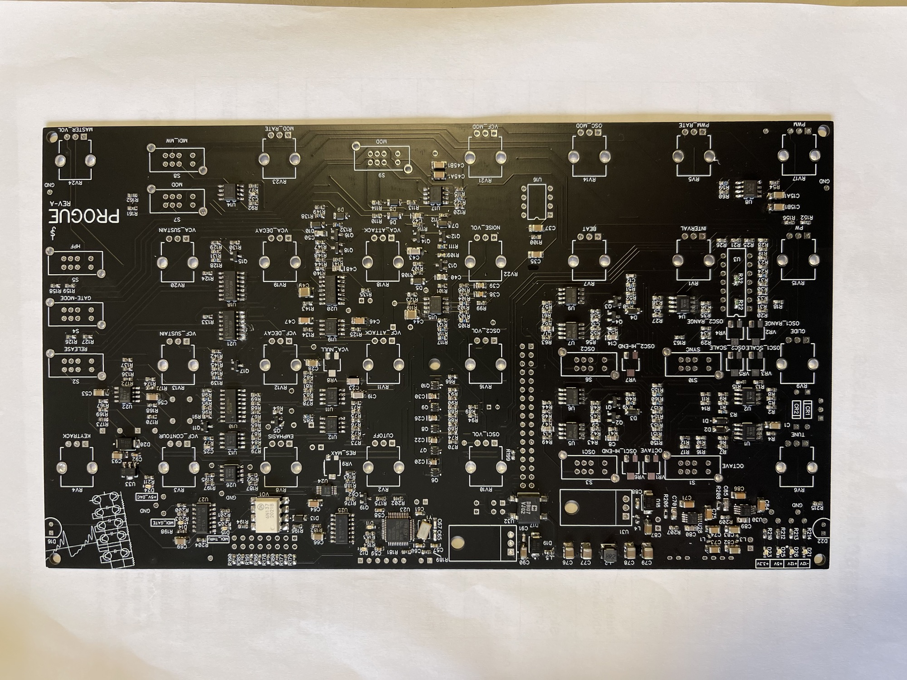

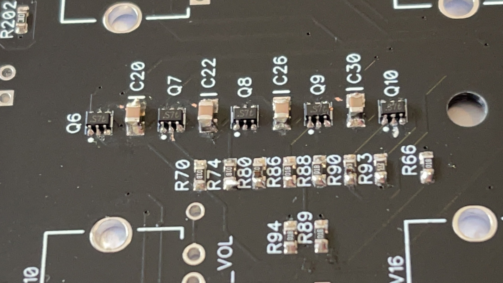

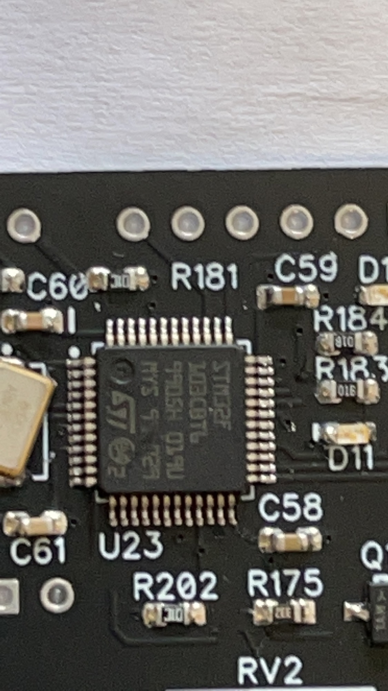

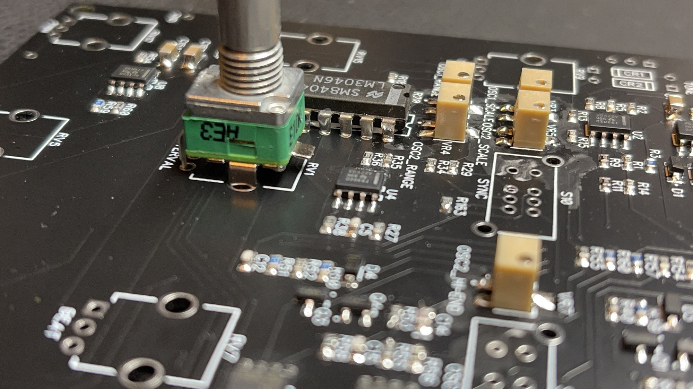

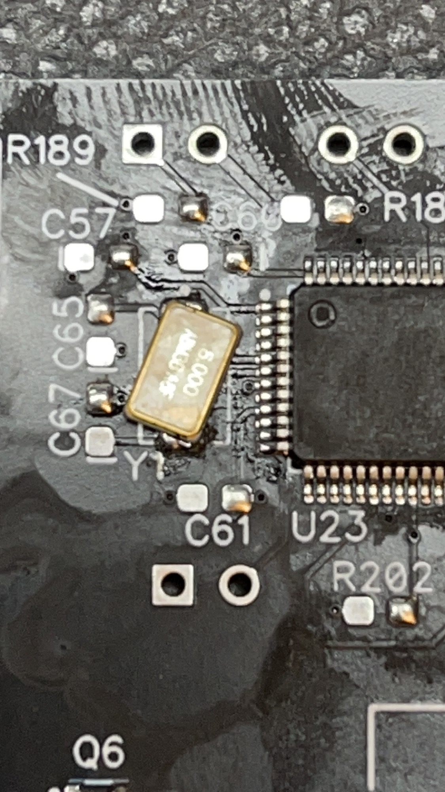

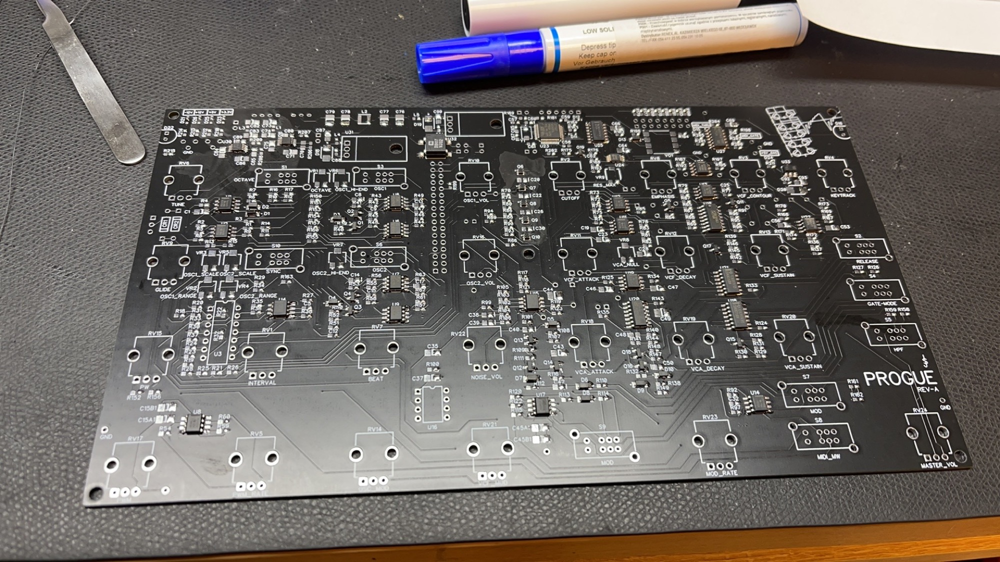

