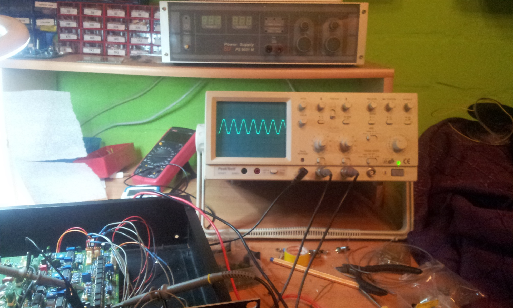
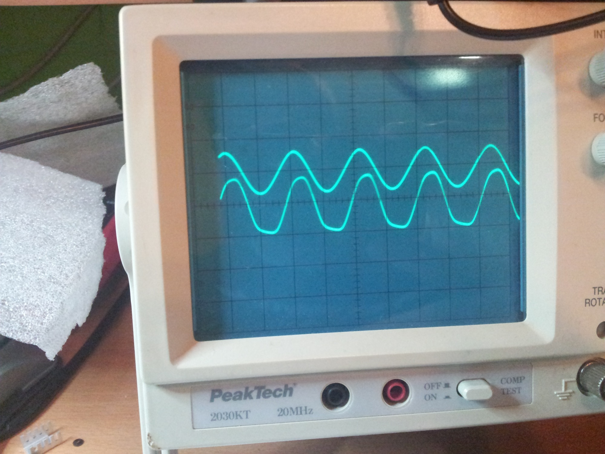
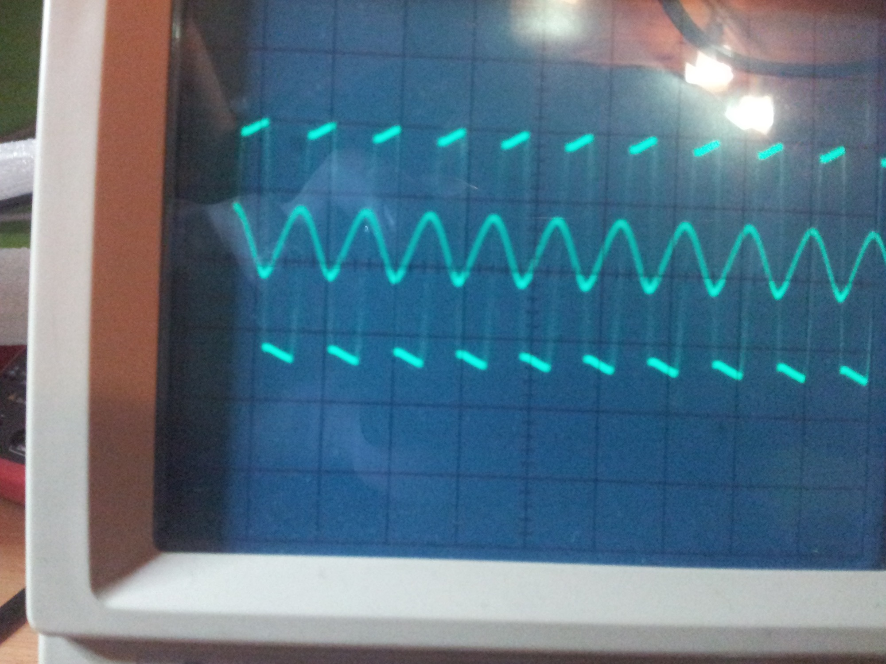
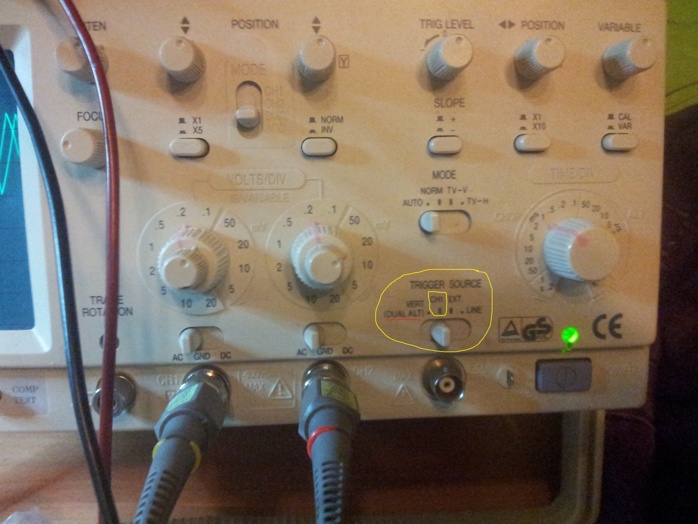
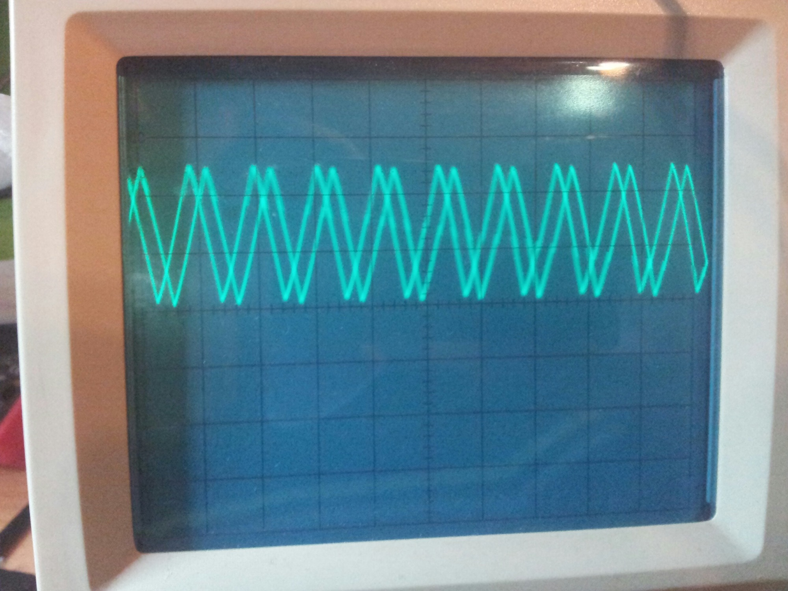
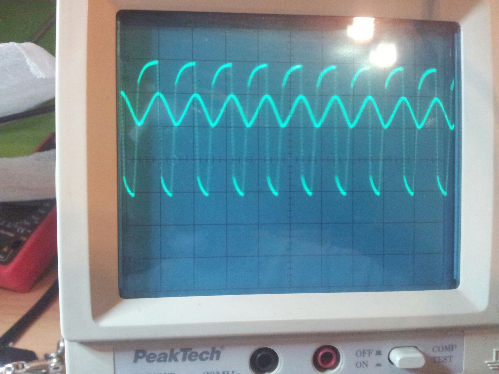
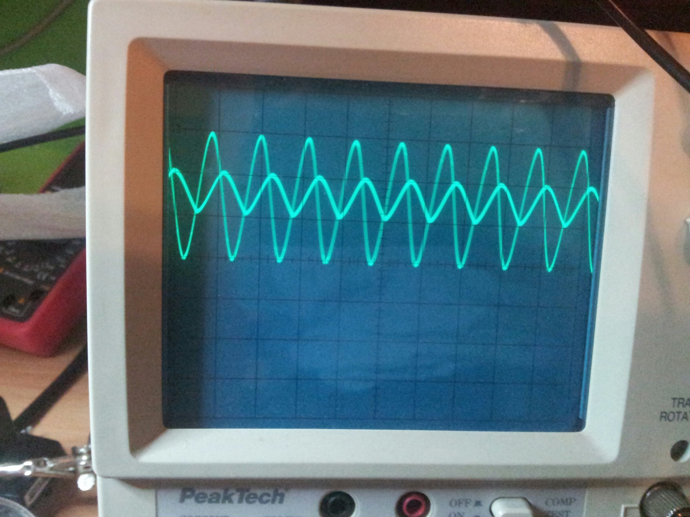

# issuehandling

schematics can fins on [Jürgen Haible FS1a Frequency Shifter](../index.md)

# I**ssue 1.**

after finishing the psu and connecting all potis,jacks.

i got in **calibration process 1** a fine TrIangle waveform but without 90degrees phasedifferent.

(dualoscilloskop and separate frequency counter)

by usage the OSC BAL trimpot - i was able to get 2 identical triangle waveforms - but no 90degrees from eachother.

**calibration process 1** picture  click to enlarge:

Issue -**calibrating process 2:**  failure - no 90degrees different (at 1khz)

after this i tried

racing the signal along the VCO structure:(U9, pin 7 is listed twice)
 U8, pin 7: triangle. (You have that.)----yes was a triangle
 U9, pin 7: triangle - yes is a triangle (U9 pin7)
 U9, pin 1: square wave - yes  - but its very unsharp

(at u9 a  other new TL072 same result)

so i tried to exchange some resistors described at em forum

em: [http://electro-music.com/forum/topic-18587-100.html](http://electro-music.com/forum/topic-18587-100.html)

[http://electro-music.com/forum/viewtopic.php?t=18587&postorder=asc&start=375](http://electro-music.com/forum/viewtopic.php?t=18587&postorder=asc&start=375)

I've taken the board out, and have gone over it. No wrong resistors. Bear in mind that this is a copy of Dave Brown's build (and using his BOM), so there are some resistor changes - specifically R2 changed from 51K to 36K, and R51 is changed from 430 to 51K. There is also a 36K resistor added at pin 6 of U1. Would any of these make this effect? (Feel free to chime in, Dave, if you had a similar problem - probably not though)

- R51 muss 51K sein statt 430ohm   - here its better to use a trimpot 100k and test value above 10K-100K
- R2 51k zu 36K
- 36K  U1 pin6

after this i get this:

(by usage of the sin sharp trimpot - i cannot trim the " waveform like square" to a sin wave.. and its not 90degrees different.

**Troubleshooting: 04.09.13**

**todo:**

issue: same triangle at step 1.

test oscilloscope setting for trigger - maybe a triggersetting issue

test:

at U8 pin 1 - must have a triangle COS

at U8 pin 7 - must have a triangle SIN

both must have 90degree !

**result:**

after checking my oscilloscope settings i found out, its my fault - the channeltrigger settings was set to "dual", needed is here single 1channel..

later i changed back the resistor R51 (board1)  ( origin 430ohm, )  to 330ohm so i have a same amplitude..

**here correct Oscilloscope settings** (click to enlarge)

**correct result step1**: fine

**Step 2 measurement -  before R51 changed to 330ohm  i used 51K (electro-music-thread -info, was wrong in my case)**

**Step2  after changing to 330Ohm is like this:**  fine

# Issue 2:

if you got this or this with 90degrees and you use a external PSU (MOTM,dotcom header)

AND you have the internal psu parts soldered, remove the internal powersupply parts (its only need to extract both LM317, D1,D2,D3,D4,D5, R1, R6, on board 2)

**or you get this on Step 2.. attention to bottom**

