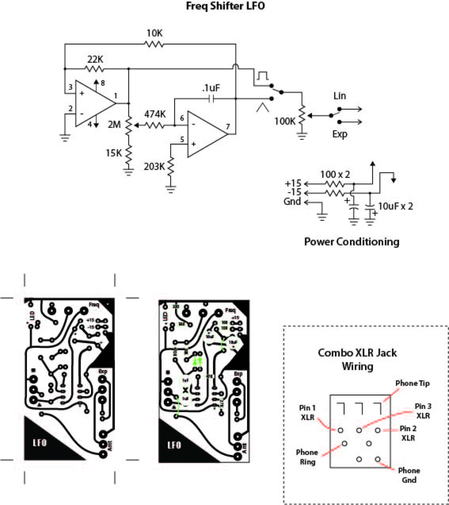
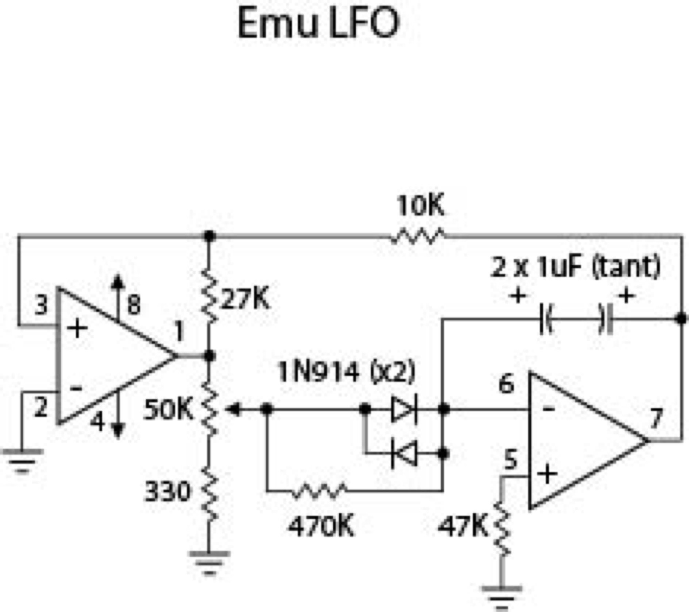
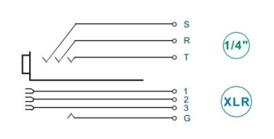
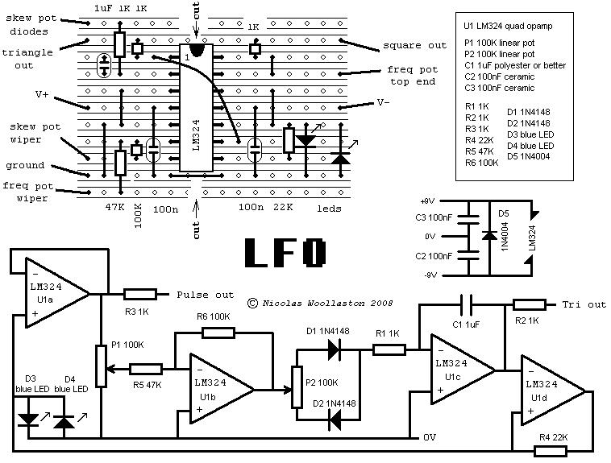

# Juergen Haible Frequency Shifter Fs1a Modifications

Its needed to use a LFO with square and triangle for modulations.

my choice its a oakleysound.com simple LFO.

**copy from oakleysound.com:**

"This is an updated version of the low frequency oscillator from a classic Japanese vintage analogue synthesiser. It features two output waveforms, triangle and pulse. But, the design also incoroporates a 'Shape' control that affects the rise and fall times of the triangle waveform, and mark-space ratio of the pulse waveform. Therefore, you can get sawtooth and reverse sawtooth from the triangle output by using the Shape control.

The Little LFO uses an integrated dual SPDT FET switch to enhance the Korg design. It also allows the use of waveform synchronisation. This is where the output waveform is reset back to zero when a SYNC pulse arrives from another module. If this SYNC pulse is the GATE output of a midi-CV convertor, then you can use the Little LFO as a linear repeating envelope generator.

A range switch may also be fitted to allow even lower frequencies to be made."

**Building Guide:**

(i remove the sync input - R8, R13, C5, D1)

[lfo6-bg.pdf](assets/lfo6-bg.pdf)

**Possible Modifications:**

[DJB-Frequency Shifter schematic mods.pdf](assets/DJB-Frequency-Shifter-schematic-mods.pdf)

[Freq Shifter LFO.ai](assets/Freq-Shifter-LFO.ai)

[E-MU LFO.ai](assets/E-MU-LFO.ai)

**Own Modifications:**

- Aux-in to switch - 50k resistor to reduce the internal sound (only in use with no jack in aux-in)
- resistor R43 change value from 430 to 330ohm
- LFO dont have a sync Input
- NCJ-5FIS Combo-Einbaubuchse 6,3mm, Klinke, XLR-Buchse

