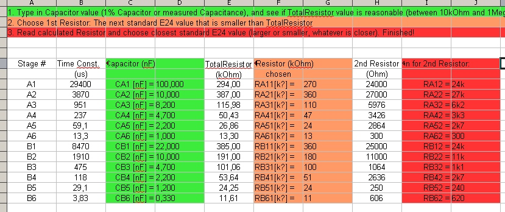
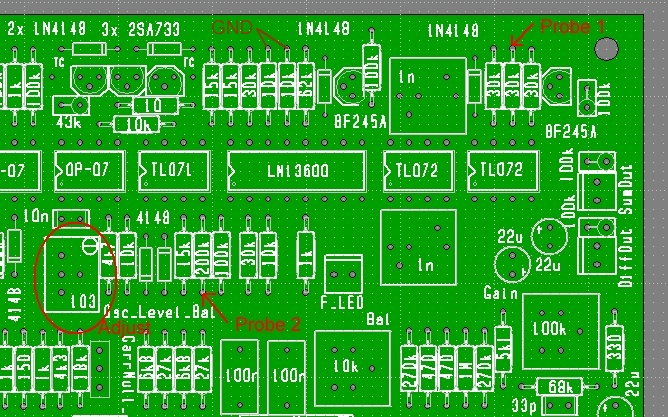
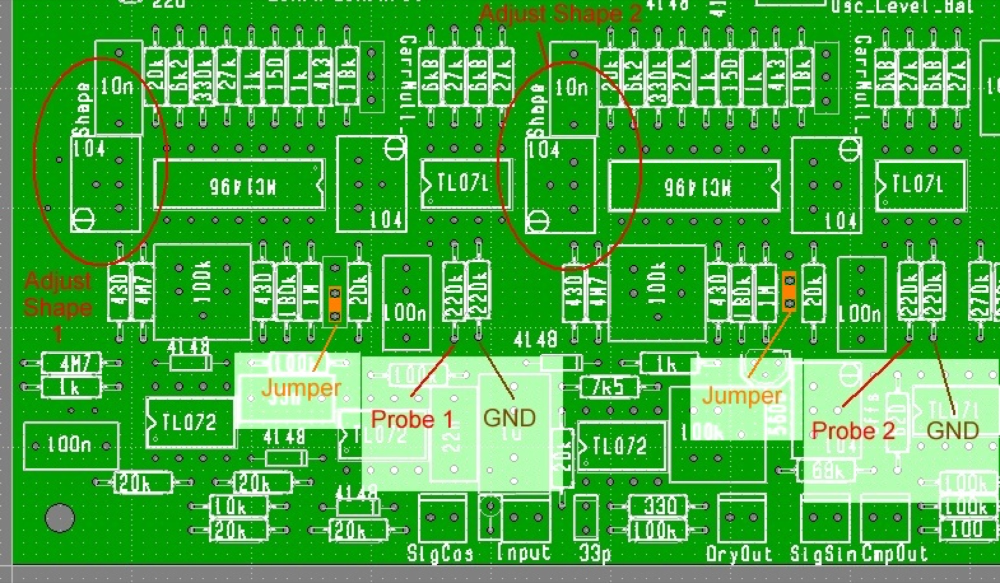
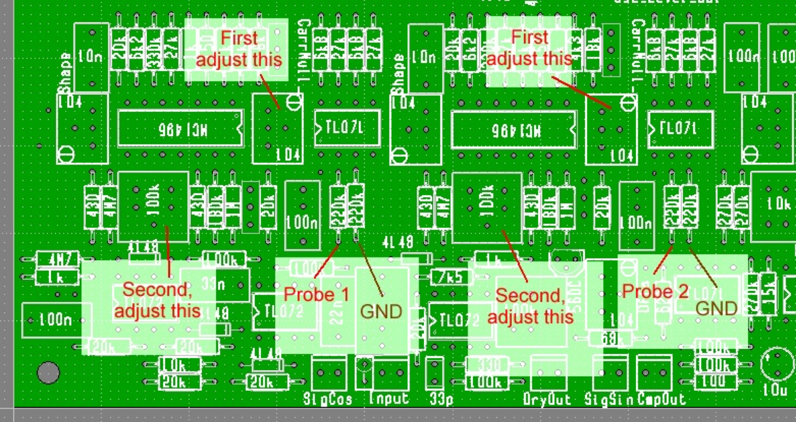
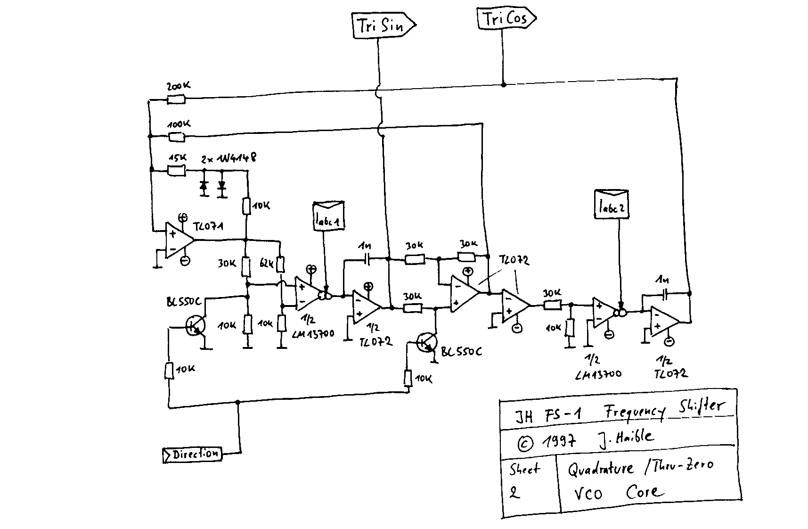
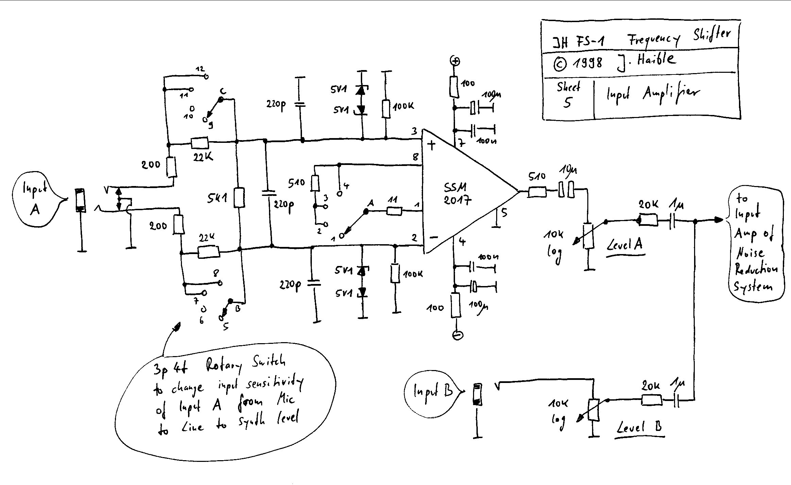

# Juergen Haible fs1a - additional tech

- schematics can fins on [Jürgen Haible FS1a Frequency Shifter](../index.md)

**Copy from j.haibles website**:

"I built this on Veroboard, and I was very pleased with the results.
 I've chosen a slightly different approach than the famous Moog / Bode model: Instead of using a beat-frequency oscillator, I implemented a linear and exponential-controlled Quadrature-Thru-Zero VCO directly. This covers the whole audio range, and (anlike the Moog / Bode) goes down far into the sub-audio range, such that you can run it with something like 1 cycle in 10 seconds, for slow "Barberpole Phasing".
 Also, I've chosen a different approach for the noise reduction. Every Frequency shifter has to battle carrier bleed-thru. In the new version, I have implemented a second-order trimming which, beyond nulling the carrier in the output, also allows to suppress the quadratic term, which means cancelling the bleed-thru at twice the carrier frequency. Even with so much effort going into the carrier suppression, you want complete silence at the output when no input signal is present. Moog used a "Squelch" circuit for this, which is basically a noise gate, and needs manual adjustment of the threshold, depending on level and nature of the input signal. I am using a special Compander / Downward-Expander system, similar to the one found in the Roland VP330 Vocoder Plus (All opamps and OTAs, NE570 etc.!), slightly changed to fit the needs of a frequency shifter.

Now that I've started designing PCBs (Printed Circuit Boards), and quite flattered by the success of my [Tau Phaser PCB project](http://www.jhaible.heim.at/tau/jh_tau.html), I decided the Frequency Shifter would be the next in line.

The whole circuit fits on two 160mm x 100mm sized boards:
 Board 1 contains the Quadrature-Thru-Zero-VCO, the Ring Modulators, Summing Amps and Compander Circuit.
 Board 2 contains the Dome Filter, a Microphone Preamp, an extra 6-pole All Pass Filter for Barberpole Phasing, an Inverter for CV inversion, a Power Supply that only needs a transformer and fuses to be connected, as well as MOTM and Synthesizers.com system connectors for direct +/-15V power supply."

Calculating the Dome Filter components

 On the 2nd PCB, you find several components without component values printed on the board; these are grouped around the three TL074's and form the "Dome Filter", that performs an approximation of the Hilbert Transformation, to create a normal and a quadrature component from the input signal. (Labeled "SigSin" and "SigCos" on the boards.)

 First of all, there are the SIL8 resistor arrays. These contain 4 equal resistors which are tightly matched to one another. The absolute resistor value is not important: In fact you can use any value from 10k to 100k. You need 6 of these arrays. They come in a SIL8 package, and must contain 4 independent resistors. (There are also arrays that countain N-1 resistors for a SIL package with N pins, with all resistors connected to Pin 1. These are the wrong ones!)

 Next, there are the resistors and capacitors that set the time constants. As it's harder to get a certain capacitor value precisely, the idea is to choose a capacitor with roughly the right capacitance that is available, and then make a series connection of two resitors to get the precise resistor value to match the chosen capacitance.
 This may sound difficult, but it really isn't. It's just a little time consuming.
 I have made a Speadsheed to help you calculating the right component values.
 It's pre-filled with reasonable capacitor values, and shows the two resistors that are calculated fom these.
 If you can get these precise capacitor values (1% tolerance), you just have to read the resistor values like a table and use them, and finished.
 If you have different capacitor values, overwrite the pre-filled numbers and the spreadsheet will do the calculations.
 The following picture shows the standard values as a table; if you click on it, the spreadsheet opens for calculation.
 (You may have to download the spreadsheet first, depending on your system. And you either need MS Office, or the free OpenOffice program. I've been using the latter. Google for open office if you need the program; it's free.)

Note: k? means kiloOhms

 Adjustment

 This project has a lot of trimpots. Frequency shifting relies on the cancellation of two ring modulation processes, and therefore high precision is required in many ways. It is recommended to use a 2-channel oscilloscope for adjustment. Maybe you could also adjust it with a multimeter and by ear - I'll try to give you some hints in that direction -  but I haven't really tried, and I really recommend using a scope. Borrow one from a friend if you don't have one (and "borrow" the friend to help you, too, while you're at it.)

 **1st Step: Oscillator Level Adjustment**

 Connect two probes of a 2-channel scope to the two integrator outputs of the QVCO, as shown in the following picture:
 (Clip the probes to the resistor leads of the marked 30k and 200k resistors. A nearby GND connection is shown at two 10k resistors.)

Set an oscillator frequency of (roughly) 1kHz using the front panel controls for Range and Frequency.
 At Probe 1 and Probe 2 you will see two triangle waves that are 90deg out of phase with each other, and have different amplitude.
 Adjust the multiturn trimpot "Osc\_Level\_Bal" (see picture above) to get equal amplitude for the two triangle waves.

 **2nd Step: Oscillator Waveform Adjustment**

 Keep the Oscillator running at approx. 1kHz, as before.
 Insert two Jumpers at the positions marked in orange in the picture below.
 Connect Probes at 220k resistors (GND is on neigbouring 220k resistors).
 Adjust an approx. Sine waveshape with the "Shape" trimmers. (Top and Bottom of what previously was a triangle should be equally flattene.)
 (You do not need two probes for this: Simply start with adjusting the first waveshaper, then proceed to the next.
 Don't worry about different amplitudes for the two waveshapes at this point - this will be equalled out in a later step.)
  When this adjustment is completed, remove the jumpers.

**3rd Step: Oscillator Bleedthru Adjustment**

 Keep the Oscillator running at approx. 1kHz, as before.
 If you haven't done yet, remove the jumpers left from the previous adjustment.
 Keep the probes where they have been in the previous adjustment.
 Make sure that no external audio signals are connected to the PCB.
 For each of the two channels, you have to make two adjustments:
 First, adjust the 100k multiturn pot ("104", "CarrNull", see picture below) for minimum signal level at the probe.
 Increase the sensitivity of the probe - you will get the level down to just a few Millivolts.
 After you have adjusted this to a minimum, adjust the unmarked 100k single turn trimmer to further reduce the level.
 You have now adjusted the Carrier Bleedthru almost to full cancellation. The Noise Reduction System will take care of the rest.

(All right - so far I have given adjustment directions without reference designators, and therefore needed a lot of pictures to describe where the probes go, and which pots have to be adjusted. Meanwhile I have a consistent set of drawings - schemos and components on boards - with reference designators, so instead of drawing a lot of pictures, I'll just refer to component numbers and pin numbers.)

**4th Step: CV Rejection of Compander Adjustment**

 All referring to Main board (PCB 1).
 Without any audio connected to any signal input, we're now feeding a signal to the CV path of the compander. For this, temporarily attach one side of a 10k resistor to pin 6 of U14, and feed a square wave of approx 100Hz, 1Vpp to the other side of the resistor. Exact values are not critical at all. You can also feed 5Vpp via a 47k resistor instead - you get the idea.
 Now, put a probe to the CmpOut jack and adjust R106 until the signal is minimal. (It won't disappear completely, which is no problem; just minimize it.)
 In a similar way, probe SumOut jack and minimize signal with R127.
 Same procedure, probe DiffOut jack and minimize signal with R114.
 Remove the resistor and 100Hz feed from pin 6 of U14.

 **5th Step: Level adjustments**

 Locate the two 3-pin connectors (for jumpers) near Pin 14 of U10 and U12 (the two 1496 chips).
 Plug the jumper onto the two pins that are closer to the 1496 chips.
 (These jumpers will be left in permanently for using the frequency shifter - do not remove them after the adjustment.)

 With PCB 1 and PCB 2 connected together (signal goes from PCB 1 to PCB 2 via CmpOut connectors, and returns to from PCB2 to PCB 1 via SigSin and SigCos connectors, and PCB 1 getting its Input from the preamp on PCB 2), feed a signal of approx 1kHz (sine wave recommended) to the Frequency Shifter (Mic input or Aux input) and adjust the level until you get an unclipped signal of 5Vp at the DryOut connector of PCB 1.
 Then adjust R99 to get approx. 5Vp at the CmpOut connector.
 Probe SumOut and DiffOut connectors and play with the Frequency settings of the Quadrature Oscillator (Range and Manual potentiometers); see how the frequency is changed. (There may be some side effects, i.e. not a pure sine wave, at this point.)
 Adjust R123 to get approx. 5Vp on SumOut.
 Adjust R110 to get approx. 5Vp  on DiffOut.

 **6th Step: Balance**

 In the previous step, you may still have some amount of the adjacent side band in yout frequency shiftet output, which appears as a slight amplitude modulation in the frequency shifted sine wave. You can minimize this to some degree with R133 for the SumOut, and with R115 for the DiffOut.
 In practice, you probably won't hear much of it, and you cannot cancel it precisely for every amount of frequency shift, but it's a good idea to minimize it. Otherwise, just leave R133 and R115 in mod position.

 Adjustment Finished!

Quadrature VCO from **old FS** not FS1A !!!

- more addional Infos here too: [http://modularsynthesis.com/jhaible/shifter/jhshifter.htm](http://modularsynthesis.com/jhaible/shifter/jhshifter.htm)
