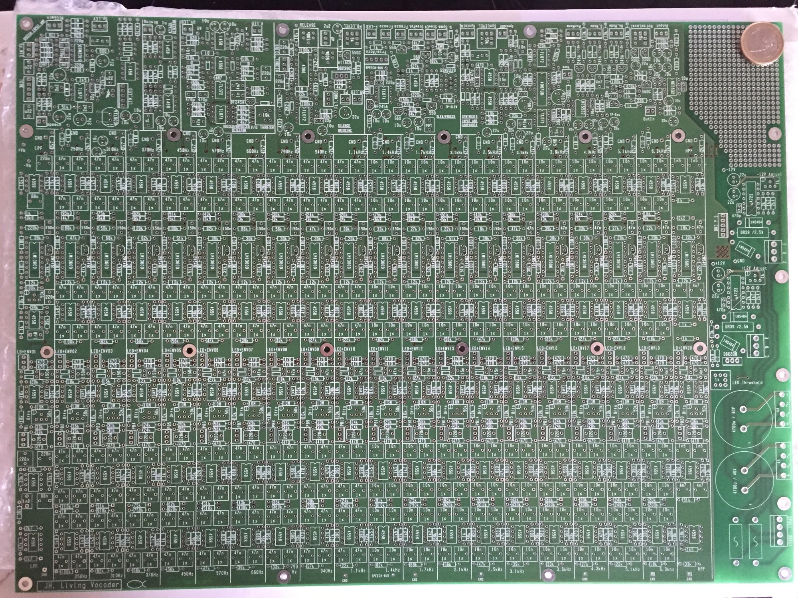

# Juergen Haible Vocoder

> **Project**
>
> ### Projecttitel:Juergen Haible Vocoder
>
> ### Status: `in build`
>
> ### Startdate: March 2016
>
> ### Duedate: July 2016
>
> ### Manufacture link: [http://jhaible.com/legacy/vocoder/living\_vocoder.html](http://jhaible.com/legacy/vocoder/living_vocoder.html)

**Muffwiggler thread:** [https://www.muffwiggler.com/forum/viewtopic.php?t=155378](https://www.muffwiggler.com/forum/viewtopic.php?t=155378)

**Em Thread:** [http://electro-music.com/forum/viewtopic.php?t=25702&postorder=asc&start=300](http://electro-music.com/forum/viewtopic.php?t=25702&postorder=asc&start=300)

> **The Filterbank funktion will have 3 modes:**
>
>  1) On
>  The Filterbank will always be mixed with the vocoded sound, acording to how you set the Filterbank sliders.
>
>  2) Off
>  Basic Vocoder function
>
>  3) Silence Bridging
>  The Filterbank function will fade in when there is no speech. So there is always a coloured Excitation signal. While you speak, the colour is set by the speech. When you don't speak, the colour is set by the 20 Filterbank sliders. This allows a seamless blend of ariticulated and non-articulated sound.
>  You can set the threshold - how many dBs down the speech signal is, before the filterbank is engaged -, and the attack and release time of the filterbank fade in/out, with 3 potentiometers.
>
> **Capacitors**
>
>  I have reduced the expensive, 1% capacitors to two values: 10nF and 47nF.
>  That way, you can buy them in larger quanities and they won't be that expensive.
>  You will need about 150 pieces of 47nF 1% and 150 pieces of 10nF 1%.
>  They are available at [www.rs-components.de](http://www.rs-components.de/) , order number 169-326 and 166-6421 (These are bags of 10 pieces.)
>  You'll need a lot of other capacitors as well, of course, butthese can be 5% tolerance - not so hard to source.
>
> I ordered my caps from TME with 5% tolerancer value - and measure they out to 1%

**Component Overlay**

[living\_vocoder\_comp\_overlay.pdf](assets/living_vocoder_comp_overlay.pdf)

**BOM:**

[living\_vocoder\_BOM.pdf](assets/living_vocoder_BOM.pdf)

**Schematics:**

[Speech Input Amplifier, Tone Control and Opto-Electronic Limiter](assets/speech_input_amp.pdf)[(Tone Control Part inspired by ETI Vocoder)](http://jhaible.com/legacy/vocoder/schematics/speech_input_amp.pdf)[Attack Detector (for Slew Time Symmetry)](assets/attack_detector.pdf)[(Inspired by EMS 2000 Vocoder)](http://jhaible.com/legacy/vocoder/schematics/attack_detector.pdf)[Voiced / Unvoiced Detector](assets/voiced_unvoiced_detector.pdf)[("AC Hysteresis" function inspired by Sennheiser Vocoder)](http://jhaible.com/legacy/vocoder/schematics/voiced_unvoiced_detector.pdf)[Silence Bridging / Filterbank Control](assets/silence_bridging.pdf)[http://jhaible.com/legacy/vocoder/schematics/silence\_bridging.pdf](http://jhaible.com/legacy/vocoder/schematics/silence_bridging.pdf)[Slew / Freeze](http://jhaible.com/legacy/vocoder/schematics/slew_freeze.pdf)[(Inspired by EMS 2000 and 5000 Vocoder)](http://jhaible.com/legacy/vocoder/schematics/slew_freeze.pdf)[Synthesis Amp, Compander, Noise and S-Generator](assets/synthesis_compand.pdf)[(Inspired by EMS 3000 Vocoder, ARP Quadra Phaser, and EMS VCS3)](http://jhaible.com/legacy/vocoder/schematics/synthesis_compand.pdf)[Output Amplifier](assets/out_amp.pdf)[http://jhaible.com/legacy/vocoder/schematics/out\_amp.pdf](http://jhaible.com/legacy/vocoder/schematics/out_amp.pdf)[Power Supply](assets/power_supply.pdf)

- [channel_9.pdf](assets/channel_9.pdf)
- [channel_5.pdf](assets/channel_5.pdf)
- [channel_6.pdf](assets/channel_6.pdf)
- [channel_7.pdf](assets/channel_7.pdf)
- [channel_8.pdf](assets/channel_8.pdf)
- [channel_1.pdf](assets/channel_1.pdf)
- [channel_14.pdf](assets/channel_14.pdf)
- [channel_15.pdf](assets/channel_15.pdf)
- [channel_16.pdf](assets/channel_16.pdf)
- [channel_2.pdf](assets/channel_2.pdf)
- [channel_3.pdf](assets/channel_3.pdf)
- [channel_4.pdf](assets/channel_4.pdf)
- [channel_17.pdf](assets/channel_17.pdf)
- [channel_18.pdf](assets/channel_18.pdf)
- [channel_19.pdf](assets/channel_19.pdf)
- [channel_20.pdf](assets/channel_20.pdf)
- [attack_detector.pdf](assets/attack_detector.pdf)
- [speech_input_amp.pdf](assets/speech_input_amp.pdf)
- [channel_12.pdf](assets/channel_12.pdf)
- [channel_11.pdf](assets/channel_11.pdf)
- [channel_13.pdf](assets/channel_13.pdf)
- [living_vocoder_comp_overlay.pdf](assets/living_vocoder_comp_overlay.pdf)
- [IMG_1453.JPG](assets/IMG_1453.jpg)
- [living_vocoder_BOM.pdf](assets/living_vocoder_BOM.pdf)
- [silence_bridging.pdf](assets/silence_bridging.pdf)
- [voiced_unvoiced_detector.pdf](assets/voiced_unvoiced_detector.pdf)
- [synthesis_compand.pdf](assets/synthesis_compand.pdf)
- [slew_freeze.pdf](assets/slew_freeze.pdf)
- [power_supply.pdf](assets/power_supply.pdf)
- [out_amp.pdf](assets/out_amp.pdf)
- [channel_10.pdf](assets/channel_10.pdf)

**Power Info from Juergen.H**

Current measured on  +12V and -12V was about 500mA each. This is without signal, and without channel LEDs.
 Expect the current to stay below 1A (DC) with all LEDs turned on.
 AC current (fuses after transformer) read 900mA each. Expect this to stay below 2A with LEDs and all.
 So the 80W toroidal transformer (2 x 15V secondary)  is slightly oversized, and exactly the right choice for this project

**Two TIP3055 transistors mounted on heatsink. (Don't forget the insulation!!!)**

**Build NOTICE:**

> |   |
> |---|
> | **jhulk wrote:** |
> | R2654=10K\* R2655=1.8K\* |
>
>  Further along in those posts others warn they had to revert to the 100k/18k values because levels were too high. Sockets.
>
>  There's a lot of good information in the e-m threads... wish they had an 'all' pages button.

> **Info**
>
> **from jhulk on muffwiggler:**
>
> As a summary, I suggest:
>
>  Synthesis Input and Compander
>  Levels:
>  R2610 (Potentiometer on front panel)
>  R2612=39K (to add 6dB of extra gain)
>  R2659 (Switch ExcMode and S\_Mode OFF and Ns\_Mode ON and adjust the trimmer R2659 for 1.23VRMS at U2606B output. Pin 7) (R2659 could also be on the front panel)
>  R2645=20K
>  R2649=7.5K
>  R2654=10K\*
>  R2655=1.8K\*
>  C2626=47nF\*
>  R2657=20K
>  R2656=JUMPER
>  \*PCB's Layout says 100K, 18K and 4n7 respectively. Schematics say the suggested values.
>
>  Switches:
>  C2622=100n
>  C2623=100n
>  C2624=100n
>  (These values attenuate “pops” when switching, these are noticeable when unvoiced signal turns on Ns\_mode Switch for example.)
>
>  Posted Image, might have been reduced in size. Click Image to view fullscreen.
>
>  Voiced/Unvoiced Detector
>  Filter's Cutoff Frequency:
>  I placed high-pass filter cutoff at 5000Hz and low-pass filter cutoff at 2000Hz.
>  R2311=33K
>  R2312=150K
>  R2309=56K
>  R2310=24K
>
>  Instability Preamp Protection:
>  Noise or high frequency oscillations in the preamp section will turn ON the unvoiced section.
>  To achieve protection to this, I considered to use the channel 17 analysis output instead of the high pass-filter, or convert the high-pass filter in a band-pass filter. However I found a more easy solution:
>  Place a 470pF capacitor in parallel with R2302 and
>  R2303=JUMPER
>
>  Posted Image, might have been reduced in size. Click Image to view fullscreen.
>
>  Speech Input Amplifier
>  I noticed instabilities in this section.
>
>  TONE Network:
>  U2102A's inverting input has long trace and also it is the center leg of the TONE potentiometer. It will be recommendable take special care of this when assembling the Vocoder to the front panel, like to use a short length and coaxial cable (shell grounded).
>
>  A tested and working solution is to place a 100pF capacitor parallel to R2120.
>
>  An extreme solution could be bypass the tone section. In this case: do not place all components related (Blue labels on the attached picture) and C2111=JUMPER, R2117=20K, TONE 5 pin connector (pin 2 to 3)=JUMPER, R2120=20K with a paralleled 220pF capacitor. This is by now untested.
>
>  Preamplifier:
>  I'm using the chip THAT1510 instead the SSM2019.
>  My suggested values are R2101=10R, R2102=10R, R2103=1K, R2104=1K, RG0=OPEN, RG1=5R, RG2=Capacitor Electrolytic 10V 3300uF (will cut about 10Hz).
>
>  Limiter:
>  RLIM =6K
>  RG3=22K
>
>  Posted Image, might have been reduced in size. Click Image to view fullscreen.
>
>  this is what was recommended for tuning the pcb
>  and some one asked about the values for resistors on the pcb values if they were correct and the answer was yes apart from the tuning values above

> This explains at least a part of the wiring:
>  [http://electro-music.com/forum/viewtopic.php?t=25702&postorder=asc&sta rt=300](http://electro-music.com/forum/viewtopic.php?t=25702&postorder=asc&start=300)
>
>  "Zthee: What's throwing me off is this
>  Quote:
>  \*) Connect patchbay outout to cw end of 5k audio taper potentiometer.
>  Connect wiper to middle pin of connector.
>  Connect ccw end of Pot to GND.
>
>  Right now the middle pin is labled patchbay output: And I'm supposed to connect that to CW end, and then I'm supposed to connect the wiper to the middle pin! "
>
>  "From the PCB viewpoint, the lowest pin is the analyzing filter output, and the middle pin is the envelope detector input.
>
>  But if you look at the matrix as a module, that can (optionally) be inserted at this break point, the matrix' input signal will come from the lowest pin of the PCB, and the matrix' output will go to the middle pin.
>
>  And if you look at channel potentiometer(s) as another (optional) module, the matrix output will go to the potentiometer's "input" (cw end), and the potentiometer's "output" (wiper) then goes to the env detector input (middle pin on PCB).
>
>  JH."

> from muffs: jhulk
>
> [https://www.muffwiggler.com/forum/viewtopic.php?t=155378&postdays=0&postorder=desc&start=125](https://www.muffwiggler.com/forum/viewtopic.php?t=155378&postdays=0&postorder=desc&start=125)
>
> the Living Vocoder is working.
>  As a summary, I suggest:
>
>  Synthesis Input and Compander
>  Levels:
>  R2610 (Potentiometer on front panel)
>  R2612=39K (to add 6dB of extra gain)
>  R2659 (Switch ExcMode and S\_Mode OFF and Ns\_Mode ON and adjust the trimmer R2659 for 1.23VRMS at U2606B output. Pin 7) (R2659 could also be on the front panel)
>  R2645=20K
>  R2649=7.5K
>  R2654=10K\*
>  R2655=1.8K\*
>  C2626=47nF\*
>  R2657=20K
>  R2656=JUMPER
>  \*PCB's Layout says 100K, 18K and 4n7 respectively. Schematics say the suggested values.
>
>  Switches:
>  C2622=100n
>  C2623=100n
>  C2624=100n
>  (These values attenuate “pops” when switching, these are noticeable when unvoiced signal turns on Ns\_mode Switch for example.)
>
>  Posted Image, might have been reduced in size. Click Image to view fullscreen.
>
>  Voiced/Unvoiced Detector
>  Filter's Cutoff Frequency:
>  I placed high-pass filter cutoff at 5000Hz and low-pass filter cutoff at 2000Hz.
>  R2311=33K
>  R2312=150K
>  R2309=56K
>  R2310=24K
>
>  Instability Preamp Protection:
>  Noise or high frequency oscillations in the preamp section will turn ON the unvoiced section.
>  To achieve protection to this, I considered to use the channel 17 analysis output instead of the high pass-filter, or convert the high-pass filter in a band-pass filter. However I found a more easy solution:
>  Place a 470pF capacitor in parallel with R2302 and
>  R2303=JUMPER
>
>  Posted Image, might have been reduced in size. Click Image to view fullscreen.
>
>  Speech Input Amplifier
>  I noticed instabilities in this section.
>
>  TONE Network:
>  U2102A's inverting input has long trace and also it is the center leg of the TONE potentiometer. It will be recommendable take special care of this when assembling the Vocoder to the front panel, like to use a short length and coaxial cable (shell grounded).
>
>  A tested and working solution is to place a 100pF capacitor parallel to R2120.
>
>  An extreme solution could be bypass the tone section. In this case: do not place all components related (Blue labels on the attached picture) and C2111=JUMPER, R2117=20K, TONE 5 pin connector (pin 2 to 3)=JUMPER, R2120=20K with a paralleled 220pF capacitor. This is by now untested.
>
>  Preamplifier:
>  I'm using the chip THAT1510 instead the SSM2019.
>  My suggested values are R2101=10R, R2102=10R, R2103=1K, R2104=1K, RG0=OPEN, RG1=5R, RG2=Capacitor Electrolytic 10V 3300uF (will cut about 10Hz).
>
>  Limiter:
>  RLIM =6K
>  RG3=22K

