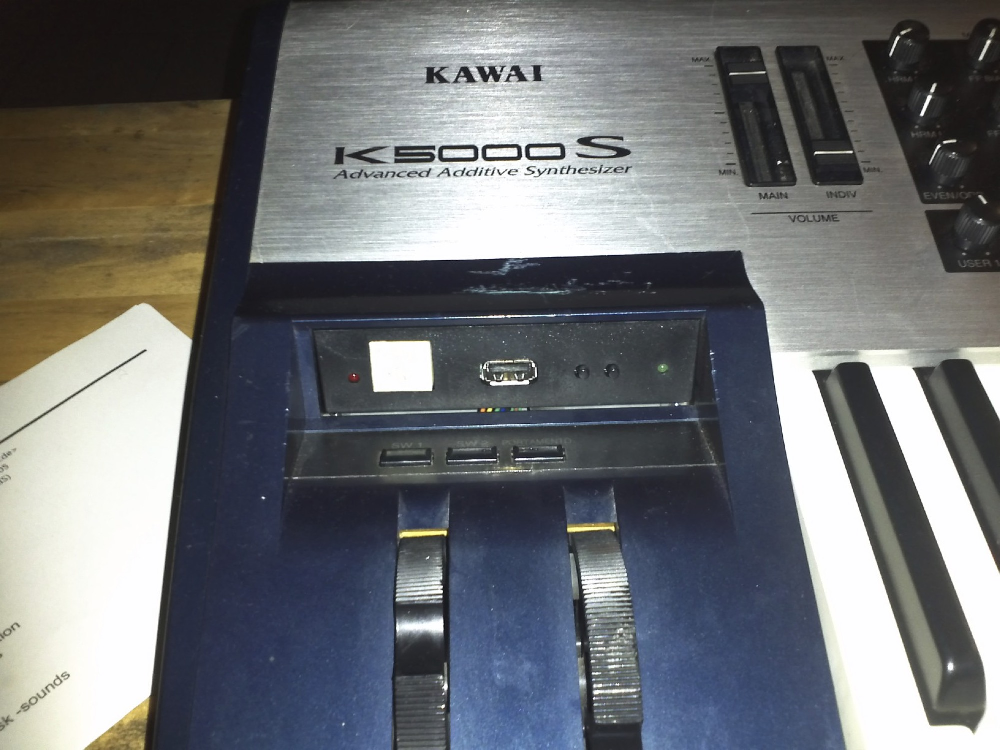
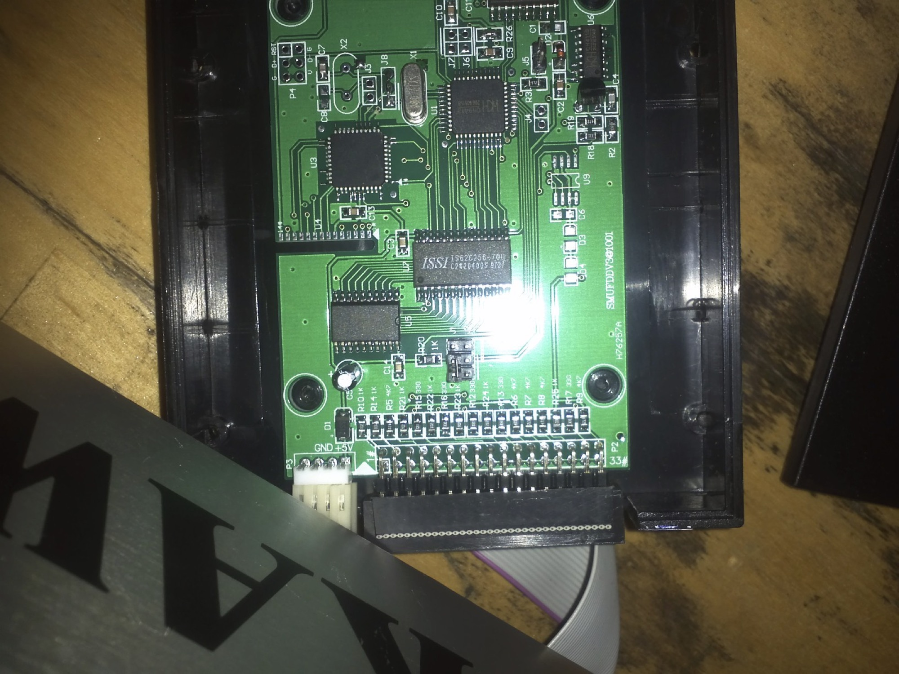
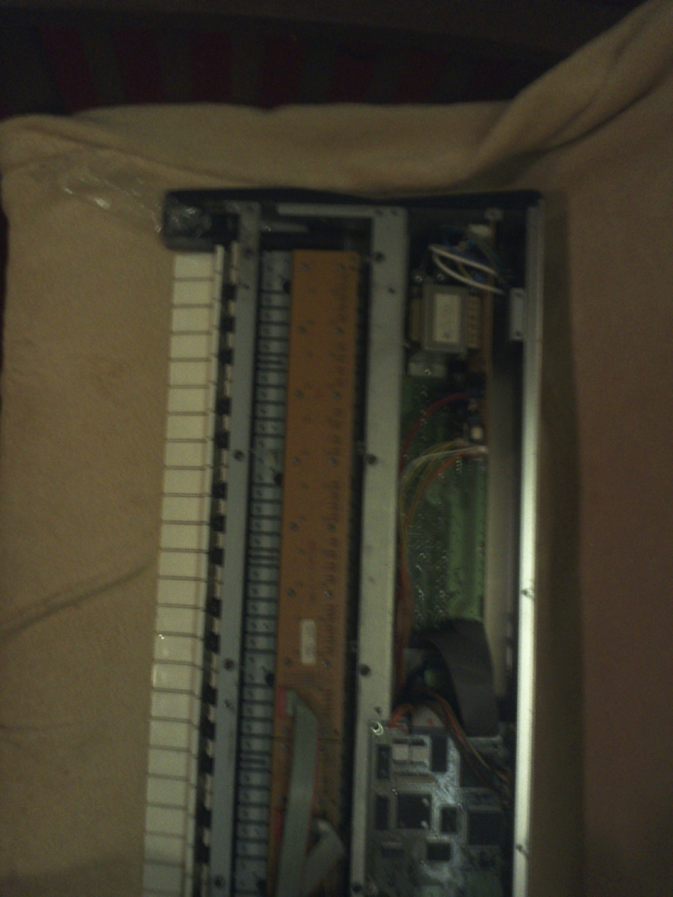
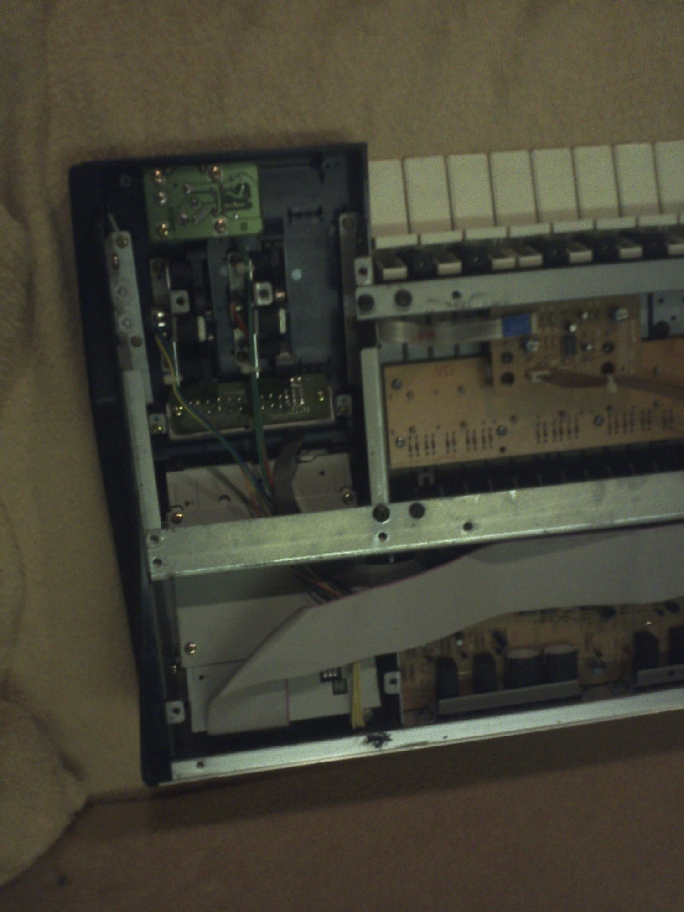

# Kawai K5000s modification USB-Floppy

have modified my Kawai K5000s to accept Sounds/Banks/Files from USB Stick, by using a USB Floppy Emulator.

sorry for the bad Photo quality:

Attention:  you must change the default jumper inside from floppy emu

