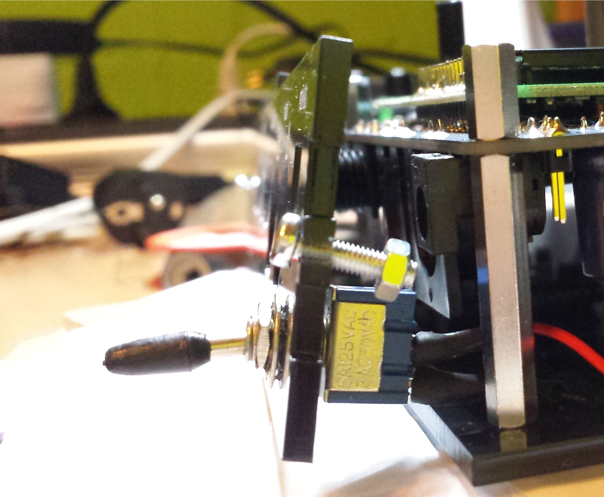
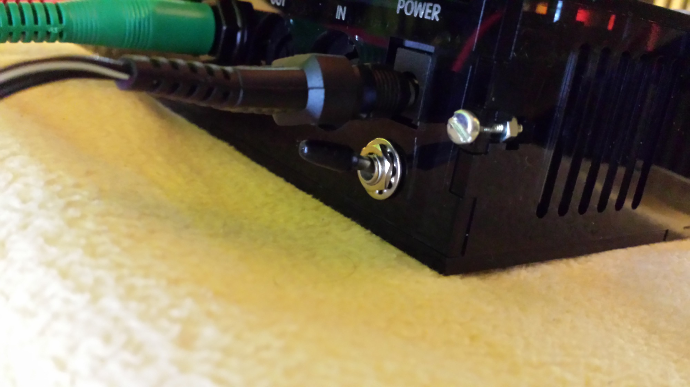
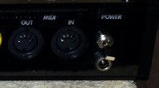
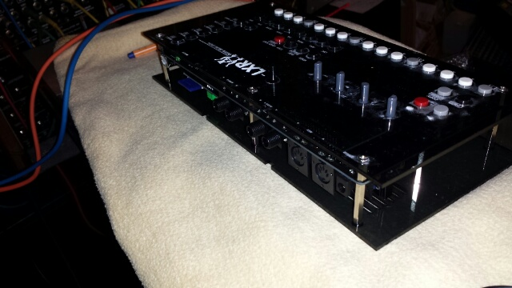

# LXR Drumsynth modifications

## **Modifications for LXR Drumsynth:**

### **RFC:**

- **powerswitch on rear panel top, and power connection port on bottom ✅**
- **Wood side panels ✅**
- **LED Colour - blue, amber -   in 2014**
- **acryl yellow-orange with white engraving - ❌**
- **custom Panel ✅**
- **Trigger outs** in 2014

**online Sources:**

[http://www.sonic-potions.de/forum/discussion/64/drilling-holes-for-the-panel#Item\_35](http://www.sonic-potions.de/forum/discussion/64/drilling-holes-for-the-panel#Item_35)

**Panel files:**

[SP\_LXRCase\_062\_Patrick.eps - own 15mm each side bigger](assets/SP_LXRCase_062_Patrick.eps)  -&gt; with power connection hole/square

[Original Panel eps file](assets/SP_LXRCase_062.eps)

**Powerswitch**

my Panel dont have at the rearside a cutting for the onboard powerconnector , so i can place a powerswitch at above from a powerconnection input.

This picture shows the powerconnection on top, but its limited to use the switch because the powerconnection cable disturbs.

whats wrong ?

.. the connector limited the switch a bit in the original rearpanel.

**The solution:**

its needed to add a new powerconnection port:  **DC Buchse 2,1mm Lumberg** (dc21lum)

with a new designed rearpanel, power switch at top, new jack bottom

## Sidepanels:

