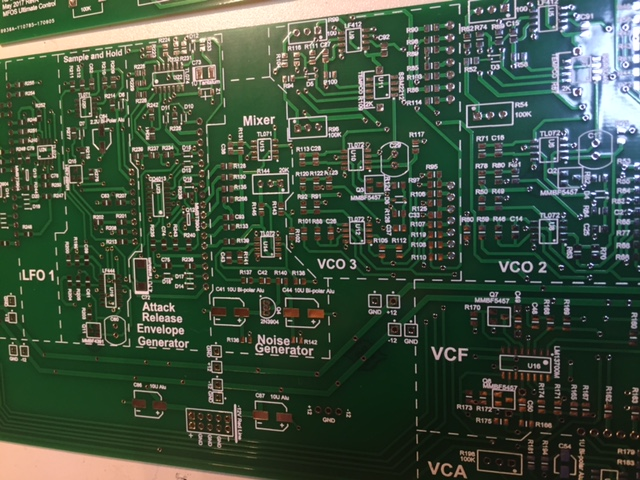
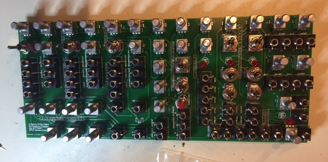
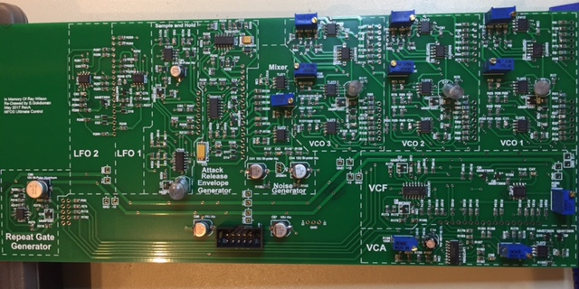
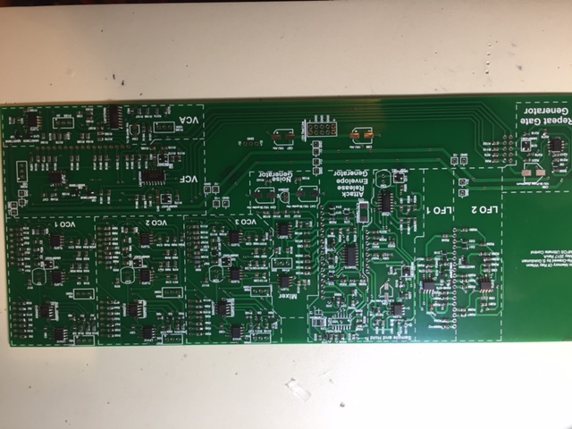
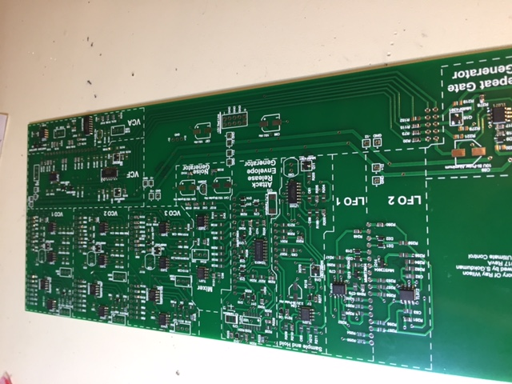
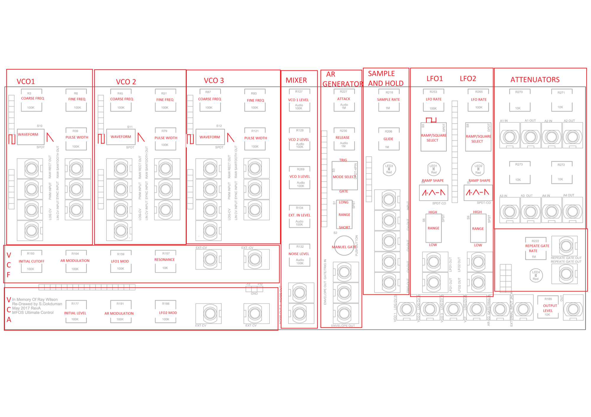
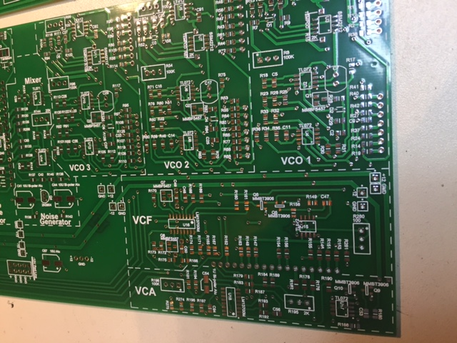
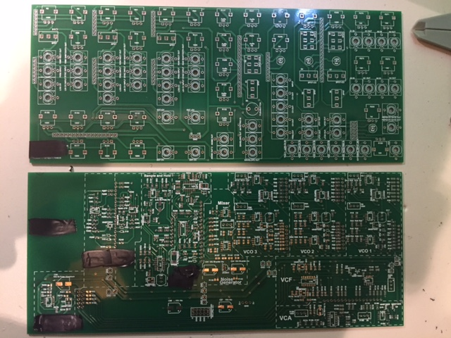

# MFOS Ultimate SMT Version

> **Project**
>
> ### Projecttitel: MFOS Ultimate SMT Version
>
> ### Status: `done`
>
> ### Startdate: 2017
>
> ### Duedate: 08/2017
>
> ### Manufacture link:

I built the MFOS Ultimate in SMT for the developer in Summer 2017.

The device was easy to build for me, the parts was all available from mouser (except the pots)

Its available soon from synthcube.com

**BOM:**

[MFOS Ultimate SMD BOM.xlsx](assets/MFOS-Ultimate-SMD-BOM.xlsx)

