# Midibox MB6582 SID

> **Project**
>
> ### Projecttitel:MB6582
>
> ### Status: `DONE`
>
> ### Startdate: 08/2019
>
> ### Duedate: 05/2020. updated 02/2026
>
> ### Manufacture link: ucapps.de

child pages:

Table of content:

## BOM:

[wilba\_mb\_6582\_parts\_list \[MIDIbox\].pdf](assets/wilba_mb_6582_parts_list-MIDIbox.pdf)

## BOM note:

**the most important things are:**

| **Part** |   |   | **update 2025** |
|---|---|---|---|
| PIC chip | preprogrammed with bootlader | ask me if you want one preprogrammed PIC chip - I have a full image for download on this page -.. scroll down to programming/flashing | ✅ |
| SID | 2x needed - one minimum 8580 or 6581 or 6582 | ebay or ask me | ✅ ARMSID is a good replacement  and the ARM2SID (dual) the TWinsid works too but is noisy. the FPGASid and Kungfusid and others works too, but look at YouTube for reviews.. |
| Frontpanel and rearpanel | see note for the ID:output in this list to improve the rear panel | See on this page here .. I made a own panel and case | ✅ |
| original power supply (latest square box version) |   | ebay or better this new stable version: [https://www.c64psu.com/c64psu/43-commodore-64-c64-psu-power-supply.html](https://www.c64psu.com/c64psu/43-commodore-64-c64-psu-power-supply.html) | ✅ |
| powerswitch from ebay- or use a DPDT switch on rearpanel |   | Ebay look for C64 powerschalter power switch. | ✅ |
| Powersupply DIN Jack |   | 7 pin **FM6727**  check [tme.eu](http://tm.eu) or mouser | ✅ |
| low current LED´s - which fit against the front panel hole | make sure the color match with the display | tme, mouser.  3mm 2mA | ✅ |
| Display HD44780 or use a OLED (preferred) | make sure the color match with the LEDs | [tme.eu](http://tme.eu)   20x4 OLED white its available in other colors too. partnumber: **REC002004AWPP5N001** **NHD-0420DZW-AB5**  = blue OLED new revision | ✅ |
| case Pactec PT10 - deprecated  - use my own case as shared on this page |   | mouser | not needed anymore |
| FAN only when you install 6 or 8 SIDs |   | 5Volt  40mm fan - ebay | ✅ |
| 9x flat ribbon cable to connect the pcbs together |   | [571-FST-21A-8](http://www.mouser.com/ProductDetail/te-connectivity/fst-21a-8/?qs=AZ5gePLSCttWhaSDX2ciEQ%3d%3d&countrycode=DE&currencycode=EUR) FST-21A-8 TE Connectivity FFC / FPC Jumper Cables TARIC:8544499500 ECCN:EAR99 COO:MX | ✅ |
| DO NOT INSTALL ALL headers and IC sockets or output drivers **if you only want 2 SID chips**- you have to install and buy less parts | you only need 2 SID chips and one preprogramed PIC chip. more SIDs. can be played on a different MIDI channel - but there's no real Polyphonic playing on one midi channel. (correct me if I´m wrong) | everything inside the blue marking isn't needed when you only want a 2 SID chip version. also the headers which are blue marked. 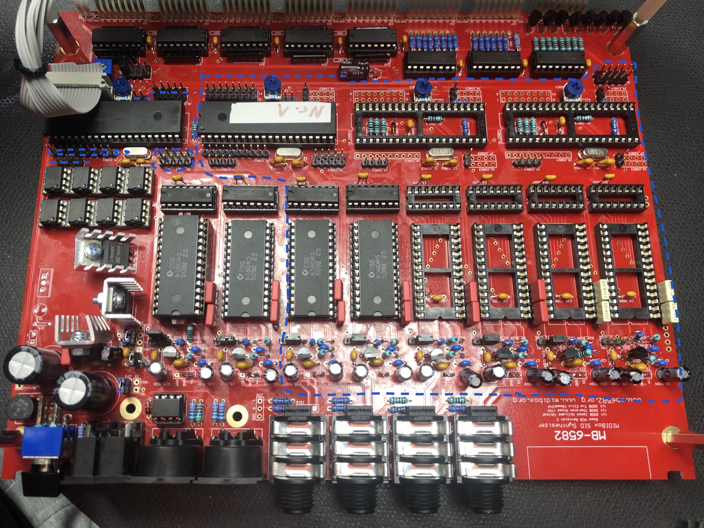 | ✅ |
| **ABSOLUTLY important !!!!!** | **the outputs are Stereo per jack !!** if you only install 2 SIDs - you can improve the jacks - install 2 MONO Jacks at the rear panel and connect each on the (Voice 1) stereo solder holes - other wise you need a adapter from stereo to 2x mono cables **(insert cable)** | **todo**: improve the rear panel to 2 or 4 MONO jacks (9.5mm holes)  move the holes more to top to get enough space between PCb and the jacks. remove the unused holes from the panel files | ✅ |
| J23\_ and J3\_ | in case - no input audio is required | If not using (or until you connect) feedback pots, use a jumper (shunt) between “IN” and “GND” pins. You can also use these headers to connect audio sockets for external audio input to the SID (but preferably sockets with switch so unused socket will ground the input). |   |
| Trimmer not required for OLED | you don't have to install any trimmer when you use a OLED ! | since the OLED doesn't have backlight, no trimmer and T1 is required. | ✅ |
| Noise from OLED | the OLED can be very noisy on the 5V line (ripple) | install a 470uF 6.3V minimum) at the Display VDD/VSS and a 1uF ceramic cap at VDD/VSS (Datasheet of the OLED describes it) 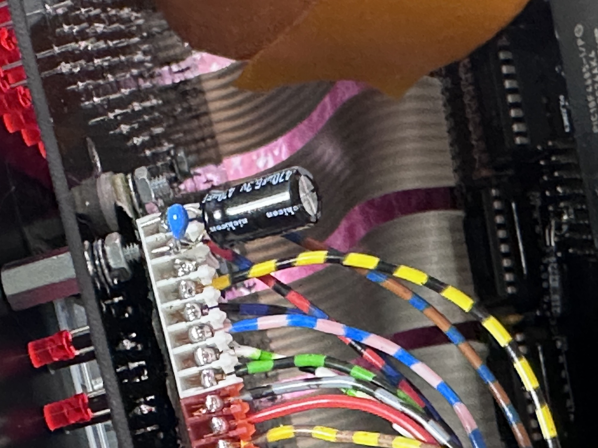 | rootcause analysing: the 5V rail isn't clean at all. use a external PSU in case you want a very clean signal, but please aware - the SID Chips, especially  the 6581 are very noisy |
| Noise | 12V with SID 6581 | on my unit is the device very noisy (unusable) in combination of 6581 and OLED Display. should be a ground issue |   |

## Panel Files:

Panel 2024 **new** to optimize/ match the OLED

[MB-6582\_OLED-c64\_ok-bold.fpd](assets/MB-6582_OLED-c64_ok-bold.fpd)

    1.5mm must be written in the order notes !!

[oled-für\_c64version\_2024-ok.fpd](assets/oled-fur_c64version_2024-ok.fpd)

note: the oled-für\_C64 match  with the MB6582\_OLED-c64 file and its 100% good.

you have to order the [MB-6582\_rearpanel\_r2\_opt.fpd](assets/MB-6582_rearpanel_r2_opt.fpd) and with the same dimenension a blank panel for the upper front

and you need a 1.5mm plate for the bottom with the same dimension as the Frontpanel has.  i

futhermore you need Gietec side panels 2x

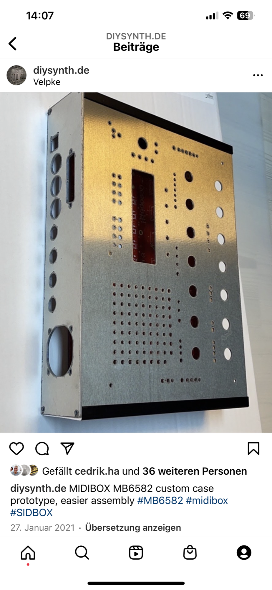

**OLD  files**

 [MB-6582\_frontpanel\_r2.fpd](assets/MB-6582_frontpanel_r2.fpd)

This one has all artwork as objects in FPD, with two HPGL engravings for the Osc and LFO waveforms. You can change individual text labels if you want:

[MB-6582\_frontpanel\_r2\_opt.fpd](assets/MB-6582_frontpanel_r2_opt.fpd)

This one is the same as the one above, but pen 1 is used for all text, control group lines and waveform lines, i.e. - 1=text & control group lines & waveform lines, 2=arrow labels, 3=section dividing lines. You can then change the colour and/or thickness of each type of artwork.

[MB-6582\_rearpanel\_r2\_opt.fpd](assets/MB-6582_rearpanel_r2_opt.fpd)

This one has all artwork as a single HPGL engraving object

## Build Infos (mostly for myself)

**Buildguide of Control panel**

[http://midibox.org/forums/topic/14564-building-the-mb-6582-control-surface-photo-tutorial/](http://midibox.org/forums/topic/14564-building-the-mb-6582-control-surface-photo-tutorial/)

**Control surface build:**

[**http://www.midibox.org/dokuwiki/doku.php?id=wilba\_mb\_6582**](http://www.midibox.org/dokuwiki/doku.php?id=wilba_mb_6582)

**Base PCB build:**

[**http://www.midibox.org/dokuwiki/doku.php?id=wilba\_mb\_6582\_base\_pcb\_construction\_guide**](http://www.midibox.org/dokuwiki/doku.php?id=wilba_mb_6582_base_pcb_construction_guide)

## **Display**: (LCD version, OLED is further down described)

> **Hinweis**
>
> in case you want less noise - for studio recordings, use the LCD Version (since the OLED produce a lot of noise - especially with 6582)
>
> ARMSIDs are fine for OLED and LCD Versions, less noise.

[http://midibox.org/forums/topic/14564-building-the-mb-6582-control-surface-photo-tutorial/](http://midibox.org/forums/topic/14564-building-the-mb-6582-control-surface-photo-tutorial/)

I used the 2004A model: (HD44780)

you have to install the SMT bridges too - in case you have character issues or a nothing at the display, also check the Contrast trimmer.

**futhermore the LCD patch (it´s described on bottom - flashing/programming)**

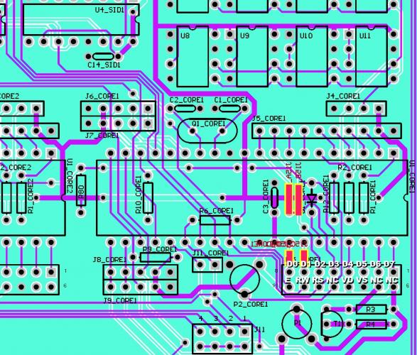

|   | **number\_marked\_on\_Display** |   |   |   |   |   |   |   |   |   |   |   |   |   |   |   |
|---|---|---|---|---|---|---|---|---|---|---|---|---|---|---|---|---|
| Display PIN | 1 | 2 | 3 | 4 | 5 | 6 | 7 | 8 | 9 | 10 | 11 | 12 | 13 | 14 | 15 | 16 |
| Display Function | VSS | VDD | V0 | RS | R/W | E | DB0 | DB1 | DB2 | DB3 | DB4 | DB5 | DB6 | DB7 | BLA(+) LED + | BLK(-) LED - |
| on Mainboard: | 11 | 12 | 13 | 14 | 15 | 16 | 8 | 7 | 6 | 5 | 4 | 3 | 2 | 1 | 9 | 10 |
| check | ✅ | ✅ | ✅ | ✅ | ✅ | ✅ | ✅ | ✅ | ✅ | ✅ | ✅ | ✅ | ✅ | ✅ | ✅ | ✅ |

**Mainboard:**

| **1** | **2** | **3** | **4** | **5** | **6** | **7** | **8** | **9** | **10** | **11** | **12** | **13** | **14** | **15** | **16** |
|---|---|---|---|---|---|---|---|---|---|---|---|---|---|---|---|
| D7 | D6 | D5 | D4 | D3 | D2 | D1 | D0 | B+ | B- | VSS | VDD | V0 | RS | RW | E |

J15\_CORE1 is the connector for the first voice - which is the default Display .

connect to this header with a ribbon cable the Display.

**This Picture shows the Pinout for the LCD VERSION only !!!!**

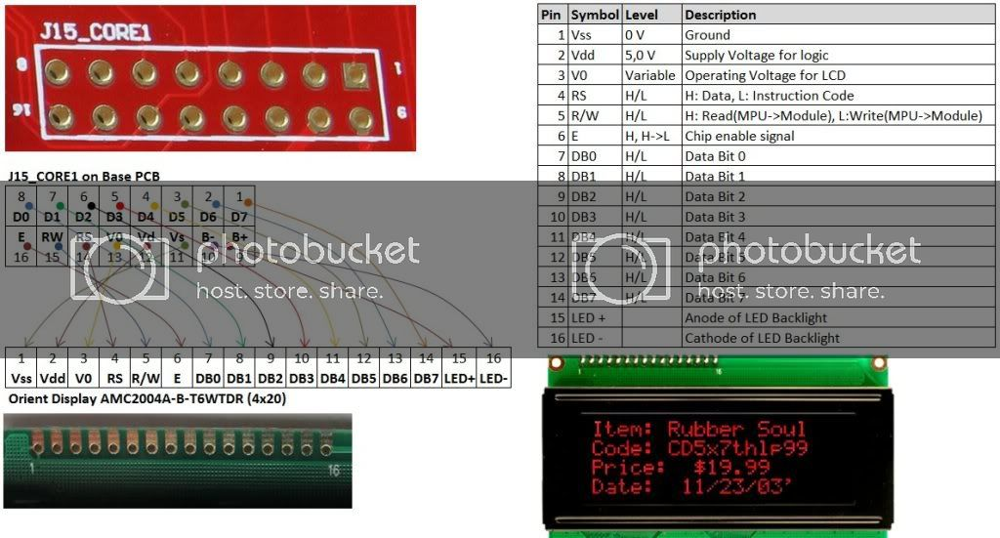

**for OLED VERSIONS:**

[http://midibox.org/forums/topic/20408-midibox-mb6582-newhaven-oled-finally-working-d/#comment-177851](http://midibox.org/forums/topic/20408-midibox-mb6582-newhaven-oled-finally-working-d/#comment-177851)

> **Hinweis**
>
> The OLED produce a lot of noise in the circuit (with extra capacitors etc. too)
>
> but, in case you only use ARMSIDs, you can go without any noise.
>
> especially with 6581 is the noise at the belonging audio channel very loud.

use the wiring as shown in the picture on bottom - you don't need all Pins connected (on LCDs you have to connect all pins as shown above) 

in case you use a 16pin ribbon cable, respect that the pins repeat as follows:  1,9,2,10,3,11.. which ends in a mapping as shown in following list

| **Ribbon cable pinout** | **OLED PIN (B+, B-, V0  isn´t required on the OLED)** |
|---|---|
| 1 (square pin on mainboard connect at this first | 14 |
| 2 | not needed |
| 3 | 13 |
| 4 | not needed |
| 5 | 12 |
| 6 | 1 |
| 7 | 11 |
| 8 | 2 |
| 9 | 10 |
| 10 | not required |
| 11 | 9 |
| 12 | 4 |
| 13 | 8 |
| 14 | 5 |
| 15 | 7 |
| 16 | 6 |

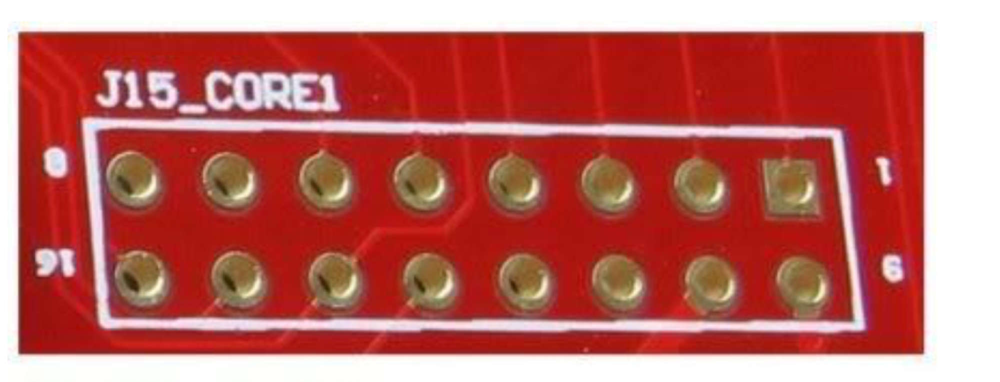

**its much easier and less risky for beginners to buy a single pin cable - for example arduino cables, instead of using a ribbon cable.**

Thats a standard Pinout of a cheap OLED which match with our **REC002004AWPP5N001**

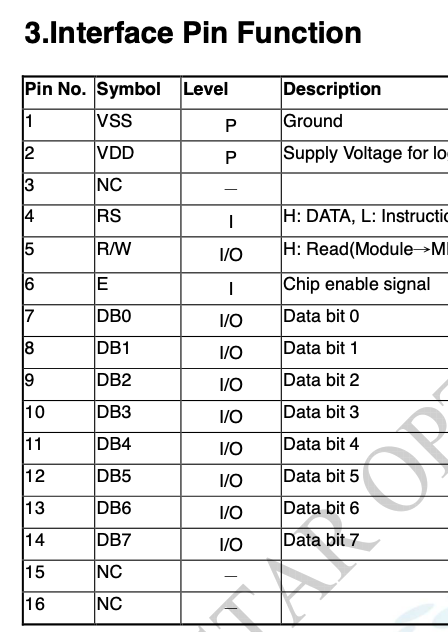

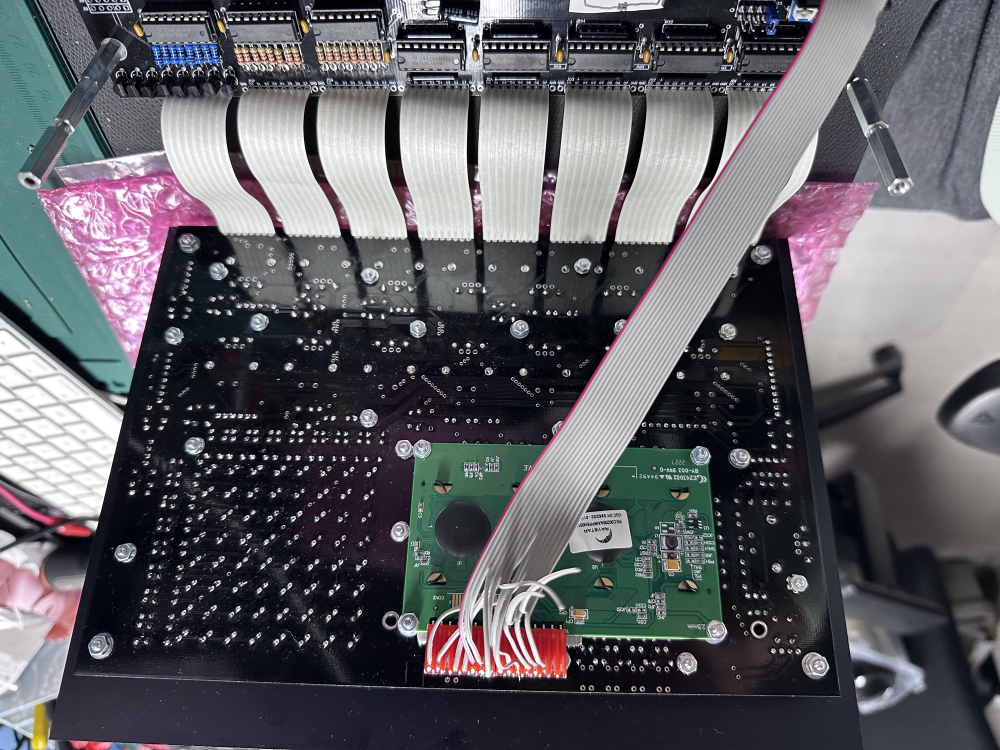

> **Hinweis**
>
> **You  have to solder the 4 small SMD Jumper bridges on the bottom on the  MainboardPCB (only for OLED version) see above picture**

## **User** Manual:

[http://www.ucapps.de/midibox\_sid\_manual\_fp.html](http://www.ucapps.de/midibox_sid_manual_fp.html)

## before programming:

**J11** (not J11\_CORE1) is a 4×2 pin header which controls which Core (PIC Tx pin) is connected to the MIDI Out port. You would only need to use this once for the first upload of MIOS and the MB-SID V2 firmware, **thereafter connect the master PIC (1) to the MIDI out** and **after** uploading new MB-SID V2 firmware, the master PIC can clone itself to the other PICs across the CAN bus.

NOTE: All Cores (PIC Rx pin) are connected to the MIDI In port. The different device ID (0,1,2,3) on each PIC determines which PIC receives an upload, **J11 is used to get “feedback” from that PIC during the upload.**

The absolute bare minimum **headers** you should put in are:

- J11 (for switching which Core is connected to MIDI Out) ✅
- J15\_CORE1 (for master Core’s LCD)
- J3\_SIDx, J23\_SIDx (for connecting feedback pots, or at least grounding the SID audio inputs) ✅

Then the list of useful headers for a “default” MB-6582 setup (no expansion port usage):

- J70 (for passive mixed output, to connect to headphone jack) ❌
- J2 (for power LED) ❌
- J25 (~9V-11V DC, for connecting to fan) ❌
- J3 (5V DC, for connecting to fan, if 9V-11V makes the fan too noisy) ❌
- J1\_SIDx, J2\_SIDx (for voltage switching between 9V and 12V per SID, see PSU Option B and D) ✅

Then for the advanced users, perhaps wanting to connect things via the expansion port:

- J6\_COREx, J7\_COREx (for analog outputs via AOUT modules) ❌
- J5\_COREx (for analog inputs) ❌

**Check this:**

Now after soldering all those, you can start soldering together the PSU section. Go back to the start of this guide and follow the soldering instructions for the PSU option you want to use. Then follow the soldering instructions for the power socket and power switch for that PSU option.

- Test that the power rails and ground are not connected (shorted). You can test this at J4.
- Test that each of the following IC socket's pins are correctly connected to the 5V rail:

SIDs: test pin 25 (fourth from top right); COREs: test pin 11 (eleventh from top left); 74HC595/74HC165s: test pin 16 (first from top right) Optocoupler 6N138: test pin 8 (first from top right)

- Test that each of the following IC socket's pins are correctly connected to ground:

SIDs: test pin 14 (bottom left) COREs: test pin 12 (twelfth from top left) 74HC595/74HC165s: test pin 8 (bottom left) Optocoupler 6N138: test pin 5 (bottom right)

You should now be ready to plug in your power supply and turn on the power switch. It is important that you get your multimeter ready to test the voltages at J4, and test them quickly after turning on the switch, so if you don't see the right voltages, then you can turn it off quickly and avoid damaging components. If you've put the bridge rectifier and capacitors in the correct way and tested for short circuits across the power rails, then you should not have a problem.

**Before connecting power to the power socket:**

- Check you've completely followed the soldering instructions for the PSU option of your choice, especially soldering the bridge at J71, J72 and J73 (if instructed to do so).
- Check the orientation of J1A (if you are using a panel-mount socket to connect a C64 PSU). It is a good idea to test the voltages coming out of the C64 PSU first, to make sure you really have 5V and ground connected to the right pins! Ideally you should use a *polarized header and connector* for J1A to avoid swapping 5V and ground and destroying components!

Then connect the power, turn on the switch and:

- Check DC voltage between 5V and ground at J3.
- If using PSU Option A or B, check voltage at J25 (should be above 9V, around 11V depending on load).
- Check output of V1 by checking voltage across C12 (bottom pin should be 9V relative to top pin).
- Check 9V pin of J1\_SID1, J2\_SID1 relative to ground (at ground pin of J3).
- If using PSU Option B, check 12V pin of J1\_SID1, J2\_SID1 relative to ground (at ground pin of J3).
- **Insert jumper into J1\_SID1, J2\_SID1 depending on type of SID - 9V for 8580/6582, 12V for 6581**
- Check voltage between pin 28 of SID socket (top right corner) relative to ground.

If these voltage checks are passed, then you have finished the PSU section and can continue. If these voltage checks fail, disconnect power immediately. You will have to work out what is wrong by testing connnections. Start with testing pins on the C64 PSU, then checking for any breaks in continuity between the power socket and the rest of the circuit, i.e. you can test if the switch is working and pins 1&2 and 4&5 are connected when the switch is on, etc.

## Programming/flashing

repository for Firmware latest is from 2024

[http://www.ucapps.de/mios\_download.html](http://www.ucapps.de/mios_download.html)  firmware is still 1.9h

App: which runs on the firmware: [http://www.ucapps.de/mios/midibox\_sid\_v2\_046.zip](http://www.ucapps.de/mios/midibox_sid_v2_046.zip)

**updated: 01/2025:**

here are images of all 4 PIC chips for the usage with the OLED version - tested !!

there´s a how to in the zip file too.

**important**: make a sticker on each PIC chip which numbers from 1-4 and insert only PIC 1, install on your PC/Mac  mios and check the functionality. (connect

MIDI in/out) and a good sign is when your OLED shows something, otherwise use the trimmer P1

in case of failure - contact me

[ARM2SID Setup for MB6582-2.pdf](assets/ARM2SID-Setup-for-MB6582-2.pdf)

**you can ignore the other steps here when you use the above method !**

1. in case you have a PIC burner - download the file:

[bootloader\_v1\_2b\_pic18f4685.hex](assets/bootloader_v1_2b_pic18f4685.hex). (that's for the 18F4685 PIC model - not for other models)

       (this the bootloader which enable the MIDI function, that you can connect by MIDI the MB6582)

if you don't have a PIC burner, ask me for a preprogrammed chip.

2. download the latest MIOS software: [MIOS\_Studio\_2\_4\_8\_OSX.app.zip](assets/MIOS_Studio_2_4_8_OSX.app.zip)

or for windows: [MIOS\_Studio\_2\_4\_8\_Win.zip](assets/MIOS_Studio_2_4_8_Win.zip)

3. install the MIOS software and connect the MB6582 with your MIDI Interface to the PC/Mac - don't start it yet.

4. download the Firmware:

[mios8\_v1\_9h\_pic18f4685.hex](assets/mios8_v1_9h_pic18f4685.hex).  (that's for the 18F4685 PIC model - not for other models)

(this install the "software" in your PIC chip) s

5. start the MIOS app on your PC - and start the MB6582  - check that the MIOS tool are able to find your Core (PIC) that's an example - but its different to that what you need.

if the software isn't able to connect to your MB6582 - you get a red text warning !!

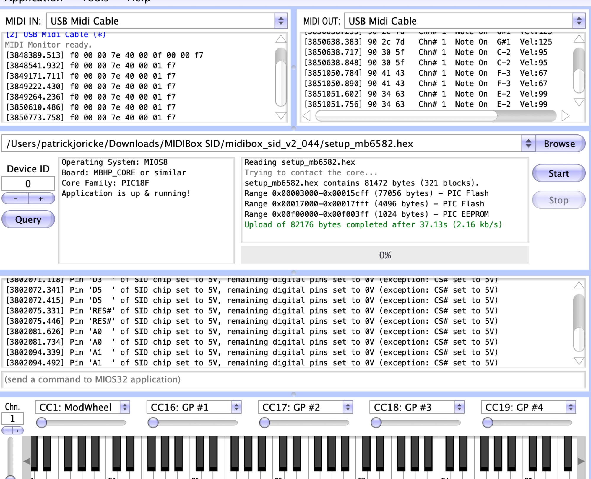

6. if the MIOS tool find your MB6582 (PIC) use the "browse" function and upload from Step 4. the firmware and press "start".

7. download the "application (setup\_mb6582)" this is the "player/editor" of the synth. there are some other apps on the ucapps website too (test tools)

 install **with** the MIOS app the setup\_mb6582 file [http://www.ucapps.de/mios/midibox\_sid\_v2\_046.zip](http://www.ucapps.de/mios/midibox_sid_v2_046.zip).  (this file works for all SID chips !!)

that's it.

1. you will see that your MB6582 starts acting on the Display and the LEDs comes to life.

if the display stays dark or don't show text, turn on the MB6582 the p2\_core1 trimmer, you find them close to the PIC chip (contrast and brightness) **(not for OLED Displays-no contrast dimming/brightness)**

1. install the.
  [device\_id\_00\_lcd7.hex](assets/device_id_00_lcd7.hex)
    in case of a LCD - when you have wrong characters etc.

leave a comment or contact me in case of questions.

## Advanced programming with more than 1 PIC

when you use more than 1 PIC to drive 3-8 SID chips you need to change the ID:

[change\_id\_v1\_9g.zip](assets/change_id_v1_9g.zip)

you must connect the JUMPER from position 1 to 2 on J11 

also you can connect the display cable to the J\_15core2 and changed with the trimer the contrast (no LED background light is normal here)

**Important**: after you have changed the device ID, you must install with MIOS the setup\_mb6582.hex file !!!! 

to test the function: press the SID\_ENGINE tactile switch (above the Display)

[http://midibox.org/forums/topic/18680-solved-debugging-my-mb-6582-part-2-software-upload-issue/](http://midibox.org/forums/topic/18680-solved-debugging-my-mb-6582-part-2-software-upload-issue/)

## Build infos for myself:

## Todos after build:

after programming: (optional)

fit LED resistors R40-R55  - start with one and check the brightness  - some colors need 1K or more. they are connect in a chain - but in the Matrix is often only one LED at one time powered - its different with the other LEDs !! so it can happen that the LED matrix LED´s needs a other resistor value.

install the Presets

[v2\_vintage\_bank.syx](assets/v2_vintage_bank.syx)

  with MIOS app

**What's the purpose of the J70 header?**

This is a passive mixed output of the four stereo channels, **which you can connect to the small phono jack above the power switch**. Totally **optional**.

This was a late design idea I threw into the prototype, the resistors below each audio socket are used to connect the audio signals together when there is no plug in the switched audio socket, i.e. it will only mix those sockets without plugs. You need to connect it together with insulated wire under the board though…. I didn't want to mess up the ground plane with tracks. To the right of the resistors R70-R77 (below the stereo sockets) are pads, these pads should be connected in two sets of wires, one set connects the pads that are next to R70, R72, R74, R76, the other set connects the pads that are next to R71, R73, R75, R77. (NOTE: R2 boards do not require the wires, there are tracks on the top layer.)

I used 10K resistors there because that's what I've seen before in passive mixer designs, but the output is very attenuated, **and I am guessing that you could drop these to 1K** or less, as the outputs of the audio buffers after each SID can probably handle that. Someone with more audio electronics (and SID!) knowledge can probably answer that question.

## Troubleshooting:

[http://www.ucapps.de/midibox\_sid\_manual\_ki.html](http://www.ucapps.de/midibox_sid_manual_ki.html)

depends on the failure, but from my experience its the best to use a glass magnifier and check every solder point  - ground pads !!

 some soldercore stay on the pcbs - wash the pcb with isopropyl from the solder side or use water soluble soldercore.

**PCB traces:**

[mb-6582\_base\_pcb\_r2\_color.pdf](assets/mb-6582_base_pcb_r2_color.pdf)

[mb-6582\_cs\_dout\_wiring.pdf](assets/mb-6582_cs_dout_wiring.pdf)

[mb-6582\_cs\_din\_wiring.pdf](assets/mb-6582_cs_din_wiring.pdf)

[mbhp\_core\_v3.pdf](assets/mbhp_core_v3.pdf)

## Sound Demos and testing:

download the player: [https://www.elektron.se/support/?connection=x-sidstation#resources](https://www.elektron.se/support/?connection=x-sidstation#resources).  (OLD - not valid anymore for new macOS/apple silicon)

connect MIDI and open the tool which can play SID files

SID Sound Files for the above player:

[http://www.ankman.de/commodore-64-sid-music/#a1998](http://www.ankman.de/commodore-64-sid-music/#a1998)

my final case, around 6 devices was built in this case design :

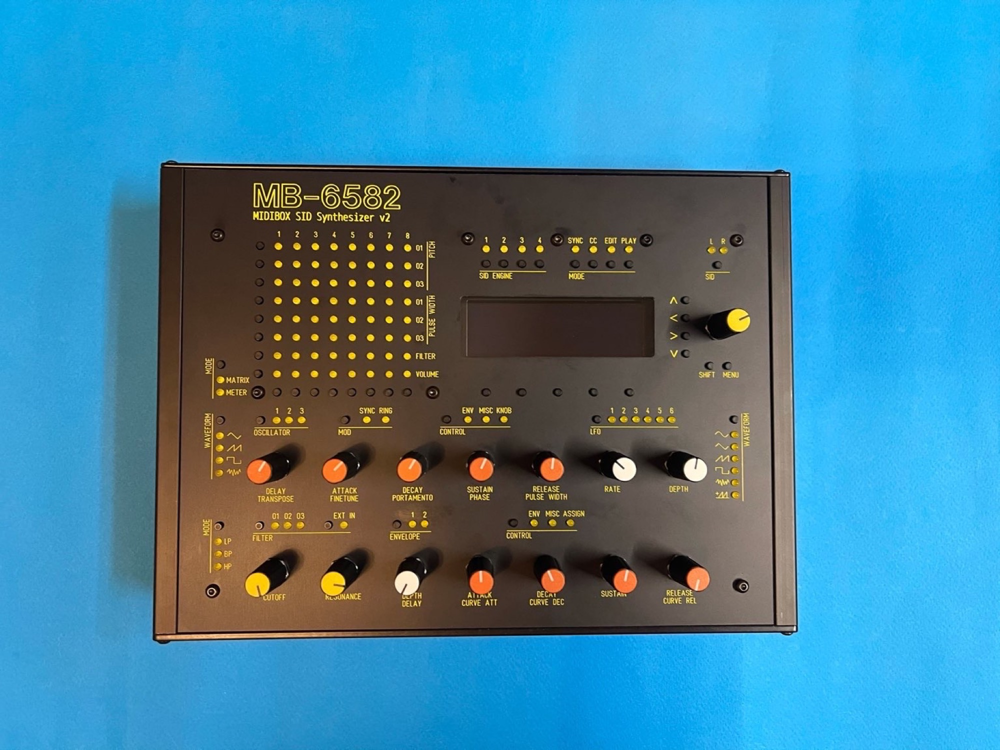

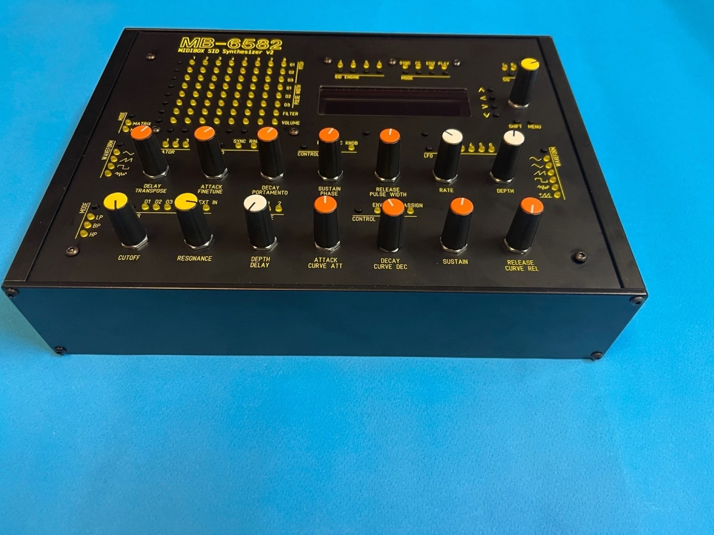

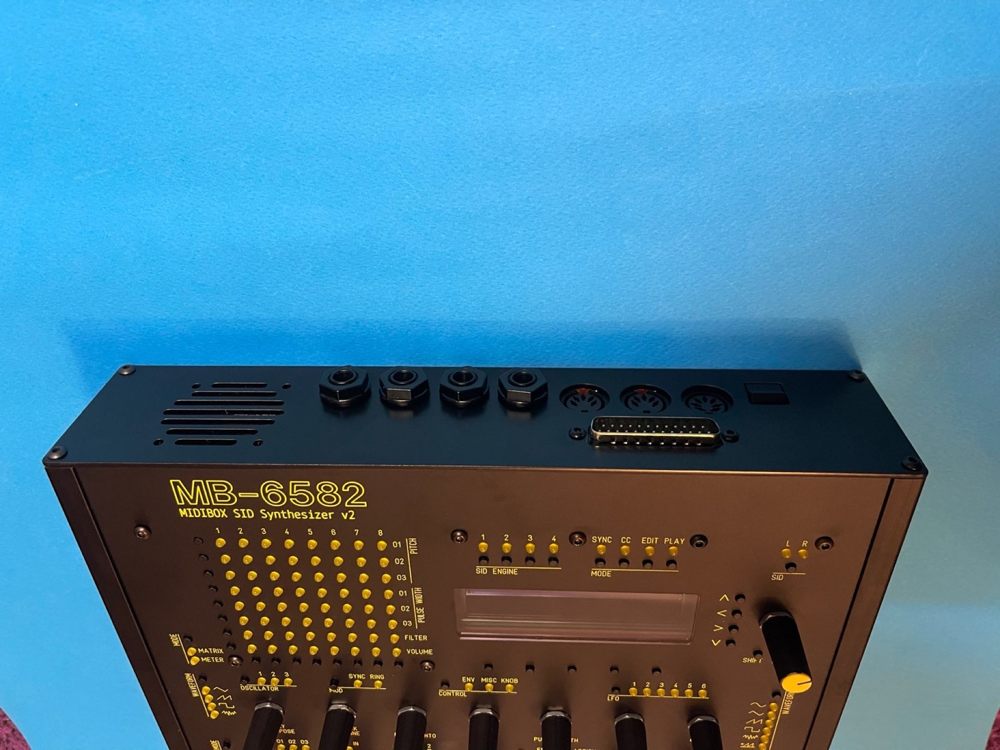

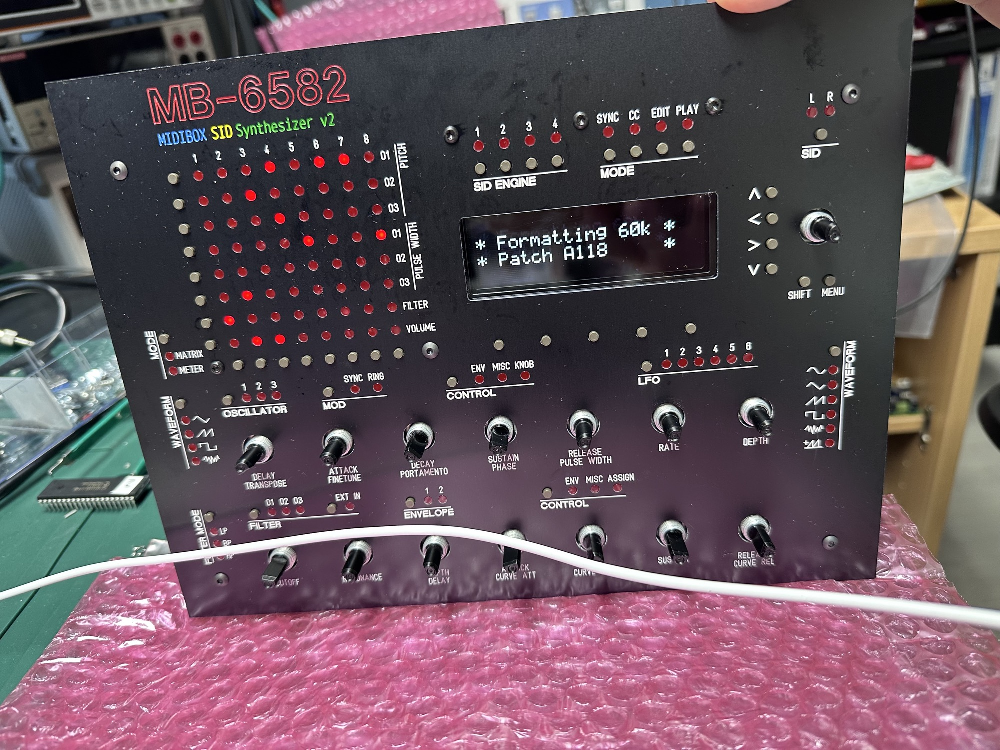

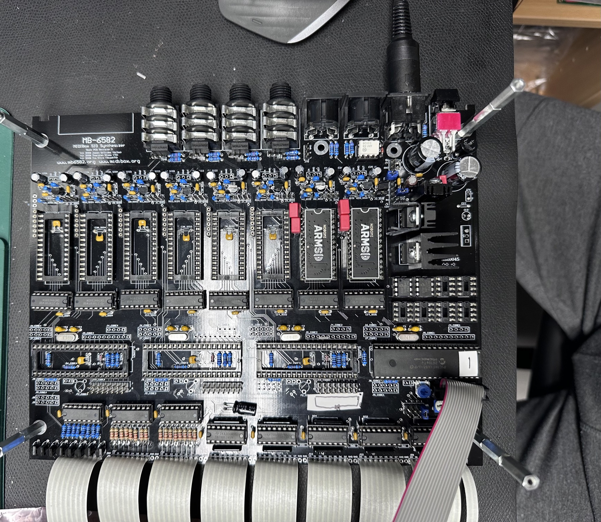

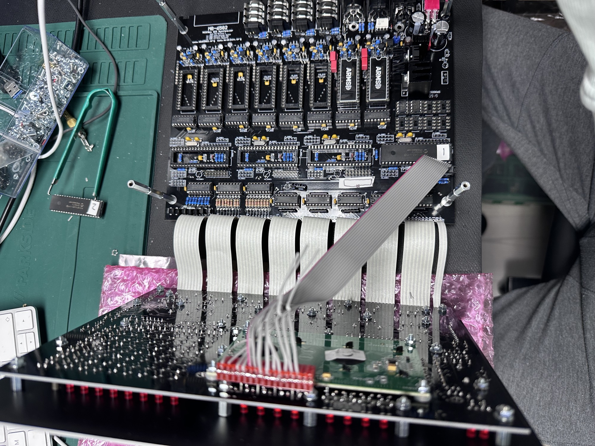

the following MB6582 s my latest build , with custom DC-DC PSu for less noise: 2025 build.

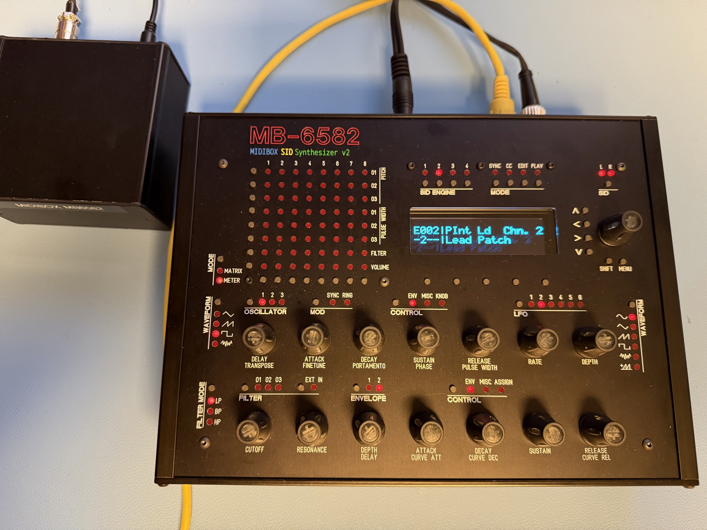
