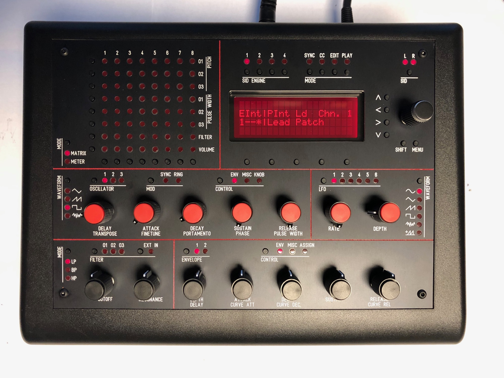
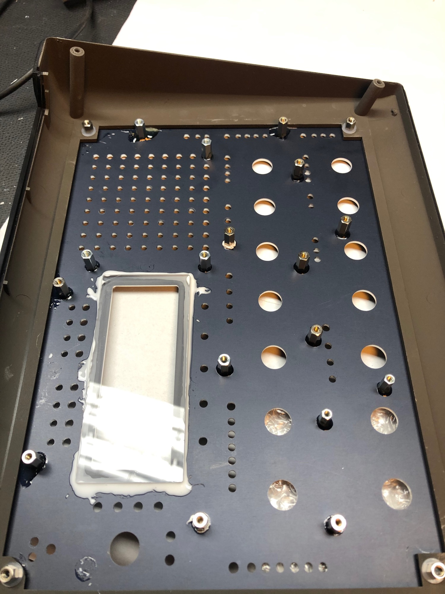
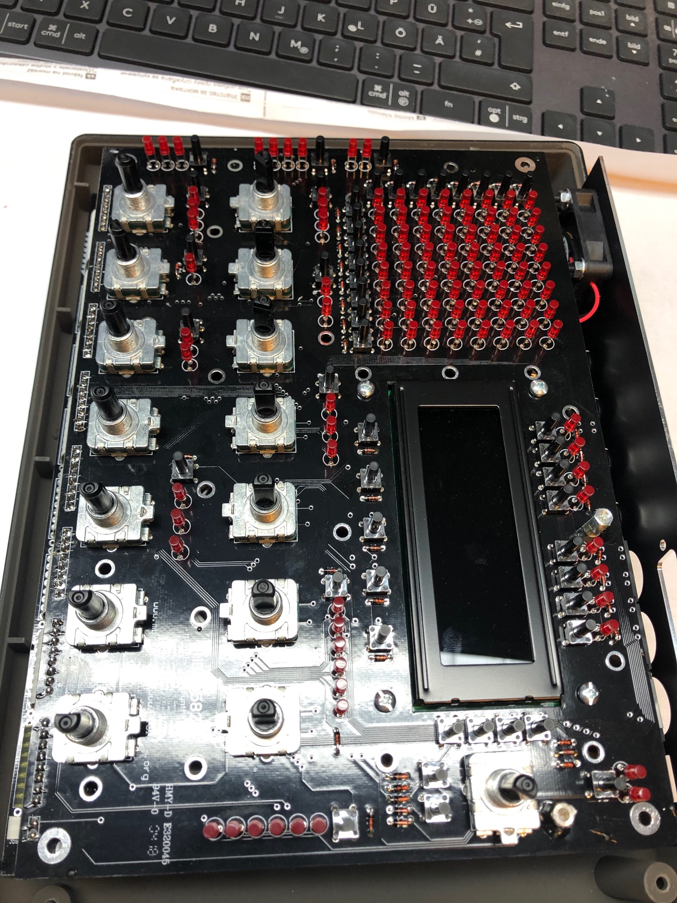
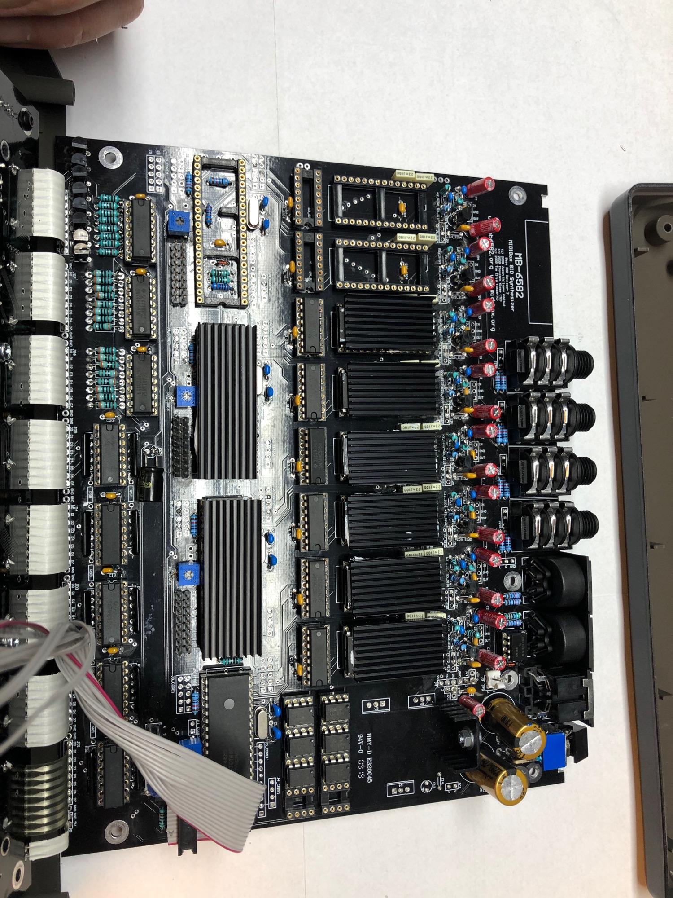
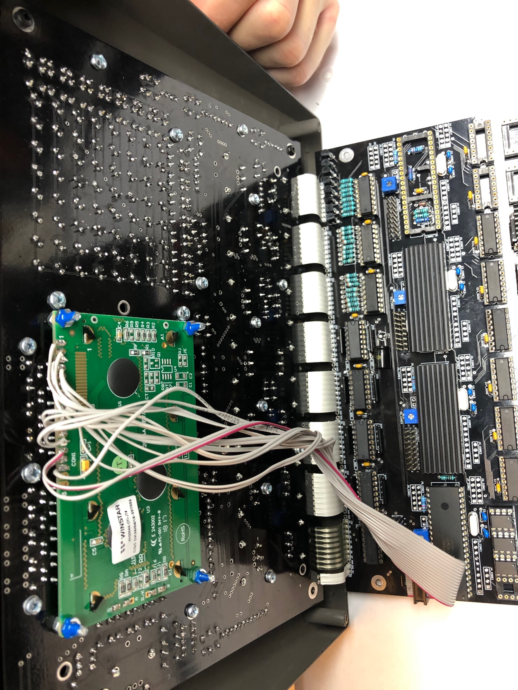
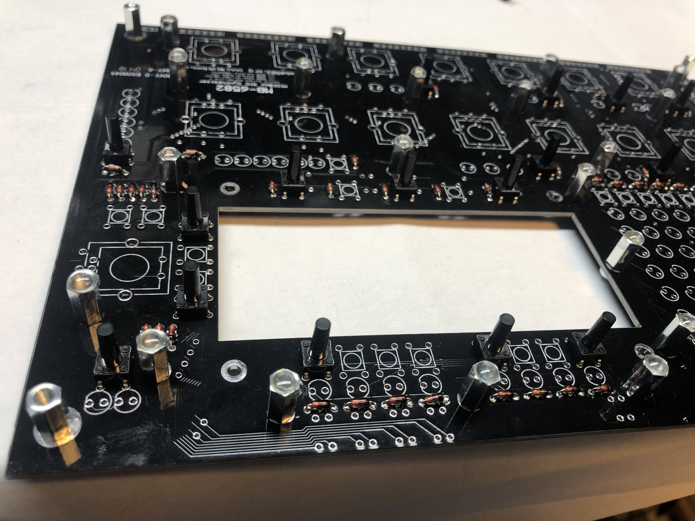
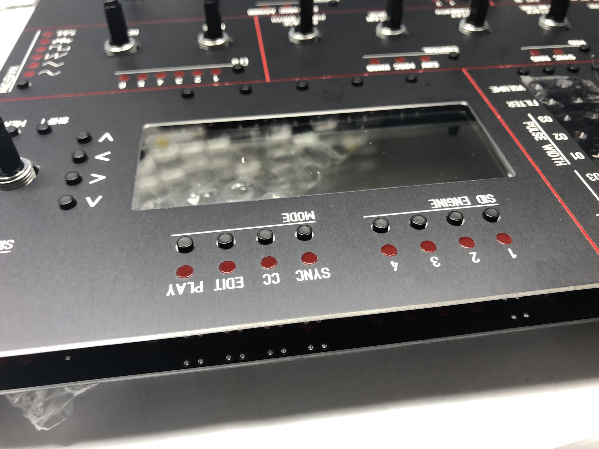
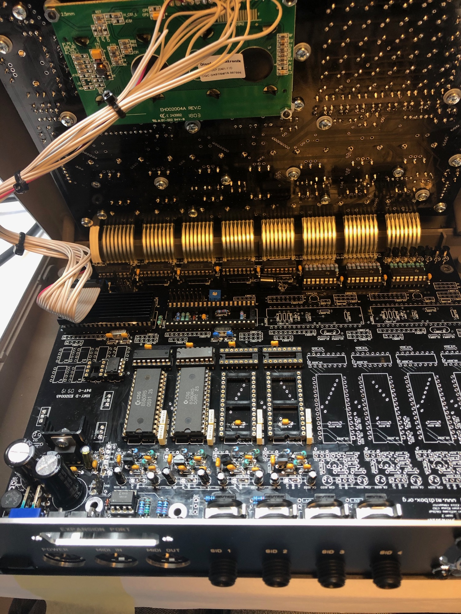
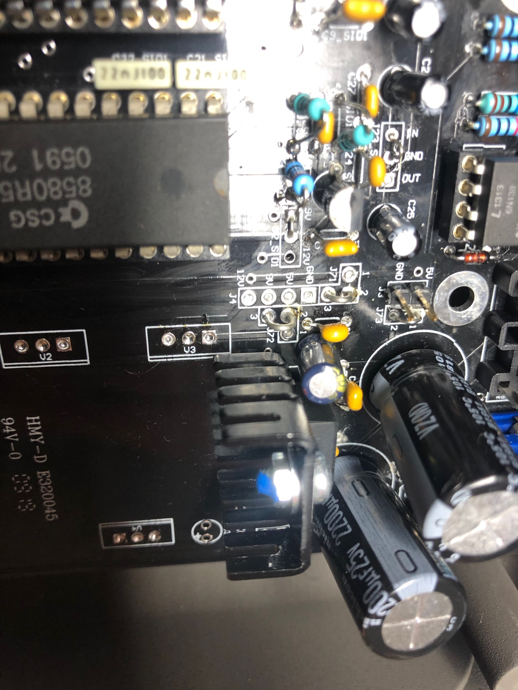
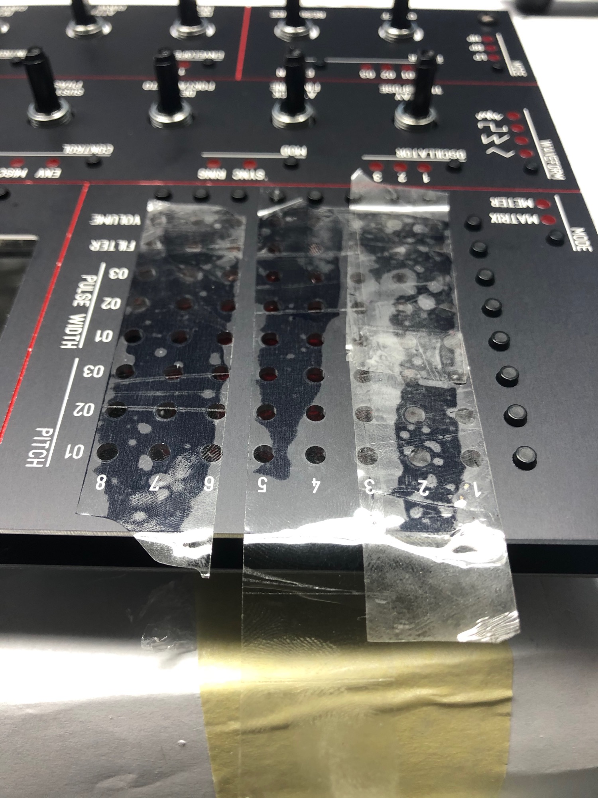

# MB6582-own first device

I built a lot of MB6582, on bottom is my first device wit a pactec case (which I didn't recommend anymore ! )

**Frontpanel for OLED (smaller cutout):**

[MB-6582\_frontpanel\_gelb\_OLED-version.fpd](assets/MB-6582_frontpanel_gelb_OLED-version.fpd)

[MB-6582\_frontpanel\_white\_OLED-version.fpd](assets/MB-6582_frontpanel_white_OLED-version.fpd)

**Screen cover for OLED version:**

[MB-6582\_window\_OLED-version.fpd](assets/MB-6582_window_OLED-version.fpd)

**Rearpanel - for standard switch:**

[MB-6582\_rearpanel\_r2\_opt.fpd](assets/MB-6582_rearpanel_r2_opt.fpd)

**Screen cover for Schaeffer normal version:**

[MB-6582\_window\_2.fpd](assets/MB-6582_window_2.fpd)

**Standard Panel Files:** make sure there's a NOTE that you want 1.5mm thickness !!!!!!

[mb6582-1\_5mm\_front.fpd](assets/mb6582-1_5mm_front.fpd)

[MB-6582\_frontpanel\_r2\_opt\_order.fpd](assets/MB-6582_frontpanel_r2_opt_order.fpd)

**OLED: "patch"**

[device\_id\_00\_lcd7.hex](assets/device_id_00_lcd7.hex)

## PSU Option A

Solder a bridge at J71 between pin 2 and 3. (This connects V1 common pin to ground).

Solder a bridge at J72 between pin 2 and 3. (This connects V1 output pin to 9v supply lines).

Solder a bridge at J73 between pin 1 and 2. (This connects 5v from power socket/switch to 5v supply lines).

Solder V1, B1, C1, C2, C3, C4, C11, C12.

