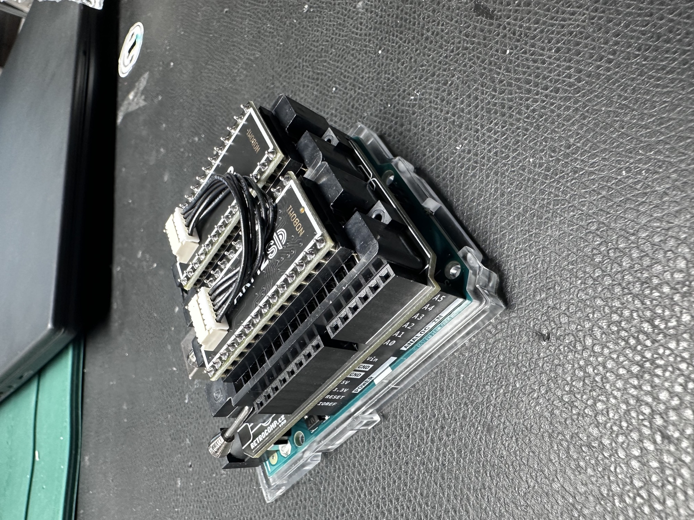
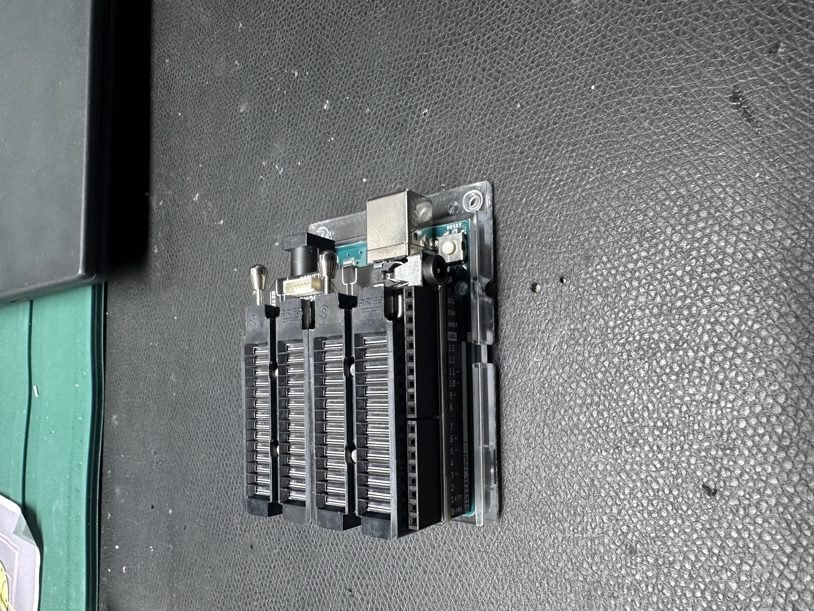
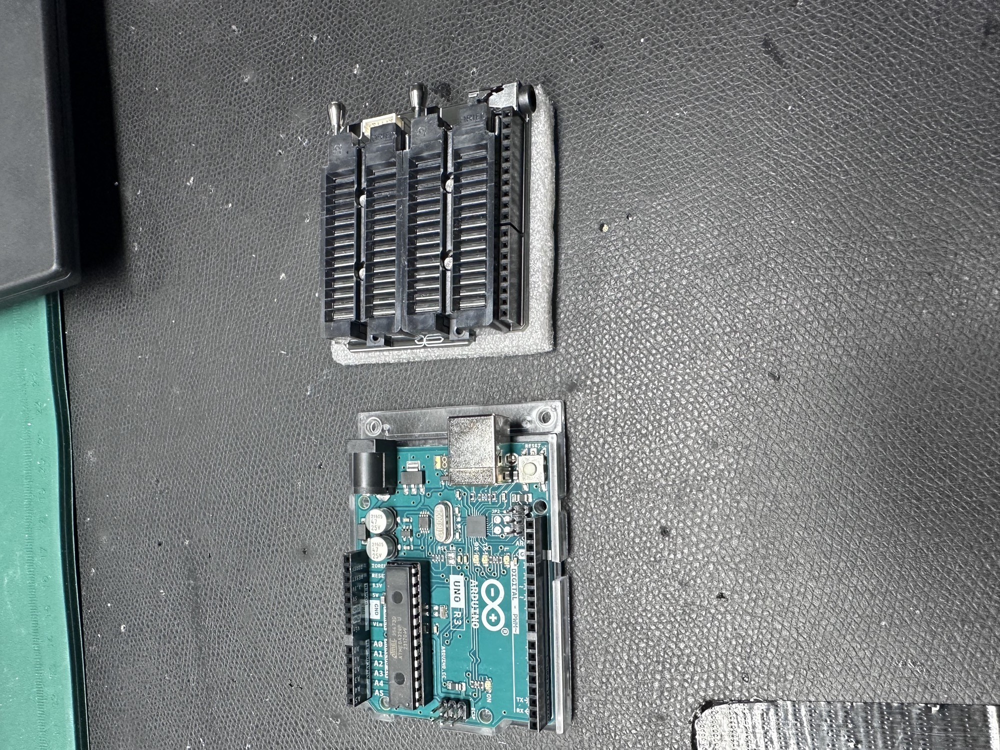

# SID Chips

Here are few infos about the SID Chips

[https://www.c64-wiki.de/wiki/SID](https://www.c64-wiki.de/wiki/SID)

| **TYP** |   |   | **Notes** |
|---|---|---|---|
| 8580 from MOS or CGS | works with 9V only |   | 22nF Filter capacitor |
| 6582 from MOS or CGS | works with 9V only |   | 22nF Filter capacitor |
| 6581 from MOS or CGS | works with 12V. (PSU Option B ) jumper power to 12V (close to the SID) | can be noisy as hell | 470pF Filter cap |
| ARMSID [https://retrocomp.cz/eshop](https://retrocomp.cz/eshop) | its a “emulation” of a 6581 or 8580” the mode can be changed in a arduino shield or with a C64. works without 9V/12V –  you need no jumper, its **powered with 5V directly**from the IC Socket. | beautiful sound and not noisy | no capacitor required |
| TwinSID | works without 9V/12V –  you need no jumper, its **powered with 5V directly** from the IC Socket. | its ok, but very noisy | no capacitor required |
| KunfuSID, TwinSID, FPGASID | not tested | not tested, but the FPGASID was tested by other MB6582 Users | no capacitor required |
|   |   |   |   |
|   |   |   |   |
| 6581 | 21/1982 bis 11/1985 | NMOS, Pin 28/Vdd = 12 V DC, je 470 pF an Pins 1+2/3+4 |   |
| 6581R3 | 42/1985 bis 07/1986 |   |   |
| 6581R4 | 16/1986 bis 30/1986 |   |   |
| 6581R4AR | 22/1986 bis 06/1987 | Im Vergleich zum R4 wurde die Siliziumqualität des IC geändert |   |
| 8580R5 | 06/1987 bis 19/1992 | HMOS-II, Pin 28/Vdd = 9 V DC, je 22 nF an Pins 1+2/3+4, Digisound ohne [Digifix](https://www.c64-wiki.de/wiki/Digifix) recht leise | 22nF Filter capacitor |

**ARMSID Source:**

[https://retrocomp.cz/eshop](https://retrocomp.cz/eshop)

you can use: ARMSID (buy 2) or you can buy the ARM2SID with socket and 5cm cable. (which is basically one ARMSID which offer “2 Soundcores”)

Sources for Arduino Shield to configure the ARMSID/ARM2SID with a Arduino Uno R3 and the ARMShield:

 [https://github.com/nobomi/Arduino-ARMSID-configurator/tree/main](https://github.com/nobomi/Arduino-ARMSID-configurator/tree/main)

or ask meto order and configure, update the ARMSIDs to your needs.

**ARMSID Doc for the MB6582**

[ARM2SID Setup for MB6582-2.pdf](assets/ARM2SID-Setup-for-MB6582-2.pdf)

