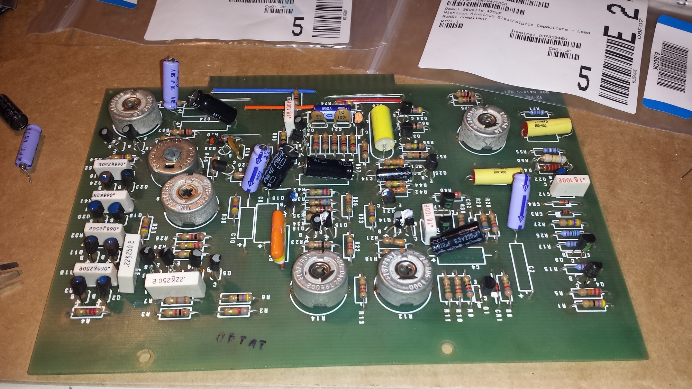
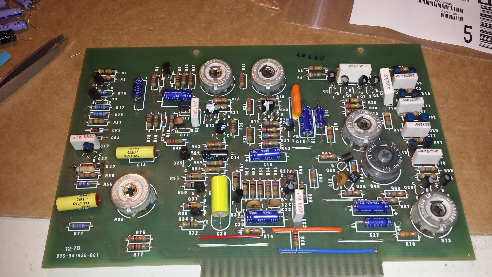
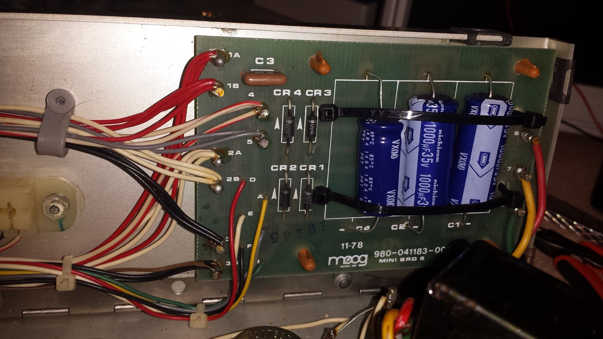

# Minimoog capacitors

**All electrolyte caps was replcaced by me**

on all pcbs !!

this list isn´t 100% correct.

**PSU caps:**

**important:**

**2x 1000uF 35V 105\***

**1x 470uf 35V 105\***

**Electrolyt:**

2,2uf  50V    x5

470uf 50v  x1

100uf 25v  x2

10uf 50v x2

**polyester:**

0,033uf 50v = 33nF  x1  (not changed)

0,12uf  50v = 120nF  x1  (not changed)

0,15uF  50v x3 (not changed)

0,1uF 50v  x3 (not changed)

5,6uF 50v x1 (not changed)

0,022uF 50V =22nF x1 (not changed)

**ceramic**

100pF 50V x4  (not changed)

220pF 50Vx1  (not changed)

47pf 50v x2 (not changed)

