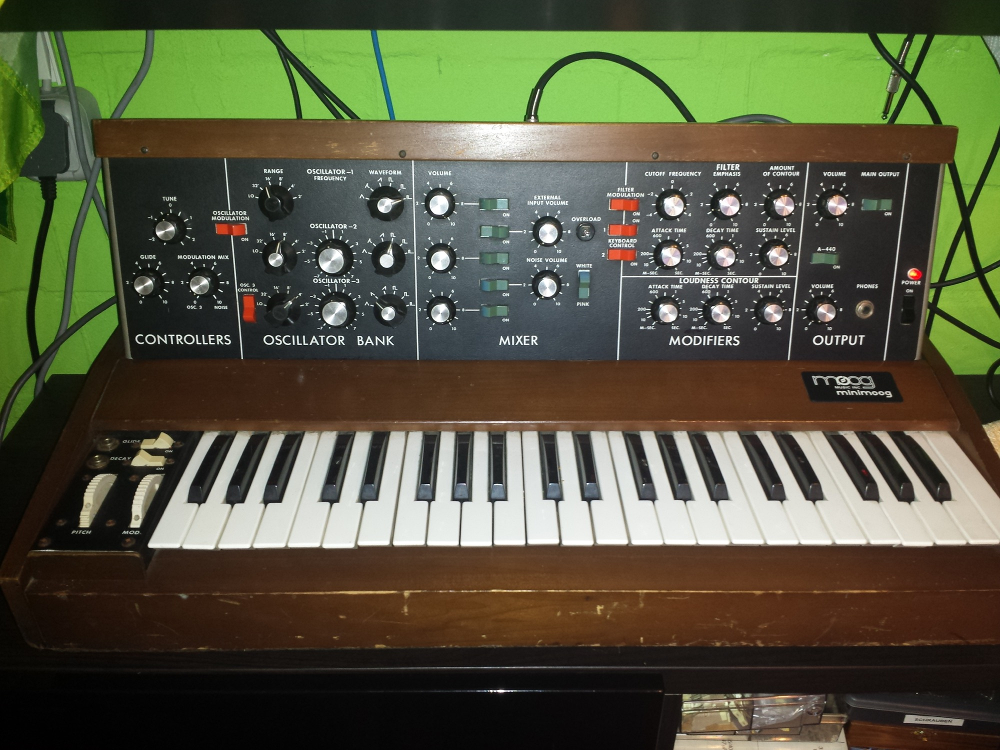
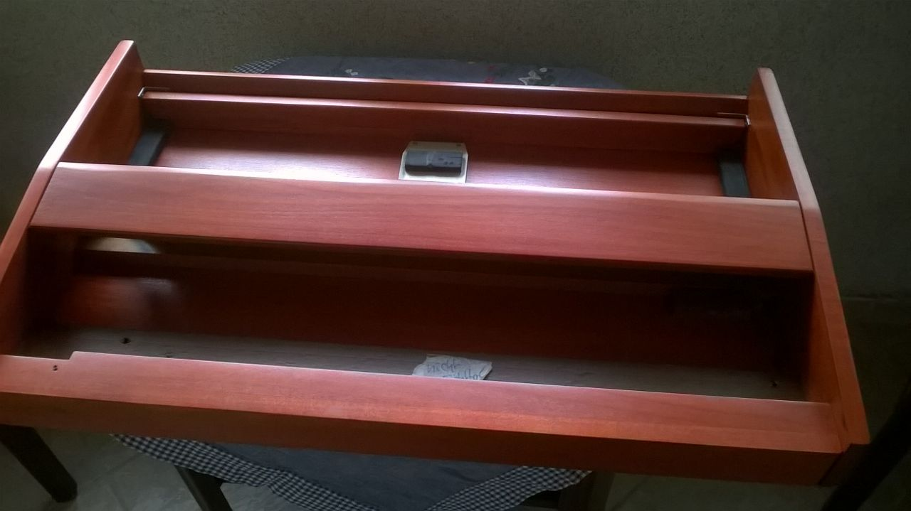
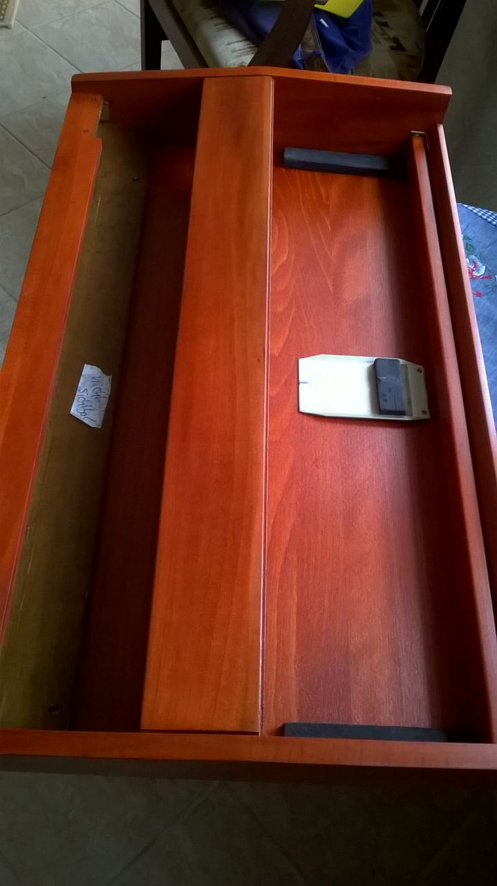

# Minimoog Case Restauration

> **Project**
>
> ### Projecttitel:Minimoog Case Restauration
>
> ### Status: `finsihed`
>
> ### Startdate: 03/2015
>
> ### Duedate: April 2015

after complete disassemble of the Minimoog, my Woodcrafter disassemble the case in all parts and dragged the wood parts,

with a special color mix was the case varnished in a red tone.

## **PRIOR:**

## **Later**

