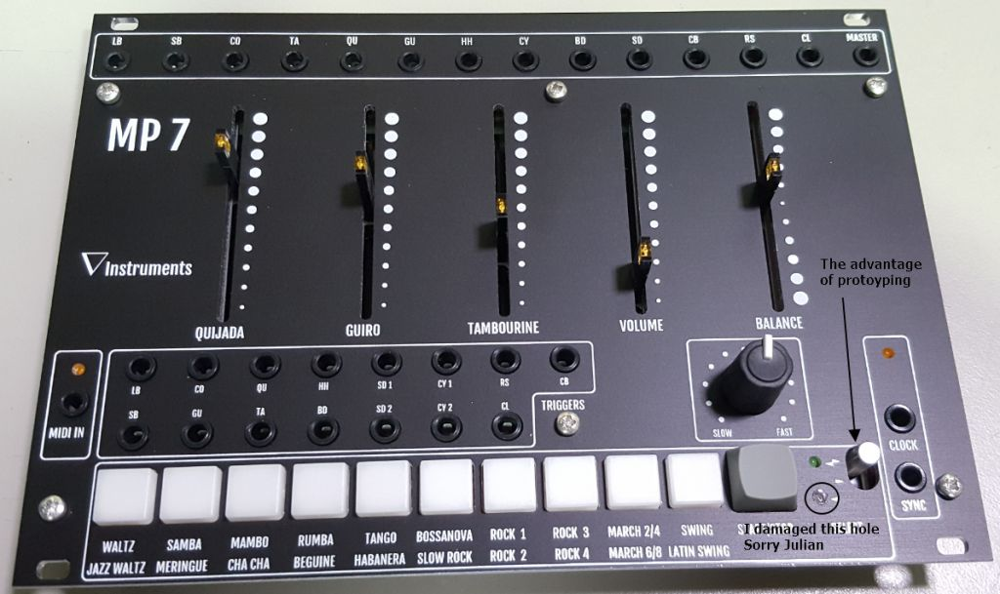

# Minipops MP7 clone

> **Project**
>
> ### Projecttitel: Minipops MP7 clone
>
> ### Status: `planning`
>
> ### Startdate: Jun 2018
>
> ### Duedate: Aug 2018
>
> ### Manufacture link: [https://www.muffwiggler.com/forum/viewtopic.php?t=194996](https://www.muffwiggler.com/forum/viewtopic.php?t=194996)

> **Achtung**
>
> there are 2 "products" available
>
> MiniMP7 &gt; bigger but less functions
>
> MP7 &gt; smaller but more functions

> **Info**
>
> copyright/IP info:   i´m not the resonsible person for the "products", its here just an documentation about this projects.

## Info thread of both devices:

[https://www.muffwiggler.com/forum/viewtopic.php?t=194996](https://www.muffwiggler.com/forum/viewtopic.php?t=194996)

## MP7 thread:

[https://www.muffwiggler.com/forum/viewtopic.php?t=199361&sid=421908c354d1b6e6a1d60b30ff72b731](https://www.muffwiggler.com/forum/viewtopic.php?t=199361&sid=421908c354d1b6e6a1d60b30ff72b731)

## MiniMP7 thread:

[https://www.muffwiggler.com/forum/viewtopic.php?t=199360&start=0](https://www.muffwiggler.com/forum/viewtopic.php?t=199360&start=0)

