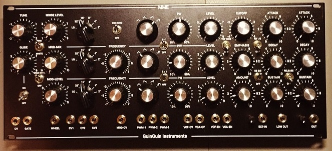
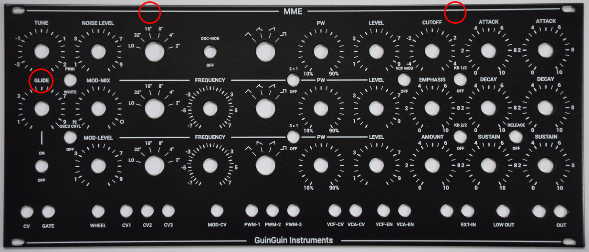
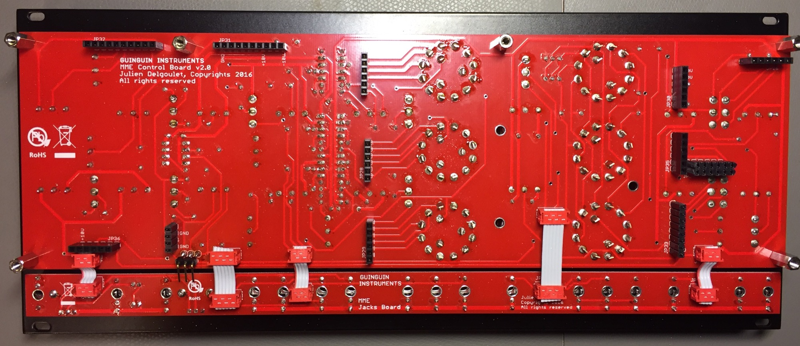
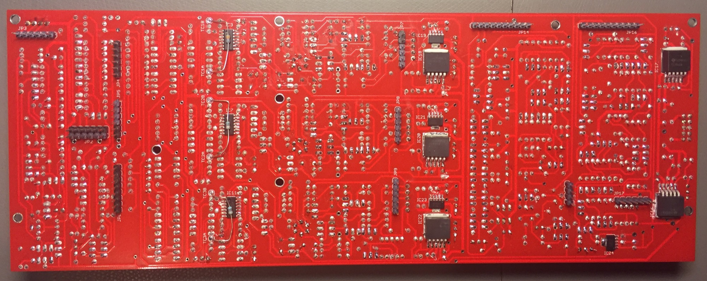
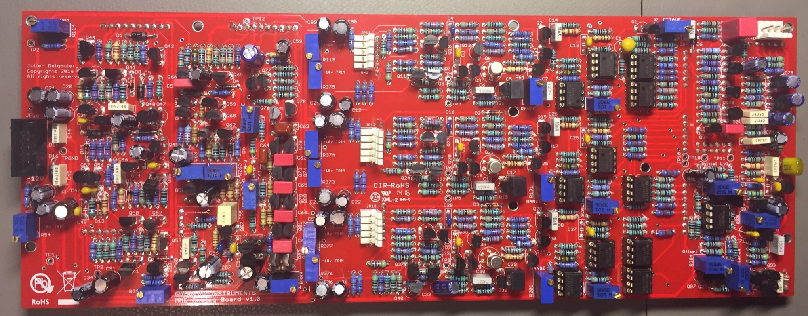
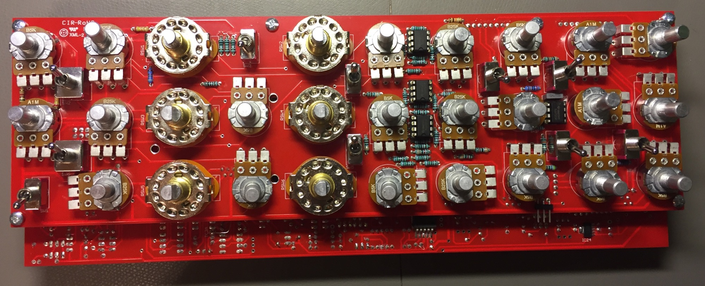

# MME Minimoog Clone guinguin

> **Project**
>
> ### Projecttitel: MME Minimoog Clone guinguin
>
> ### Status: `done`
>
> ### Startdate: 07 Aug.2017
>
> ### Duedate: 23.08. 2017
>
> ### Last Update 03 Sept. 2024
>
> ### Manufacture link: [https://guinguin-instruments.github.io/MME](https://guinguin-instruments.github.io/MME)

### Manufacture link: [https://guinguin-instruments.github.io/MME](https://guinguin-instruments.github.io/MME)

**Shop:**

[https://guinguin-instruments.ecwid.com/](https://guinguin-instruments.ecwid.com/)

**rare Parts**

3x LM3046M  ask me if you can't find it

3X 2N3954 (tested) avaiable on [diysynth.de](http://diysynth.de)

3x 2N4402 (tested)    ask me if you can't find it

2x BF245  (tested)    ask me if you can't find it

3x 1K Tempco avaiable on diysynth.de

**muffwiggler thread:**

[https://www.muffwiggler.com/forum/viewtopic.php?t=126711&postdays=0&postorder=asc&start=1175](https://www.muffwiggler.com/forum/viewtopic.php?t=126711&postdays=0&postorder=asc&start=1175)

**modified BOM: (my BOM list)**

[minimoog.xlsx](assets/minimoog.xlsx) 

check  for the original BOM: [https://guinguin-instruments.github.io/MME](https://guinguin-instruments.github.io/MME)

[All.ods](https://guinguin-instruments.github.io/MME/files/All.ods).  you can also use this file and open it with  OpenOffice - export it to a CSV file and import it on mouser import tool.  

> **Info**
>
> ### important
>
> update 2024:   don't use low ESR Caps at the LDO outputs (LM2991/LT1963) otherwise you can run in unstable Voltages, Defect regulators, circuit swings - ripple.

I ordered from: TME, mouser, thonk and musikding

my mouser cart: [http://www.mouser.com/ProjectManager/ProjectDetail.aspx?AccessID=0901ddef92](http://www.mouser.com/ProjectManager/ProjectDetail.aspx?AccessID=0901ddef92)

this cart is limited to my own usage for one device - you need to order standard parts like resistors from another source to save money.

for male/female headers use a different brand or headers with more pins in case they're out of stock.

> **Info**
>
> order 10 resistors instead of 2 and you'll get the better price.

| **supplier** |   |   |   |
|---|---|---|---|
| mouser | 92€ |   |   |
| tme | 45€ |   |   |
| thonk | 20€ |   |   |
| musikding | 40€ |   |   |
| homestock parts | 20€ |   |   |
| mouser trannys und 4402,bf245 | 60€ |   |   |
|   |   |   |   |
| TOTAL | ca.280€ |   |   |

not including all ic-sockets

> **Build Notice**
>
> 1. Don´t install the header as described at the beginning of the build - otherwise you run in trouble ( normally is the process: put the male and female header together, put it on one board and use spacers and screws to hold this in correct place/alignment,
>
> then solder the male/female header. this is the only way to get a correct alignment of the pcbs and frontpanel.
>
> 2. solder the 4x TL1963 and lm2991 not to close together - or you risk a short between the solder points or regulators.
>
> 3. use matched transistor pairs as described in the buildguide, but from my pov. you cant match a 2N3904 and 2N3906 to the same value.
>
> make sure you installed a jumper on JP10(2pins)  and JP19 (3pins) (bridge the second and third pin with a PC jumper)

(my analog board picture shows my build with one failure - near the 2N4402 are 56K instead of 56R in the picture)
