# Nava TR-909 Clone

> **Project**
>
> ### Projecttitel:Nava TR-909 Clone
>
> ### Status: `finished`
>
> ### Startdate: 01. May 2016
>
> ### Duedate: July 2016
>
> **updated Jan  2026 noise mod Gerber**
>
> ### Manufacture link: [http://www.e-licktronic.com/en/nava-parts-kit/50-nava-tr909-clone.html](http://www.e-licktronic.com/en/nava-parts-kit/50-nava-tr909-clone.html)

**Table of Contents**

## BOM: v1.0

[Nava\_v1.0l\_Bom.pdf](assets/Nava_v1.0l_Bom.pdf)

[Interactive BOM.zip](assets/Interactive-BOM.zip)

[https://www.youtube.com/watch?v=XhW09354Q4I](https://www.youtube.com/watch?v=XhW09354Q4I)

## Bugs

**update the Firmware  to v1.023 (30 May 2017)**

###### **(current:**[**http://www.e-licktronic.com/forum/download/file.php?id=106**](http://www.e-licktronic.com/forum/download/file.php?id=106)**)**

**Release Notes:**

###### [**http://www.e-licktronic.com/forum/viewtopic.php?f=25&t=864&p=4853#p4853**](http://www.e-licktronic.com/forum/viewtopic.php?f=25&t=864&p=4853#p4853)

###### **You should replace C89 (BD-Section) and C163 (Snare Section) by 10nF filmcap (Build manual and Mouser BOM updated)**

**HH Bug**

###### [http://www.e-licktronic.com/forum/viewtopic.php?f=24&t=1233&p=7905#p7905](http://www.e-licktronic.com/forum/viewtopic.php?f=24&t=1233&p=7905#p7905)

**MIDI SYNC ISSUE** (only if happen)

###### Sync test in slave mode with a TR505 and with Ableton and Midi interface.

###### Sync with hardware is perfect but Nava loose some clock signal when sync with a software thru a Midi interface.

###### Replace R365 value by 1K and R314 value by 4K7 to increase Midi signal should solve this issue or by replacing the Transistor on the switchboard (higher HFE)

**only for rev.1.00 pcb: (not for 1.01, 1.02)**

> **Achtung**
>
> **Issues: (respect the change for C89 and C163 too (to 10nF)**
>
> Afaik the first pcb (v1.0 ) has 3 bugs, all of them are highlighted in red in the build guide and are easy to fix.
>
> **BD:** [http://www.e-licktronic.com/forum/viewtopic.php?f=24&t=889&start=50#p6085](http://www.e-licktronic.com/forum/viewtopic.php?f=24&t=889&start=50#p6085)
>
> **SD:** [http://www.e-licktronic.com/forum/viewtopic.php?f=24&t=970&hilit=snare+q43&start=40#p5823](http://www.e-licktronic.com/forum/viewtopic.php?f=24&t=970&hilit=snare+q43&start=40#p5823)
>
> Q43, Q46, Q49  Mixed Collectors and Emitters
>
> This is a mistake. When we designed Nava SD PCBs, we placed this transistor to act like switches to generate SD envelopes. We had some sound test and it was okay for us but this transistors should act like amplifier.
>
> To solve this issue you need to bend transistors pin 1 and 2 to swap their position in the pad.
>
> **Master:** [http://www.e-licktronic.com/forum/viewtopic.php?f=24&t=850&hilit=master+mods&start=10#p4855](http://www.e-licktronic.com/forum/viewtopic.php?f=24&t=850&hilit=master+mods&start=10#p4855)
>
> To bypass the muting circuit simply omit both transistors Q82 and Q83 and you don't need all part from the muting circuit (C142, C143, D193, D194, D195, R468, R469, R470, R471, R472)

**open:** check in BD C8 for closer BD Decay (the Nava Decay is bigger as the original)

modify C153/ C154 to 10uF  check: [http://www.e-licktronic.com/forum/viewtopic.php?f=24&t=850&hilit=master+mods&start=50](http://www.e-licktronic.com/forum/viewtopic.php?f=24&t=850&hilit=master+mods&start=50)   &  [https://www.gearslutz.com/board/electronic-music-instruments-electronic-music-production/584333-tr909-owners-stereo-out-less-bass-than-individual.html](https://www.gearslutz.com/board/electronic-music-instruments-electronic-music-production/584333-tr909-owners-stereo-out-less-bass-than-individual.html)

## MODIFICATION:

my version was build with addon second Noise source for fixing the loudness balance with snare and handclap

Gerber File v3 from Altitude :

[909-noise.zip](assets/909-noise.zip)

[https://www.e-licktronic.com/forum/viewtopic.php?t=837&start=70](https://www.e-licktronic.com/forum/viewtopic.php?t=837&start=70)

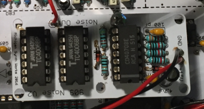

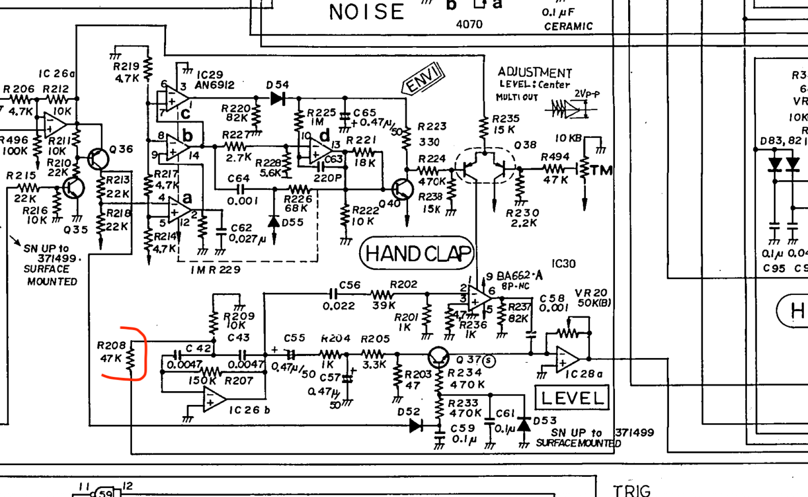

**Installation**: Remove ONE side of R208 (the side connected to pin 9 IC33, the other side is connected to R209) and solder a wire from the NOISE output of the new noise board to that leg of the resistor.

Connect +15V and GND to the noise board wherever convenient

**MUX BOARD:**

[S\_H Board v1.00\_SCH.pdf](assets/S_H-Board-v1.00_SCH.pdf)

[https://www.e-licktronic.com/forum/viewtopic.php?t=1549](https://www.e-licktronic.com/forum/viewtopic.php?t=1549)

IC111 an 114 need a milled pin socket or adapter

Nava 2: You must unsolder C517, C518, C519, C89 (BD), C163 (SD), C164 (LT), C165 (MT), C166 (HT), C167 (RS), C168 (HC)
**If you have Nava v1.02 PCB go to step 3 those capacitors are not on the PCB (no further changes required)**

power for the Dmux pcb comes from J15

**Bill of Materials from S\_H Board v1.00.sch, 16 parts, grouped by values, as of 26/09/2017 10:33:34**

|   |   |   |   |   |   |
|---|---|---|---|---|---|
| **Part** | **Value** | **Device** | **Package** | **Description** | **Qty** |
| C1, C2, C3, C4, C5, C6, C7, C8 | 470p | C-EUC0805 | C0805 | CAPACITOR, European symbol | 8 |
| C9, C10 | 100n | C-EUC0805 | C0805 | CAPACITOR, European symbol | 2 |
| ~~IC1~~ | ~~4051A~~ | ~~4051A~~ | ~~DIL16-S~~ | ~~8-channel ANALOG MULTIPLEXER~~ | 1 |
| IC2 | 4051D | 4051D | SO16 | 8-channel ANALOG MULTIPLEXER | 1 |
| IC3, IC4 | TL074D | TL074D | SO14 | OP AMP | 2 |
| J1, J2 |   | MA03-1 | MA03-1 | PIN HEADER | 2 |

**Power connection with MTA156**

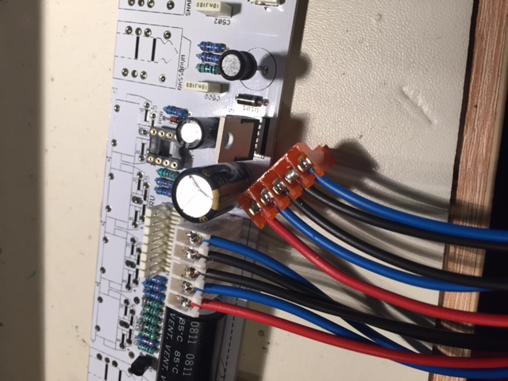

### **Schematics:**

[Nava\_v1.0l\_Schematics.pdf](assets/Nava_v1.0l_Schematics.pdf)

### PCB Silkscreen

[Nava\_v1.0 silkscreen.rar](assets/Nava_v1.0-silkscreen.rar) (brd File)

### PCB layout:

[Nava\_v1.0l\_PCBs\_Top.pdf](assets/Nava_v1.0l_PCBs_Top.pdf)

[Nava\_v1.0l\_PCBs\_Bottom.pdf](assets/Nava_v1.0l_PCBs_Bottom.pdf)

**Manual:**

- [S_H Board v1.00_SCH.pdf](assets/S_H-Board-v1.00_SCH.pdf)
- [Nava_v1.0l_PCBs_Bottom.pdf](assets/Nava_v1.0l_PCBs_Bottom.pdf)
- [Nava_v1.0l_Bom.pdf](assets/Nava_v1.0l_Bom.pdf)
- [Nava_v1.0l_Schematics.pdf](assets/Nava_v1.0l_Schematics.pdf)
- [Nava_v1.0l_PCBs_Top.pdf](assets/Nava_v1.0l_PCBs_Top.pdf)
- [IMG_2723.JPG](assets/IMG_2723.jpg)
- [IMG_2728.JPG](assets/IMG_2728.jpg)
- [IMG_2729.JPG](assets/IMG_2729.jpg)
- [IMG_2726.JPG](assets/IMG_2726.jpg)
- [IMG_2727.JPG](assets/IMG_2727.jpg)
- [FullSizeRender.jpg](assets/FullSizeRender.jpg)
- [IMG_2724.JPG](assets/IMG_2724.jpg)
- [image2016-7-26 14:30:53.png](assets/image2016-7-26-14-30-53.png)
- [IMG_2721.JPG](assets/IMG_2721.jpg)
- [IMG_2112.JPG](assets/IMG_2112.jpg)
- [image2016-7-26 14:32:51.png](assets/image2016-7-26-14-32-51.png)
- [Nava_v1.0 silkscreen.rar](assets/Nava_v1.0-silkscreen.rar)
- [Nava v1.0 user manual.pdf](assets/Nava-v1.0-user-manual.pdf)
- [IMG_2116.JPG](assets/IMG_2116.jpg)
- [IMG_2118.JPG](assets/IMG_2118.jpg)
- [Interactive BOM.zip](assets/Interactive-BOM.zip)
- [909-noise.zip](assets/909-noise.zip)
- [Bildschirmfoto 2026-02-12 um 12.10.41.png](assets/Bildschirmfoto-2026-02-12-um-12.10.41.png)

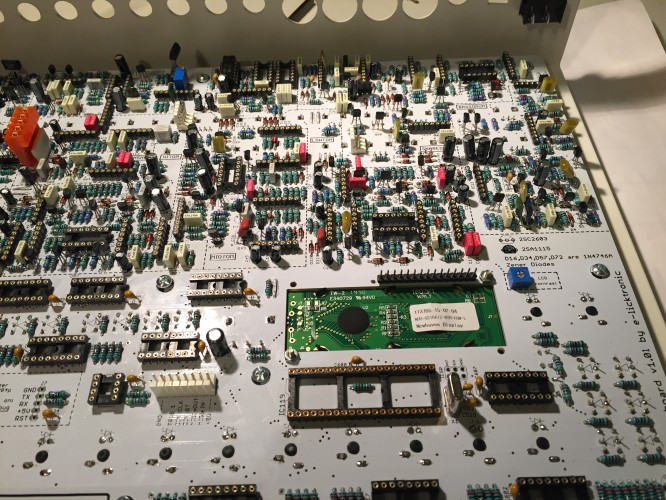

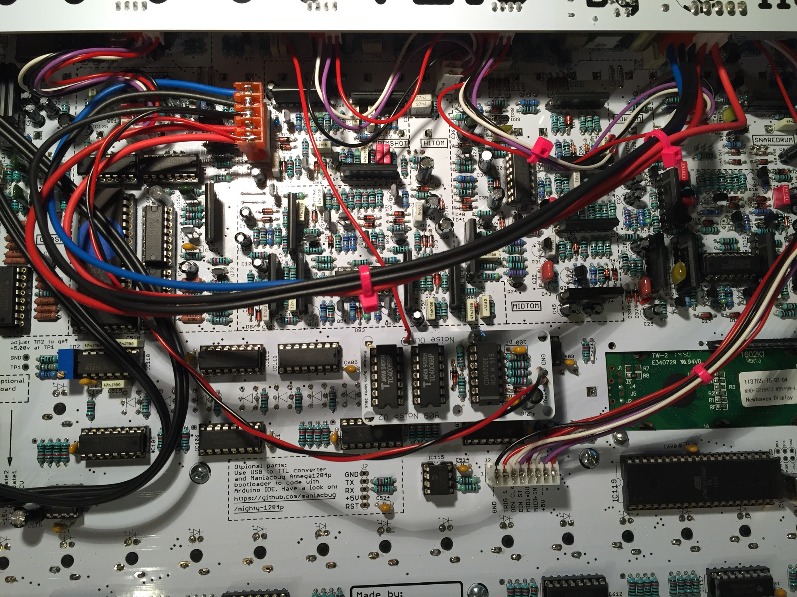

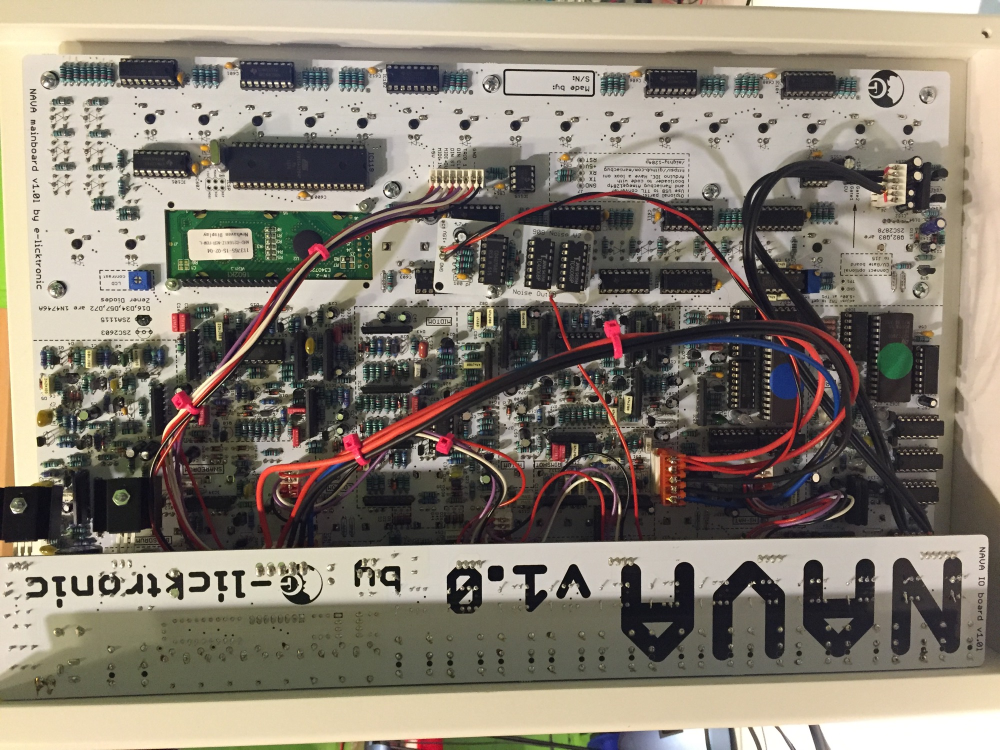

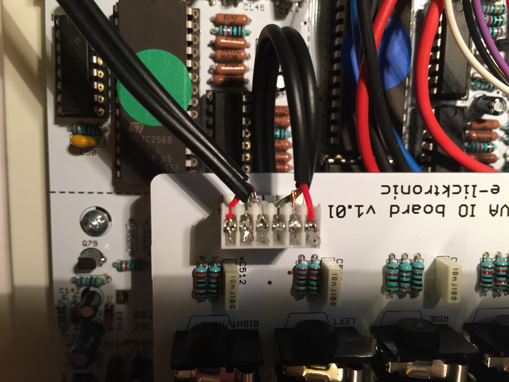

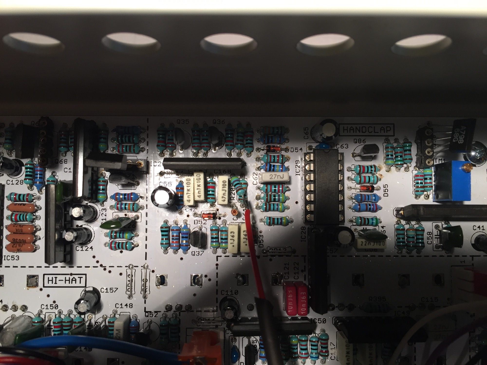

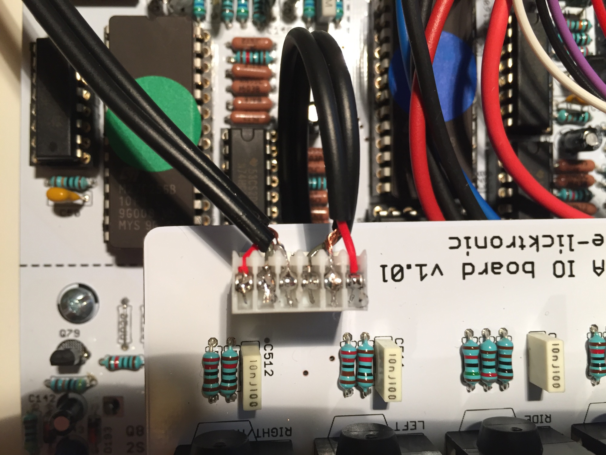

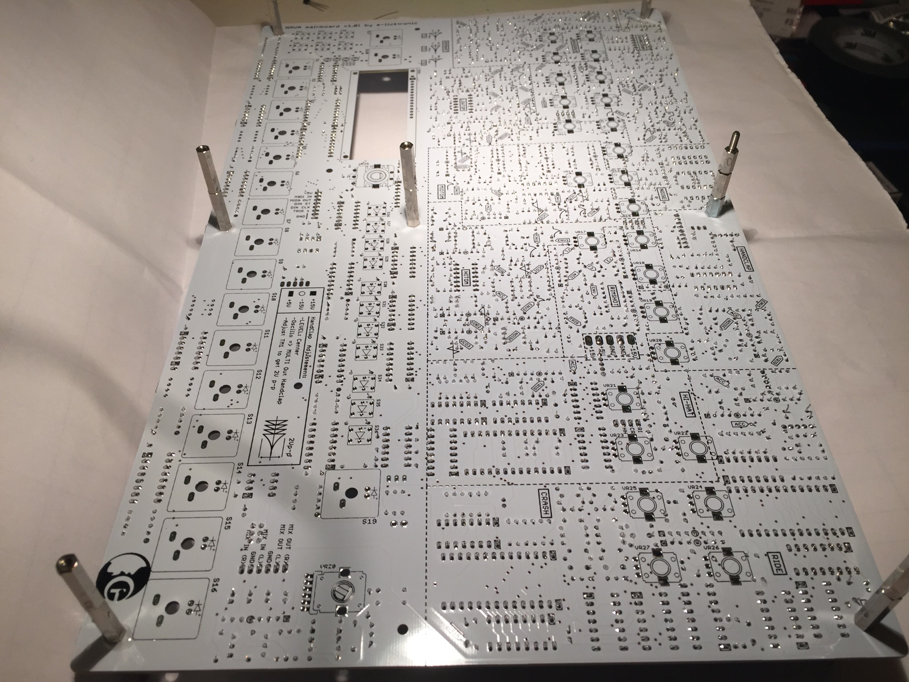

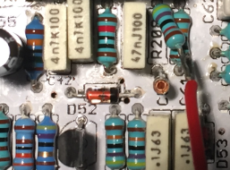

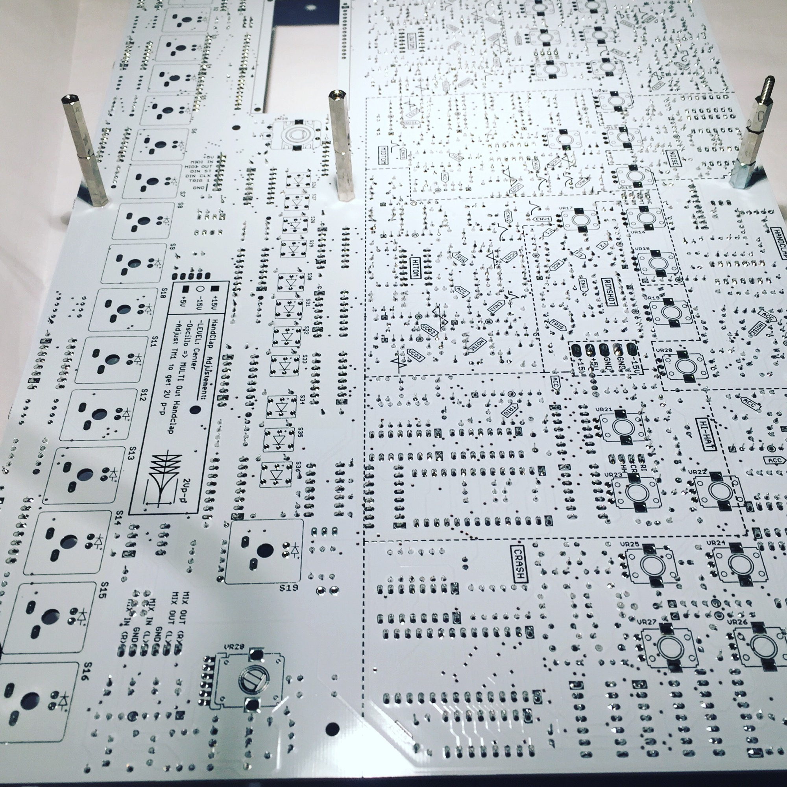

