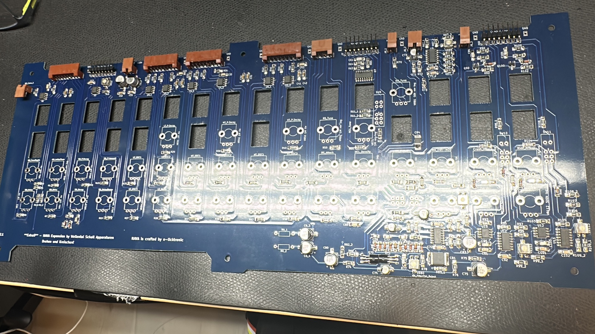
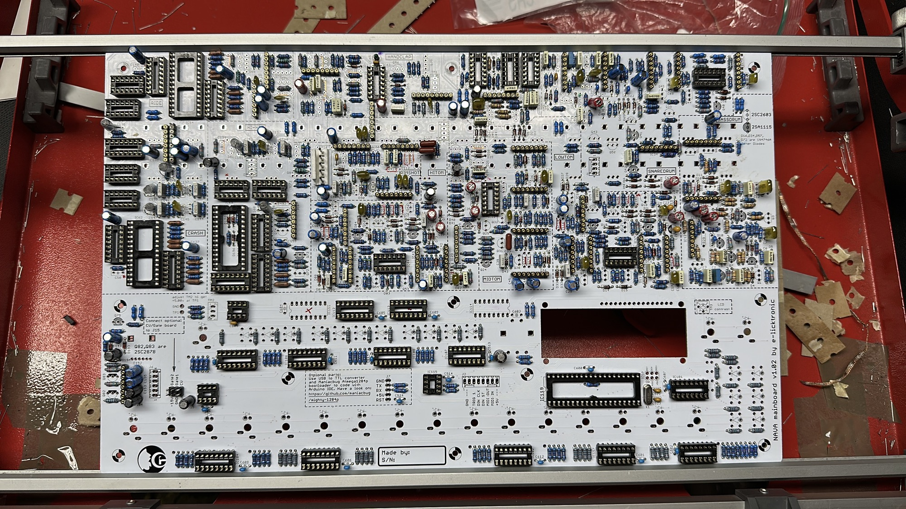
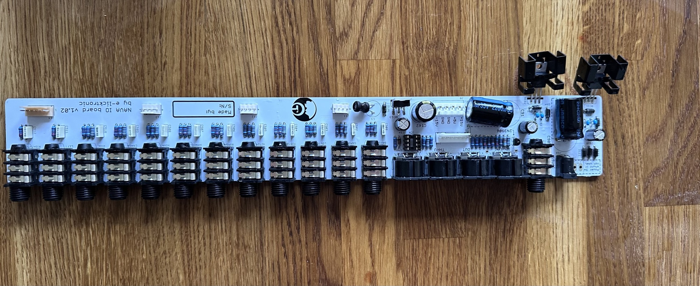
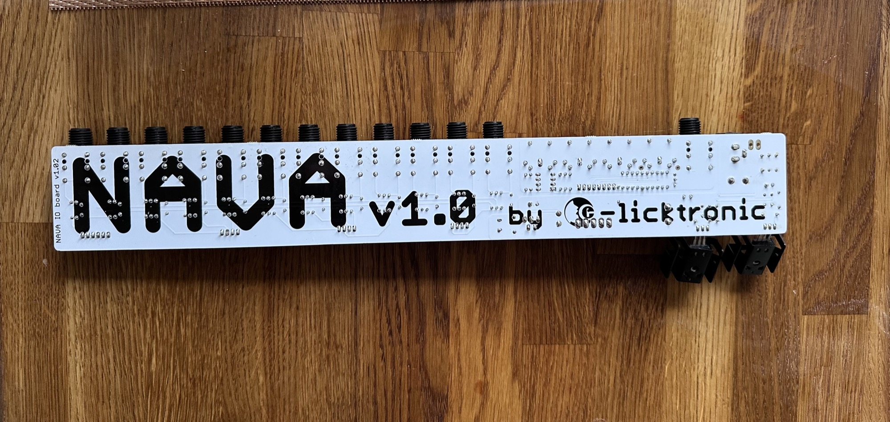
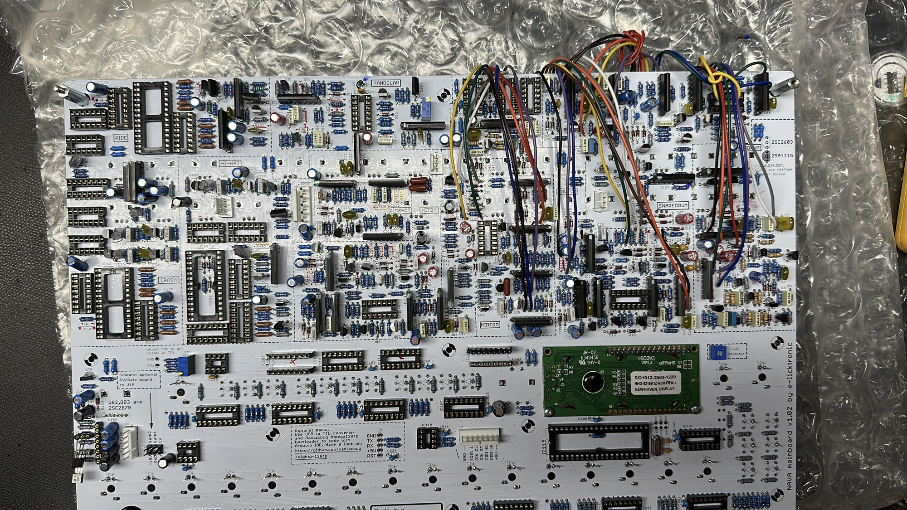
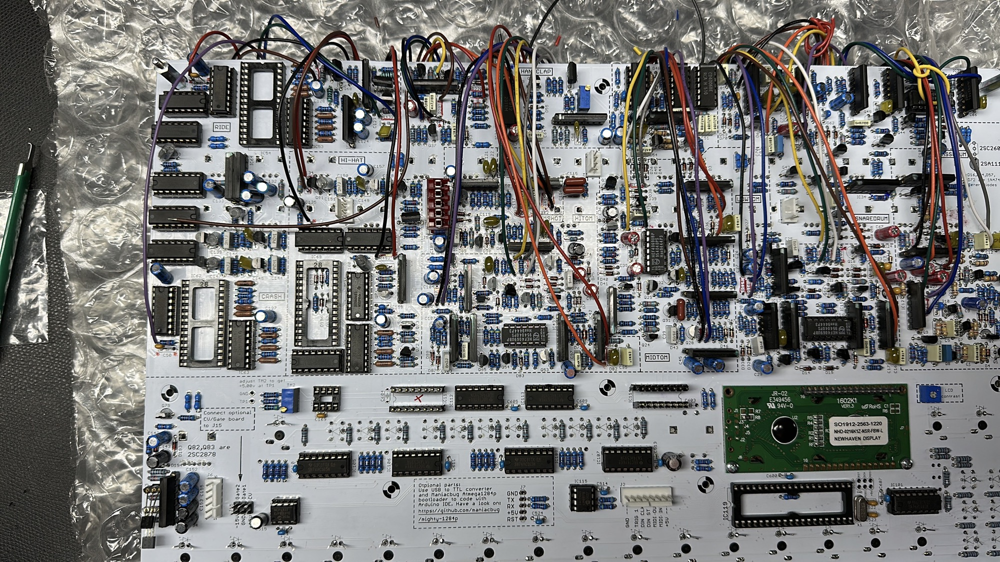

# Nava Extra9

Build in 2025

helpful for Troubleshooting: look at my [RE-909 pages](../../re-909-tr-909-replica/index.md)

[Extra9\_schematics.pdf](assets/Extra9_schematics.pdf)

[Nava\_v1.0l\_Bom.pdf](assets/Nava_v1.0l_Bom.pdf)

[Extra9\_InstallationManual\_V1.03.pdf](assets/Extra9_InstallationManual_V1.03.pdf)

[e-licktronic Nava TR-909 clone assembly guide.pdf](assets/e-licktronic-Nava-TR-909-clone-assembly-guide.pdf)

[Extra9\_UserBOM\_2ndRun\_20190501.ods](assets/Extra9_UserBOM_2ndRun_20190501.ods)

[Nava\_v1.0l\_Schematics.pdf](assets/Nava_v1.0l_Schematics.pdf)

