# Oakleysound SE330 meets HVM

> **Project**
>
> ### Projecttitel: Oakleysound SE330 meets HVM
>
> ### Status: `FinISHED`
>
> ### Startdate: Nov.2014
>
> ### Duedate: May 2015
>
> ### Manufacture link: [http://oakleysound.com/hvm.htm](http://oakleysound.com/hvm.htm) [http://oakleysound.com/se330.htm](http://oakleysound.com/se330.htm)

OPA2134PA from TME.eu  each 1,20€  was special offer price

case: [http://www.musikding.de/19-Gehaeuse-1HE](http://www.musikding.de/19-Gehaeuse-1HE)

**Frontpanel:**

**FPD File: final for musikding 19" case    [se330\_meets\_HVM\_final2.fpd](assets/se330_meets_HVM_final2.fpd)   -&gt; the file isnt correct for every 19" Rack case. please double check and change the distance between HVM OUT and SE330 Input, the pcbs are too close together.**

## Building Guides:

HVM [hvm1-bg.pdf](assets/hvm1-bg.pdf)

SE330:[sem2-bg.pdf](assets/sem2-bg.pdf)

**COSTS:**

TME  28€

pcbs 104€

19" case: with shipping 39€

ICs /reverb driver, DG0403, pots  11€ + 35€ +5€ =  51€

mouser caps 15€

resistors, cables, jacks, diodes, sockets, trimmer, pcb wash material 50€

powersupply, fuse 18€

panel 61€

shipping costs from 4 suppliers 25€

screws, knobs,pots around 40€

= 421€

---

## Build

**Problem:**

Playing close spaced notes, eg. standard chords, in higher octaves at high signal levels can cause noticeable distortion within the BBDs. If you haven't noticed a problem then you can ignore this change note. 

**Cause:**

The SE330, like most other BBD circuits, uses pre-emphasis and de-emphasis circuitry to reduce the effects of high frequency noise generated by the BBDs. This boosts high frequency signals on the way into the delay lines, and cuts them on the way out. The system works well but assumes that the signal input is predominantly below 2kHz as it would be with vocals, guitar and 'normal' instruments. 

However, if the signal contains a great number of high frequencies then the boost given by the pre-emphasis is just too much for the BBDs to cope with and they distort. The companding noise reduction system will be able to cope with simple sets of high frequencies and will reduce the signal level accordingly and prevent distortion, but complex high frequency clusters confuse the compander and the signal levels are not tamed in a beneficial way. 

**Solution:**

Reduce the amount of pre-emphasis and de-emphasis accordingly. 

for Issue 1 (**pcb rev.1**): Make R109, R118 & R143 all 15K resistors. Make C61, C77 & C96 all 1nF capacitors. 

for Issue 2(pcb **rev.2**) : Make R156, R187 & R184 all 15K resistors. Make C110, C118 & C119 all 1nF capacitors. 

There is an argument to remove all the components above and allow the full range signal to both enter and leave the BBDs unaffected. This does increase the noise level slightly but reduces the risk of any surprises when you go for that highest Cm13. 

You may also experiment with the capacitor values and any value between the original 6n8 and 680pF are worthy contenders. The smaller the value the higher the frequency that the emphasis/de-emphasis band starts. Note: that all three sets of components must be the same value so as to make the de-emphasis exactly cancel out the effects of the emphasis circuit. 

---

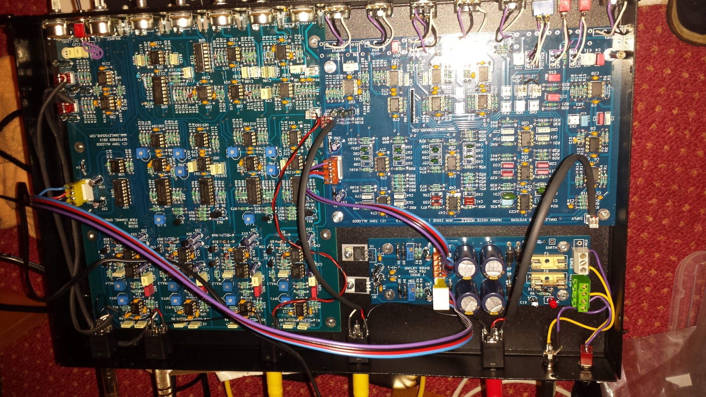

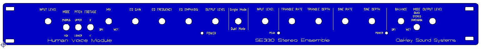

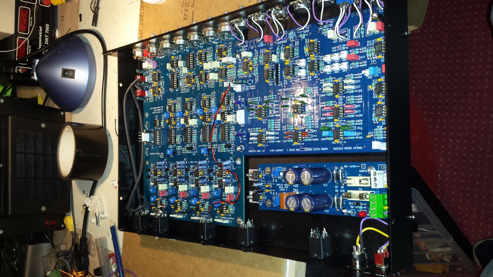

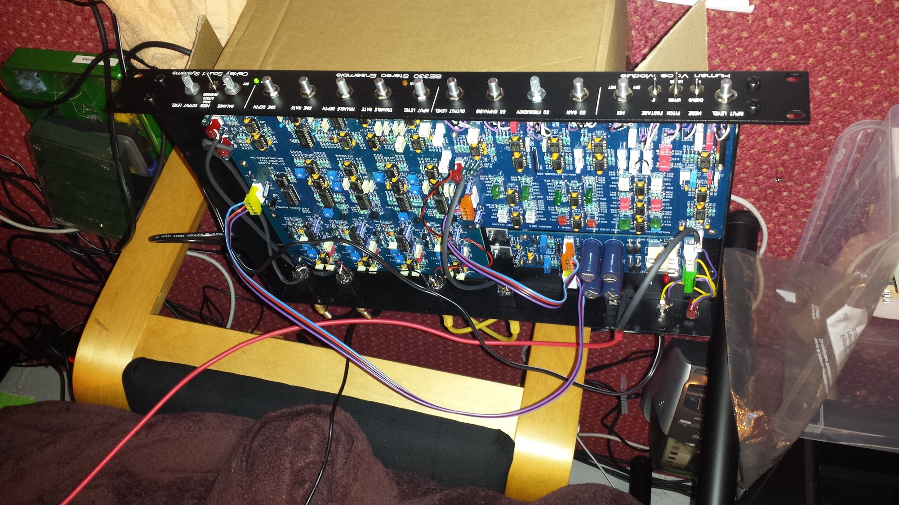

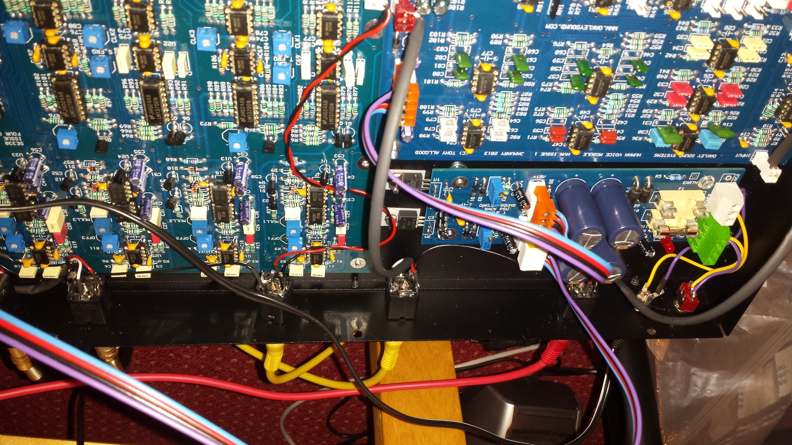

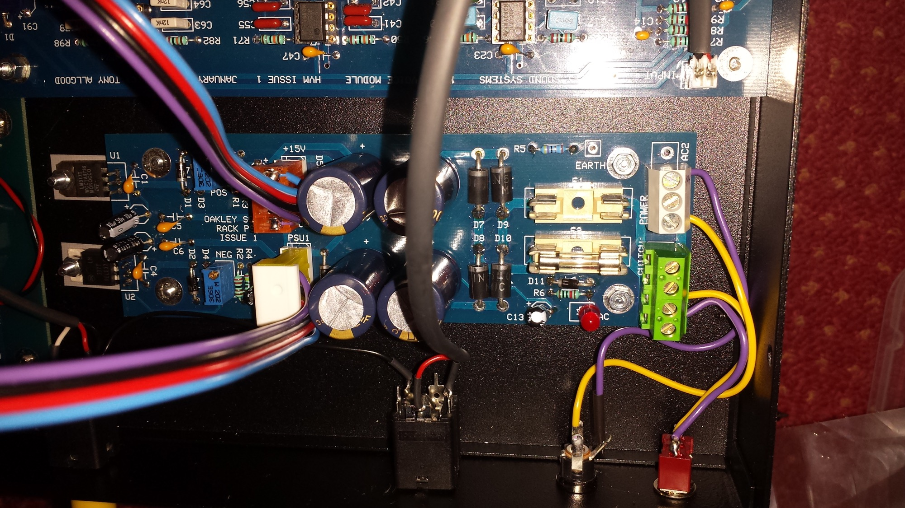

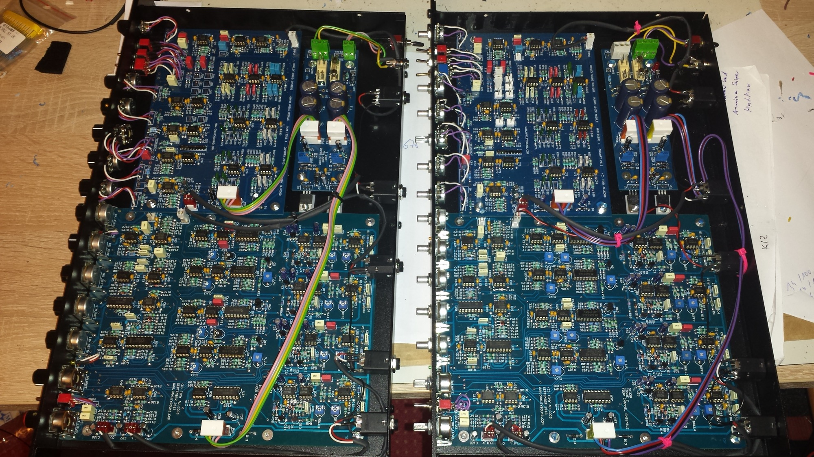

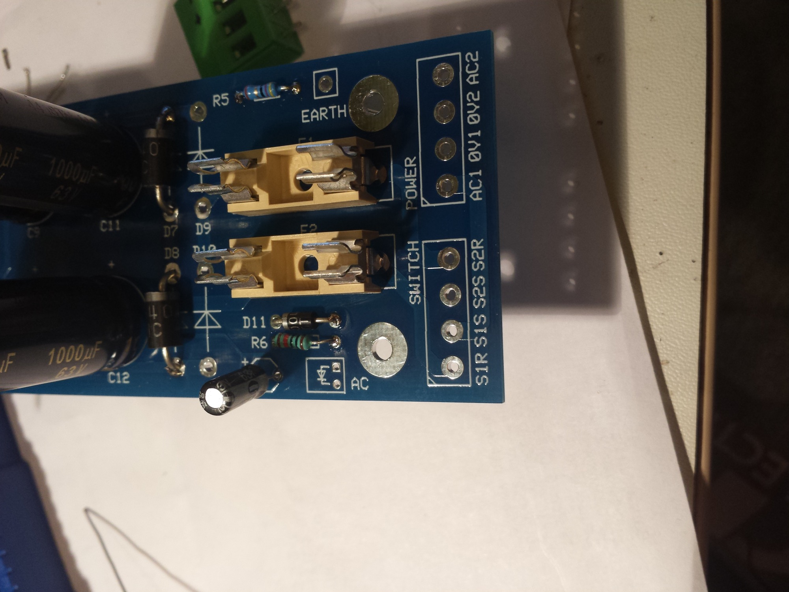

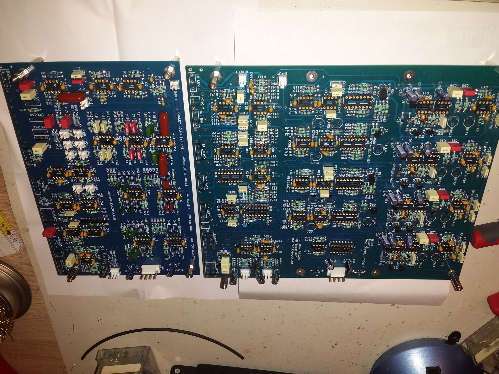

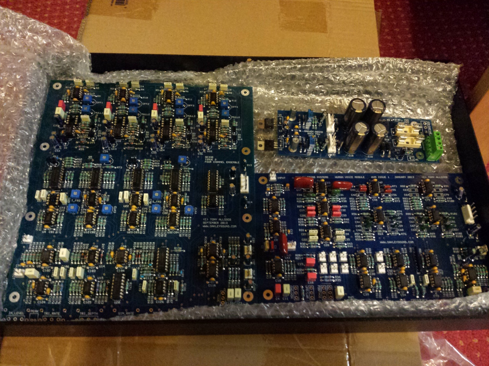

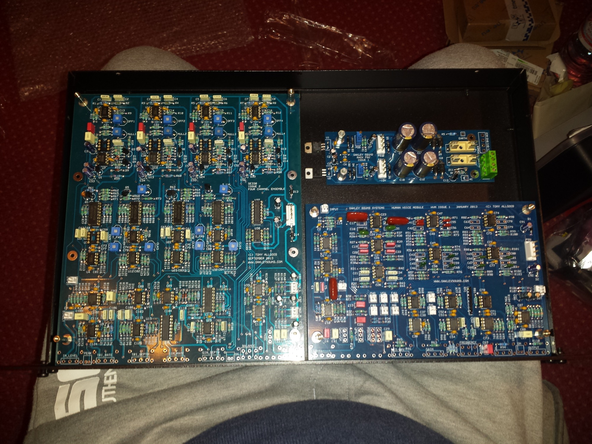

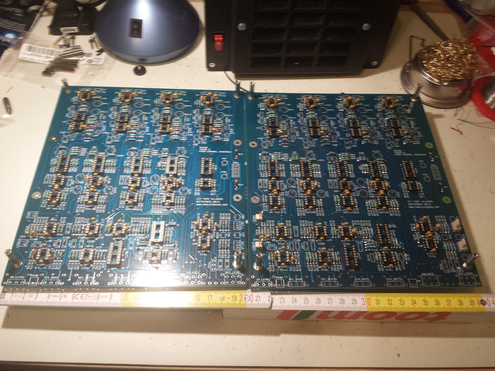

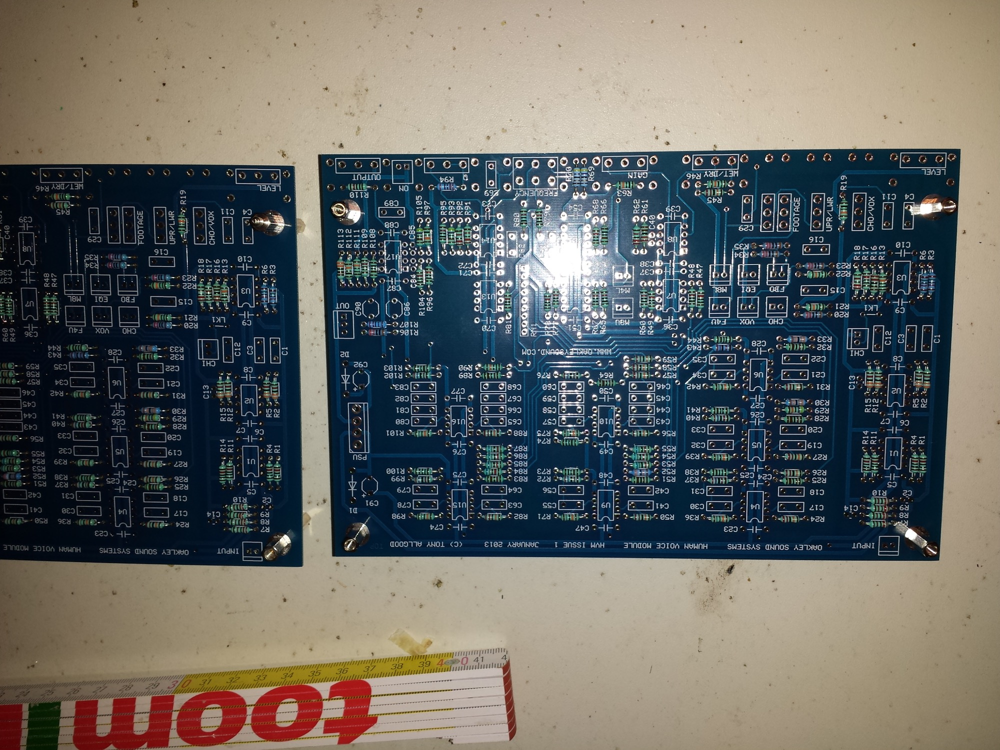

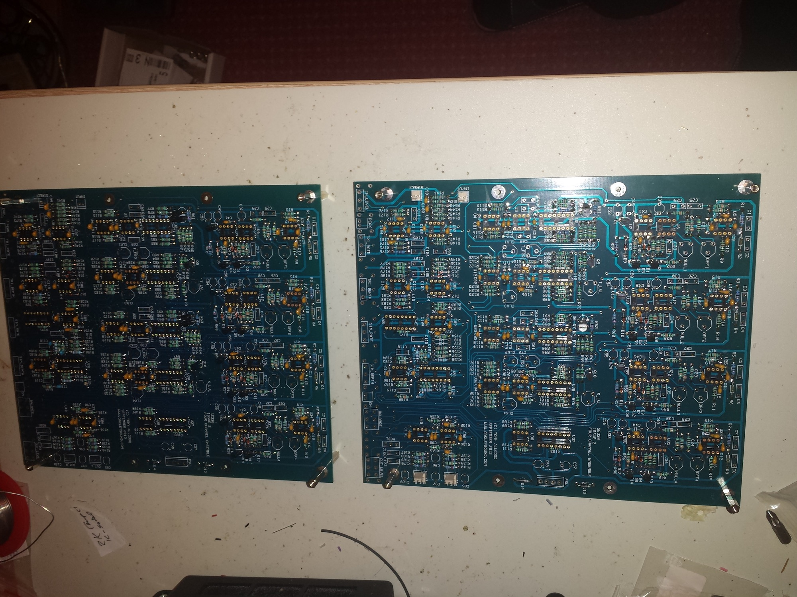

