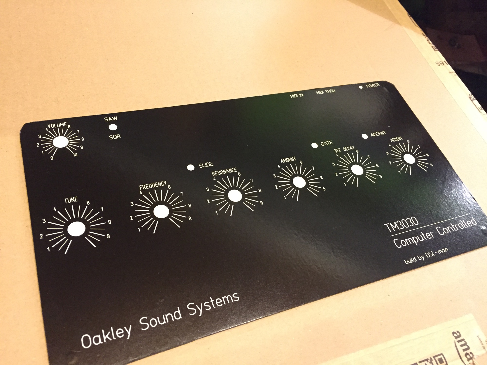
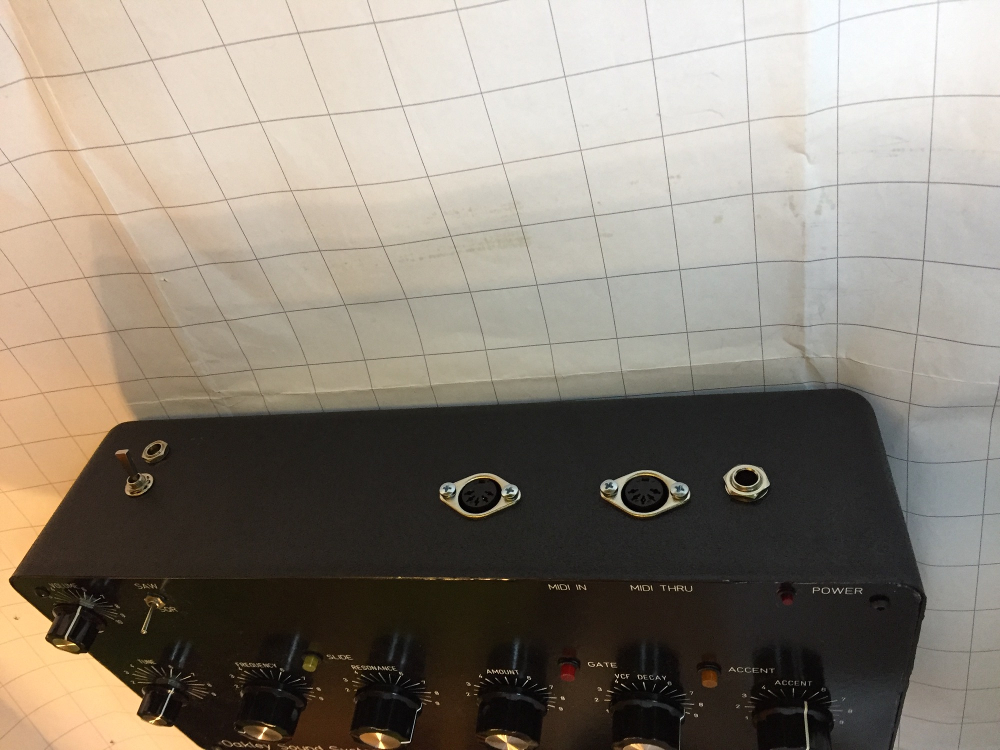
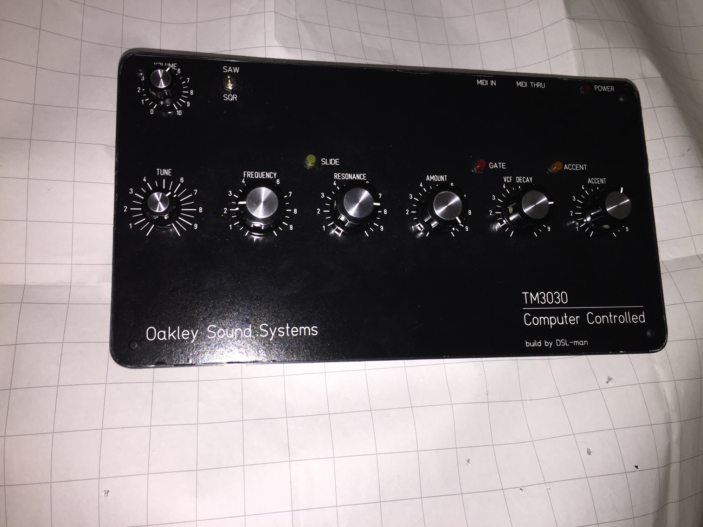
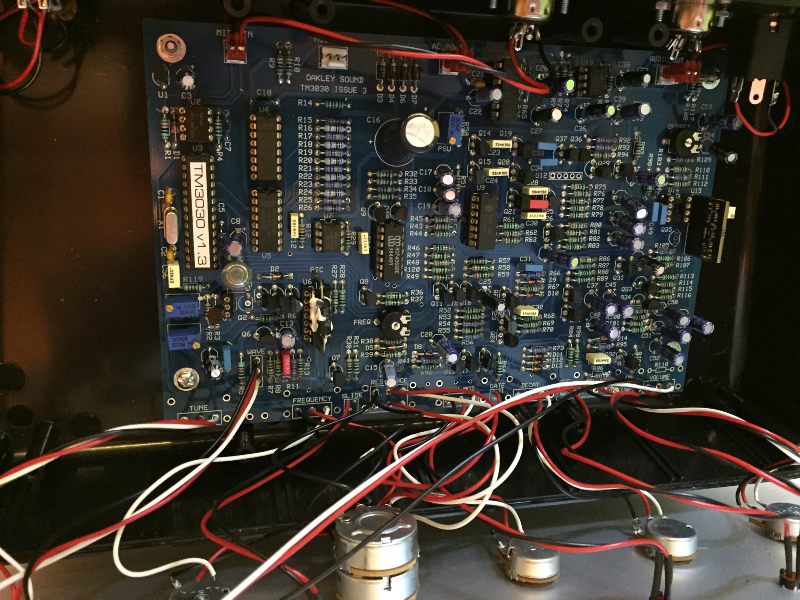
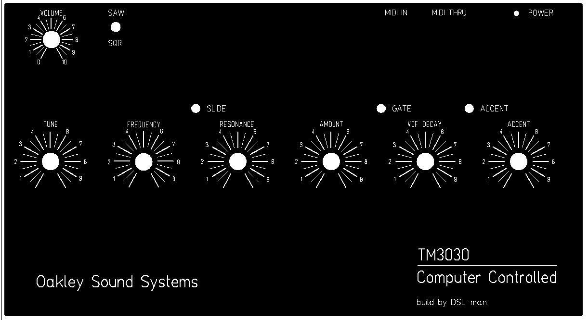
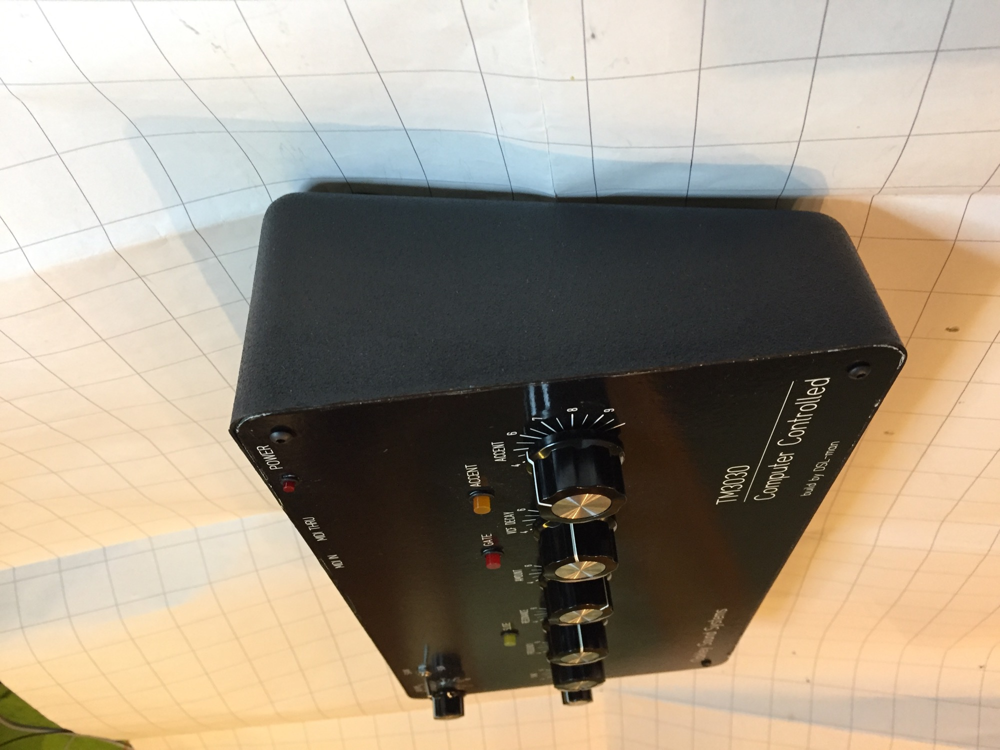

# Oakleysound TM3030

> **Project**
>
> ### Projecttitel: Oakleysound TM3030
>
> ### Status: `finsihed`
>
> ### Startdate: 01 Aug. 2015
>
> ### Duedate: 01.Feb. 2016
>
> ### Manufacture link: [http://oakleysound.com/tm3030.htm](http://oakleysound.com/tm3030.htm)

## buildersguide rev.3 (from 2015)

[tm3030-bg3.pdf](assets/tm3030-bg3.pdf)

Parts:

(standard resistors not listed here)

1K +3500ppm/K PTC - see text for mounting information.

|   |   |   |
|---|---|---|
| **Capacitors** 10nF 1% polystyrene C9   or polypropylene 33pF ceramic plate C1, C2 330p ceramic plate C21 3n3, 100V polyester C30 1nF, 100V polyester C12 10nF, 100V polyester C11 15nF, 100V polyester C29 33nF 100V polyester C41, C23, C28, C24 47nF 100V polyester C32 100nF, 63V polyester film C31, C6, C49, C47, C33, C34 220nF, 63V polyester film C14 330nF, 63V polyester film C56 100nF, 63V axial ceramic C5, C7, C10 1u0, 63V elect C37, C13, C55, C52, C19, C53, C51, C42, C46, C44, C35, C43, C15, C20 2u2, 63V elect C22, C8 10uF, 35V elect C54, C48, C27, C38, C36, C50, C17, C18, C25 22uF, 35V elect C4, C3 47uF, 35V elect C45, C26, C39, C40 470uF, 35V elect C16 **Discrete Semiconductors** 1N4004 power diode D7, D6, D4, D3 1N4148 signal diode D2, D14, D1, D5, D8, D13, D12, D10, D9, D11 BC182L NPN transistor Q5, Q4     **ebay** BC212L PNP transistor Q3     **ebay** BC550 NPN transistor Q34, Q9, Q10, Q27, Q8, Q26, Q7, Q20, Q19, Q21, Q15, Q14, Q29, Q30, Q24, Q25, Q12, Q17, Q23, Q13 BC550C NPN transistor Q36, Q37 - **matched pair,** see text. BC560C PNP transistor Q31, Q6, Q33, Q32, Q11, Q16, Q22, Q28 **J201 FET Q35 - only if not fitting BA662 in U15** J201 FET Q2 - **only if not fitting 2SK30A-0 in Q1** 2SC1583 NPN pair U12 - **only if not fitting Q36 & Q37** 2SK30A-O FET Q1 - **only if not fitting J201 in Q2** 2SK30-Y FET Q18 THAT300P NPN array U6, U9     **order from banzai** **Integrated Circuits** 4050 hex non-inverting bufferU5, U4 4066 quad analogue switch U8 6562 or LM358 dual op-amp U7, U13 6N137 opto coupler U2 LM723 voltage regulator U10 78L05 +5V regulator U1 BA662 Roland OTA U15 - **fit only if not fitting CA3080 in U14)** CA3080 OTA U14 -**fit only if not fitting BA662 in U15)   we use this** PIC18F242 TM midi-chip U3 - supplied with PCB **Trimmers** 2K multiturn cermet PSU 10K multiturn cermet V/OCT 50K multiturn cermet PITCH 470K horizontal carbon FREQ, OFFSET **Pots** 1M log DECAY 50K lin TUNE, ENV\_MOD, FREQUENCY, ACCENT 50K lin x 2 (dual gang) RESONANCE 50K log VOLUME **Miscellaneous** 4.000MHz crystal X1 - see text for mounting information. 5-pin DIN socket MIDI\_IN, MIDI\_OUT 1/4" jack socket AUDIO\_OUT 2.1mm power inlet AC\_POWER  (changed from 2,5mm) 3x leds, 1x switch, 7x knobs .. |   |   |

> **Info**
>
> my TM3030 was build with the [BA662 Clone](http://www.openmusiclabs.com/projects/ba662-clone/)

## Panel:

[TM3030\_panel.fpd](assets/TM3030_panel.fpd)

Copyshop Version (pdf DINA3 scaled)

[FPD.pdf](assets/FPD.pdf)

